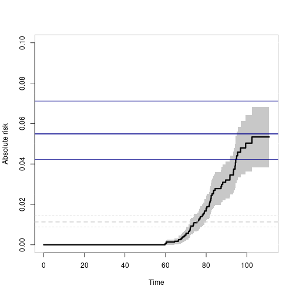

<!-- badges: start -->
[](https://github.com/kkholst/mets/actions)

[](https://codecov.io/github/kkholst/mets?branch=master)
  [](https://CRAN.R-project.org/package=mets)
  [](https://cranlogs.r-pkg.org/downloads/total/last-month/mets)
<!-- badges: end -->


# Multivariate Event Times (`mets`) 

Implementation of various statistical models for multivariate
event history data <10.1007/s10985-013-9244-x>. Including multivariate
cumulative incidence models <10.1002/sim.6016>, and  bivariate random
effects probit models (Liability models) <10.1016/j.csda.2015.01.014>.
Also contains two-stage binomial modelling that can do pairwise odds-ratio
dependence modelling based marginal logistic regression models. This is an
alternative to the alternating logistic regression approach (ALR).


## Installation


```r
install.packages("mets")
```

The development version may be installed directly from github
(requires [Rtools](https://cran.r-project.org/bin/windows/Rtools/) on windows and [development tools](https://cran.r-project.org/bin/macosx/tools/) (+Xcode) for Mac OS
X):


```r
remotes::install_github("kkholst/mets", dependencies="Suggests")
```

or to get development version


```r
remotes::install_github("kkholst/mets",ref="develop")
```


## Citation

To cite the `mets` package please use one of the following references

> Thomas H. Scheike and Klaus K. Holst and Jacob B. Hjelmborg (2013).
> Estimating heritability for cause specific mortality based on twin studies.
> Lifetime Data Analysis. <http://dx.doi.org/10.1007/s10985-013-9244-x>

> Klaus K. Holst and Thomas H. Scheike Jacob B. Hjelmborg (2015).
> The Liability Threshold Model for Censored Twin Data.
> Computational Statistics and Data Analysis. <http://dx.doi.org/10.1016/j.csda.2015.01.014>

BibTeX:

    @Article{,
      title={Estimating heritability for cause specific mortality based on twin studies},
      author={Scheike, Thomas H. and Holst, Klaus K. and Hjelmborg, Jacob B.},
      year={2013},
      issn={1380-7870},
      journal={Lifetime Data Analysis},
      doi={10.1007/s10985-013-9244-x},
      url={http://dx.doi.org/10.1007/s10985-013-9244-x},
      publisher={Springer US},
      keywords={Cause specific hazards; Competing risks; Delayed entry;
    	    Left truncation; Heritability; Survival analysis},
      pages={1-24},
      language={English}
    }

    @Article{,
      title={The Liability Threshold Model for Censored Twin Data},
      author={Holst, Klaus K. and Scheike, Thomas H. and Hjelmborg, Jacob B.},
      year={2015},
      doi={10.1016/j.csda.2015.01.014},
      url={http://dx.doi.org/10.1016/j.csda.2015.01.014},
      journal={Computational Statistics and Data Analysis}
    }


## Examples


```r
library("mets")

data(prt) ## Prostate data example (sim)

## Bivariate competing risk, concordance estimates
p33 <- bicomprisk(Event(time,status)~strata(zyg)+id(id),
                  data=prt, cause=c(2,2), return.data=1, prodlim=TRUE)
#> Strata 'DZ'
#> Strata 'MZ'

p33dz <- p33$model$"DZ"$comp.risk
p33mz <- p33$model$"MZ"$comp.risk

## Probability weights based on Aalen's additive model (same censoring within pair)
prtw <- ipw(Surv(time,status==0)~country+zyg, data=prt,
            obs.only=TRUE, same.cens=TRUE, 
            cluster="id", weight.name="w")

## Marginal model (wrongly ignoring censorings)
bpmz <- biprobit(cancer~1 + cluster(id), 
                 data=subset(prt,zyg=="MZ"), eqmarg=TRUE)

## Extended liability model
bpmzIPW <- biprobit(cancer~1 + cluster(id),
                    data=subset(prtw,zyg=="MZ"),
                    weights="w")
smz <- summary(bpmzIPW)

## Concordance
plot(p33mz,ylim=c(0,0.1),axes=FALSE, automar=FALSE,atrisk=FALSE,background=TRUE,background.fg="white")
axis(2); axis(1)

abline(h=smz$prob["Concordance",],lwd=c(2,1,1),col="darkblue")
## Wrong estimates:
abline(h=summary(bpmz)$prob["Concordance",],lwd=c(2,1,1),col="lightgray", lty=2)
```


