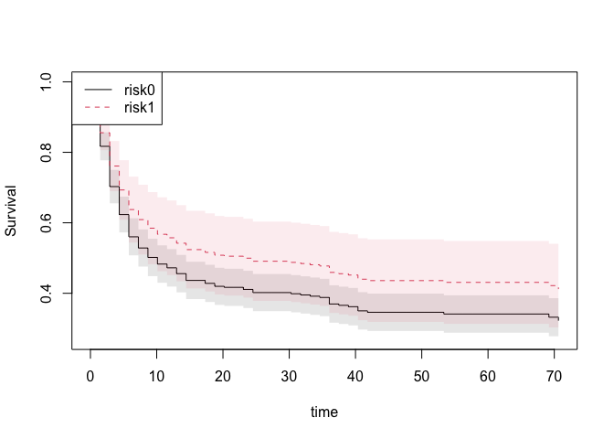
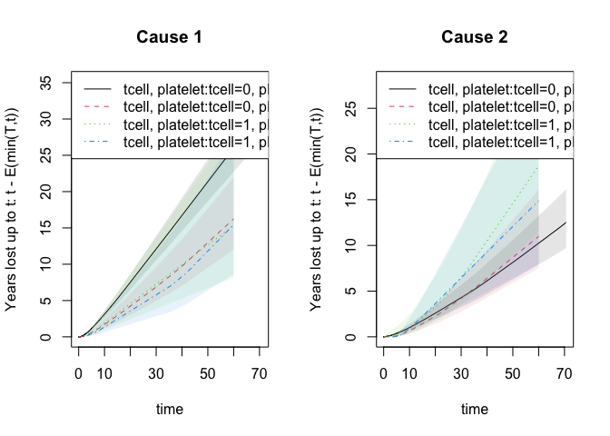
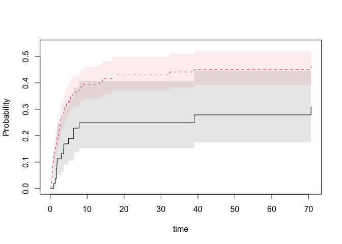
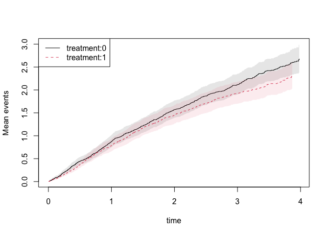

<!-- README.md is generated from README.Rmd. Please edit that file -->

<!-- badges: start-->

[](https://github.com/kkholst/mets/actions/workflows/R-CMD-check.yaml)
[](https://app.codecov.io/github/kkholst/mets?branch=master)
[](https://CRAN.R-project.org/package=mets)
[](https://cranlogs.r-pkg.org/downloads/total/last-month/mets)

<!-- badges: end -->

# Multivariate Event Times (`mets`) 

Implementation of various statistical models for multivariate event
history data <doi:10.1007/s10985-013-9244-x>. Including multivariate
cumulative incidence models <doi:10.1002/sim.6016>, and bivariate random
effects probit models (Liability models)
<doi:10.1016/j.csda.2015.01.014>. Modern methods for survival analysis,
including regression modelling (Cox, Fine-Gray, Ghosh-Lin, Binomial
regression) with fast computation of influence functions. Restricted
mean survival time regression and years lost for competing risks.
Average treatment effects and G-computation. All functions can be used
with clusters and will work for large data.

## Installation

``` r
install.packages("mets")
```

The development version may be installed directly from github (requires
[Rtools](https://cran.r-project.org/bin/windows/Rtools/) on windows and
[development tools](https://cran.r-project.org/bin/macosx/tools/)
(+Xcode) for Mac OS X):

``` r
remotes::install_github("kkholst/mets", dependencies="Suggests")
```

or to get development version

``` r
remotes::install_github("kkholst/mets",ref="develop")
```

## Citation

To cite the `mets` package please use one of the following references

> Thomas H. Scheike and Klaus K. Holst and Jacob B. Hjelmborg (2013).
> Estimating heritability for cause specific mortality based on twin
> studies. Lifetime Data Analysis.
> <http://dx.doi.org/10.1007/s10985-013-9244-x>

> Klaus K. Holst and Thomas H. Scheike Jacob B. Hjelmborg (2015). The
> Liability Threshold Model for Censored Twin Data. Computational
> Statistics and Data Analysis.
> <http://dx.doi.org/10.1016/j.csda.2015.01.014>

BibTeX:

    @Article{,
      title={Estimating heritability for cause specific mortality based on twin studies},
      author={Scheike, Thomas H. and Holst, Klaus K. and Hjelmborg, Jacob B.},
      year={2013},
      issn={1380-7870},
      journal={Lifetime Data Analysis},
      doi={10.1007/s10985-013-9244-x},
      url={http://dx.doi.org/10.1007/s10985-013-9244-x},
      publisher={Springer US},
      keywords={Cause specific hazards; Competing risks; Delayed entry;
            Left truncation; Heritability; Survival analysis},
      pages={1-24},
      language={English}

}

    @Article{,
      title={The Liability Threshold Model for Censored Twin Data},
      author={Holst, Klaus K. and Scheike, Thomas H. and Hjelmborg, Jacob B.},
      year={2015},
      doi={10.1016/j.csda.2015.01.014},
      url={http://dx.doi.org/10.1016/j.csda.2015.01.014},
      journal={Computational Statistics and Data Analysis}
    }

## Examples: Twins Polygenic modelling

First considering standard twin modelling (ACE, AE, ADE, and more
models)

``` r
# simulated data with pairs of observations in twins on long #data format
set.seed(1)
d <- twinsim(1000, b1=c(1,-1), b2=c(), acde=c(1,1,0,1))
# Polygenic model with Additive genetic effects, and shared and invidual environmental effects (ACE)
ace <- twinlm(y ~ 1, data=d, DZ="DZ", zyg="zyg", id="id")
ace
#>        Estimate Std. Error Z value  Pr(>|z|)
#> y     -0.019439   0.041817 -0.4649     0.642
#> sd(A)  0.902004   0.203739  4.4273 9.544e-06
#> sd(C)  1.137025   0.132852  8.5586 < 2.2e-16
#> sd(E)  1.728992   0.037408 46.2194 < 2.2e-16
#> 
#> MZ-pairs DZ-pairs 
#>     1000     1000 
#> 
#> Variance decomposition:
#>   Estimate 2.5%    97.5%  
#> A 0.15966  0.01867 0.30065
#> C 0.25370  0.13920 0.36820
#> E 0.58664  0.53677 0.63650
#> 
#> 
#>                          Estimate 2.5%    97.5%  
#> Broad-sense heritability 0.15966  0.01867 0.30065
#> 
#>                        Estimate 2.5%    97.5%  
#> Correlation within MZ: 0.41336  0.36229 0.46196
#> Correlation within DZ: 0.33353  0.27933 0.38561
#> 
#> 'log Lik.' -8779.953 (df=4)
#> AIC: 17567.91 
#> BIC: 17590.31
# An AE-model could be fitted as
ae <- twinlm(y ~ 1, data=d, DZ="DZ", zyg="zyg", id="id", type="ae")
# AIC
AIC(ae)-AIC(ace)
#> [1] 15.20656
# To adjust for the covariates we simply alter the formula statement
ace2 <- twinlm(y ~ x1+x2, data=d, DZ="DZ", zyg="zyg", id="id", type="ace")
 ## Summary/GOF
summary(ace2)
#>        Estimate Std. Error  Z value Pr(>|z|)
#> y     -0.026049   0.034844  -0.7476   0.4547
#> sd(A)  1.066060   0.072890  14.6256   <2e-16
#> sd(C)  0.980740   0.073569  13.3309   <2e-16
#> sd(E)  0.979980   0.021887  44.7736   <2e-16
#> y~x1   1.006963   0.021900  45.9807   <2e-16
#> y~x2  -0.993802   0.021962 -45.2512   <2e-16
#> 
#> MZ-pairs DZ-pairs 
#>     1000     1000 
#> 
#> Variance decomposition:
#>   Estimate 2.5%    97.5%  
#> A 0.37156  0.27300 0.47012
#> C 0.31446  0.22643 0.40250
#> E 0.31398  0.28381 0.34414
#> 
#> 
#>                          Estimate 2.5%    97.5%  
#> Broad-sense heritability 0.37156  0.27300 0.47012
#> 
#>                        Estimate 2.5%    97.5%  
#> Correlation within MZ: 0.68602  0.65467 0.71502
#> Correlation within DZ: 0.50024  0.45538 0.54257
#> 
#> 'log Lik.' -7449.697 (df=6)
#> AIC: 14911.39 
#> BIC: 14945
```

## Examples: Twins Polygenic modelling time-to-events Data

In the context of time-to-events data we consider the “Liabilty
Threshold model” with IPCW adjustment for censoring.

First we fit the bivariate probit model (same marginals in MZ and DZ
twins but different correlation parameter). Here we evaluate the risk of
getting cancer before the last double cancer event (95 years)

``` r
data(prt)
prt0 <-  force.same.cens(prt, cause="status", cens.code=0, time="time", id="id")
prt0$country <- relevel(prt0$country, ref="Sweden")
prt_wide <- fast.reshape(prt0, id="id", num="num", varying=c("time","status","cancer"))
prt_time <- subset(prt_wide,  cancer1 & cancer2, select=c(time1, time2, zyg))
tau <- 95
tt <- seq(70, tau, length.out=5) ## Time points to evaluate model in

b0 <- bptwin.time(cancer ~ 1, data=prt0, id="id", zyg="zyg", DZ="DZ", type="cor",
              cens.formula=Surv(time,status==0)~zyg, breaks=tau)
summary(b0)
#> 
#>                Estimate   Std.Err        Z   p-value    
#> (Intercept)   -1.348188  0.026276 -51.3086 < 2.2e-16 ***
#> atanh(rho) MZ  0.735992  0.087838   8.3789 < 2.2e-16 ***
#> atanh(rho) DZ  0.353023  0.068234   5.1737 2.295e-07 ***
#> ---
#> Signif. codes:  0 '***' 0.001 '**' 0.01 '*' 0.05 '.' 0.1 ' ' 1
#> 
#>  Total MZ/DZ Complete pairs MZ/DZ
#>  1994/3618   997/1809            
#> 
#>                            Estimate 2.5%    97.5%  
#> Tetrachoric correlation MZ 0.62672  0.51081 0.72024
#> Tetrachoric correlation DZ 0.33905  0.21584 0.45164
#> 
#> MZ:
#>                      Estimate 2.5%    97.5%  
#> Concordance          0.03504  0.02779 0.04409
#> Casewise Concordance 0.39458  0.31876 0.47584
#> Marginal             0.08880  0.08086 0.09743
#> Rel.Recur.Risk       4.44351  3.50521 5.38182
#> log(OR)              2.34131  1.87105 2.81157
#> DZ:
#>                      Estimate 2.5%    97.5%  
#> Concordance          0.01952  0.01449 0.02625
#> Casewise Concordance 0.21983  0.16667 0.28415
#> Marginal             0.08880  0.08086 0.09743
#> Rel.Recur.Risk       2.47556  1.81096 3.14016
#> log(OR)              1.23088  0.81020 1.65156
#> 
#>                          Estimate 2.5%    97.5%  
#> Broad-sense heritability 0.57533  0.25790 0.89276
#> 
#> 
#> Event of interest before time 95
```

Liability threshold model with ACE random effects structure

``` r
b1 <- bptwin.time(cancer ~ 1, data=prt0, id="id", zyg="zyg", DZ="DZ", type="ace",
           cens.formula=Surv(time,status==0)~zyg, breaks=tau)
summary(b1)
#> 
#>             Estimate  Std.Err        Z p-value    
#> (Intercept) -2.20664  0.16463 -13.4034  <2e-16 ***
#> log(var(A))  0.43260  0.39149   1.1050  0.2691    
#> log(var(C)) -1.98289  2.52342  -0.7858  0.4320    
#> ---
#> Signif. codes:  0 '***' 0.001 '**' 0.01 '*' 0.05 '.' 0.1 ' ' 1
#> 
#>  Total MZ/DZ Complete pairs MZ/DZ
#>  1994/3618   997/1809            
#> 
#>                    Estimate 2.5%     97.5%   
#> A                   0.57533  0.25790  0.89276
#> C                   0.05139 -0.20836  0.31114
#> E                   0.37328  0.26874  0.47782
#> MZ Tetrachoric Cor  0.62672  0.51081  0.72024
#> DZ Tetrachoric Cor  0.33905  0.21584  0.45164
#> 
#> MZ:
#>                      Estimate 2.5%    97.5%  
#> Concordance          0.03504  0.02779 0.04409
#> Casewise Concordance 0.39458  0.31876 0.47584
#> Marginal             0.08880  0.08086 0.09743
#> Rel.Recur.Risk       4.44351  3.50520 5.38182
#> log(OR)              2.34131  1.87104 2.81157
#> DZ:
#>                      Estimate 2.5%    97.5%  
#> Concordance          0.01952  0.01449 0.02625
#> Casewise Concordance 0.21983  0.16667 0.28415
#> Marginal             0.08880  0.08086 0.09743
#> Rel.Recur.Risk       2.47556  1.81096 3.14016
#> log(OR)              1.23088  0.81020 1.65156
#> 
#>                          Estimate 2.5%    97.5%  
#> Broad-sense heritability 0.57533  0.25790 0.89276
#> 
#> 
#> Event of interest before time 95
```

## Examples: Twins Concordance for time-to-events Data

``` r

data(prt) ## Prostate data example (sim)

## Bivariate competing risk, concordance estimates
p33 <- bicomprisk(Event(time,status)~strata(zyg)+id(id),
                  data=prt, cause=c(2,2), return.data=1, prodlim=TRUE)
#> Strata 'DZ'
#> Strata 'MZ'

p33dz <- p33$model$"DZ"$comp.risk
p33mz <- p33$model$"MZ"$comp.risk

## Probability weights based on Aalen's additive model (same censoring within pair)
prtw <- ipw(Surv(time,status==0)~country+zyg, data=prt,
            obs.only=TRUE, same.cens=TRUE, 
            cluster="id", weight.name="w")

## Marginal model (wrongly ignoring censorings)
bpmz <- biprobit(cancer~1 + cluster(id), 
                 data=subset(prt,zyg=="MZ"), eqmarg=TRUE)

## Extended liability model
bpmzIPW <- biprobit(cancer~1 + cluster(id),
                    data=subset(prtw,zyg=="MZ"),
                    weights="w")
smz <- summary(bpmzIPW)

## Concordance
plot(p33mz,ylim=c(0,0.1),axes=FALSE, automar=FALSE,atrisk=FALSE,background=TRUE,background.fg="white")
axis(2); axis(1)

abline(h=smz$prob["Concordance",],lwd=c(2,1,1),col="darkblue")
## Wrong estimates:
abline(h=summary(bpmz)$prob["Concordance",],lwd=c(2,1,1),col="lightgray",lty=2)
```


## Examples: Cox model, RMST

We can fit the Cox model and compute many useful summaries, such as
restricted mean survival and stanardized treatment effects
(G-estimation). First estimating the standardized survival

``` r
 data(bmt)
 bmt$time <- bmt$time+runif(408)*0.001
 bmt$event <- (bmt$cause!=0)*1
 dfactor(bmt) <- tcell.f~tcell

 ss <- phreg(Surv(time,event)~tcell.f+platelet+age,bmt) 
 summary(survivalG(ss,bmt,50))
#> G-estimator :
#>       Estimate Std.Err   2.5%  97.5%    P-value
#> risk0   0.6539 0.02708 0.6008 0.7070 9.119e-129
#> risk1   0.5641 0.05973 0.4470 0.6811  3.600e-21
#> 
#> Average Treatment effect: difference (G-estimator) :
#>     Estimate Std.Err    2.5%   97.5% P-value
#> ps0 -0.08982 0.06293 -0.2132 0.03352  0.1535
#> 
#> Average Treatment effect: ratio (G-estimator) :
#> log-ratio: 
#>         Estimate  Std.Err       2.5%      97.5%   P-value
#> [ps0] -0.1477619 0.109562 -0.3624994 0.06697567 0.1774462
#> ratio: 
#>  Estimate      2.5%     97.5% 
#> 0.8626365 0.6959347 1.0692695 
#> 
#> Average Treatment effect: 1-G (survival)-ratio (G-estimator) :
#>       Estimate   Std.Err        2.5%     97.5%   P-value
#> [ps0] 0.230711 0.1504459 -0.06415759 0.5255796 0.1251491

 sst <- survivalGtime(ss,bmt,n=50)
 plot(sst,type=c("survival","risk","survival.ratio")[1])
```



Based on the phreg we can also compute the restricted mean survival time
and years lost (via Kaplan-Meier estimates). The function does it for
all times at once and can be plotted as restricted mean survival or
years lost at the different time horizons

``` r
 out1 <- phreg(Surv(time,cause!=0)~strata(tcell,platelet),data=bmt)
 
 rm1 <- resmean.phreg(out1,times=50)
 summary(rm1)
#>                     strata times    rmean se.rmean    lower    upper years.lost
#> tcell=0, platelet=0      0    50 20.48245 1.411055 17.89542 23.44348   29.51755
#> tcell=0, platelet=1      1    50 28.33071 2.196175 24.33733 32.97934   21.66929
#> tcell=1, platelet=0      2    50 22.74596 4.053717 16.04005 32.25544   27.25404
#> tcell=1, platelet=1      3    50 26.11565 4.230688 19.01112 35.87517   23.88435
 par(mfrow=c(1,2))
 plot(rm1,se=1)
 plot(rm1,years.lost=TRUE,se=1)
```


For competing risks the years lost can be decomposed into different
causes and is based on the integrated Aalen-Johansen estimators for the
different strata

``` r
 ## years.lost decomposed into causes
 drm1 <- cif.yearslost(Event(time,cause)~strata(tcell,platelet),data=bmt,times=10*(1:6))
 par(mfrow=c(1,2)); plot(drm1,cause=1,se=1); title(main="Cause 1"); plot(drm1,cause=2,se=1); title(main="Cause 2")
```



``` r
 summary(drm1)
#> $estimate
#>                       strata times    intF_1     intF_2 se.intF_1 se.intF_2
#> tcell.0..platelet.0        0    10  3.117746  1.0189361 0.2487194 0.1703643
#> tcell.0..platelet.1        1    10  1.710931  0.6571440 0.3238407 0.1870606
#> tcell.1..platelet.0        2    10  1.876196  0.8462898 0.6339263 0.4726281
#> tcell.1..platelet.1        3    10  1.358655  0.9711963 0.5303246 0.3617178
#> tcell.0..platelet.0.1      0    20  7.517584  2.5934872 0.5441151 0.3861267
#> tcell.0..platelet.1.1      1    20  4.230946  2.2626301 0.7414097 0.5327619
#> tcell.1..platelet.0.1      2    20  4.568503  3.3285422 1.4876970 1.1718320
#> tcell.1..platelet.1.1      3    20  3.569540  3.6427256 1.3003187 1.1906483
#> tcell.0..platelet.0.2      0    30 12.105147  4.2919345 0.8508118 0.6161444
#> tcell.0..platelet.1.2      1    30  6.884182  4.2145554 1.1741018 0.9057049
#> tcell.1..platelet.0.2      2    30  7.260811  6.5480736 2.3533061 1.9703360
#> tcell.1..platelet.1.2      3    30  5.780424  6.4534862 2.0925159 2.0815077
#> tcell.0..platelet.0.3      0    40 16.718654  6.1214106 1.1626290 0.8509987
#> tcell.0..platelet.1.3      1    40  9.728002  6.3883279 1.6094986 1.2998337
#> tcell.1..platelet.0.3      2    40  9.953119 10.4977207 3.2212240 2.8144071
#> tcell.1..platelet.1.3      3    40  8.302442  9.2642469 2.8718084 2.9840737
#> tcell.0..platelet.0.4      0    50 21.367838  8.1497111 1.4766473 1.0945200
#> tcell.0..platelet.1.4      1    50 12.979243  8.6900468 2.0475160 1.7124412
#> tcell.1..platelet.0.4      2    50 12.645426 14.6086098 4.0899812 3.7302594
#> tcell.1..platelet.1.4      3    50 11.809344 12.0750076 3.6737009 3.8902066
#> tcell.0..platelet.0.5      0    60 26.017022 10.2415183 1.7930416 1.3471506
#> tcell.0..platelet.1.5      1    60 16.236998 10.9917656 2.5097411 2.1389901
#> tcell.1..platelet.0.5      2    60 15.337734 18.7194989 4.9591366 4.6873833
#> tcell.1..platelet.1.5      3    60 15.442616 14.8857682 4.5899750 4.7978860
#>                       total.years.lost lower_intF_1 upper_intF_1 lower_intF_2
#> tcell.0..platelet.0           4.136682    2.6664640     3.645403    0.7342222
#> tcell.0..platelet.1           2.368075    1.1806442     2.479395    0.3761492
#> tcell.1..platelet.0           2.722485    0.9675543     3.638152    0.2832357
#> tcell.1..platelet.1           2.329852    0.6322072     2.919841    0.4680376
#> tcell.0..platelet.0.1        10.111072    6.5233279     8.663381    1.9371110
#> tcell.0..platelet.1.1         6.493577    3.0010779     5.964826    1.4262265
#> tcell.1..platelet.0.1         7.897045    2.4131642     8.648903    1.6694898
#> tcell.1..platelet.1.1         7.212265    1.7479738     7.289362    1.9195780
#> tcell.0..platelet.0.2        16.397082   10.5473476    13.893027    3.2393340
#> tcell.0..platelet.1.2        11.098738    4.9280986     9.616684    2.7658536
#> tcell.1..platelet.0.2        13.808885    3.8468181    13.704671    3.6306496
#> tcell.1..platelet.1.2        12.233910    2.8433112    11.751546    3.4296343
#> tcell.0..platelet.0.3        22.840064   14.5884128    19.159958    4.6614116
#> tcell.0..platelet.1.3        16.116330    7.0338371    13.454111    4.2873915
#> tcell.1..platelet.0.3        20.450839    5.2780876    18.769027    6.2071246
#> tcell.1..platelet.1.3        17.566689    4.2147894    16.354445    4.9275679
#> tcell.0..platelet.0.4        29.517549   18.6611064    24.467172    6.2636056
#> tcell.0..platelet.1.4        21.669290    9.5272967    17.681906    5.9059020
#> tcell.1..platelet.0.4        27.254036    6.7084870    23.836494    8.8564043
#> tcell.1..platelet.1.4        23.884352    6.4184533    21.728071    6.4217842
#> tcell.0..platelet.0.5        36.258540   22.7297398    29.779727    7.9140511
#> tcell.0..platelet.1.5        27.228764   11.9932295    21.982413    7.5062706
#> tcell.1..platelet.0.5        34.057233    8.1384730    28.905433   11.4591501
#> tcell.1..platelet.1.5        30.328384    8.6242250    27.651688    7.9143890
#>                       upper_intF_2
#> tcell.0..platelet.0       1.414055
#> tcell.0..platelet.1       1.148050
#> tcell.1..platelet.0       2.528659
#> tcell.1..platelet.1       2.015270
#> tcell.0..platelet.0.1     3.472272
#> tcell.0..platelet.1.1     3.589538
#> tcell.1..platelet.0.1     6.636275
#> tcell.1..platelet.1.1     6.912691
#> tcell.0..platelet.0.2     5.686571
#> tcell.0..platelet.1.2     6.422060
#> tcell.1..platelet.0.2    11.809806
#> tcell.1..platelet.1.2    12.143419
#> tcell.0..platelet.0.3     8.038695
#> tcell.0..platelet.1.3     9.518779
#> tcell.1..platelet.0.3    17.754137
#> tcell.1..platelet.1.3    17.417573
#> tcell.0..platelet.0.4    10.603763
#> tcell.0..platelet.1.4    12.786686
#> tcell.1..platelet.0.4    24.096854
#> tcell.1..platelet.1.4    22.704875
#> tcell.0..platelet.0.5    13.253477
#> tcell.0..platelet.1.5    16.095731
#> tcell.1..platelet.0.5    30.579898
#> tcell.1..platelet.1.5    27.997878
```

Computations are again done for all time horizons at once as illustrated
in the plot.

## Examples: Cox model IPTW

We can fit the Cox model with inverse probabilty of treatment weights
based on logistic regression. The treatment weights can be
time-dependent and then mutiplicative weights are applied (see details
and vignette).

``` r
data(bmt)
bmt$time <- bmt$time+runif(408)*0.001
bmt$id <- seq_len(nrow(bmt))
bmt$event <- (bmt$cause!=0)*1
dfactor(bmt) <- tcell.f~tcell

fit <- phreg_IPTW(Surv(time,event)~tcell.f+cluster(id),data=bmt,treat.model=tcell.f~platelet+age) 
summary(fit)
#> 
#>    n events
#>  408    248
#> 
#>  408 clusters
#> coeffients:
#>           Estimate      S.E.   dU^-1/2 P-value
#> tcell.f1 -0.108518  0.199557  0.089653  0.5866
#> 
#> exp(coeffients):
#>          Estimate    2.5%  97.5%
#> tcell.f1  0.89716 0.60675 1.3266
head(IC(fit))
#>    tcell.f1
#> 1 -1.639213
#> 2 -1.669024
#> 3 -1.749736
#> 4 -1.745936
#> 5 -1.625389
#> 6 -1.793350
```

## Examples: Competing risks regression, Binomial Regression

We can fit the logistic regression model at a specific time-point with
IPCW adjustment

``` r
data(bmt); bmt$time <- bmt$time+runif(408)*0.001
# logistic regresion with IPCW binomial regression 
out <- binreg(Event(time,cause)~tcell+platelet,bmt,time=50)
summary(out)
#>    n events
#>  408    160
#> 
#>  408 clusters
#> coeffients:
#>              Estimate   Std.Err      2.5%     97.5% P-value
#> (Intercept) -0.180332  0.126755 -0.428766  0.068103  0.1548
#> tcell       -0.418194  0.345422 -1.095208  0.258820  0.2260
#> platelet    -0.437668  0.240973 -0.909965  0.034630  0.0693
#> 
#> exp(coeffients):
#>             Estimate    2.5%  97.5%
#> (Intercept)  0.83499 0.65131 1.0705
#> tcell        0.65823 0.33447 1.2954
#> platelet     0.64554 0.40254 1.0352
head(IC(out))
#>           [,1]     [,2]     [,3]
#> [1,] -2.834135 1.633735 2.520232
#> [2,] -2.834135 1.633735 2.520232
#> [3,] -2.834135 1.633735 2.520232
#> [4,] -2.834135 1.633735 2.520232
#> [5,] -2.834135 1.633735 2.520232
#> [6,] -2.834135 1.633735 2.520232
 predict(out,data.frame(tcell=c(0,1),platelet=c(1,1)),se=TRUE)
#>        pred         se     lower     upper
#> 1 0.3502366 0.04847386 0.2552278 0.4452453
#> 2 0.2618851 0.06969063 0.1252915 0.3984787
```

## Examples: Competing risks regression, Fine-Gray/Logistic link

We can fit the Fine-Gray model and the logit-link competing risks model
(using IPCW adjustment). Starting with the logit-link model

``` r
data(bmt)
bmt$time <- bmt$time+runif(nrow(bmt))*0.01
bmt$id <- 1:nrow(bmt)
## logistic link  OR interpretation
 or=cifreg(Event(time,cause)~strata(tcell)+platelet+age,data=bmt,cause=1)
summary(or)
#> 
#>    n events
#>  408    161
#> 
#>  408 clusters
#> coeffients:
#>           Estimate      S.E.   dU^-1/2 P-value
#> platelet -0.454568  0.235415  0.187996  0.0535
#> age       0.390178  0.097675  0.083636  0.0001
#> 
#> exp(coeffients):
#>          Estimate    2.5%  97.5%
#> platelet  0.63472 0.40013 1.0069
#> age       1.47724 1.21986 1.7889
par(mfrow=c(1,2))
 ## to see baseline 
plot(or)

 # predictions 
nd <- data.frame(tcell=c(1,0),platelet=0,age=0)
pll <- predict(or,nd)
plot(pll)
```


Similarly, the Fine-Gray model can be estimated using IPCW adjustment

``` r
 ## Fine-Gray model
 fg=cifreg(Event(time,cause)~strata(tcell)+platelet+age,data=bmt,cause=1,propodds=NULL)
 summary(fg)
#> 
#>    n events
#>  408    161
#> 
#>  408 clusters
#> coeffients:
#>           Estimate      S.E.   dU^-1/2 P-value
#> platelet -0.424744  0.180772  0.187819  0.0188
#> age       0.341964  0.079862  0.086284  0.0000
#> 
#> exp(coeffients):
#>          Estimate    2.5%  97.5%
#> platelet  0.65394 0.45884 0.9320
#> age       1.40771 1.20374 1.6462
## baselines 
plot(fg)
```


``` r
nd <- data.frame(tcell=c(1,0),platelet=0,age=0)
pfg <- predict(fg,nd,se=1)
plot(pfg,se=1)
```



``` r

## influence functions of regression coefficients
head(iid(fg))
#>         platelet           age
#> [1,] 0.004953454  0.0001245448
#> [2,] 0.005348468 -0.0022341780
#> [3,] 0.006069240 -0.0087211028
#> [4,] 0.006043149 -0.0084185511
#> [5,] 0.004732076  0.0011839004
#> [6,] 0.006331427 -0.0121683704
```

and we can get standard errors for predictions based on the influence
functions of the baseline and the regression coefiicients (these are
used in the predict function)

``` r
baseid <- iidBaseline(fg,time=40)
FGprediid(baseid,nd)
#>           pred     se-log     lower     upper
#> [1,] 0.2787513 0.23977174 0.1742299 0.4459754
#> [2,] 0.4506249 0.07265688 0.3908135 0.5195900
```

further G-estimation can be done

``` r
 dfactor(bmt) <- tcell.f~tcell
 fg1 <- cifreg(Event(time,cause)~tcell.f+platelet+age,bmt,cause=1,propodds=NULL)
 summary(survivalG(fg1,bmt,50))
#> G-estimator :
#>       Estimate Std.Err   2.5%  97.5%   P-value
#> risk0   0.4332 0.02749 0.3793 0.4871 6.331e-56
#> risk1   0.2726 0.05861 0.1577 0.3875 3.301e-06
#> 
#> Average Treatment effect: difference (G-estimator) :
#>     Estimate Std.Err   2.5%    97.5% P-value
#> ps0  -0.1606 0.06351 -0.285 -0.03609 0.01146
#> 
#> Average Treatment effect: ratio (G-estimator) :
#> log-ratio: 
#>         Estimate  Std.Err       2.5%       97.5%    P-value
#> [ps0] -0.4630779 0.221165 -0.8965534 -0.02960241 0.03627677
#> ratio: 
#>  Estimate      2.5%     97.5% 
#> 0.6293436 0.4079734 0.9708314 
#> 
#> Average Treatment effect: 1-G (survival)-ratio (G-estimator) :
#> NULL
```

## Examples: Marginal mean for recurrent events

We can estimate the expected number of events non-parametrically and get
standard errors for this estimator

``` r
data(hfactioncpx12)
dtable(hfactioncpx12,~status)
#> 
#> status
#>    0    1    2 
#>  617 1391  124

gl1 <- recurrentMarginal(Event(entry,time,status)~strata(treatment)+cluster(id),hfactioncpx12,cause=1,death.code=2)
summary(gl1,times=1:5)
#> [[1]]
#>       new.time      mean         se   CI-2.5% CI-97.5% strata
#> 325          1 0.8737156 0.06783343 0.7503858 1.017315      0
#> 555          2 1.5718563 0.09572955 1.3949953 1.771140      0
#> 682          3 2.1184963 0.11385721 1.9066915 2.353829      0
#> 748          4 2.6815219 0.15451005 2.3951619 3.002118      0
#> 748.1        5 2.6815219 0.15451005 2.3951619 3.002118      0
#> 
#> [[2]]
#>       new.time      mean         se   CI-2.5%  CI-97.5% strata
#> 284          1 0.7815557 0.06908585 0.6572305 0.9293989      1
#> 499          2 1.4534055 0.10315606 1.2646561 1.6703258      1
#> 601          3 1.9240624 0.12165771 1.6998008 2.1779119      1
#> 645          4 2.3134997 0.14963892 2.0380418 2.6261880      1
#> 645.1        5 2.3134997 0.14963892 2.0380418 2.6261880      1
plot(gl1,se=1)
```



## Examples: Ghosh-Lin for recurrent events

We can fit the Ghosh-Lin model for the expected number of events
observed before dying (using IPCW adjustment and get predictions)

``` r
data(hfactioncpx12)
dtable(hfactioncpx12,~status)
#> 
#> status
#>    0    1    2 
#>  617 1391  124

gl1 <- recreg(Event(entry,time,status)~treatment+cluster(id),hfactioncpx12,cause=1,death.code=2)
summary(gl1)
#> 
#>     n events
#>  2132   1391
#> 
#>  741 clusters
#> coeffients:
#>             Estimate      S.E.   dU^-1/2 P-value
#> treatment1 -0.110404  0.078656  0.053776  0.1604
#> 
#> exp(coeffients):
#>            Estimate    2.5%  97.5%
#> treatment1  0.89547 0.76754 1.0447

## influence functions of regression coefficients
head(iid(gl1))
#>      treatment1
#> 1 -1.266428e-04
#> 2 -6.112340e-04
#> 3  2.885192e-03
#> 4  1.308207e-03
#> 5  5.404664e-05
#> 6  2.229380e-03
```

and we can get standard errors for predictions based on the influence
functions of the baseline and the regression coefiicients

``` r
 nd=data.frame(treatment=levels(hfactioncpx12$treatment),id=1)
 pfg <- predict(gl1,nd,se=1)
 summary(pfg,times=1:5)
#> $pred
#>              Lamt     Lamt     Lamt     Lamt     Lamt
#> strata0 0.8573256 1.592252 2.121181 2.635437 2.635437
#> strata0 0.7677110 1.425817 1.899458 2.359959 2.359959
#> 
#> $se.pred
#>       seLamt     seLamt    seLamt    seLamt    seLamt
#> 1 0.05719895 0.08818784 0.1096157 0.1429941 0.1429941
#> 2 0.05763288 0.09495475 0.1184567 0.1484200 0.1484200
#> 
#> $lower
#>              [,1]     [,2]     [,3]     [,4]     [,5]
#> strata0 0.7522383 1.428458 1.916860 2.369561 2.369561
#> strata0 0.6626698 1.251343 1.680916 2.086276 2.086276
#> 
#> $upper
#>              [,1]     [,2]     [,3]     [,4]     [,5]
#> strata0 0.9770936 1.774827 2.347281 2.931145 2.931145
#> strata0 0.8894025 1.624617 2.146415 2.669546 2.669546
#> 
#> $times
#> [1] 1 2 3 4 5
#> 
#> attr(,"class")
#> [1] "summarypredictrecreg"
 plot(pfg,se=1)
```


The influence functions of the baseline and regression coefficients at a
specific time-point can be obtained

``` r
baseid <- iidBaseline(gl1,time=2)
dd <- data.frame(treatment=levels(hfactioncpx12$treatment),id=1)
GLprediid(baseid,dd)
#>          pred     se-log    lower    upper
#> [1,] 1.596065 0.05530215 1.432113 1.778786
#> [2,] 1.429231 0.06660096 1.254329 1.628521
```

## Examples: Fixed time modelling for recurrent events

We can fit a log-link regression model at 2 years for the expected
number of events observed before dying (using IPCW adjustment)

``` r
data(hfactioncpx12)

e2 <- recregIPCW(Event(entry,time,status)~treatment+cluster(id),hfactioncpx12,cause=1,death.code=2,time=2)
summary(e2)
#>    n events
#>  741   1052
#> 
#>  741 clusters
#> coeffients:
#>              Estimate   Std.Err      2.5%     97.5% P-value
#> (Intercept)  0.452430  0.060814  0.333236  0.571624  0.0000
#> treatment1  -0.078322  0.093560 -0.261696  0.105052  0.4025
#> 
#> exp(coeffients):
#>             Estimate    2.5%  97.5%
#> (Intercept)  1.57213 1.39548 1.7711
#> treatment1   0.92467 0.76974 1.1108
head(iid(e2))
#>            [,1]          [,2]
#> 1  1.959479e-04 -2.266440e-04
#> 2  2.237613e-03 -2.227140e-03
#> 3 -9.349773e-06  1.293789e-03
#> 4 -9.653029e-04  9.653029e-04
#> 5 -1.203962e-04  6.744236e-05
#> 6 -2.861359e-03  2.871831e-03
```

## Examples: Regression for RMST/Restricted mean survival for survival and competing risks using IPCW

RMST can be computed using the Kaplan-Meier (via phreg) and the for
competing risks via the cumulative incidence functions, but we can also
get these estimates via IPCW adjustment and then we can do regression

``` r
 ### same as Kaplan-Meier for full censoring model 
 bmt$int <- with(bmt,strata(tcell,platelet))
 out <- resmeanIPCW(Event(time,cause!=0)~-1+int,bmt,time=30,
                         cens.model=~strata(platelet,tcell),model="lin")
 estimate(out)
#>                        Estimate Std.Err  2.5% 97.5%   P-value
#> inttcell=0, platelet=0    13.61  0.8314 11.98 15.24 3.338e-60
#> inttcell=0, platelet=1    18.90  1.2693 16.42 21.39 3.643e-50
#> inttcell=1, platelet=0    16.19  2.4056 11.48 20.91 1.671e-11
#> inttcell=1, platelet=1    17.77  2.4531 12.96 22.58 4.368e-13
 head(iid(out))
#>             [,1] [,2] [,3] [,4]
#> [1,] -0.05340931    0    0    0
#> [2,] -0.05342287    0    0    0
#> [3,] -0.05343167    0    0    0
#> [4,] -0.05341367    0    0    0
#> [5,] -0.05342290    0    0    0
#> [6,] -0.05341057    0    0    0
 ## same as 
 out1 <- phreg(Surv(time,cause!=0)~strata(tcell,platelet),data=bmt)
 rm1 <- resmean.phreg(out1,times=30)
 summary(rm1)
#>                     strata times    rmean  se.rmean    lower    upper
#> tcell=0, platelet=0      0    30 13.60681 0.8313556 12.07116 15.33781
#> tcell=0, platelet=1      1    30 18.90421 1.2689962 16.57370 21.56243
#> tcell=1, platelet=0      2    30 16.19493 2.4001354 12.11235 21.65357
#> tcell=1, platelet=1      3    30 17.76902 2.4416127 13.57380 23.26086
#>                     years.lost
#> tcell=0, platelet=0   16.39319
#> tcell=0, platelet=1   11.09579
#> tcell=1, platelet=0   13.80507
#> tcell=1, platelet=1   12.23098
 
 ## competing risks years-lost for cause 1  
 out1 <- resmeanIPCW(Event(time,cause)~-1+int,bmt,time=30,cause=1,
                       cens.model=~strata(platelet,tcell),model="lin")
 estimate(out1)
#>                        Estimate Std.Err   2.5%  97.5%   P-value
#> inttcell=0, platelet=0   12.102  0.8506 10.435 13.770 6.171e-46
#> inttcell=0, platelet=1    6.883  1.1738  4.582  9.183 4.534e-09
#> inttcell=1, platelet=0    7.259  2.3528  2.648 11.871 2.033e-03
#> inttcell=1, platelet=1    5.779  2.0920  1.679  9.879 5.737e-03
 ## same as 
 drm1 <- cif.yearslost(Event(time,cause)~strata(tcell,platelet),data=bmt,times=30)
 summary(drm1)
#> $estimate
#>                     strata times    intF_1   intF_2 se.intF_1 se.intF_2
#> tcell=0, platelet=0      0    30 12.102401 4.290792 0.8506248 0.6159844
#> tcell=0, platelet=1      1    30  6.882501 4.213287 1.1737998 0.9054513
#> tcell=1, platelet=0      2    30  7.259290 6.545780 2.3528203 1.9697958
#> tcell=1, platelet=1      3    30  5.778981 6.451995 2.0919811 2.0810363
#>                     total.years.lost lower_intF_1 upper_intF_1 lower_intF_2
#> tcell=0, platelet=0         16.39319    10.544945    13.889889     3.238466
#> tcell=0, platelet=1         11.09579     4.926916     9.614294     2.764996
#> tcell=1, platelet=0         13.80507     3.846005    13.701826     3.629215
#> tcell=1, platelet=1         12.23098     2.842613    11.748563     3.428832
#>                     upper_intF_2
#> tcell=0, platelet=0     5.685067
#> tcell=0, platelet=1     6.420183
#> tcell=1, platelet=0    11.806200
#> tcell=1, platelet=1    12.140648
```

## Examples: Average treatment effects (ATE) for survival or competing risks

We can compute ATE for survival or competing risks data for the
probabilty of dying

``` r
 bmt$event <- bmt$cause!=0; dfactor(bmt) <- tcell~tcell
 brs <- binregATE(Event(time,cause)~tcell+platelet+age,bmt,time=50,cause=1,
      treat.model=tcell~platelet+age)
 summary(brs)
#>    n events
#>  408    160
#> 
#>  408 clusters
#> coeffients:
#>              Estimate   Std.Err      2.5%     97.5% P-value
#> (Intercept) -0.199016  0.130985 -0.455742  0.057711  0.1287
#> tcell1      -0.637823  0.356674 -1.336891  0.061244  0.0737
#> platelet    -0.344106  0.246039 -0.826333  0.138121  0.1619
#> age          0.437369  0.107273  0.227117  0.647621  0.0000
#> 
#> exp(coeffients):
#>             Estimate    2.5%  97.5%
#> (Intercept)  0.81954 0.63398 1.0594
#> tcell1       0.52844 0.26266 1.0632
#> platelet     0.70885 0.43765 1.1481
#> age          1.54863 1.25498 1.9110
#> 
#> Average Treatment effects (G-formula) :
#>             Estimate    Std.Err       2.5%      97.5% P-value
#> treat0     0.4288008  0.0275150  0.3748723  0.4827293  0.0000
#> treat1     0.2898584  0.0659036  0.1606897  0.4190270  0.0000
#> treat:1-0 -0.1389424  0.0717742 -0.2796172  0.0017323  0.0529
#> 
#> Average Treatment effects (double robust) :
#>            Estimate   Std.Err      2.5%     97.5% P-value
#> treat0     0.428212  0.027617  0.374084  0.482340  0.0000
#> treat1     0.250349  0.064792  0.123360  0.377338  0.0001
#> treat:1-0 -0.177863  0.070147 -0.315349 -0.040377  0.0112
 head(brs$riskDR.iid)
#>          iidriska      iidriska
#> [1,] -0.001159045 -3.527789e-05
#> [2,] -0.001201110  7.610120e-05
#> [3,] -0.001326536  3.362024e-04
#> [4,] -0.001320395  3.249943e-04
#> [5,] -0.001140793 -9.098499e-05
#> [6,] -0.001398310  4.597376e-04
 head(brs$riskG.iid)
#>        riskGa.iid    riskGa.iid
#> [1,] -0.001190761 -0.0001528457
#> [2,] -0.001242466  0.0001089006
#> [3,] -0.001355318  0.0006916253
#> [4,] -0.001350731  0.0006677088
#> [5,] -0.001164524 -0.0002838631
#> [6,] -0.001404172  0.0009472093
```

or the the restricted mean survival or years-lost to cause 1

``` r
 out <- resmeanATE(Event(time,event)~tcell+platelet,data=bmt,time=40,treat.model=tcell~platelet)
 summary(out)
#>    n events
#>  408    241
#> 
#>  408 clusters
#> coeffients:
#>              Estimate   Std.Err      2.5%     97.5% P-value
#> (Intercept)  2.852932  0.062466  2.730501  2.975363  0.0000
#> tcell1       0.021536  0.122859 -0.219264  0.262335  0.8609
#> platelet     0.303304  0.090722  0.125493  0.481115  0.0008
#> 
#> exp(coeffients):
#>             Estimate     2.5%   97.5%
#> (Intercept) 17.33854 15.34057 19.5967
#> tcell1       1.02177  0.80311  1.3000
#> platelet     1.35433  1.13371  1.6179
#> 
#> Average Treatment effects (G-formula) :
#>           Estimate  Std.Err     2.5%    97.5% P-value
#> treat0    19.26592  0.95907 17.38617 21.14566  0.0000
#> treat1    19.68532  2.22765 15.31920 24.05143  0.0000
#> treat:1-0  0.41940  2.41046 -4.30502  5.14382  0.8619
#> 
#> Average Treatment effects (double robust) :
#>           Estimate  Std.Err     2.5%    97.5% P-value
#> treat0    19.28496  0.95789 17.40754 21.16238  0.0000
#> treat1    20.34976  2.54072 15.37004 25.32949  0.0000
#> treat:1-0  1.06480  2.70943 -4.24558  6.37519  0.6943
 head(out$riskDR.iid)
#>         iidriska    iidriska
#> [1,] -0.05142919 0.005889929
#> [2,] -0.05143849 0.005889929
#> [3,] -0.05144453 0.005889929
#> [4,] -0.05143218 0.005889929
#> [5,] -0.05143852 0.005889929
#> [6,] -0.05143006 0.005889929
 head(out$riskG.iid)
#>       riskGa.iid  riskGa.iid
#> [1,] -0.05185661 -0.01866232
#> [2,] -0.05186599 -0.01866507
#> [3,] -0.05187208 -0.01866686
#> [4,] -0.05185962 -0.01866320
#> [5,] -0.05186601 -0.01866508
#> [6,] -0.05185748 -0.01866257

 out1 <- resmeanATE(Event(time,cause)~tcell+platelet,data=bmt,cause=1,time=40,
                    treat.model=tcell~platelet)
 summary(out1)
#>    n events
#>  408    157
#> 
#>  408 clusters
#> coeffients:
#>              Estimate   Std.Err      2.5%     97.5% P-value
#> (Intercept)  2.806125  0.069617  2.669677  2.942572  0.0000
#> tcell1      -0.374420  0.247750 -0.860000  0.111161  0.1307
#> platelet    -0.491637  0.164933 -0.814900 -0.168375  0.0029
#> 
#> exp(coeffients):
#>             Estimate     2.5%   97.5%
#> (Intercept) 16.54567 14.43531 18.9646
#> tcell1       0.68769  0.42316  1.1176
#> platelet     0.61162  0.44268  0.8450
#> 
#> Average Treatment effects (G-formula) :
#>           Estimate  Std.Err     2.5%    97.5% P-value
#> treat0    14.52969  0.95687 12.65426 16.40512   0.000
#> treat1     9.99190  2.37781  5.33148 14.65232   0.000
#> treat:1-0 -4.53779  2.57475 -9.58420  0.50862   0.078
#> 
#> Average Treatment effects (double robust) :
#>             Estimate    Std.Err       2.5%      97.5% P-value
#> treat0     14.511634   0.957828  12.634326  16.388943  0.0000
#> treat1      9.361845   2.416703   4.625195  14.098495  0.0001
#> treat:1-0  -5.149790   2.597556 -10.240906  -0.058673  0.0474
```

Here event is 0/1 thus leading to restricted mean and cause taking the
values 0,1,2 produces regression for the years lost due to cause 1.

## Examples: While Alive estimands for recurrent events

We consider an RCT and aim to describe the treatment effect via while
alive estimands

``` r
data(hfactioncpx12)

dtable(hfactioncpx12,~status)
#> 
#> status
#>    0    1    2 
#>  617 1391  124
dd <- WA_recurrent(Event(entry,time,status)~treatment+cluster(id),hfactioncpx12,time=2,death.code=2)
summary(dd)
#> While-Alive summaries:  
#> 
#> RMST,  E(min(D,t)) 
#>            Estimate Std.Err  2.5% 97.5% P-value
#> treatment0    1.859 0.02108 1.817 1.900       0
#> treatment1    1.924 0.01502 1.894 1.953       0
#>  
#>                           Estimate Std.Err    2.5%    97.5% P-value
#> [treatment0] - [treat.... -0.06517 0.02588 -0.1159 -0.01444  0.0118
#> 
#>  Null Hypothesis: 
#>   [treatment0] - [treatment1] = 0 
#> mean events, E(N(min(D,t))): 
#>            Estimate Std.Err  2.5% 97.5%   P-value
#> treatment0    1.572 0.09573 1.384 1.759 1.375e-60
#> treatment1    1.453 0.10315 1.251 1.656 4.376e-45
#>  
#>                           Estimate Std.Err    2.5%  97.5% P-value
#> [treatment0] - [treat....   0.1185  0.1407 -0.1574 0.3943     0.4
#> 
#>  Null Hypothesis: 
#>   [treatment0] - [treatment1] = 0 
#> _______________________________________________________ 
#> Ratio of means E(N(min(D,t)))/E(min(D,t)) 
#>            Estimate Std.Err   2.5%  97.5%   P-value
#> treatment0   0.8457 0.05264 0.7425 0.9488 4.411e-58
#> treatment1   0.7555 0.05433 0.6490 0.8619 5.963e-44
#>  
#>                           Estimate Std.Err     2.5%  97.5% P-value
#> [treatment0] - [treat....  0.09022 0.07565 -0.05805 0.2385   0.233
#> 
#>  Null Hypothesis: 
#>   [treatment0] - [treatment1] = 0 
#> _______________________________________________________ 
#> Mean of Events per time-unit E(N(min(D,t))/min(D,t)) 
#>        Estimate Std.Err   2.5%  97.5%   P-value
#> treat0   1.0725  0.1222 0.8331 1.3119 1.645e-18
#> treat1   0.7552  0.0643 0.6291 0.8812 7.508e-32
#>  
#>                     Estimate Std.Err    2.5%  97.5% P-value
#> [treat0] - [treat1]   0.3173  0.1381 0.04675 0.5879 0.02153
#> 
#>  Null Hypothesis: 
#>   [treat0] - [treat1] = 0

dd <- WA_recurrent(Event(entry,time,status)~treatment+cluster(id),hfactioncpx12,time=2,
           death.code=2,trans=.333)
summary(dd,type="log")
#> While-Alive summaries, log-scale:  
#> 
#> RMST,  E(min(D,t)) 
#>            Estimate  Std.Err   2.5%  97.5% P-value
#> treatment0   0.6199 0.011340 0.5977 0.6421       0
#> treatment1   0.6543 0.007807 0.6390 0.6696       0
#>  
#>                           Estimate Std.Err     2.5%     97.5% P-value
#> [treatment0] - [treat.... -0.03446 0.01377 -0.06145 -0.007478 0.01231
#> 
#>  Null Hypothesis: 
#>   [treatment0] - [treatment1] = 0 
#> mean events, E(N(min(D,t))): 
#>            Estimate Std.Err   2.5%  97.5%   P-value
#> treatment0   0.4523 0.06090 0.3329 0.5716 1.119e-13
#> treatment1   0.3739 0.07097 0.2348 0.5130 1.376e-07
#>  
#>                           Estimate Std.Err    2.5%  97.5% P-value
#> [treatment0] - [treat....  0.07835 0.09352 -0.1049 0.2616  0.4022
#> 
#>  Null Hypothesis: 
#>   [treatment0] - [treatment1] = 0 
#> _______________________________________________________ 
#> Ratio of means E(N(min(D,t)))/E(min(D,t)) 
#>            Estimate Std.Err    2.5%    97.5%   P-value
#> treatment0  -0.1676 0.06224 -0.2896 -0.04563 7.081e-03
#> treatment1  -0.2804 0.07192 -0.4214 -0.13947 9.651e-05
#>  
#>                           Estimate Std.Err     2.5%  97.5% P-value
#> [treatment0] - [treat....   0.1128 0.09511 -0.07361 0.2992  0.2356
#> 
#>  Null Hypothesis: 
#>   [treatment0] - [treatment1] = 0 
#> _______________________________________________________ 
#> Mean of Events per time-unit E(N(min(D,t))/min(D,t)) 
#>        Estimate Std.Err    2.5%   97.5%   P-value
#> treat0  -0.3833 0.04939 -0.4801 -0.2865 8.487e-15
#> treat1  -0.5380 0.05666 -0.6491 -0.4270 2.191e-21
#>  
#>                     Estimate Std.Err     2.5%  97.5% P-value
#> [treat0] - [treat1]   0.1548 0.07517 0.007459 0.3021 0.03948
#> 
#>  Null Hypothesis: 
#>   [treat0] - [treat1] = 0
```
