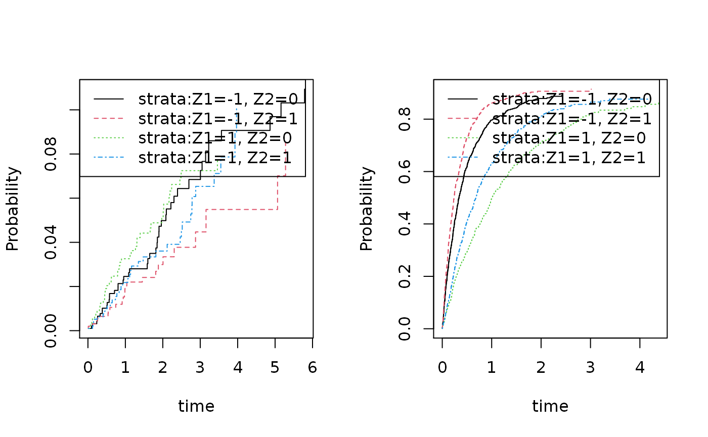
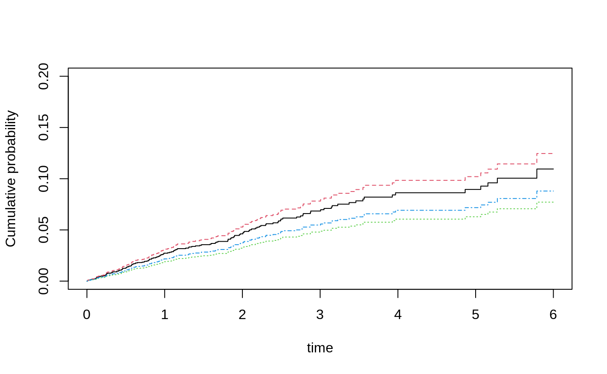

# Cumulative Incidence Regression

The cifreg function can fit the Fine-Gray model and the logit-link
cumulative incidence function for the cause of interest for competing
risks, and is completely scalable, that is, linear in the data. This
includes computation of standard errors that is also linear in data. In
addition for the Fine-Gray model predictions can be provided standard
errors for specific time-points based on influence functions for the
baseline and the regression coeficients.

To summarize

- the baseline can be stratified
- the censoring weights can be strata dependent
- predictions can be computed with standard errors (only for Fine-Gray)
- computation time linear in data
  - including standard errors
- only Fine-Gray: influence functions of baseline and regression
  coefficients computed and given by IC, iid and iidBaseline functions
- clusters can be given and then cluster corrected standard errors are
  computed

## Fine-Gray model

considered a cumulative incidence on the form $$\begin{aligned}
{F_{1}(t,X)} & {= P(T \leq t,\epsilon = 1) = 1 - exp\left( - \Lambda_{0}(t)\exp\left( X^{T}\beta \right) \right).}
\end{aligned}$$

In the case of independent right-censoring with the censoring
distribtion $G_{c}(t,X) = P\left( C > t|S(X) \right)$ where $S(X)$ is a
set of strata defined from $X$, then an ubiased estimating equation is
given by $$\begin{array}{r}
{U_{n}^{FG}(\beta) = \sum\limits_{i = 0}^{n}\int_{0}^{+ \infty}\left( X_{i} - E_{n}(t,\beta) \right)w_{i}\left( t,X_{i} \right)dN_{1,i}(t){\mspace{6mu}\text{where}\mspace{6mu}}E_{n}(t,\beta) = \frac{{\widetilde{S}}_{1}(t,\beta)}{{\widetilde{S}}_{0}(t,\beta)},}
\end{array}$$ with
$w_{i}\left( t,X_{i} \right) = \frac{G_{c}\left( t,X_{i} \right)}{G_{c}\left( T_{i} \land t,X_{i} \right)}I\left( C_{i} > T_{i} \land t \right)$
,${\widetilde{S}}_{k}(t,\beta) = \sum_{j = 1}^{n}X_{j}^{k}\exp\left( X_{j}^{T}\beta \right)Y_{1,j}(t)$
for $k = 0,1$, and with with
${\widetilde{Y}}_{1,i}(t) = Y_{1,i}(t)w_{i}\left( t,X_{i} \right)$ for
$i = 1,...,n$. $w_{i}(t)$ needs to be replaced by an estimator of the
censoring distribution, and since it does not depend on $X$ the
${\widehat{w}}_{i}(t) = \frac{{\widehat{G}}_{c}\left( t,X_{i} \right)}{{\widehat{G}}_{c}\left( T_{i} \land t,X_{i} \right)}I\left( C_{i} > T_{i} \land t \right)$
where ${\widehat{G}}_{c}$ is the Kaplan-Meier estimator of the censoring
distribution.

First we simulate some competing risks data using some utility
functions.

We simulate data with two causes based on the Fine-Gray model:
$$\begin{aligned}
{F_{1}(t,X)} & {= P\left( T \leq t,\epsilon = 1|X \right) = \left( 1 - exp\left( - \Lambda_{1}(t)\exp\left( X^{T}\beta_{1} \right) \right) \right)} \\
{F_{2}(t,X)} & {= P\left( T \leq t,\epsilon = 2|X \right) = \left( 1 - exp\left( - \Lambda_{2}(t)\exp\left( X^{T}\beta_{2} \right) \right) \right) \cdot \left( 1 - F_{1}(\infty,X) \right)}
\end{aligned}$$ where the baselines are given as
$\Lambda_{j}(t) = \rho_{j}\left( 1 - exp\left( - t/\nu_{j} \right) \right)$
for $j = 1,2$, and the $X$ being two independent binomials.
Alternatively, one can also replace the FG-model with a logistic link
$\text{expit}\left( \Lambda_{j}(t) + \exp\left( X^{T}\beta_{j} \right) \right)$.

The advantage of the model is that it is easy to fit and to get standard
errors, and that it is quite flexible essentially being a Cox-model. On
the downside is that the coefficients must be interpreted on
$cloglog$-scale. Specifically, $$\begin{aligned}
{\log\left( - \log\left( 1 - F_{1}\left( t,X_{1} + 1,X_{2} \right) \right) \right) - \log\left( - \log\left( 1 - F_{1}\left( t,X_{1},X_{2} \right) \right) \right)} & {= \beta_{1},}
\end{aligned}$$ so the effect of an increase in $X_{1}$ is $\beta_{1}$
and leads to $1 - F_{1}(t,X)$ on the $cloglog$ scale.

``` r
 library(mets)
 options(warn=-1)
 set.seed(1000) # to control output in simulatins for p-values below.

 rho1 <- 0.2; rho2 <- 10
 n <- 400
 beta=c(0.0,-0.1,-0.5,0.3)
 ## beta1=c(0.0,-0.1); beta2=c(-0.5,0.3)
 dats <- simul.cifs(n,rho1,rho2,beta,rc=0.5,rate=7)
 dtable(dats,~status)
#> 
#> status
#>   0   1   2 
#> 127  12 261
 dsort(dats) <- ~time
```

We have a look at the non-parametric cumulative incidence curves

``` r
 par(mfrow=c(1,2))
 cifs1 <- cif(Event(time,status)~strata(Z1,Z2),dats,cause=1)
 plot(cifs1)

 cifs2 <- cif(Event(time,status)~strata(Z1,Z2),dats,cause=2)
 plot(cifs2)
```



Now fitting the Fine-Gray model

``` r
 fg <- cifregFG(Event(time,status)~Z1+Z2,data=dats,cause=1)
 summary(fg)
#> 
#>    n events
#>  400     12
#> 
#>  400 clusters
#> coeffients:
#>    Estimate     S.E.  dU^-1/2 P-value
#> Z1  0.69686  0.38760  0.38882  0.0722
#> Z2 -0.85929  0.62453  0.61478  0.1689
#> 
#> exp(coeffients):
#>    Estimate    2.5%  97.5%
#> Z1  2.00744 0.93911 4.2911
#> Z2  0.42346 0.12451 1.4402

 dd <- expand.grid(Z1=c(-1,1),Z2=0:1)
 pfg <- predict(fg,dd)
 plot(pfg,ylim=c(0,0.2))
```



and GOF based on cumulative residuals (Li et al. 2015)

``` r
gofFG(Event(time,status)~Z1+Z2,data=dats,cause=1)
#> Cumulative score process test for Proportionality:
#>    Sup|U(t)|  pval
#> Z1  3.011461 0.124
#> Z2  1.373513 0.227
```

showing no problem with the proportionality of the model.

## SE’s for the baseline and predictions of FG

The standard errors reported for the FG-estimator are based on the i.i.d
decompostion (influence functions) of the estimator that we give later.
A similar decompostion exist for the baseline and is needed when
standard errors of predictions are computed. These are a bit harder to
compute for all time-points simultaneously, but they can be obtained for
specific timepoints jointly with the iid decomposition of the regression
coefficients and then used to get standard errors for predictions.

We here plot the predictions with jittered confidence intervals for the
predictions at time point 5

``` r
### predictions with CI based on iid decomposition of baseline and beta
fg <- cifregFG(Event(time,status)~Z1+Z2,data=dats,cause=1)
Biid <- iidBaseline(fg,time=5)
pfgse <- FGprediid(Biid,dd)
pfgse
#>            pred    se-log       lower     upper
#> [1,] 0.04253879 0.7418354 0.009938793 0.1820692
#> [2,] 0.16069100 0.3946377 0.074143886 0.3482633
#> [3,] 0.01823957 0.9410399 0.002884032 0.1153531
#> [4,] 0.07149610 0.4611261 0.028958169 0.1765199
plot(pfg,ylim=c(0,0.2))
for (i in 1:4) lines(c(5,5)+i/10,pfgse[i,3:4],col=i,lwd=2)
```


The iid decompostions are stored inside Biid, in addition we note that
the iid decompostions for $\widehat{\beta} - \beta_{0}$ are obtained by
the command iid()

## Comparison

We compare with the cmprsk function, that gives exactly the same, but
without running it to avoid dependencies:

``` r
run <- 0
if (run==1) {
library(cmprsk)
mm <- model.matrix(~Z1+Z2,dats)[,-1]
cr <- with(dats,crr(time,status,mm))
cbind(cr$coef,diag(cr$var)^.5,fg$coef,fg$se.coef,cr$coef-fg$coef,diag(cr$var)^.5-fg$se.coef)
#          [,1]      [,2]       [,3]      [,4]          [,5]          [,6]
# Z1  0.6968603 0.3876029  0.6968603 0.3876029 -2.442491e-15 -2.553513e-15
# Z2 -0.8592892 0.6245258 -0.8592892 0.6245258 -2.997602e-15  1.776357e-15
}
```

When comparing with the results from the coxph based on setting up the
data using the finegray function, we get the same estimates but note
that the standard errors of the coxph is missing a term and therefore
slightly different. When comparing to the estimates from coxph missing
the additional censoring term we see that we get also the same standard
errors

``` r
if (run==1) {
 library(survival)
 dats$id <- 1:nrow(dats)
 dats$event <- factor(dats$status,0:2, labels=c("censor", "death", "other"))
 fgdats <- finegray(Surv(time,event)~.,data=dats)
 coxfg <- survival::coxph(Surv(fgstart, fgstop, fgstatus) ~ Z1+Z2 + cluster(id), weight=fgwt, data=fgdats)

 fg0 <- cifreg(Event(time,status)~Z1+Z2,data=dats,cause=1,propodds=NULL)
 cbind( coxfg$coef,fg0$coef, coxfg$coef-fg0$coef)
#          [,1]       [,2]          [,3]
# Z1  0.6968603  0.6968603 -1.110223e-16
# Z2 -0.8592892 -0.8592892 -1.110223e-15
 cbind(diag(coxfg$var)^.5,fg0$se.coef,diag(coxfg$var)^.5-fg0$se.coef)
#           [,1]      [,2]          [,3]
# [1,] 0.3889129 0.3876029  0.0013099915
# [2,] 0.6241225 0.6245258 -0.0004033148
 cbind(diag(coxfg$var)^.5,fg0$se1.coef,diag(coxfg$var)^.5-fg0$se1.coef)
#           [,1]      [,2]          [,3]
# [1,] 0.3889129 0.3889129 -2.331468e-15
# [2,] 0.6241225 0.6241225  2.553513e-15
}
```

We also remove all censorings from the data to compare the estimates
with those based on coxph, and observe that the estimates as well as the
standard errors agree

``` r
datsnc <- dtransform(dats,status=2,status==0)
dtable(datsnc,~status)
#> 
#> status
#>   1   2 
#>  12 388
datsnc$id <- 1:n
datsnc$entry <- 0
max <- max(dats$time)+1
## for cause 2 add risk interaval 
datsnc2 <- subset(datsnc,status==2)
datsnc2 <- transform(datsnc2,entry=time)
datsnc2 <- transform(datsnc2,time=max)
datsncf <- rbind(datsnc,datsnc2)
#
cifnc <- cifreg(Event(time,status)~Z1+Z2,data=datsnc,cause=1,propodds=NULL)
cc <- phreg(Surv(entry,time,status==1)~Z1+Z2+cluster(id),datsncf)
cbind(cc$coef-cifnc$coef, diag(cc$var)^.5-diag(cifnc$var)^.5)
#>            [,1]          [,2]
#> Z1 1.221245e-15 -1.609823e-15
#> Z2 3.996803e-15  1.887379e-15
#            [,1]          [,2]
# Z1 1.332268e-15 -4.440892e-16
# Z2 4.218847e-15  2.220446e-16
```

the cmprsk also gives the same

``` r
if (run==1) {
 library(cmprsk)
 mm <- model.matrix(~Z1+Z2,datsnc)[,-1]
 cr <- with(datsnc,crr(time,status,mm))
 cbind(cc$coef-cr$coef, diag(cr$var)^.5-diag(cc$var)^.5)
#             [,1]         [,2]
# Z1 -4.218847e-15 1.443290e-15
# Z2  7.549517e-15 1.110223e-16
}
```

## Strata dependent Censoring weights

We can improve efficiency and avoid bias by allowing the censoring
weights to depend on the covariates

``` r
 fgcm <- cifregFG(Event(time,status)~Z1+Z2,data=dats,cause=1,cens.model=~strata(Z1,Z2))
 summary(fgcm)
#> 
#>    n events
#>  400     12
#> 
#>  400 clusters
#> coeffients:
#>    Estimate     S.E.  dU^-1/2 P-value
#> Z1  0.54277  0.37188  0.39352  0.1444
#> Z2 -0.91846  0.61886  0.61447  0.1378
#> 
#> exp(coeffients):
#>    Estimate    2.5%  97.5%
#> Z1  1.72077 0.83019 3.5667
#> Z2  0.39913 0.11867 1.3424
 summary(fg)
#> 
#>    n events
#>  400     12
#> 
#>  400 clusters
#> coeffients:
#>    Estimate     S.E.  dU^-1/2 P-value
#> Z1  0.69686  0.38760  0.38882  0.0722
#> Z2 -0.85929  0.62453  0.61478  0.1689
#> 
#> exp(coeffients):
#>    Estimate    2.5%  97.5%
#> Z1  2.00744 0.93911 4.2911
#> Z2  0.42346 0.12451 1.4402
```

We note that the standard errors are slightly smaller for the more
efficient estimator.

The influence functions of the FG-estimator is given by ,  
$$\begin{aligned}
\phi_{i}^{FG} & {= \int\left( X_{i} - e(t) \right){\widetilde{w}}_{i}(t)dM_{i1}\left( t,X_{i} \right) + \int\frac{q(t)}{\pi(t)}dM_{ic}(t),} \\
 & {= \phi_{i}^{FG,1} + \phi_{i}^{FG,2},}
\end{aligned}$$ where the first term is what would be achieved for a
known censoring distribution, and the second term is due to the
variability from the Kaplan-Meier estimator. Where
$M_{ic}(t) = N_{ic}(t) - \int_{0}^{t}Y_{i}(s)d\Lambda_{c}(s)$ with
$M_{ic}$ the standard censoring martingale.

The function $q(t)$ that reflects that the censoring only affects the
terms related to cause “2” jumps, can be written as (see Appendix B2)
$$\begin{aligned}
{q(t)} & {= E\left( H(t,X)I(T \leq t,\epsilon = 2)I(C > T)/G_{c}(T) \right) = E\left( H(t,X)F_{2}(t,X) \right),}
\end{aligned}$$ with
$H(t,X) = \int_{t}^{\infty}\left( X - e(s) \right)G(s)d\Lambda_{1}(s,X)$
and since $\pi(t) = E\left( Y(t) \right) = S(t)G_{c}(t)$.

In the case where the censoring weights are stratified (based on $X$) we
get the influence functions related to the censoring term with
$$\begin{aligned}
{q(t,X)} & {= E\left( H(t,X)I(T \leq t,\epsilon = 2)I(T < C)/G_{c}(T,X)|X \right) = H(t,X)F_{2}(t,X),}
\end{aligned}$$ so that the influence function becomes
$$\begin{array}{r}
{\int\left( X - e(t) \right)w(t)dM_{1}(t,X) + \int H(t,X)\frac{F_{2}(t,X)}{S(t,X)}\frac{1}{G_{c}(t,X)}dM_{c}(t,X).}
\end{array}$$ with
$H(t,X) = \int_{t}^{\infty}\left( X - e(s) \right)G(s,X)d\Lambda_{1}(s,X)$.

## Augmenting the FG-estimator

Rather than using a larger censoring model we can also compute the
augmentation term directly and then fit the FG-model based on this
augmentation term and do a couple of iterations

``` r
  fgaugS <- FG_AugmentCifstrata(Event(time,status)~Z1+Z2+strata(Z1,Z2),data=dats,cause=1,E=fg$E)
  summary(fgaugS)
#> 
#>    n events
#>  400     12
#> 
#>  400 clusters
#> coeffients:
#>    Estimate     S.E.  dU^-1/2 P-value
#> Z1  0.69686  0.34898  0.38882  0.0458
#> Z2 -0.85929  0.60243  0.61478  0.1538
#> 
#> exp(coeffients):
#>    Estimate    2.5%  97.5%
#> Z1  2.00744 1.01296 3.9783
#> Z2  0.42346 0.13002 1.3791

  fgaugS2 <- FG_AugmentCifstrata(Event(time,status)~Z1+Z2+strata(Z1,Z2),data=dats,cause=1,E=fgaugS$E)
  summary(fgaugS2)
#> 
#>    n events
#>  400     12
#> 
#>  400 clusters
#> coeffients:
#>    Estimate     S.E.  dU^-1/2 P-value
#> Z1  0.69686  0.34898  0.38882  0.0458
#> Z2 -0.85929  0.60243  0.61478  0.1538
#> 
#> exp(coeffients):
#>    Estimate    2.5%  97.5%
#> Z1  2.00744 1.01296 3.9783
#> Z2  0.42346 0.13002 1.3791

  fgaugS3 <- FG_AugmentCifstrata(Event(time,status)~Z1+Z2+strata(Z1,Z2),data=dats,cause=1,E=fgaugS2$E)
  summary(fgaugS3)
#> 
#>    n events
#>  400     12
#> 
#>  400 clusters
#> coeffients:
#>    Estimate     S.E.  dU^-1/2 P-value
#> Z1  0.69686  0.34898  0.38882  0.0458
#> Z2 -0.85929  0.60243  0.61478  0.1538
#> 
#> exp(coeffients):
#>    Estimate    2.5%  97.5%
#> Z1  2.00744 1.01296 3.9783
#> Z2  0.42346 0.13002 1.3791
```

Again we note slightly smaller standard errors when augmenting the
estimator.

The function compute the augmentation term for fixed $E(t)$ based on the
current $\widehat{\beta}$$$\begin{array}{r}
{U_{n}^{A} = \sum\limits_{i = 1}^{n}\int_{0}^{+ \infty}\frac{F_{2}\left( t,X_{i} \right)}{S\left( t,X_{i} \right)G_{c}\left( t,X_{i} \right)}H\left( t,X_{i},E,G_{c},\Lambda_{1} \right)dM_{ci}(t)}
\end{array}$$ using working models based on stratification to get
$F_{1}^{s}$ and $F_{2}^{s}$ where the strata are given by $strata{()}$
in the call. Then fits the FG model so solve the $$\begin{array}{r}
{U_{n}^{A}\left( \beta_{p} \right) + U_{n}^{FG}(\beta) = 0.}
\end{array}$$

Then we may iterate to get a solution to the augmented score equation
$$\begin{array}{r}
{U_{n}^{A}\left( \beta_{\infty} \right) + U_{n}^{FG}\left( \beta_{\infty} \right) = 0.}
\end{array}$$

The censoring model here is one overall Kaplan-Meier.

The influence funtion for the augmented estimator is $$\begin{array}{r}
{\int\left( X - e(t) \right)w(t)dM_{1}(t,X) + \int H(t,X)\frac{F_{2}(t,X)}{S(t,X)}\frac{1}{G_{c}(t)}dM_{c}.}
\end{array}$$ and standard errors are based on this formula.

## Logistic-link

``` r
 rho1 <- 0.2; rho2 <- 10
 n <- 400
 beta=c(0.0,-0.1,-0.5,0.3)
 dats <- simul.cifs(n,rho1,rho2,beta,rc=0.5,rate=7,type="logistic")
 dtable(dats,~status)
#> 
#> status
#>   0   1   2 
#> 166  16 218
 dsort(dats) <- ~time
```

The model where $$\begin{aligned}
{\text{logit}\left( F_{1}(t,X) \right)} & {= \alpha(t) + X^{T}\beta}
\end{aligned}$$ that then leads to OR interpretation of the $F_{1}$, can
also be fitted easily, however, the standard errors are harder to
compute and only approximative (assuming that the censoring weights are
known) but this gives typically only a small error. In the \${{\bf
timereg}}\$-package the model can be fitted using different estimators
that are more efficient using different weights but this is much slower.

Fitting the model and getting OR’s

``` r
 or <- cifreg(Event(time,status)~Z1+Z2,data=dats,cause=1)
 summary(or)
#> 
#>    n events
#>  400     16
#> 
#>  400 clusters
#> coeffients:
#>    Estimate    S.E. dU^-1/2 P-value
#> Z1  0.10017 0.25562 0.25215  0.6952
#> Z2  0.21763 0.50407 0.50346  0.6659
#> 
#> exp(coeffients):
#>    Estimate    2.5%  97.5%
#> Z1  1.10535 0.66976 1.8242
#> Z2  1.24313 0.46287 3.3387
```

## Administrative Censoring

In the case with administrative censoring we can simply provide the
risk-set given by the administrative censoring times for the Fine-Gray
or logistic link cumulative incidence regression models.

``` r
library(mets)
rho1 <- 0.3; rho2 <- 5.9
set.seed(100)
n <- 100
beta=c(0.3,-0.3,-0.5,0.3)
rc <- 0.9
###
dats <- mets:::simul.cifsRA(n,rho1,rho2,beta,bin=1,rc=rc,rate=c(3,7))
dats$status07 <- dats$status
dats$status07[dats$status %in% c(0,7)] <- 0
tt <- seq(0,6,by=0.1)
base1 <- rho1*(1-exp(-tt/3))

ccA  <-  cifregFG(Event(timeA,statusA)~Z1+Z2,dats,
          adm.cens.time=dats$censorA,no.codes=7)
estimate(ccA)
#>    Estimate Std.Err    2.5%  97.5% P-value
#> Z1  0.08665  0.2116 -0.3280 0.5014  0.6821
#> Z2  0.40535  0.4276 -0.4328 1.2435  0.3432
```

The Fine-Gray model can similarly be estimated using the modified
risk-set and the phreg function

``` r
dats$entry <- 0
dats$id <- 1:n
datA <- dats
datA2 <- subset(datA,statusA==2)
datA2$entry <- datA2$timeA
datA2$timeA <- datA2$censorA
datA2$statusA <- 0
datA <- rbind(datA,datA2)
ddA <- phreg(Event(entry,timeA,statusA==1)~Z1+Z2+cluster(id),datA)
estimate(ddA)
#>    Estimate Std.Err    2.5%  97.5% P-value
#> Z1  0.08665  0.2116 -0.3280 0.5014  0.6821
#> Z2  0.40535  0.4276 -0.4328 1.2435  0.3432

## also checking the cumulative baseline 
###plotl(tt,base1) 
###plot(ccA,add=TRUE,col=3)
###plot(ddA,col=2,add=TRUE)
```

## SessionInfo

``` r
sessionInfo()
#> R version 4.5.2 (2025-10-31)
#> Platform: x86_64-pc-linux-gnu
#> Running under: Ubuntu 24.04.3 LTS
#> 
#> Matrix products: default
#> BLAS:   /usr/lib/x86_64-linux-gnu/openblas-pthread/libblas.so.3 
#> LAPACK: /usr/lib/x86_64-linux-gnu/openblas-pthread/libopenblasp-r0.3.26.so;  LAPACK version 3.12.0
#> 
#> locale:
#>  [1] LC_CTYPE=C.UTF-8       LC_NUMERIC=C           LC_TIME=C.UTF-8       
#>  [4] LC_COLLATE=C.UTF-8     LC_MONETARY=C.UTF-8    LC_MESSAGES=C.UTF-8   
#>  [7] LC_PAPER=C.UTF-8       LC_NAME=C              LC_ADDRESS=C          
#> [10] LC_TELEPHONE=C         LC_MEASUREMENT=C.UTF-8 LC_IDENTIFICATION=C   
#> 
#> time zone: UTC
#> tzcode source: system (glibc)
#> 
#> attached base packages:
#> [1] stats     graphics  grDevices utils     datasets  methods   base     
#> 
#> other attached packages:
#> [1] mets_1.3.9
#> 
#> loaded via a namespace (and not attached):
#>  [1] cli_3.6.5              knitr_1.51             rlang_1.1.7           
#>  [4] xfun_0.55              textshaping_1.0.4      jsonlite_2.0.0        
#>  [7] listenv_0.10.0         future.apply_1.20.1    lava_1.8.2            
#> [10] htmltools_0.5.9        ragg_1.5.0             sass_0.4.10           
#> [13] rmarkdown_2.30         grid_4.5.2             evaluate_1.0.5        
#> [16] jquerylib_0.1.4        fastmap_1.2.0          numDeriv_2016.8-1.1   
#> [19] yaml_2.3.12            mvtnorm_1.3-3          lifecycle_1.0.5       
#> [22] timereg_2.0.7          compiler_4.5.2         codetools_0.2-20      
#> [25] fs_1.6.6               htmlwidgets_1.6.4      Rcpp_1.1.1            
#> [28] future_1.68.0          lattice_0.22-7         systemfonts_1.3.1     
#> [31] digest_0.6.39          R6_2.6.1               parallelly_1.46.1     
#> [34] parallel_4.5.2         splines_4.5.2          Matrix_1.7-4          
#> [37] bslib_0.9.0            tools_4.5.2            RcppArmadillo_15.2.3-1
#> [40] globals_0.18.0         survival_3.8-3         pkgdown_2.2.0         
#> [43] cachem_1.1.0           desc_1.4.3
```
