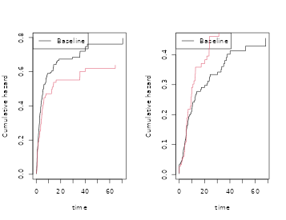
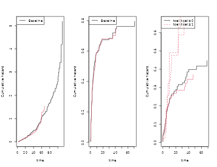
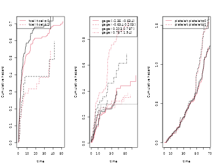

# WIP: Cooking survival data, 5 minute recipes

## Overview

Simulation of survival data is important for both theoretical and
practical work. In a practical setting we might wish to validate that
standard errors are valid even in a rather small sample, or validate
that a complicated procedure is doing as intended. Therefore it is
useful to have simple tools for generating survival data that looks as
much as possible like particular data. In a theoretical setting we often
are interested in evaluating the finite sample properties of a new
procedure in different settings that often are motivated by a specific
practical problem. The aim is provide such tools.

Bender et al. in a nice paper discussed how to generate survival data
based on the Cox model, and restricted attention to some of the many
useful parametric survival models (weibull, exponential). We here use
piecwise linear baseline functions that make it easy to simulate data
that follows closely the baseline given by the data using semi or
nonparametric models. THis makes it easy to capture important aspects of
the data.

Different survival models can be cooked, and we here give recipes for
hazard and cumulative incidence based simulations. More recipes are
given in vignette about recurrent events.

- hazard based.
- cumulative incidence.
- recurrent events (see recurrent events vignette).

``` r
 library(mets)
 options(warn=-1)
 set.seed(10) # to control output in simulations
```

## Hazard based, Cox models

Given a survival time $T$ with cumulative hazard
$\Lambda(t) = \int_{0}^{t}\lambda(s)ds$, it follows that with
$E \sim Exp(1)$ (exponential with rate 1), that $\Lambda^{- 1}(E)$ will
have the same distribution as $T$.

This provides the basis for simulations of survival times with a given
hazard and is a consequence of this simple calculation
$$P\left( \Lambda^{- 1}(E) > t \right) = P\left( E > \Lambda(t) \right) = \exp\left( - \Lambda(t) \right) = P(T > t).$$

Similarly if $T$ given $X$ have hazard on Cox form
$$\lambda_{0}(t)\exp\left( X^{T}\beta \right)$$ where $\beta$ is a
$p$-dimensional regression coefficient and $\lambda_{0}(t)$ a baseline
hazard funcion, then it is useful to observe also that
$\Lambda^{- 1}(E/HR)$ with $HR = \exp\left( X^{T}\beta \right)$ has the
same distribution as $T$ given $X$.

Therefore if the inverse of the cumulative hazard can be computed we can
generate survival with a specified hazard function. One useful
observation is note that for a piecewise linear continuous cumulative
hazard on an interval $\lbrack 0,\tau\rbrack$$\Lambda_{l}(t)$ it is easy
to compute the inverse.

Further, we can approximate any cumulative hazard with a piecewise
linear continous cumulative hazard and then simulate data according to
this approximation. Recall that fitting the Cox model to data will give
a piecewise constant cumulative hazard and the regression coefficients
so with these at hand we can first approximate the piecewise constant
“Breslow”-estimator with a linear upper (or lower bound) by simply
connecting the values by straight lines.

## Delayed entry

If $T$ given $X$ have hazard on Cox form
$$\lambda_{0}(t)\exp\left( X^{T}\beta \right)$$ and we wish to generate
data according to this hazard for those that are alive at time $s$, that
is draw from the distribution of $T$ given $T > s$ (all given $X$ ),
then we note that  
$$\Lambda_{0}^{- 1}\left( \Lambda_{0}(s) + E/HR \right))$$ with
$HR = \exp\left( X^{T}\beta \right))$ and with $E \sim Exp(1)$ has the
distributiion we are after.

This is again a consequence of a simple calculation
$$P_{X}\left( \Lambda^{- 1}\left( \Lambda(s) + E/HR \right) > t \right) = P_{X}\left( E > HR\left( \Lambda(t) - \Lambda(s) \right) \right) = P_{X}\left( T > t|T > s \right)$$

The engine is to simulate data with a given linear cumulative hazard.
First generating survival data based on the cumulative hazard cumhaz:j

``` r
 nsim <- 200
 chaz <-  c(0,1,1.5,2,2.1)
 breaks <- c(0,10,   20,  30,   40)
 cumhaz <- cbind(breaks,chaz)
 X <- rbinom(nsim,1,0.5)
 beta <- 0.2
 rrcox <- exp(X * beta)
 
 pctime <- rchaz(cumhaz,n=nsim)
 pctimecox <- rchaz(cumhaz,rrcox)
```

Now looking at a simple cox model

``` r
 library(mets)
 n <- 100
 data(bmt)
 bmt$bmi <- rnorm(408)
 dcut(bmt) <- gage~age
 data <- bmt
 cox1 <- phreg(Surv(time,cause==1)~tcell+platelet+age,data=bmt)

 dd <- sim.phreg(cox1,n,data=bmt)
 dtable(dd,~status)
#> 
#> status
#>  0  1 
#> 54 46
 scox1 <- phreg(Surv(time,status==1)~tcell+platelet+age,data=dd)
 cbind(coef(cox1),coef(scox1))
#>                [,1]       [,2]
#> tcell    -0.6517920 -0.8108950
#> platelet -0.5207454 -0.5471871
#> age       0.4083098  0.4390413
 par(mfrow=c(1,1))
 plot(scox1,col=2); plot(cox1,add=TRUE,col=1)
```



``` r

 ## changing the parametes 
 cox10 <- cox1
 cox10$coef <- c(0,0.4,0.3)
 dd <- sim.phreg(cox10,n,data=bmt)
 dtable(dd,~status)
#> 
#> status
#>  0  1 
#> 41 59
 scox1 <- phreg(Surv(time,status==1)~tcell+platelet+age,data=dd)
 cbind(coef(cox10),coef(scox1))
#>          [,1]      [,2]
#> tcell     0.0 0.1752103
#> platelet  0.4 0.4409485
#> age       0.3 0.1086505
 par(mfrow=c(1,1))
 plot(scox1,col=2); plot(cox10,add=TRUE,col=1)
```


Multiple Cox models for cause specific hazards can be combined, and we
start by drawing the covariates manually, below we just call the
sim.phregs function that draws covariates from the data,

``` r
 data(bmt); 
 cox1 <- phreg(Surv(time,cause==1)~tcell+platelet,data=bmt)
 cox2 <- phreg(Surv(time,cause==2)~tcell+platelet,data=bmt)

 X1 <- bmt[,c("tcell","platelet")]
 n <- nsim
 xid <- sample(1:nrow(X1),n,replace=TRUE)
 Z1 <- X1[xid,]
 Z2 <- X1[xid,]
 rr1 <- exp(as.matrix(Z1) %*% cox1$coef)
 rr2 <- exp(as.matrix(Z2) %*% cox2$coef)

 d <-  rcrisk(cox1$cum,cox2$cum,rr1,rr2)
 dd <- cbind(d,Z1)

 scox1 <- phreg(Surv(time,status==1)~tcell+platelet,data=dd)
 scox2 <- phreg(Surv(time,status==2)~tcell+platelet,data=dd)
 par(mfrow=c(1,2))
 plot(cox1); plot(scox1,add=TRUE,col=2)
 plot(cox2); plot(scox2,add=TRUE,col=2)
```


``` r
 cbind(cox1$coef,scox1$coef,cox2$coef,scox2$coef)
#>                [,1]       [,2]       [,3]       [,4]
#> tcell    -0.4232606 -0.6808494  0.3991068  0.2044248
#> platelet -0.5654438 -0.3404486 -0.2461474 -0.1388716
```

Now fully nonparametric model with stratified baselines and specific
call of sim.base function

``` r
 data(sTRACE)
 dtable(sTRACE,~chf+diabetes)
#> 
#>     diabetes   0   1
#> chf                 
#> 0            223  16
#> 1            230  31
 coxs <-   phreg(Surv(time,status==9)~strata(diabetes,chf),data=sTRACE)
 strata <- sample(0:3,nsim,replace=TRUE)
 simb <- sim.base(coxs$cumhaz,nsim,stratajump=coxs$strata.jumps,strata=strata)
 cc <-   phreg(Surv(time,status)~strata(strata),data=simb)
 plot(coxs,col=1); plot(cc,add=TRUE,col=2)
```


We now fit 3 cause-specific hazard models and generate competing risks
data with hazards taken from the fitted Cox models. Here a complex
situation with stratified baselines of some of the models.

``` r
 ## stratified with phreg 
 cox0 <- phreg(Surv(time,cause==0)~tcell+platelet,data=bmt)
 cox1 <- phreg(Surv(time,cause==1)~tcell+platelet,data=bmt)
 cox2 <- phreg(Surv(time,cause==2)~strata(tcell)+platelet,data=bmt)
 coxs <- list(cox0,cox1,cox2)
### dd <- sim.cause.cox(coxs,nsim,data=bmt)
 dd <- sim.phregs(coxs,n,data=bmt)

 ## checking that  cause specific hazards are as given, make n larger

 scox0 <- phreg(Surv(time,status==1)~tcell+platelet,data=dd)
 scox1 <- phreg(Surv(time,status==2)~tcell+platelet,data=dd)
 scox2 <- phreg(Surv(time,status==3)~strata(tcell)+platelet,data=dd)
 cbind(cox0$coef,scox0$coef)
#>               [,1]       [,2]
#> tcell    0.1912407 0.04260751
#> platelet 0.1563789 0.62751528
 cbind(cox1$coef,scox1$coef)
#>                [,1]       [,2]
#> tcell    -0.4232606 -0.5092389
#> platelet -0.5654438 -0.4858872
 cbind(cox2$coef,scox2$coef)
#>                [,1]      [,2]
#> platelet -0.2271912 0.2167204
 par(mfrow=c(1,3))
 plot(cox0); plot(scox0,add=TRUE,col=2); 
 plot(cox1); plot(scox1,add=TRUE,col=2); 
 plot(cox2); plot(scox2,add=TRUE,col=2); 
```


``` r
 
 ########################################
 ## second example 
 ########################################

 cox1 <- phreg(Surv(time,cause==1)~strata(tcell)+platelet,data=bmt)
 cox2 <- phreg(Surv(time,cause==2)~tcell+strata(platelet),data=bmt)
 coxs <- list(cox1,cox2)
### dd <- sim.cause.cox(coxs,nsim,data=bmt)
 dd <- sim.phregs(coxs,n,data=bmt)
 scox1 <- phreg(Surv(time,status==1)~strata(tcell)+platelet,data=dd)
 scox2 <- phreg(Surv(time,status==2)~tcell+strata(platelet),data=dd)
 cbind(cox1$coef,scox1$coef)
#>                [,1]       [,2]
#> platelet -0.5658612 -0.6092701
 cbind(cox2$coef,scox2$coef)
#>            [,1]      [,2]
#> tcell 0.4153706 0.5130511
 par(mfrow=c(1,2))
 plot(cox1); plot(scox1,add=TRUE); 
 plot(cox2); plot(scox2,add=TRUE); 
```


- sim.phreg only for phreg, but can deal with strata
- sim.cox for other cox models, see last part of vignette, can only deal
  with covariates that can be identified from the names of its
  coefficients (so factors should be coded accordingly).

One more example

``` r
 library(mets)
 n <- 100
 data(bmt)
 bmt$bmi <- rnorm(408)
 dcut(bmt) <- gage~age
 data <- bmt
 cox1 <- phreg(Surv(time,cause==1)~strata(tcell,platelet),data=bmt)
 cox2 <- phreg(Surv(time,cause==2)~strata(gage,tcell),data=bmt)
 cox3 <- phreg(Surv(time,cause==0)~strata(platelet)+bmi,data=bmt)
 coxs <- list(cox1,cox2,cox3)

 dd <- sim.phregs(coxs,n,data=bmt,extend=0.002)
 dtable(dd,~status)
#> 
#> status
#>  0  1  2  3 
#>  9 46 17 28
 scox1 <- phreg(Surv(time,status==1)~strata(tcell,platelet),data=dd)
 scox2 <- phreg(Surv(time,status==2)~strata(gage,tcell),data=dd)
 scox3 <- phreg(Surv(time,status==3)~strata(platelet)+bmi,data=dd)
 cbind(coef(cox1),coef(scox1), coef(cox2),coef(scox2), coef(cox3),coef(scox3))
#>          [,1]      [,2]
#> bmi 0.1281967 0.2921947
 par(mfrow=c(1,3))
 plot(scox1,col=2); plot(cox1,add=TRUE,col=1)
 plot(scox2,col=2); plot(cox2,add=TRUE,col=1)
 plot(scox3,col=2); plot(cox3,add=TRUE,col=1)
```



## Multistate models: The Illness Death model

Using a hazard based simulation with delayed entry we can then simulate
data from for example the general illness-death model. Here the
cumulative hazards need to be specified.

First we set up some cumulative hazards, then we simulate some data and
re-estimate the cumulative baselines

``` r
 data(CPH_HPN_CRBSI)
 dr <- CPH_HPN_CRBSI$terminal
 base1 <- CPH_HPN_CRBSI$crbsi 
 base4 <- CPH_HPN_CRBSI$mechanical
 dr2 <- scalecumhaz(dr,1.5)
 cens <- rbind(c(0,0),c(2000,0.5),c(5110,3))

 iddata <- simMultistate(nsim,base1,base1,dr,dr2,cens=cens)
 dlist(iddata,.~id|id<3,n=0)
#> id: 1
#>       time status entry death from to start     stop
#> 1 119.8711      3     0     1    1  3     0 119.8711
#> ------------------------------------------------------------ 
#> id: 2
#>       time status entry death from to start     stop
#> 2 682.9688      3     0     1    1  3     0 682.9688
  
 ### estimating rates from simulated data  
 c0 <- phreg(Surv(start,stop,status==0)~+1,iddata)
 c3 <- phreg(Surv(start,stop,status==3)~+strata(from),iddata)
 c1 <- phreg(Surv(start,stop,status==1)~+1,subset(iddata,from==2))
 c2 <- phreg(Surv(start,stop,status==2)~+1,subset(iddata,from==1))
 ###
 par(mfrow=c(2,2))
 plot(c0)
 lines(cens,col=2) 
 plot(c3,main="rates 1-> 3 , 2->3")
 lines(dr,col=1,lwd=2)
 lines(dr2,col=2,lwd=2)
 ###
 plot(c1,main="rate 1->2")
 lines(base1,lwd=2)
 ###
 plot(c2,main="rate 2->1")
 lines(base1,lwd=2)
```



## Cumulative incidence

In this section we discuss how to simulate competing risks data that
have a specfied cumulative incidence function. We consider for
simplicity a competing risks model with two causes and denote the
cumulative incidence curves as
$F_{1}(t,X) = P\left( T < t,\epsilon = 1|X \right)$ and
$F_{2}(t,X) = P\left( T < t,\epsilon = 2|X \right)$. Here given some
covariate $X$.

To generate data with the required cumulative incidence functions a
simple approach is to first figure out if the subject dies and then from
what cause, then finally draw the survival time according to the
conditional distribution.

For simplicity we consider survival times in a fixed interval
$\lbrack 0,\tau\rbrack$, and first flip a coin with and probabilities
$1 - F_{1}(\tau,X) - F_{2}(\tau,X)$ to decide if the subject is a
survivor or dies. Then if subject dies we then flip a coin with
probabilities
$F_{1}(\tau,X)/\left( F_{1}(\tau,X) + F_{2}(\tau,X) \right)$ and
$F_{2}(\tau,X)/\left( F_{1}(\tau,X) + F_{2}(\tau,X) \right)$ to decide
if it is a cause $!$, $\epsilon = 1$, or a cause 2, $\epsilon = 2$.
Finally we draw the survival time using the cumulative incidence
distribution. The timing of a cause $j$ event is thus
$T = ({\widetilde{F}}_{1}^{- 1}(U,X)$ with
${\widetilde{F}}_{1}(s,X) = F_{1}(s,X)/F_{1}(\tau,X)$ and $U$ is a
uniform.

Then indeed $P\left( T \leq t,\epsilon = j|X \right) = F_{j}(t,X)$ for
$j = 1,2$.

We again note and use that if ${\widetilde{F}}_{j}(s)$ and $F_{j}(s)$
are piecewise linear continuous functions then the inverse is easy to
compute.

## Cumulative incidence I

We here simulate two causes of death with two binary covarites of
logistic type $$\begin{aligned}
{F_{1}(t,X)} & {= \frac{\Lambda_{1}\left( t,\rho_{1} \right)exp\left( X^{T}\beta \right)}{1 + \Lambda_{1}\left( t,\rho_{1} \right)exp\left( X^{T}\beta \right)}}
\end{aligned}$$ and $F_{2}$ here enforcing the sum condition
$F_{1} + F_{2} \leq 1$$$\begin{aligned}
{F_{2}(t,X)} & {= \frac{\Lambda_{2}\left( t,\rho_{2} \right)exp\left( X^{T}\beta \right)}{1 + \Lambda_{2}\left( t,\rho_{2} \right)exp\left( X^{T}\beta \right)}\left\lbrack 1 - F_{1}(\tau,X) \right\rbrack}
\end{aligned}$$ or not $$\begin{aligned}
{F_{2}(t,X)} & {= \frac{\Lambda_{2}\left( t,\rho_{2} \right)exp\left( X^{T}\beta \right)}{1 + \Lambda_{2}\left( t,\rho_{2} \right)exp\left( X^{T}\beta \right)}}
\end{aligned}$$

The baselines are given as
$\Lambda_{j}(t) = \rho_{1}\left( 1 - exp\left( - t/r_{j} \right) \right)$
where $\rho_{j}$ and $r_{j}$ are postive constants, and here $\tau = 6$.

To simulate the survival time we use a piecwise linear approximation of
the cumulative incidence functions and will thus depends on some grid
for linear approximation. Our linear approximation can be made
arbitrarily close to any specific smooth cumulative incidence function.

``` r
library(mets)
nsim <- 100
rho1 <- 0.4; rho2 <- 2
beta <- c(0.3,-0.3,-0.3,0.3)

dats <- simul.cifs(nsim,rho1,rho2,beta,rc=0.5,depcens=0,type="logistic")

# Fitting regression model with CIF logistic-link 
cif1 <- cifreg(Event(time,status)~Z1+Z2,dats)
summary(cif1)
#> 
#>    n events
#>  100     13
#> 
#>  100 clusters
#> coeffients:
#>    Estimate     S.E.  dU^-1/2 P-value
#> Z1  0.19032  0.30822  0.27962  0.5369
#> Z2 -0.82349  0.64255  0.60309  0.2000
#> 
#> exp(coeffients):
#>    Estimate    2.5%  97.5%
#> Z1  1.20964 0.66114 2.2132
#> Z2  0.43890 0.12457 1.5463


dats <- simul.cifs(n,rho1,rho2,beta,rc=0.5,depcens=0,type="cloglog")
ciff <- cifregFG(Event(time,status)~Z1+Z2,dats)
summary(ciff)
#> 
#>    n events
#>  100     26
#> 
#>  100 clusters
#> coeffients:
#>    Estimate     S.E.  dU^-1/2 P-value
#> Z1  0.33760  0.19992  0.20825  0.0913
#> Z2 -0.62671  0.38164  0.40632  0.1006
#> 
#> exp(coeffients):
#>    Estimate    2.5%  97.5%
#> Z1  1.40158 0.94722 2.0739
#> Z2  0.53435 0.25291 1.1290
```

We can also use the parameters based on fitted models

``` r
 data(bmt)
 ################################################################
 #  simulating several causes with specific cumulatives 
 ################################################################
 cif1 <-  cifreg(Event(time,cause)~tcell+age,data=bmt,cause=1)
 cif2 <-  cifreg(Event(time,cause)~tcell+age,data=bmt,cause=2)

 ## dd <- sim.cifs(list(cif1,cif2),nsim,data=bmt)
 dds <- sim.cifsRestrict(list(cif1,cif2),nsim,data=bmt)

 scif1 <-  cifreg(Event(time,cause)~tcell+age,data=dds,cause=1)
 scif2 <-  cifreg(Event(time,cause)~tcell+age,data=dds,cause=2)
    
 cbind(cif1$coef,scif1$coef)
#>             [,1]       [,2]
#> tcell -0.7966937 -2.5383710
#> age    0.4164386  0.5450321
 cbind(cif2$coef,scif2$coef)
#>              [,1]      [,2]
#> tcell  0.66688269 1.7602329
#> age   -0.03248603 0.4363223
 par(mfrow=c(1,2))   
 plot(cif1); plot(scif1,add=TRUE,col=2)
 plot(cif2); plot(scif2,add=TRUE,col=2)
```


## CIF Delayed entry

Now assume that given covariates
$F_{1}(t;X) = P\left( T < t,\epsilon = 1|X \right)$ and
$F_{2}(t;X) = P\left( T < t,\epsilon = 2|X \right)$ are two cumulative
incidence functions that satistifes the needed constraints. We wish to
generate data that follows these two piecewise linear cumulative
indidence functions with delayed entry at time $s$. We should thus
generate data that follows the cumulative incidence functions
$${\widetilde{F}}_{1}(t,s;X) = \frac{F_{1}(t;X) - F_{1}(s;;X)}{1 - F_{1}(s;X) - F_{2}(s;X)}$$
and
$${\widetilde{F}}_{2}(t,s;X) = \frac{F_{2}(t;X) - F_{2}(s;;X)}{1 - F_{1}(s;X) - F_{2}(s;X)}$$
this can be done according to the recipe in the previous section.  
To be specific (ignoring the $X$ in the formula)
$$F_{1}^{- 1}\left( F_{1}(s) + U \cdot \left( 1 - F_{1}(s;X) - F_{2}(s;X) \right) \right)$$
where $U$ is a uniform, will have distribution given by
${\widetilde{F}}_{1}(t,s)$.

## Recurrent events

See also recurrent events vignette

``` r
 data(CPH_HPN_CRBSI)
 dr <- CPH_HPN_CRBSI$terminal
 base1 <- CPH_HPN_CRBSI$crbsi 
 base4 <- CPH_HPN_CRBSI$mechanical

 n <- 100
 rr <- simRecurrent(n,base1,death.cumhaz=dr)
 ###
 par(mfrow=c(1,3))
 showfitsim(causes=1,rr,dr,base1,base1,which=1:2)

 rr <- simRecurrentII(n,base1,base4,death.cumhaz=dr)
 dtable(rr,~death+status)
#> 
#>       status   0   1   2
#> death                   
#> 0             10 280  40
#> 1             90   0   0
 showfitsim(causes=2,rr,dr,base1,base4,which=1:2)

 cumhaz <- list(base1,base1,base4)
 drl <- list(dr,base4)
 rr <- simRecurrentList(n,cumhaz,death.cumhaz=drl)
 dtable(rr,~death+status)
#> 
#>       status   0   1   2   3
#> death                       
#> 0              2 194 192  30
#> 1             71   0   0   0
#> 2             27   0   0   0
 showfitsimList(rr,cumhaz,drl) 
```


- sim.recurrent can simulate based on cox hazard for events and death
  based on phreg
  - similar to sim.phreg

``` r
 data(hfactioncpx12)
 hf <- hfactioncpx12
 hf$x <- as.numeric(hf$treatment) 
 n <- 100

 ##  to fit non-parametric models with just a baseline 
 xr <- phreg(Surv(entry,time,status==1)~cluster(id),data=hf)
 dr <- phreg(Surv(entry,time,status==2)~cluster(id),data=hf)

 simcoxcox <- sim.recurrent(xr,dr,n=n,data=hf)

 recGL <- recreg(Event(entry,time,status)~+cluster(id),hf,death.code=2)
 simglcox <- sim.recurrent(recGL,dr,n=n,data=hf)
```

## Simulations based on coxph

``` r
 cox <-  survival::coxph(Surv(time,status==9)~vf+chf+wmi,data=sTRACE)
 sim1 <- sim.cox(cox,nsim,data=sTRACE)
 cc <- survival::coxph(Surv(time,status)~vf+chf+wmi,data=sim1)
 cbind(cox$coef,cc$coef)
#>           [,1]       [,2]
#> vf   0.2970218 -0.2184569
#> chf  0.8018334  0.5825885
#> wmi -0.8920005 -1.8603130
 cor(sim1[,c("vf","chf","wmi")])
#>             vf        chf         wmi
#> vf  1.00000000  0.1435916  0.06617519
#> chf 0.14359163  1.0000000 -0.50148928
#> wmi 0.06617519 -0.5014893  1.00000000
 cor(sTRACE[,c("vf","chf","wmi")])
#>              vf        chf         wmi
#> vf   1.00000000  0.1346711 -0.08966805
#> chf  0.13467109  1.0000000 -0.37464791
#> wmi -0.08966805 -0.3746479  1.00000000
 
 cox <-  phreg(Surv(time, status==9)~vf+chf+wmi,data=sTRACE)
 sim3 <- sim.cox(cox,nsim,data=sTRACE)
 cc <-  phreg(Surv(time, status)~vf+chf+wmi,data=sim3)
 cbind(cox$coef,cc$coef)
#>           [,1]       [,2]
#> vf   0.2970218  0.1326161
#> chf  0.8018334  1.0879842
#> wmi -0.8920005 -0.5919069
 plot(cox,se=TRUE); plot(cc,add=TRUE,col=2)
```


``` r
 
 coxs <-  phreg(Surv(time,status==9)~strata(chf,vf)+wmi,data=sTRACE)
 sim3 <- sim.phreg(coxs,nsim,data=sTRACE)
 cc <-   phreg(Surv(time, status)~strata(chf,vf)+wmi,data=sim3)
 cbind(coxs$coef,cc$coef)
#>           [,1]       [,2]
#> wmi -0.8683355 -0.9816674
 plot(coxs,col=1); plot(cc,add=TRUE,col=2)
```


More Cox games with cause specific hazards

``` r
 data(bmt)
 # coxph          
 cox1 <- survival::coxph(Surv(time,cause==1)~tcell+platelet,data=bmt)
 cox2 <- survival::coxph(Surv(time,cause==2)~tcell+platelet,data=bmt)
 coxs <- list(cox1,cox2)
 dd <- sim.cause.cox(coxs,nsim,data=bmt)
 scox1 <- survival::coxph(Surv(time,status==1)~tcell+platelet,data=dd)
 scox2 <- survival::coxph(Surv(time,status==2)~tcell+platelet,data=dd)
 cbind(cox1$coef,scox1$coef)
#>                [,1]       [,2]
#> tcell    -0.4231551 -0.9391252
#> platelet -0.5646181 -0.1879697
 cbind(cox2$coef,scox2$coef)
#>                [,1]       [,2]
#> tcell     0.3991911  0.0480784
#> platelet -0.2456203 -0.3839736
```

## SessionInfo

``` r
sessionInfo()
#> R version 4.5.2 (2025-10-31)
#> Platform: x86_64-pc-linux-gnu
#> Running under: Ubuntu 24.04.3 LTS
#> 
#> Matrix products: default
#> BLAS:   /usr/lib/x86_64-linux-gnu/openblas-pthread/libblas.so.3 
#> LAPACK: /usr/lib/x86_64-linux-gnu/openblas-pthread/libopenblasp-r0.3.26.so;  LAPACK version 3.12.0
#> 
#> locale:
#>  [1] LC_CTYPE=C.UTF-8       LC_NUMERIC=C           LC_TIME=C.UTF-8       
#>  [4] LC_COLLATE=C.UTF-8     LC_MONETARY=C.UTF-8    LC_MESSAGES=C.UTF-8   
#>  [7] LC_PAPER=C.UTF-8       LC_NAME=C              LC_ADDRESS=C          
#> [10] LC_TELEPHONE=C         LC_MEASUREMENT=C.UTF-8 LC_IDENTIFICATION=C   
#> 
#> time zone: UTC
#> tzcode source: system (glibc)
#> 
#> attached base packages:
#> [1] stats     graphics  grDevices utils     datasets  methods   base     
#> 
#> other attached packages:
#> [1] mets_1.3.9
#> 
#> loaded via a namespace (and not attached):
#>  [1] cli_3.6.5           knitr_1.50          rlang_1.1.6        
#>  [4] xfun_0.54           textshaping_1.0.4   jsonlite_2.0.0     
#>  [7] listenv_0.10.0      future.apply_1.20.0 lava_1.8.2         
#> [10] htmltools_0.5.8.1   ragg_1.5.0          sass_0.4.10        
#> [13] rmarkdown_2.30      grid_4.5.2          evaluate_1.0.5     
#> [16] jquerylib_0.1.4     fastmap_1.2.0       numDeriv_2016.8-1.1
#> [19] yaml_2.3.10         mvtnorm_1.3-3       lifecycle_1.0.4    
#> [22] timereg_2.0.7       compiler_4.5.2      codetools_0.2-20   
#> [25] fs_1.6.6            htmlwidgets_1.6.4   Rcpp_1.1.0         
#> [28] future_1.68.0       lattice_0.22-7      systemfonts_1.3.1  
#> [31] digest_0.6.38       R6_2.6.1            parallelly_1.45.1  
#> [34] parallel_4.5.2      splines_4.5.2       Matrix_1.7-4       
#> [37] bslib_0.9.0         tools_4.5.2         globals_0.18.0     
#> [40] survival_3.8-3      pkgdown_2.2.0       cachem_1.1.0       
#> [43] desc_1.4.3
```
