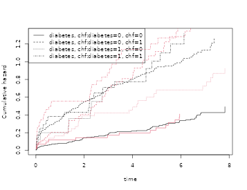
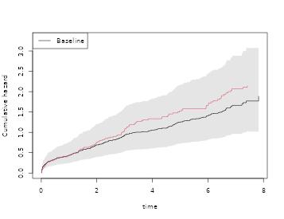
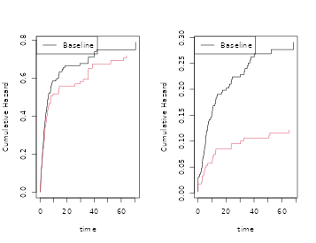

# WIP: Cooking survival data, 5 minute recipes

## Overview

Simulation of survival data is important for both theoretical and
practical work. In a practical setting we might wish to validate that
standard errors are valid even in a rather small sample, or validate
that a complicated procedure is doing as intended. Therefore it is
useful to have simple tools for generating survival data that looks as
much as possible like particular data. In a theoretical setting we often
are interested in evaluating the finite sample properties of a new
procedure in different settings that often are motivated by a specific
practical problem. The aim is provide such tools.

Bender et al. in a nice paper discussed how to generate survival data
based on the Cox model, and restricted attention to some of the many
useful parametric survival models (weibull, exponential). We here use
piecewise linear baseline functions that make it easy to simulate data
that follows closely the baseline given by the data using semi or
nonparametric models. This makes it easy to capture important aspects of
the data.

Different survival models can be cooked, and we here give recipes for
hazard and cumulative incidence based simulations. More recipes are
given in vignette about recurrent events.

- hazard based.
- cumulative incidence.
- recurrent events (see recurrent events vignette).

``` r
 library(mets)
 options(warn=-1)
 set.seed(10) # to control output in simulations
```

## Hazard based, Cox models

Given a survival time $T$ with cumulative hazard
$\Lambda(t) = \int_{0}^{t}\lambda(s)ds$, it follows that with
$E \sim Exp(1)$ (exponential with rate 1), that $\Lambda^{- 1}(E)$ will
have the same distribution as $T$.

This provides the basis for simulations of survival times with a given
hazard and is a consequence of this simple calculation
$$P\left( \Lambda^{- 1}(E) > t \right) = P\left( E > \Lambda(t) \right) = \exp\left( - \Lambda(t) \right) = P(T > t).$$

Similarly if $T$ given $X$ have hazard on Cox form
$$\lambda_{0}(t)\exp\left( X^{T}\beta \right)$$ where $\beta$ is a
$p$-dimensional regression coefficient and $\lambda_{0}(t)$ a baseline
hazard funcion, then it is useful to observe also that
$\Lambda^{- 1}(E/HR)$ with $HR = \exp\left( X^{T}\beta \right)$ has the
same distribution as $T$ given $X$.

Therefore if the inverse of the cumulative hazard can be computed we can
generate survival with a specified hazard function. One useful
observation is note that for a piecewise linear continuous cumulative
hazard on an interval $\lbrack 0,\tau\rbrack$$\Lambda_{l}(t)$ it is easy
to compute the inverse.

Further, we can approximate any cumulative hazard with a piecewise
linear continous cumulative hazard and then simulate data according to
this approximation. Recall that fitting the Cox model to data will give
a piecewise constant cumulative hazard and the regression coefficients
so with these at hand we can first approximate the piecewise constant
“Breslow”-estimator with a linear upper (or lower bound) by simply
connecting the values by straight lines.

## Delayed entry

If $T$ given $X$ have hazard on Cox form
$$\lambda_{0}(t)\exp\left( X^{T}\beta \right)$$ and we wish to generate
data according to this hazard for those that are alive at time $s$, that
is draw from the distribution of $T$ given $T > s$ (all given $X$ ),
then we note that  
$$\Lambda_{0}^{- 1}\left( \Lambda_{0}(s) + E/HR \right))$$ with
$HR = \exp\left( X^{T}\beta \right))$ and with $E \sim Exp(1)$ has the
distributiion we are after.

This is again a consequence of a simple calculation
$$P_{X}\left( \Lambda^{- 1}\left( \Lambda(s) + E/HR \right) > t \right) = P_{X}\left( E > HR\left( \Lambda(t) - \Lambda(s) \right) \right) = P_{X}\left( T > t|T > s \right)$$

The engine is to simulate data with a given linear cumulative hazard.
First generating survival data based on the cumulative hazard cumhaz:j

``` r
 nsim <- 1000
 chaz <-  c(0,1,1.5,2,2.1)
 breaks <- c(0,10,   20,  30,   40)
 cumhaz <- cbind(breaks,chaz)
 X <- rbinom(nsim,1,0.5)
 beta <- 0.2
 rrcox <- exp(X * beta)
 
 pctime <- rchaz(cumhaz,n=nsim)
 pctimecox <- rchaz(cumhaz,rrcox)
```

Now looking at a simple cox model

``` r
 library(mets)
 n <- nsim
 data(bmt)
 bmt$bmi <- rnorm(408)
 dcut(bmt) <- gage~age
 data <- bmt
 cox1 <- phreg(Surv(time,cause==1)~tcell+platelet+age,data=bmt)

 dd <- sim.phreg(cox1,n,data=bmt)
 dtable(dd,~status)
#> 
#> status
#>   0   1 
#> 529 471
 scox1 <- phreg(Surv(time,status==1)~tcell+platelet+age,data=dd)
 cbind(coef(cox1),coef(scox1))
#>                [,1]       [,2]
#> tcell    -0.6517920 -0.4564152
#> platelet -0.5207454 -0.5113844
#> age       0.4083098  0.3860139
 par(mfrow=c(1,1))
 plot(scox1,col=2); plot(cox1,add=TRUE,col=1)
```


``` r

 ## changing the parameters 
 cox10 <- cox1
 cox10$coef <- c(0,0.4,0.3)
 dd <- sim.phreg(cox10,n,data=bmt)
 dtable(dd,~status)
#> 
#> status
#>   0   1 
#> 427 573
 scox1 <- phreg(Surv(time,status==1)~tcell+platelet+age,data=dd)
 cbind(coef(cox10),coef(scox1))
#>          [,1]       [,2]
#> tcell     0.0 0.05615982
#> platelet  0.4 0.34930321
#> age       0.3 0.42496872
 par(mfrow=c(1,1))
 plot(scox1,col=2); plot(cox10,add=TRUE,col=1)
```


Multiple Cox models for cause specific hazards can be combined, and we
start by drawing the covariates manually, below we just call the
sim.phregs function that draws covariates from the data,

``` r
 data(bmt); 
 cox1 <- phreg(Surv(time,cause==1)~tcell+platelet,data=bmt)
 cox2 <- phreg(Surv(time,cause==2)~tcell+platelet,data=bmt)

 X1 <- bmt[,c("tcell","platelet")]
 n <- nsim
 xid <- sample(1:nrow(X1),n,replace=TRUE)
 Z1 <- X1[xid,]
 Z2 <- X1[xid,]
 rr1 <- exp(as.matrix(Z1) %*% cox1$coef)
 rr2 <- exp(as.matrix(Z2) %*% cox2$coef)

 d <-  rcrisk(cox1$cum,cox2$cum,rr1,rr2)
 dd <- cbind(d,Z1)

 scox1 <- phreg(Surv(time,status==1)~tcell+platelet,data=dd)
 scox2 <- phreg(Surv(time,status==2)~tcell+platelet,data=dd)
 par(mfrow=c(1,2))
 plot(cox1); plot(scox1,add=TRUE,col=2)
 plot(cox2); plot(scox2,add=TRUE,col=2)
```



``` r
 cbind(cox1$coef,scox1$coef,cox2$coef,scox2$coef)
#>                [,1]       [,2]       [,3]       [,4]
#> tcell    -0.4232606 -0.3727007  0.3991068  0.8167564
#> platelet -0.5654438 -0.5834273 -0.2461474 -0.3190683
```

Now fully nonparametric model with stratified baselines

``` r
 data(sTRACE)
 dtable(sTRACE,~chf+diabetes)
#> 
#>     diabetes   0   1
#> chf                 
#> 0            223  16
#> 1            230  31
 coxs <-   phreg(Surv(time,status==9)~strata(diabetes,chf),data=sTRACE)
 strata <- sample(0:3,nsim,replace=TRUE)
 simb <- sim.phreg(coxs,nsim,data=NULL,strata=strata)

 cc <-   phreg(Surv(time,status)~strata(strata),data=simb)
 plot(coxs,col=1); plot(cc,add=TRUE,col=2)

 simb1 <- sim.phreg(coxs,nsim,data=sTRACE)
 cc1 <-   phreg(Surv(time,status)~strata(diabetes,chf),data=simb1)
 plot(cc1,add=TRUE,col=3)
```



We now fit cause-specific hazard models with 3 causes (censoring as one
of them) and generate competing risks data with hazards taken from the
fitted Cox models. Here a situation with stratified baselines for some
of the models:

``` stratified
 ## r with phreg 
 cox0 <- phreg(Surv(time,cause==0)~tcell+platelet,data=bmt)
 cox1 <- phreg(Surv(time,cause==1)~tcell+platelet,data=bmt)
 cox2 <- phreg(Surv(time,cause==2)~strata(tcell)+platelet,data=bmt)
 coxs <- list(cox0,cox1,cox2)
 dd <- sim.phregs(coxs,n,data=bmt)

 ## checking that  cause specific hazards are as given, make n larger
 scox0 <- phreg(Surv(time,status==1)~tcell+platelet,data=dd)
 scox1 <- phreg(Surv(time,status==2)~tcell+platelet,data=dd)
 scox2 <- phreg(Surv(time,status==3)~strata(tcell)+platelet,data=dd)
 cbind(cox0$coef,scox0$coef)
 cbind(cox1$coef,scox1$coef)
 cbind(cox2$coef,scox2$coef)
 par(mfrow=c(1,3))
 plot(cox0); plot(scox0,add=TRUE,col=2); 
 plot(cox1); plot(scox1,add=TRUE,col=2); 
 plot(cox2); plot(scox2,add=TRUE,col=2); 
 
 ########################################
 ## second example 
 ########################################

 cox1 <- phreg(Surv(time,cause==1)~strata(tcell)+platelet,data=bmt)
 cox2 <- phreg(Surv(time,cause==2)~tcell+strata(platelet),data=bmt)
 coxs <- list(cox1,cox2)
 dd <- sim.phregs(coxs,n,data=bmt)
 scox1 <- phreg(Surv(time,status==1)~strata(tcell)+platelet,data=dd)
 scox2 <- phreg(Surv(time,status==2)~tcell+strata(platelet),data=dd)
 cbind(cox1$coef,scox1$coef)
 cbind(cox2$coef,scox2$coef)
 par(mfrow=c(1,2))
 plot(cox1); plot(scox1,add=TRUE); 
 plot(cox2); plot(scox2,add=TRUE); 
```

- sim.phreg for phreg, can deal with strata
- sim.phregs cause specific hazards on phreg form

One more example fully non-parametric

``` r
 library(mets)
 n <- nsim
 data(bmt)
 bmt$bmi <- rnorm(408)
 dcut(bmt) <- gage~age
 data <- bmt
 cox1 <- phreg(Surv(time,cause==1)~strata(tcell,platelet),data=bmt)
 cox2 <- phreg(Surv(time,cause==2)~strata(gage,tcell),data=bmt)
 cox3 <- phreg(Surv(time,cause==0)~strata(platelet)+bmi,data=bmt)
 coxs <- list(cox1,cox2,cox3)

 dd <- sim.phregs(coxs,n,data=bmt,extend=0.002)
 dtable(dd,~status)
#> 
#> status
#>   0   1   2   3 
#> 227 373 232 168
 scox1 <- phreg(Surv(time,status==1)~strata(tcell,platelet),data=dd)
 scox2 <- phreg(Surv(time,status==2)~strata(gage,tcell),data=dd)
 scox3 <- phreg(Surv(time,status==3)~strata(platelet)+bmi,data=dd)
 cbind(coef(cox1),coef(scox1), coef(cox2),coef(scox2), coef(cox3),coef(scox3))
#>           [,1]      [,2]
#> bmi 0.07591238 0.1488615
 par(mfrow=c(1,3))
 plot(scox1,col=2); plot(cox1,add=TRUE,col=1)
 plot(scox2,col=2); plot(cox2,add=TRUE,col=1)
 plot(scox3,col=2); plot(cox3,add=TRUE,col=1)
```


## Multistate models: The Illness Death model

Using a hazard based simulation with delayed entry we can then simulate
data from for example the general illness-death model. Here the
cumulative hazards need to be specified.

We simply give the cumulative hazards for the different transitions to
the function simMultistate to simulate data from the model, subsequently
we re-estimate the parameters based on the simulated data to validate
the procedure.

``` r
 data(CPH_HPN_CRBSI)
 dr <- CPH_HPN_CRBSI$terminal
 base1 <- CPH_HPN_CRBSI$crbsi 
 base4 <- CPH_HPN_CRBSI$mechanical
 dr2 <- scalecumhaz(dr,1.5)
 cens <- rbind(c(0,0),c(2000,0.5),c(5110,3))

 iddata <- simMultistate(nsim,base1,base1,dr,dr2,cens=cens)
 dlist(iddata,.~id|id<3,n=0)
#> id: 1
#>   entry     time status rr death from to start     stop
#> 1     0 140.6815      3  1     1    1  3     0 140.6815
#> ------------------------------------------------------------ 
#> id: 2
#>         entry     time status rr death from to    start     stop
#> 2      0.0000 335.4145      2  1     0    1  2   0.0000 335.4145
#> 1001 335.4145 394.7477      1  1     0    2  1 335.4145 394.7477
#> 1634 394.7477 395.6884      0  1     0    1  0 394.7477 395.6884
  
 ### estimating rates from simulated data  
 c0 <- phreg(Surv(start,stop,status==0)~+1,iddata)
 c3 <- phreg(Surv(start,stop,status==3)~+strata(from),iddata)
 c1 <- phreg(Surv(start,stop,status==1)~+1,subset(iddata,from==2))
 c2 <- phreg(Surv(start,stop,status==2)~+1,subset(iddata,from==1))
 ###
 par(mfrow=c(2,2))
 plot(c0)
 lines(cens,col=2) 
 plot(c3,main="rates 1-> 3 , 2->3")
 lines(dr,col=1,lwd=2)
 lines(dr2,col=2,lwd=2)
 ###
 plot(c1,main="rate 1->2")
 lines(base1,lwd=2)
 ###
 plot(c2,main="rate 2->1")
 lines(base1,lwd=2)
```


## Cumulative incidence

In this section we discuss how to simulate competing risks data that
have a specfied cumulative incidence function. We consider for
simplicity a competing risks model with two causes and denote the
cumulative incidence curves as
$F_{1}(t,X) = P\left( T < t,\epsilon = 1|X \right)$ and
$F_{2}(t,X) = P\left( T < t,\epsilon = 2|X \right)$. Here given some
covariate $X$.

To generate data with the required cumulative incidence functions a
simple approach is to first figure out if the subject dies and then from
what cause, then finally draw the survival time according to the
conditional distribution.

For simplicity we consider survival times in a fixed interval
$\lbrack 0,\tau\rbrack$, and first flip a coin with and probabilities
$1 - F_{1}(\tau,X) - F_{2}(\tau,X)$ to decide if the subject is a
survivor or dies. Then if subject dies we then flip a coin with
probabilities
$F_{1}(\tau,X)/\left( F_{1}(\tau,X) + F_{2}(\tau,X) \right)$ and
$F_{2}(\tau,X)/\left( F_{1}(\tau,X) + F_{2}(\tau,X) \right)$ to decide
if it is a cause $!$, $\epsilon = 1$, or a cause 2, $\epsilon = 2$.
Finally we draw the survival time using the cumulative incidence
distribution. The timing of a cause $j$ event is thus
$T = ({\widetilde{F}}_{1}^{- 1}(U,X)$ with
${\widetilde{F}}_{1}(s,X) = F_{1}(s,X)/F_{1}(\tau,X)$ and $U$ is a
uniform.

Then indeed $P\left( T \leq t,\epsilon = j|X \right) = F_{j}(t,X)$ for
$j = 1,2$.

We again note and use that if ${\widetilde{F}}_{j}(s)$ and $F_{j}(s)$
are piecewise linear continuous functions then the inverse is easy to
compute.

### Cumulative incidence I

We here simulate two causes of death with two binary covarites of
logistic type $$\begin{aligned}
{F_{1}(t,X)} & {= \frac{\Lambda_{1}\left( t,\rho_{1} \right)exp\left( X^{T}\beta \right)}{1 + \Lambda_{1}\left( t,\rho_{1} \right)exp\left( X^{T}\beta \right)}}
\end{aligned}$$ and $F_{2}$ here enforcing the sum condition
$F_{1} + F_{2} \leq 1$$$\begin{aligned}
{F_{2}(t,X)} & {= \frac{\Lambda_{2}\left( t,\rho_{2} \right)exp\left( X^{T}\beta \right)}{1 + \Lambda_{2}\left( t,\rho_{2} \right)exp\left( X^{T}\beta \right)}\left\lbrack 1 - F_{1}(\tau,X) \right\rbrack}
\end{aligned}$$ or not $$\begin{aligned}
{F_{2}(t,X)} & {= \frac{\Lambda_{2}\left( t,\rho_{2} \right)exp\left( X^{T}\beta \right)}{1 + \Lambda_{2}\left( t,\rho_{2} \right)exp\left( X^{T}\beta \right)}}
\end{aligned}$$

The baselines are given as
$\Lambda_{j}(t) = \rho_{1}\left( 1 - exp\left( - t/r_{j} \right) \right)$
where $\rho_{j}$ and $r_{j}$ are postive constants, and here $\tau = 6$.

To simulate the survival time we use a piecwise linear approximation of
the cumulative incidence functions and will thus depends on some grid
for linear approximation. Our linear approximation can be made
arbitrarily close to any specific smooth cumulative incidence function.

``` r
library(mets)
nsim <- 100
rho1 <- 0.4; rho2 <- 2
beta <- c(0.3,-0.3,-0.3,0.3)

dats <- simul.cifs(nsim,rho1,rho2,beta,rc=0.5,depcens=0,type="logistic")

par(mfrow=c(1,2))
# Fitting regression model with CIF logistic-link 
cif1 <- cifreg(Event(time,status)~Z1+Z2,dats)
summary(cif1)
#> 
#>    n events
#>  100     19
#> 
#>  100 clusters
#> coeffients:
#>     Estimate      S.E.   dU^-1/2 P-value
#> Z1 -0.097975  0.252782  0.232452  0.6983
#> Z2  0.146136  0.502409  0.464850  0.7711
#> 
#> exp(coeffients):
#>    Estimate    2.5%  97.5%
#> Z1  0.90667 0.55244 1.4881
#> Z2  1.15735 0.43233 3.0983
plot(cif1)
lines(attr(dats,"Lam1"))

dats <- simul.cifs(nsim,rho1,rho2,beta,rc=0.5,depcens=0,type="cloglog")
ciff <- cifregFG(Event(time,status)~Z1+Z2,dats)
summary(ciff)
#> 
#>    n events
#>  100     20
#> 
#>  100 clusters
#> coeffients:
#>    Estimate    S.E. dU^-1/2 P-value
#> Z1  0.24189 0.22915 0.23459  0.2912
#> Z2  0.65704 0.46627 0.46940  0.1588
#> 
#> exp(coeffients):
#>    Estimate    2.5%  97.5%
#> Z1  1.27365 0.81283 1.9957
#> Z2  1.92907 0.77349 4.8110
plot(ciff)
lines(attr(dats,"Lam1"))
```


We can also use the parameters based on fitted models

``` r
 data(bmt)
 ################################################################
 #  simulating several causes with specific cumulatives 
 ################################################################
 ## two logistic link models 
 cif1 <-  cifreg(Event(time,cause)~tcell+age,data=bmt,cause=1)
 cif2 <-  cifreg(Event(time,cause)~tcell+age,data=bmt,cause=2)

 dd <- sim.cifs(list(cif1,cif2),nsim,data=bmt)

 ## still logistic link 
 scif1 <-  cifreg(Event(time,cause)~tcell+age,data=dd,cause=1)
 ## 2nd cause not on logistic form due to restriction
 scif2 <-  cifreg(Event(time,cause)~tcell+age,data=dd,cause=2)
    
 cbind(cif1$coef,scif1$coef)
#>             [,1]      [,2]
#> tcell -0.7966937 0.2319643
#> age    0.4164386 0.7074909
 cbind(cif2$coef,scif2$coef)
#>              [,1]       [,2]
#> tcell  0.66688269 -0.6246131
#> age   -0.03248603 -0.5207753
 par(mfrow=c(1,2))   
 plot(cif1); plot(scif1,add=TRUE,col=2)
 plot(cif2); plot(scif2,add=TRUE,col=2)
```


### CIF Delayed entry

Now assume that given covariates
$F_{1}(t;X) = P\left( T < t,\epsilon = 1|X \right)$ and
$F_{2}(t;X) = P\left( T < t,\epsilon = 2|X \right)$ are two cumulative
incidence functions that satistifes the needed constraints. We wish to
generate data that follows these two piecewise linear cumulative
indidence functions with delayed entry at time $s$. We should thus
generate data that follows the cumulative incidence functions
$${\widetilde{F}}_{1}(t,s;X) = \frac{F_{1}(t;X) - F_{1}(s;;X)}{1 - F_{1}(s;X) - F_{2}(s;X)}$$
and
$${\widetilde{F}}_{2}(t,s;X) = \frac{F_{2}(t;X) - F_{2}(s;;X)}{1 - F_{1}(s;X) - F_{2}(s;X)}$$
this can be done according to the recipe in the previous section.  
To be specific (ignoring the $X$ in the formula)
$$F_{1}^{- 1}\left( F_{1}(s) + U \cdot \left( 1 - F_{1}(s;X) - F_{2}(s;X) \right) \right)$$
where $U$ is a uniform, will have distribution given by
${\widetilde{F}}_{1}(t,s)$.

## Recurrent events

See also recurrent events vignette

- sim.recurrent can simulate based on the Two-Stage model where the the
  - the rate of the terminal event among survivors in on Cox form
    (phreg)
    - the rate of the recurrent events among survivors is on Cox form
      (phreg)
    - the rate of the recurrent events is a marginal Ghosh-Lin model
      (recreg)
  - the simulations is based on approximations with piecewise linear
    models based on a grid.
  - the events can be dependent via a frailty random effects (Gamma
    distributed)
- simRecurrentII, simRecurrent, simRecurrentList
  - A frailty Gamma model where the rate of the events and the terminal
    event are given based on cumulative baselines and relative risk
    covariate effects. Thus ends up on Cox form given the frailty and
    covariates.
  - simRecurrentList can take multiple recurrent events and multiple
    causes of death

Two-stage models

``` r
 data(hfactioncpx12)
 hf <- hfactioncpx12
 hf$x <- as.numeric(hf$treatment) 
 n <- 1000

 ##  to fit Cox  models 
 xr <- phreg(Surv(entry,time,status==1)~treatment+cluster(id),data=hf)
 dr <- phreg(Surv(entry,time,status==2)~treatment+cluster(id),data=hf)
 estimate(xr)
#>            Estimate Std.Err   2.5%    97.5% P-value
#> treatment1  -0.1534 0.08145 -0.313 0.006286 0.05973
 estimate(dr)
#>            Estimate Std.Err    2.5%    97.5% P-value
#> treatment1  -0.4301  0.1831 -0.7889 -0.07132  0.0188

 simcoxcox <- sim.recurrent(xr,dr,n=n,data=hf)

 xrs <- phreg(Surv(start,stop,statusD==1)~treatment+cluster(id),data=simcoxcox)
 drs <- phreg(Surv(start,stop,statusD==3)~treatment+cluster(id),data=simcoxcox)
 estimate(xrs)
#>            Estimate Std.Err    2.5%    97.5%  P-value
#> treatment1  -0.2233 0.07217 -0.3648 -0.08185 0.001974
 estimate(drs)
#>            Estimate Std.Err    2.5%   97.5%  P-value
#> treatment1  -0.3901  0.1375 -0.6596 -0.1206 0.004552

 par(mfrow=c(1,2))
 plot(xrs); 
 plot(xr,add=TRUE)
###
 plot(drs)
 plot(dr,add=TRUE)
```



and a now with Ghosh-Lin and Cox marginals

``` r
 recGL <- recreg(Event(entry,time,status)~treatment+cluster(id),hf,death.code=2)
 estimate(recGL)
#>            Estimate Std.Err    2.5%   97.5% P-value
#> treatment1  -0.1104 0.07866 -0.2646 0.04376  0.1604
 estimate(dr)
#>            Estimate Std.Err    2.5%    97.5% P-value
#> treatment1  -0.4301  0.1831 -0.7889 -0.07132  0.0188

 simglcox <- sim.recurrent(recGL,dr,n=n,data=hf)

 simcoxcox <- sim.recurrent(xr,dr,n=n,data=hf)
 dtable(simcoxcox,~statusD)
#> 
#> statusD
#>    0    1    3 
#>  755 2603  245

 recGL <- recreg(Event(entry,time,status)~treatment+cluster(id),hf,death.code=2)
 simglcox <- sim.recurrent(recGL,dr,n=n,data=hf)

 GLs <- recreg(Event(start,stop,statusD)~treatment+cluster(id),data=simglcox,death.code=3)
 drs <- phreg(Surv(start,stop,statusD==3)~treatment+cluster(id),data=simglcox)
 estimate(GLs)
#>            Estimate Std.Err   2.5%  97.5% P-value
#> treatment1  -0.1317 0.07259 -0.274 0.0106 0.06968
 estimate(drs)
#>            Estimate Std.Err    2.5%   97.5%   P-value
#> treatment1    -0.46  0.1336 -0.7219 -0.1982 0.0005744

 par(mfrow=c(1,2))
 plot(GLs); 
 plot(recGL,add=TRUE)
###
 plot(drs)
 plot(dr,add=TRUE)
```


Frailty models

``` r
 data(CPH_HPN_CRBSI)
 dr <- CPH_HPN_CRBSI$terminal
 base1 <- CPH_HPN_CRBSI$crbsi 
 base4 <- CPH_HPN_CRBSI$mechanical

 n <- 100
 rr <- simRecurrent(n,base1,death.cumhaz=dr)
 ###
 par(mfrow=c(1,3))
 showfitsim(causes=1,rr,dr,base1,base1,which=1:2)

 rr <- simRecurrentII(n,base1,base4,death.cumhaz=dr)
 dtable(rr,~death+status)
#> 
#>       status   0   1   2
#> death                   
#> 0             11 266  25
#> 1             89   0   0
 showfitsim(causes=2,rr,dr,base1,base4,which=1:2)

 cumhaz <- list(base1,base1,base4)
 drl <- list(dr,base4)
 rr <- simRecurrentList(n,cumhaz,death.cumhaz=drl)
 dtable(rr,~death+status)
#> 
#>       status   0   1   2   3
#> death                       
#> 0              4 179 192  24
#> 1             78   0   0   0
#> 2             18   0   0   0
 showfitsimList(rr,cumhaz,drl) 
```


## Parametric models

While the semi‑parametric Cox model provides substantial flexibility for
simulating survival data, there are situations where a fully parametric
simulation model is convenient or preferable. Here we consider a Weibull
model parametrized so that the cumulative hazard is given by
$$\Lambda(t) = \lambda \cdot t^{s}$$ where $s$ is the **shape
parameter**, and $\lambda$ the **rate parameter**. We allow regression
on both parameters $$\begin{array}{r}
{\lambda:=\exp\left( \beta^{\top}X \right),\quad s:=\exp\left( \gamma^{\top}Z \right)}
\end{array}$$ where $X$ and $Z$ are covariate vectors. Specifically,
this opens up for exploring non‑proportional hazards when $s$ depends on
covariates.

Revisiting the TRACE data example we can compare the predictions from
the Cox and the Weibull-Cox model stratified by `chf` and with a
proportional hazard effect of `age`

``` r
data(sTRACE, package = "mets")
dat <- sTRACE
cox1 <- phreg(Surv(time, status > 0) ~ strata(chf) + I(age - 67), data = sTRACE)
coxw <- phreg_weibull(Surv(time, status > 0) ~ chf + age,
    shape.formula = ~chf,
    data = sTRACE
    )
coxw
#> 
#> - Weibull-Cox model -
#> 
#> Call:
#> phreg_weibull(formula = Surv(time, status > 0) ~ chf + age, shape.formula = ~chf, 
#>     data = sTRACE)
#> 
#> log-Likelihood: -684.750499 
#> 
#>    n events obs.time
#>  500    264 2228.481
#> 
#>               Estimate  Std.Err     2.5%   97.5%   P-value
#> (Intercept)   -5.59626 0.465886 -6.50938 -4.6831 3.070e-33
#> chf            0.83250 0.197629  0.44516  1.2198 2.526e-05
#> age            0.05331 0.006165  0.04123  0.0654 5.241e-18
#> ─────────────                                             
#> s:(Intercept) -0.44096 0.116740 -0.66977 -0.2122 1.585e-04
#> s:chf         -0.11794 0.133078 -0.37877  0.1429 3.755e-01

tt <- seq(0, max(sTRACE$time), length.out = 100)
newd <- data.frame(chf = c(1, 0), age=67)
pr <- predict(coxw, newdata = newd, times = tt, type="chaz")
plot(cox1, col = 1)
lines(tt, pr[, 1, 1], lty=2, lwd=2)
lines(tt, pr[, 1, 2], lty = 1, lwd = 2)
```


To simulate data we can use the
[`rweibullcox()`](http://kkholst.github.io/mets/reference/rweibullcox.md)
function. Note that the
[`stats::rweibull()`](https://rdrr.io/r/stats/Weibull.html) function
gives a different parametrization where the cumulative hazard is given
by $H(t) = (t/b)^{s}$, i.e., with the same scale parameter but where the
scale parameter $b$ is related to the rate parameter we consider by
$r:=b^{- s}$.

``` r
n <- 5000
newd <- mets::dsample(size=n, sTRACE[,c("chf","age")]) # bootstrap covariates
lp <- predict(coxw, newdata=newd, type="lp") # linear-predictors
head(lp)
#>             [,1]       [,2]
#> X6549 -0.9896742 -0.5589006
#> X6523 -0.5935585 -0.5589006
#> X3742 -1.3657441 -0.5589006
#> X6258 -0.9611517 -0.5589006
#> X79   -2.8312847 -0.4409608
#> X2952 -2.3217722 -0.4409608

## simulate event times
tt <- rweibullcox(nrow(lp), rate = exp(lp[,1]), shape= exp(lp[,2]))

# censoring model
censw <- phreg_weibull(Surv(time, status==0) ~ 1, data=sTRACE)
censpar <- exp(coef(censw))
censtime <- pmin(8, rweibullcox(nrow(lp), censpar[1], censpar[2]))

# combined simulated data
newd <- transform(newd, time=pmin(tt, censtime), status=(tt<=censtime))
head(newd)
#>       chf    age     time status
#> X6549   1 70.791 0.374941   TRUE
#> X6523   1 78.221 3.973340   TRUE
#> X3742   1 63.737 4.330397   TRUE
#> X6258   1 71.326 1.414283   TRUE
#> X79     0 51.863 5.323526   TRUE
#> X2952   0 61.420 6.433051  FALSE

# estimate weibull model on new data
phreg_weibull(Surv(time,status) ~ chf + age, ~chf, data=newd)
#> 
#> - Weibull-Cox model -
#> 
#> Call:
#> phreg_weibull(formula = Surv(time, status) ~ chf + age, shape.formula = ~chf, 
#>     data = newd)
#> 
#> log-Likelihood: -6682.897120 
#> 
#>     n events obs.time
#>  5000   2622 21530.79
#> 
#>               Estimate  Std.Err     2.5%    97.5%    P-value
#> (Intercept)   -5.57207 0.154019 -5.87394 -5.27020 1.356e-286
#> chf            0.79395 0.057334  0.68158  0.90632  1.311e-43
#> age            0.05367 0.002115  0.04952  0.05782 5.238e-142
#> ─────────────                                               
#> s:(Intercept) -0.46327 0.032007 -0.52600 -0.40054  1.767e-47
#> s:chf         -0.11396 0.038514 -0.18944 -0.03847  3.088e-03
```

All these steps are wrapped in the `simulate` method:

``` r
# simulate(coxw, n = 5, cens.model = NULL, data=newd, var.names = c("time", "status"))
simulate(coxw, nsim = 5)
#>         no wmi status chf    age sex diabetes       time vf
#> X707   707 1.8   TRUE   1 87.175   0        0 0.12940912  0
#> X1157 1157 1.3  FALSE   1 64.074   1        0 7.13699999  0
#> X6628 6628 1.1   TRUE   0 84.825   0        0 0.44463601  0
#> X969   969 0.6   TRUE   1 65.461   1        0 0.05219977  0
#> X4417 4417 1.2  FALSE   0 76.189   1        0 6.01461443  0
```

## SessionInfo

``` r
sessionInfo()
#> R version 4.5.2 (2025-10-31)
#> Platform: x86_64-pc-linux-gnu
#> Running under: Ubuntu 24.04.3 LTS
#> 
#> Matrix products: default
#> BLAS:   /usr/lib/x86_64-linux-gnu/openblas-pthread/libblas.so.3 
#> LAPACK: /usr/lib/x86_64-linux-gnu/openblas-pthread/libopenblasp-r0.3.26.so;  LAPACK version 3.12.0
#> 
#> locale:
#>  [1] LC_CTYPE=C.UTF-8       LC_NUMERIC=C           LC_TIME=C.UTF-8       
#>  [4] LC_COLLATE=C.UTF-8     LC_MONETARY=C.UTF-8    LC_MESSAGES=C.UTF-8   
#>  [7] LC_PAPER=C.UTF-8       LC_NAME=C              LC_ADDRESS=C          
#> [10] LC_TELEPHONE=C         LC_MEASUREMENT=C.UTF-8 LC_IDENTIFICATION=C   
#> 
#> time zone: UTC
#> tzcode source: system (glibc)
#> 
#> attached base packages:
#> [1] stats     graphics  grDevices utils     datasets  methods   base     
#> 
#> other attached packages:
#> [1] mets_1.3.9
#> 
#> loaded via a namespace (and not attached):
#>  [1] cli_3.6.5              knitr_1.51             rlang_1.1.7           
#>  [4] xfun_0.55              textshaping_1.0.4      jsonlite_2.0.0        
#>  [7] listenv_0.10.0         future.apply_1.20.1    lava_1.8.2            
#> [10] htmltools_0.5.9        ragg_1.5.0             sass_0.4.10           
#> [13] rmarkdown_2.30         grid_4.5.2             evaluate_1.0.5        
#> [16] jquerylib_0.1.4        fastmap_1.2.0          numDeriv_2016.8-1.1   
#> [19] yaml_2.3.12            mvtnorm_1.3-3          lifecycle_1.0.5       
#> [22] timereg_2.0.7          compiler_4.5.2         codetools_0.2-20      
#> [25] fs_1.6.6               htmlwidgets_1.6.4      Rcpp_1.1.1            
#> [28] future_1.68.0          lattice_0.22-7         systemfonts_1.3.1     
#> [31] digest_0.6.39          R6_2.6.1               parallelly_1.46.1     
#> [34] parallel_4.5.2         splines_4.5.2          Matrix_1.7-4          
#> [37] bslib_0.9.0            tools_4.5.2            RcppArmadillo_15.2.3-1
#> [40] globals_0.18.0         survival_3.8-3         pkgdown_2.2.0         
#> [43] cachem_1.1.0           desc_1.4.3
```
