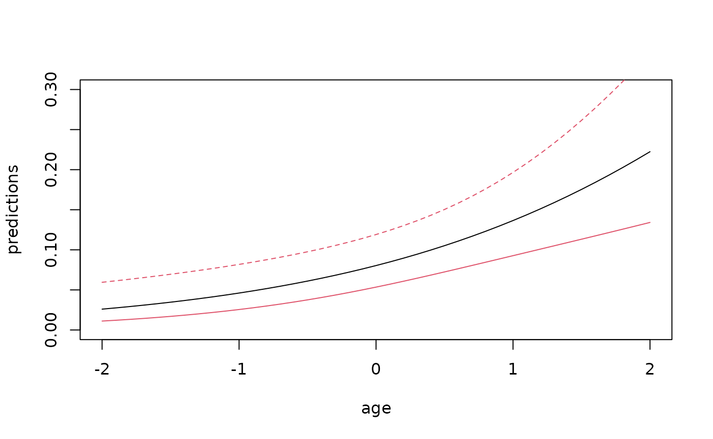

# GEE cluster standard errors and predictions for glm objects

## Utility functions for GLM objects

Getting the OR with confidence intervals using the GEE (sandwhich)
standard errors

``` r
set.seed(100)

library(mets)
data(bmt); 
bmt$id <- sample(1:100,408,replace=TRUE)

glm1 <- glm(tcell~platelet+age,bmt,family=binomial)
summaryGLM(glm1)
#> $coef
#>             Estimate Std.Err    2.5%   97.5%   P-value
#> (Intercept)  -2.4371  0.2225 -2.8732 -2.0009 6.481e-28
#> platelet      1.1368  0.3076  0.5340  1.7397 2.189e-04
#> age           0.5927  0.1551  0.2888  0.8966 1.319e-04
#> 
#> $or
#>               Estimate       2.5%     97.5%
#> (Intercept) 0.08741654 0.05651794 0.1352076
#> platelet    3.11688928 1.70573194 5.6955015
#> age         1.80895115 1.33489115 2.4513641
#> 
#> $fout
#> NULL

## GEE robust standard errors
summaryGLM(glm1,id=bmt$id)
#> $coef
#>             Estimate Std.Err    2.5%   97.5%   P-value
#> (Intercept)  -2.4371  0.2157 -2.8599 -2.0142 1.361e-29
#> platelet      1.1368  0.2830  0.5822  1.6914 5.877e-05
#> age           0.5927  0.1434  0.3117  0.8738 3.568e-05
#> 
#> $or
#>               Estimate       2.5%     97.5%
#> (Intercept) 0.08741654 0.05727471 0.1334211
#> platelet    3.11688928 1.79006045 5.4271903
#> age         1.80895115 1.36575550 2.3959664
#> 
#> $fout
#> NULL
```

Predictions also simple

``` r
age <- seq(-2,2,by=0.1)
nd <- data.frame(platelet=0,age=seq(-2,2,by=0.1))
pnd <- predictGLM(glm1,nd)
head(pnd$pred)
#>      Estimate       2.5%      97.5%
#> p1 0.02601899 0.01115243 0.05951051
#> p2 0.02756409 0.01214068 0.06136414
#> p3 0.02919819 0.01321187 0.06328733
#> p4 0.03092608 0.01437206 0.06528441
#> p5 0.03275278 0.01562757 0.06736019
#> p6 0.03468351 0.01698493 0.06952008
plot(age,pnd$pred[,1],type="l",ylab="predictions",xlab="age",ylim=c(0,0.3))
plotConfRegion(age,pnd$pred[,2:3],col=2)
```



``` r
###matlines(age,pnd$pred[,-1],col=2,lty=1)
```

## SessionInfo

``` r
sessionInfo()
#> R version 4.5.2 (2025-10-31)
#> Platform: x86_64-pc-linux-gnu
#> Running under: Ubuntu 24.04.3 LTS
#> 
#> Matrix products: default
#> BLAS:   /usr/lib/x86_64-linux-gnu/openblas-pthread/libblas.so.3 
#> LAPACK: /usr/lib/x86_64-linux-gnu/openblas-pthread/libopenblasp-r0.3.26.so;  LAPACK version 3.12.0
#> 
#> locale:
#>  [1] LC_CTYPE=C.UTF-8       LC_NUMERIC=C           LC_TIME=C.UTF-8       
#>  [4] LC_COLLATE=C.UTF-8     LC_MONETARY=C.UTF-8    LC_MESSAGES=C.UTF-8   
#>  [7] LC_PAPER=C.UTF-8       LC_NAME=C              LC_ADDRESS=C          
#> [10] LC_TELEPHONE=C         LC_MEASUREMENT=C.UTF-8 LC_IDENTIFICATION=C   
#> 
#> time zone: UTC
#> tzcode source: system (glibc)
#> 
#> attached base packages:
#> [1] stats     graphics  grDevices utils     datasets  methods   base     
#> 
#> other attached packages:
#> [1] mets_1.3.9
#> 
#> loaded via a namespace (and not attached):
#>  [1] cli_3.6.5              knitr_1.51             rlang_1.1.7           
#>  [4] xfun_0.55              textshaping_1.0.4      jsonlite_2.0.0        
#>  [7] listenv_0.10.0         future.apply_1.20.1    lava_1.8.2            
#> [10] htmltools_0.5.9        ragg_1.5.0             sass_0.4.10           
#> [13] rmarkdown_2.30         grid_4.5.2             evaluate_1.0.5        
#> [16] jquerylib_0.1.4        fastmap_1.2.0          numDeriv_2016.8-1.1   
#> [19] yaml_2.3.12            mvtnorm_1.3-3          lifecycle_1.0.5       
#> [22] timereg_2.0.7          compiler_4.5.2         codetools_0.2-20      
#> [25] fs_1.6.6               htmlwidgets_1.6.4      Rcpp_1.1.1            
#> [28] future_1.68.0          lattice_0.22-7         systemfonts_1.3.1     
#> [31] digest_0.6.39          R6_2.6.1               parallelly_1.46.1     
#> [34] parallel_4.5.2         splines_4.5.2          Matrix_1.7-4          
#> [37] bslib_0.9.0            tools_4.5.2            RcppArmadillo_15.2.3-1
#> [40] globals_0.18.0         survival_3.8-3         pkgdown_2.2.0         
#> [43] cachem_1.1.0           desc_1.4.3
```
