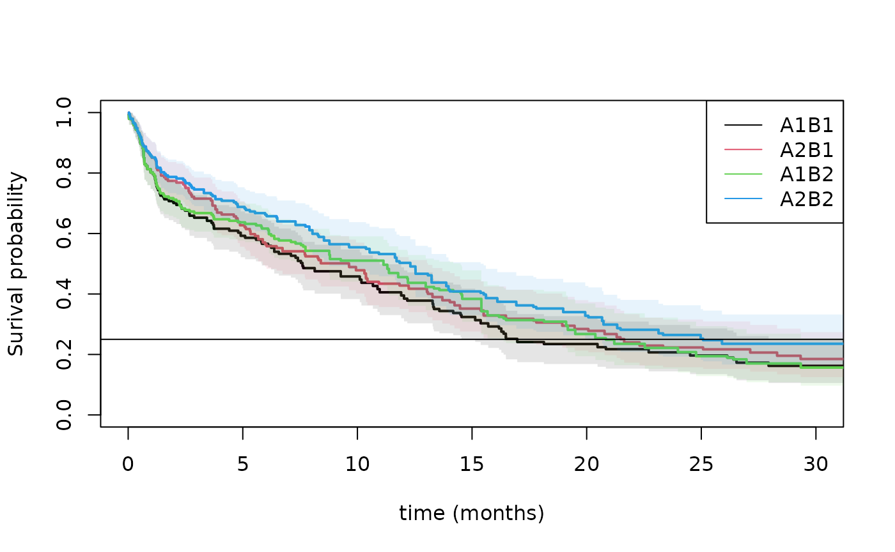

# Randomization for Cox Type rate models

## Two-Stage Randomization for counting process outcomes

Specify rate models of $N_{1}(t)$.

- survival data
- competing risks, cause specific hazards.
- recurrent events data

Under simple randomization we can estimate the rate Cox model

- $\lambda_{0}(t)\exp\left( A_{0}\beta_{0} \right)$

Under two-stage randomization we can estimate the rate Cox model

- $\lambda_{0}(t)\exp\left( A_{0}\beta_{0} + A_{1}(t)\beta_{1} \right)$

Starting point is that Cox’s partial likelihood score can be used for
estimating parameters $$\begin{aligned}
{U(\beta)} & {= \int\left( A(t) - e(t) \right)dN_{1}(t)}
\end{aligned}$$ where $A(t)$ is the combined treatments over time.

- the solution will converge to $\beta^{*}$ the Struthers-Kalbfleisch
  solution of the score and will have robust standard errors Lin-Wei.

The estimator can be agumented in different ways using additional
covariates at the time of randomization and a censoring augmentation.
The solved estimating eqution is $$\begin{array}{r}
{\sum\limits_{i}U_{i} - AUG_{0} - AUG_{1} + AUG_{C} = 0}
\end{array}$$ using the covariates from augmentR0 to augment with
$$\begin{array}{r}
{AUG_{0} = \left( A_{0} - \pi_{0}\left( X_{0} \right) \right)X_{0}\gamma_{0}}
\end{array}$$ where possibly
$P\left( A_{0} = 1|X_{0} \right) = \pi_{0}\left( X_{0} \right)$ but does
not depend on covariates under randomization, and furhter using the
covariates from augmentR1, to augment with R indiciating that the
randomization takes place or not, $$\begin{array}{r}
{AUG_{1} = R\left( A_{1} - \pi_{1}\left( X_{1} \right) \right)X_{1}\gamma_{1}}
\end{array}$$ and the dynamic censoring augmenting  
$$\begin{array}{r}
{AUG_{C} = \int_{0}^{t}\gamma_{c}(s)^{T}\left( e(s) - \bar{e}(s) \right)\frac{1}{G_{c}(s)}dM_{c}(s)}
\end{array}$$ where $\gamma_{c}(s)$ is chosen to minimize the variance
given the dynamic covariates specified by augmentC.

The propensity score models are always estimated unless it is requested
to use some fixed number $\pi_{0} = 1/2$ for example, but always better
to be adaptive and estimate $\pi_{0}$. Also $\gamma_{0}$ and
$\gamma_{1}$ are estimated to reduce variance of $U_{i}$.

- The treatment’s must be given as factors.
- Treatment for 2nd randomization may depend on response.
  - Treatment probabilities are estimated by default and uncertainty
    from this adjusted for.
  - treat.model must then typically allow for interaction with treatment
    number and covariates
- Randomization augmentation for 1’st and 2’nd randomization possible.
  - typesR=c(“R0”,“R1”,“R01”)
- Censoring model possibly stratified on observed covariates (at time
  0).
  - default model is to stratify after randomization R0
  - cens.model can be specified
- Censoring augmentation done dynamically over time with time-dependent
  covariates.
  - typesC=c(“C”,“dynC”), C fixed coefficients and dynC dynamic
  - done for each strata in censoring model

Standard errors are estimated using the influence function of all
estimators and tests of differences can therefore be computed
subsequently.

- variance adjustment for censoring augmentation computed subtracting
  variance gain
- influence functions given for case with R0 only

The times of randomization is specified by

- treat.var is “1” when a randomization is given
  - default is to assume that all time-points corresponds to a
    treatment, the survival case without time-dependent covariates
  - recurrent events situation must be specified as first record of each
    subject, see below example.

Data must be given on start,stop,status survival format with

- one code of status indicating events of interest
- one code for the censorings

The phreg_rct can be used for counting process style data, and thus
covers situations with

- recurrent events
- survival data
- cause-specific hazards (competing risks)

and will in all cases compute augmentations

- dynamic censoring augmentation
  - dynC
- RCT augmentation
  - R0, R1 and R01

## Simple Randomization: Lu-Tsiatis marginal Cox model

``` r
library(mets) 
set.seed(100)

## Lu, Tsiatis simulation
data <- mets:::simLT(0.7,100)
dfactor(data) <- Z.f~Z
 
out <- phreg_rct(Surv(time,status)~Z.f,data=data,augmentR0=~X,augmentC=~factor(Z):X)
summary(out)
#>                 Estimate   Std.Err       2.5%     97.5%   P-value
#> Marginal-Z.f1 0.29263400 0.2739159 -0.2442313 0.8294993 0.2853693
#> R0_C:Z.f1     0.07166242 0.2234066 -0.3662065 0.5095313 0.7483838
#> R0_dynC:Z.f1  0.08321604 0.2221710 -0.3522312 0.5186633 0.7079889
#> attr(,"class")
#> [1] "summary.phreg_rct"
###out <- phreg_rct(Surv(time,status)~Z.f,data=data,augmentR0=~X,augmentC=~X)
###out <- phreg_rct(Surv(time,status)~Z.f,data=data,augmentR0=~X,augmentC=~factor(Z):X,cens.model=~+1)
```

Results consitent with speff of library(speff2trial)

``` r
###library(speff2trial) 
library(mets)
data(ACTG175)
###
data <- ACTG175[ACTG175$arms==0 | ACTG175$arms==1, ]
data <- na.omit(data[,c("days","cens","arms","strat","cd40","cd80","age")])
data$days <- data$days+runif(nrow(data))*0.01
dfactor(data) <- arms.f~arms
notrun <- 1

if (notrun==0) { 
fit1 <- speffSurv(Surv(days,cens)~cd40+cd80+age,data=data,trt.id="arms",fixed=TRUE)
summary(fit1)
}
# 
# Treatment effect
#             Log HR       SE   LowerCI   UpperCI           p
# Prop Haz  -0.70375  0.12352  -0.94584  -0.46165  1.2162e-08
# Speff     -0.72430  0.12051  -0.96050  -0.48810  1.8533e-09

out <- phreg_rct(Surv(days,cens)~arms.f,data=data,augmentR0=~cd40+cd80+age,augmentC=~cd40+cd80+age)
summary(out)
#>                    Estimate   Std.Err       2.5%      97.5%      P-value
#> Marginal-arms.f1 -0.7036460 0.1224406 -0.9436251 -0.4636669 9.092786e-09
#> R0_C:arms.f1     -0.7265342 0.1197607 -0.9612610 -0.4918075 1.306891e-09
#> R0_dynC:arms.f1  -0.7204699 0.1196158 -0.9549125 -0.4860272 1.710025e-09
#> attr(,"class")
#> [1] "summary.phreg_rct"
```

The study is actually block-randomized according (?) so the standard
should be computed with an adjustment that is equivalent to augmenting
with this block as factor

``` r
dtable(data,~strat+arms)
#> 
#>       arms   0   1
#> strat             
#> 1          223 213
#> 2           96 106
#> 3          213 203
dfactor(data) <- strat.f~strat
out <- phreg_rct(Surv(days,cens)~arms.f,data=data,augmentR0=~strat.f)
summary(out)
#>                    Estimate   Std.Err       2.5%      97.5%      P-value
#> Marginal-arms.f1 -0.7036460 0.1224406 -0.9436251 -0.4636669 9.092786e-09
#> R0_none:arms.f1  -0.7009844 0.1217138 -0.9395390 -0.4624298 8.447051e-09
#> attr(,"class")
#> [1] "summary.phreg_rct"
```

## Two-Stage Randomization CALGB-9823 for survival outcomes

We here illustrate some analysis of one SMART conducted by Cancer and
Leukemia Group B Protocol 8923 (CALGB 8923), Stone and others (2001).
388 patients were randomized to an initial treatment of GM-CSF (A1 ) or
standard chemotherapy (A2 ). Patients with complete remission and
informed consent to second stage were then re-randomized to only
cytarabine (B1 ) or cytarabine plus mitoxantrone (B2 ).

We first compute the weighted risk-set estimator based on estimated
weights $$\begin{aligned}
{\Lambda_{A1,B1}(t)} & {= \sum\limits_{i}\int_{0}^{t}\frac{w_{i}(s)}{Y^{w}(s)}dN_{i}(s)}
\end{aligned}$$ where
$w_{i}(s) = I\left( A0_{i} = A1 \right) + \left( t > T_{R} \right)I\left( A1_{i} = B1 \right)/\pi_{1}\left( X_{i} \right)$,
that is 1 when you start on treatment $A1$ and then for those that
changes to $B1$ at time $T_{R}$ then is scaled up with the proportion
doing this. This is equivalent to the IPTW (inverse probability of
treatment weighted estimator). We estimate the treatment regimes $A1,B1$
and $A2,B1$ by letting $A10$ indicate those that are consistent with
ending on $B1$. $A10$ then starts being $1$ and becomes $0$ if the
subject is treated with $B2$, but stays $1$ if the subject is treated
with $B1$. We can then look at the two strata where $A0 = 0,A10 = 1$ and
$A0 = 1,A10 = 1$. Similary, for those that end being consistent with
$B2$. Thus defining $A11$ to start being $1$, then stays $1$ if $B2$ is
taken, and becomes $0$ if the second randomization is $B1$.

- the treatment models are for all time-points, unless the weight.var
  variable is given (1 for treatments, 0 otherwise) to accomodate a
  general start,stop format
- the treatment model may also depend on a response value
- standard errors are based on influence functions and is also computed
  for the baseline

We here use the propensity score model $P\left( A1 = B1|A0 \right)$ that
uses the observed frequencies on arm $B1$ among those starting out on
either $A1$ or $A2$.

``` r
data(calgb8923)
calgt <- calgb8923

## tm <- At.f~factor(Count2)+age+sex+wbc
## tm <- At.f~factor(Count2)
tm <-  At.f~factor(Count2)*A0.f

head(calgt)
#>   id V X Z   TR R     U delta  stop age   wbc sex race      time status start
#> 1  1 0 0 0 0.00 0 13.33     1 13.33  64 128.0   1    1 13.338219      1  0.00
#> 2  2 1 1 0 0.00 0 17.80     1 17.80  71   4.3   2    1 17.802995      1  0.00
#> 3  3 1 0 0 0.00 0  1.27     1  1.27  71  43.6   2    1  1.271527      1  0.00
#> 4  4 1 0 1 0.00 0 24.77     1 24.77  63  72.3   2    1  0.730000      2  0.00
#> 5  4 1 0 1 0.73 1 24.77     1 24.77  63  72.3   2    1 24.772515      1  0.73
#> 6  5 0 1 0 0.00 0 10.37     1 10.37  65   1.4   1    1 10.374479      1  0.00
#>   A0.f A0 A1 A11 A12 A1.f A10 At.f lbnr__id Count1 Count2 consent trt2 trt1
#> 1    0  0  0   1   0    0   0    0        1      0      0      -1   -1    1
#> 2    1  1  0   1   0    0   0    1        1      0      0      -1   -1    2
#> 3    0  0  0   1   0    0   0    0        1      0      0      -1   -1    1
#> 4    0  0  0   1   0    0   0    0        1      0      0      -1   -1    1
#> 5    0  0  1   1   1    1   1    1        2      0      1       1    1    1
#> 6    1  1  0   1   0    0   0    1        1      0      0      -1   -1    2
ll0 <- phreg_IPTW(Event(start,time,status==1)~strata(A0,A10)+cluster(id),calgt,treat.model=tm)
pll0 <- predict(ll0,expand.grid(A0=0:1,A10=0,id=1))
ll1 <- phreg_IPTW(Event(start,time,status==1)~strata(A0,A11)+cluster(id),calgt,treat.model=tm)
pll1 <- predict(ll1,expand.grid(A0=0:1,A11=1,id=1))
plot(pll0,se=1,lwd=2,col=1:2,lty=1,xlab="time (months)",xlim=c(0,30))
plot(pll1,add=TRUE,col=3:4,se=1,lwd=2,lty=1,xlim=c(0,30))
abline(h=0.25)
legend("topright",c("A1B1","A2B1","A1B2","A2B2"),col=c(1,2,3,4),lty=1)
```



``` r

summary(pll1,times=1:10)
#> $pred
#>           [,1]      [,2]      [,3]      [,4]      [,5]      [,6]      [,7]
#> [1,] 0.8022569 0.7119656 0.6675967 0.6471848 0.6369788 0.6164021 0.5770105
#> [2,] 0.8568499 0.7871414 0.7456444 0.7133504 0.6878999 0.6623719 0.6400970
#>           [,8]      [,9]     [,10]
#> [1,] 0.5427705 0.5154506 0.5103024
#> [2,] 0.6109335 0.5646244 0.5543596
#> 
#> $se.pred
#>            [,1]       [,2]       [,3]       [,4]       [,5]       [,6]
#> [1,] 0.02861524 0.03101141 0.03283701 0.03265187 0.03255301 0.03229413
#> [2,] 0.02491113 0.02819870 0.02918381 0.03134551 0.03175905 0.03205534
#>            [,7]       [,8]       [,9]      [,10]
#> [1,] 0.03387985 0.03486639 0.03785952 0.03806234
#> [2,] 0.03345603 0.03601502 0.03946837 0.03959668
#> 
#> $lower
#>           [,1]      [,2]      [,3]      [,4]      [,5]      [,6]      [,7]
#> [1,] 0.7480876 0.6537066 0.6062423 0.5862506 0.5762674 0.5562481 0.5142857
#> [2,] 0.8093900 0.7337687 0.6905840 0.6544855 0.6283866 0.6024322 0.5777713
#>           [,8]      [,9]     [,10]
#> [1,] 0.4785606 0.4463411 0.4408982
#> [2,] 0.5442707 0.4923330 0.4819390
#> 
#> $upper
#>           [,1]      [,2]      [,3]      [,4]      [,5]      [,6]      [,7]
#> [1,] 0.8603486 0.7754168 0.7351604 0.7144523 0.7040864 0.6830613 0.6473856
#> [2,] 0.9070927 0.8443964 0.8050947 0.7775096 0.7530497 0.7282753 0.7091460
#>           [,8]      [,9]     [,10]
#> [1,] 0.6155957 0.5952608 0.5906319
#> [2,] 0.6857613 0.6475306 0.6376627
#> 
#> $times
#>  [1]  1  2  3  4  5  6  7  8  9 10
#> 
#> attr(,"class")
#> [1] "summarypredictrecreg"
summary(pll0,times=1:10)
#> $pred
#>           [,1]      [,2]      [,3]      [,4]      [,5]      [,6]      [,7]
#> [1,] 0.8017327 0.7008265 0.6523029 0.6158134 0.5923768 0.5659830 0.5329907
#> [2,] 0.8560743 0.7740713 0.7153512 0.6690102 0.6272139 0.5642496 0.5412531
#>           [,8]      [,9]     [,10]
#> [1,] 0.4856035 0.4751084 0.4580125
#> [2,] 0.5244200 0.5014231 0.4784263
#> 
#> $se.pred
#>            [,1]       [,2]       [,3]       [,4]       [,5]       [,6]
#> [1,] 0.02874374 0.03363964 0.03593932 0.03745772 0.03849765 0.03905568
#> [2,] 0.02508408 0.03053222 0.03382459 0.03662354 0.03831324 0.04083119
#>            [,7]       [,8]       [,9]      [,10]
#> [1,] 0.03953451 0.04080406 0.04110910 0.04157512
#> [2,] 0.04145722 0.04203299 0.04238077 0.04269490
#> 
#> $lower
#>           [,1]      [,2]      [,3]      [,4]      [,5]      [,6]      [,7]
#> [1,] 0.7473298 0.6379004 0.5855331 0.5466050 0.5215305 0.4943860 0.4608737
#> [2,] 0.8082955 0.7164839 0.6520354 0.6009461 0.5564424 0.4896381 0.4658035
#>           [,8]      [,9]     [,10]
#> [1,] 0.4118674 0.4009976 0.3833640
#> [2,] 0.4481818 0.4248738 0.4016554
#> 
#> $upper
#>           [,1]      [,2]      [,3]      [,4]      [,5]      [,6]      [,7]
#> [1,] 0.8600959 0.7699599 0.7266867 0.6937847 0.6728470 0.6479486 0.6163926
#> [2,] 0.9066774 0.8362873 0.7848152 0.7447834 0.7069865 0.6502305 0.6289239
#>           [,8]      [,9]     [,10]
#> [1,] 0.5725404 0.5629159 0.5471966
#> [2,] 0.6136267 0.5917643 0.5698710
#> 
#> $times
#>  [1]  1  2  3  4  5  6  7  8  9 10
#> 
#> attr(,"class")
#> [1] "summarypredictrecreg"
```

The propensity score mode can be extended to use covariates to get
increased efficiency. Note also that the propensity scores for $A0$ will
cancel out in the different strata.

We now illustrate how to fit a Cox model of the form $$\begin{aligned}
 & {\lambda_{A0}(t)\exp\left( B1(t)\beta_{1} + B2(t)\beta_{2} \right)}
\end{aligned}$$ where $\beta_{0}$ is the effect of treatment $A2$ and
the effect of $B1$

Now comparing only those starting on A1/A2 to compare the effect of B1
versus B2

``` r
library(mets)
data(calgb8923)
calgt <- calgb8923
calgt$treatvar <- 1

## making time-dependent indicators of going to B1/B2
calgt$A10t <- calgt$A11t <- 0
calgt <- dtransform(calgt,A10t=1,A1==0 & Count2==1)
calgt <- dtransform(calgt,A11t=1,A1==1 & Count2==1)
calgt0 <- subset(calgt,A0==0)

ss0 <- phreg_rct(Event(start,time,status)~A10t+A11t+cluster(id),data=subset(calgt,A0==0),
     typesR=c("non","R1"),typesC=c("non","dynC"),
     treat.var="treatvar",treat.model=At.f~factor(Count2),
     augmentR1=~age+wbc+sex+TR,augmentC=~age+wbc+sex+TR+Count2)
summary(ss0)
#>                Estimate   Std.Err      2.5%      97.5%      P-value
#> Marginal-A10t -1.570250 0.2433389 -2.047185 -1.0933143 1.097054e-10
#> Marginal-A11t -1.407287 0.2193924 -1.837289 -0.9772861 1.413090e-10
#> non_dynC:A10t -1.583146 0.2418997 -2.057260 -1.1090311 5.963963e-11
#> non_dynC:A11t -1.406682 0.2190539 -1.836020 -0.9773442 1.348264e-10
#> R1_non:A10t   -1.544312 0.2396152 -2.013949 -1.0746751 1.156250e-10
#> R1_non:A11t   -1.423064 0.2087465 -1.832199 -1.0139282 9.284039e-12
#> R1_dynC:A10t  -1.557021 0.2381534 -2.023793 -1.0902486 6.239330e-11
#> R1_dynC:A11t  -1.422360 0.2083906 -1.830798 -1.0139218 8.764919e-12
#> attr(,"class")
#> [1] "summary.phreg_rct"

ss1 <- phreg_rct(Event(start,time,status)~A10t+A11t+cluster(id),data=subset(calgt,A0==1),
     typesR=c("non","R1"),typesC=c("non","dynC"),
     treat.var="treatvar",treat.model=At.f~factor(Count2),
     augmentR1=~age+wbc+sex+TR,augmentC=~age+wbc+sex+TR+Count2)
summary(ss1)
#>                 Estimate   Std.Err      2.5%      97.5%      P-value
#> Marginal-A10t -0.8968608 0.2312067 -1.350018 -0.4437039 1.048683e-04
#> Marginal-A11t -0.9754528 0.2215523 -1.409687 -0.5412181 1.068580e-05
#> non_dynC:A10t -0.8312901 0.2263294 -1.274888 -0.3876925 2.397942e-04
#> non_dynC:A11t -1.0165973 0.2211108 -1.449967 -0.5832280 4.272177e-06
#> R1_non:A10t   -0.9310307 0.2299136 -1.381653 -0.4804083 5.133147e-05
#> R1_non:A11t   -0.9361199 0.2204289 -1.368153 -0.5040872 2.168342e-05
#> R1_dynC:A10t  -0.8634407 0.2250083 -1.304449 -0.4224326 1.243576e-04
#> R1_dynC:A11t  -0.9753885 0.2199851 -1.406551 -0.5442256 9.255029e-06
#> attr(,"class")
#> [1] "summary.phreg_rct"
```

and a more structured model with both A0 and A1, that does not seem very
reasonable based on the above,

``` r
ssf <- phreg_rct(Event(start,time,status)~A0.f+A10t+A11t+cluster(id),
     data=calgt,
     typesR=c("non","R0","R1","R01"),typesC=c("non","C","dynC"),
     treat.var="treatvar",treat.model=At.f~factor(Count2),
     augmentR0=~age+wbc+sex,augmentR1=~age+wbc+sex+TR,augmentC=~age+wbc+sex+TR+Count2)
```

## Recurrent events: Simple Randomization

Recurrents events simulation with death and censoring.

``` r
n <- 1000
beta <- 0.15; 
 data(CPH_HPN_CRBSI)
 dr <- CPH_HPN_CRBSI$terminal
 base1 <- CPH_HPN_CRBSI$crbsi 
 base4 <- scalecumhaz(CPH_HPN_CRBSI$mechanical,0.5)

cens <- rbind(c(0,0),c(2000,0.5),c(5110,3))
ce <- 3; betao1 <- 0

varz <- 1; dep=4; X <- z <- rgamma(n,1/varz)*varz
Z0 <- NULL
px <- 0.5
if (betao1!=0) px <- lava::expit(betao1*X)      
A0 <- rbinom(n,1,px)
r1 <- exp(A0*beta[1])
rd <- exp( A0 * 0.15)
rc <- exp( A0 * 0 )
###
rr <-    mets:::simLUCox(n,base1,death.cumhaz=dr,r1=r1,Z0=X,dependence=dep,var.z=varz,cens=ce/5000)
rr$A0 <- A0[rr$id]
rr$z1 <- attr(rr,"z")[rr$id]
rr$lz1 <- log(rr$z1)
rr$X <- rr$lz1 
rr$lX <- rr$z1
rr$statusD <- rr$status
rr <- dtransform(rr,statusD=2,death==1)
rr <- count.history(rr)
rr$Z <- rr$A0
data <- rr
data$Z.f <- as.factor(data$Z)
data$treattime <- 0
data <- dtransform(data,treattime=1,lbnr__id==1)
dlist(data,start+stop+statusD+A0+z1+treattime+Count1~id|id %in% c(4,5))
#> id: 4
#>      start   stop    statusD A0 z1    treattime Count1
#> 4      0.000   9.565 1       0  0.471 1         0     
#> 1003   9.565 372.057 1       0  0.471 0         1     
#> 1468 372.057 389.831 0       0  0.471 0         2     
#> ------------------------------------------------------------ 
#> id: 5
#>   start stop  statusD A0 z1    treattime Count1
#> 5 0     213.9 2       1  2.338 1         0
```

Now we fit the model

``` r
fit2 <- phreg_rct(Event(start,stop,statusD)~Z.f+cluster(id),data=data,
     treat.var="treattime",typesR=c("non","R0"),typesC=c("non","C","dynC"),
     augmentR0=~z1,augmentC=~z1+Count1)
summary(fit2)
#>                Estimate    Std.Err       2.5%     97.5%      P-value
#> Marginal-Z.f1 0.2870649 0.09632565 0.09827011 0.4758597 0.0028810700
#> non_C:Z.f1    0.2826049 0.09631924 0.09382262 0.4713871 0.0033457707
#> non_dynC:Z.f1 0.1926888 0.08864883 0.01894025 0.3664373 0.0297337758
#> R0_non:Z.f1   0.3110880 0.08049844 0.15331399 0.4688621 0.0001113067
#> R0_C:Z.f1     0.3066141 0.08049078 0.14885504 0.4643731 0.0001393570
#> R0_dynC:Z.f1  0.2164684 0.07113356 0.07704922 0.3558877 0.0023413376
#> attr(,"class")
#> [1] "summary.phreg_rct"
```

- Censoring model was stratified on Z.f
- treatment probabilities were estimated using the data

## Twostage Randomization: Recurrent events

``` r
n <- 500
beta=c(0.3,0.3);betatr=0.3;betac=0;betao=0;betao1=0;ce=3;fixed=1;sim=1;dep=4;varz=1;ztr=0; ce <- 3
## take possible frailty 
Z0 <- rgamma(n,1/varz)*varz
px0 <- 0.5; if (betao!=0) px0 <- expit(betao*Z0)
A0 <- rbinom(n,1,px0)
r1 <- exp(A0*beta[1])
#
px1 <- 0.5; if (betao1!=0) px1 <- expit(betao1*Z0)
A1 <- rbinom(n,1,px1)
r2 <- exp(A1*beta[2])
rtr <- exp(A0*betatr[1])
rr <-  mets:::simLUCox(n,base1,death.cumhaz=dr,cumhaz2=base1,rtr=rtr,betatr=0.3,A0=A0,Z0=Z0,
        r1=r1,r2=r2,dependence=dep,var.z=varz,cens=ce/5000,ztr=ztr)
rr$z1 <- attr(rr,"z")[rr$id]
rr$A1 <- A1[rr$id]
rr$A0 <- A0[rr$id]
rr$lz1 <- log(rr$z1)
rr <- count.history(rr,types=1:2)
rr$A1t <- 0
rr <- dtransform(rr,A1t=A1,Count2==1) 
rr$At.f <- rr$A0
rr$A0.f <- factor(rr$A0)
rr$A1.f <- factor(rr$A1)
rr <- dtransform(rr, At.f = A1, Count2 == 1)
rr$At.f <- factor(rr$At.f)
dfactor(rr)  <-  A0.f~A0
rr$treattime <- 0
rr <- dtransform(rr,treattime=1,lbnr__id==1)
rr$lagCount2 <- dlag(rr$Count2)
rr <- dtransform(rr,treattime=1,Count2==1 & (Count2!=lagCount2))
dlist(rr,start+stop+statusD+A0+A1+A1t+At.f+Count2+z1+treattime+Count1~id|id %in% c(5,10))
#> id: 5
#>   start stop  statusD A0 A1 A1t At.f Count2 z1     treattime Count1
#> 5 0     132.3 3       1  1  0   1    0      0.2316 1         0     
#> ------------------------------------------------------------ 
#> id: 10
#>     start stop    statusD A0 A1 A1t At.f Count2 z1      treattime Count1
#> 10   0.00   33.12 2       1  0  0   1    0      0.06891 1         0     
#> 509 33.12 1363.53 0       1  0  0   0    1      0.06891 1         0
```

Now fitting the model and computing different augmentations (true values
0.3 and 0.3)

``` r
sse <- phreg_rct(Event(start,time,statusD)~A0.f+A1t+cluster(id),data=rr,
     typesR=c("non","R0","R1","R01"),typesC=c("non","C","dynC"),treat.var="treattime",
     treat.model=At.f~factor(Count2),
     augmentR0=~z1,augmentR1=~z1,augmentC=~z1+Count1+A1t)
summary(sse)
#>                 Estimate   Std.Err        2.5%     97.5%      P-value
#> Marginal-A0.f1 0.3179631 0.1418023  0.04003574 0.5958904 0.0249420566
#> Marginal-A1t   0.3290147 0.1472363  0.04043683 0.6175925 0.0254434247
#> non_C:A0.f1    0.3002782 0.1391490  0.02755115 0.5730053 0.0309308283
#> non_C:A1t      0.4151190 0.1405664  0.13961382 0.6906241 0.0031451130
#> non_dynC:A0.f1 0.3104992 0.1314476  0.05286660 0.5681318 0.0181692114
#> non_dynC:A1t   0.4374223 0.1300991  0.18243265 0.6924119 0.0007731772
#> R0_non:A0.f1   0.4142867 0.1176773  0.18364338 0.6449300 0.0004306830
#> R0_non:A1t     0.3382185 0.1470378  0.05002979 0.6264072 0.0214360247
#> R0_C:A0.f1     0.3962505 0.1144662  0.17190089 0.6206002 0.0005367253
#> R0_C:A1t       0.4242165 0.1403584  0.14911904 0.6993140 0.0025079567
#> R0_dynC:A0.f1  0.4066624 0.1049692  0.20092652 0.6123983 0.0001070147
#> R0_dynC:A1t    0.4464941 0.1298744  0.19194497 0.7010432 0.0005862621
#> R1_non:A0.f1   0.3269008 0.1416813  0.04921043 0.6045911 0.0210383383
#> R1_non:A1t     0.2104421 0.1254571 -0.03544923 0.4563335 0.0934636201
#> R1_C:A0.f1     0.3092275 0.1390258  0.03674199 0.5817130 0.0261319083
#> R1_C:A1t       0.2976811 0.1175580  0.06727171 0.5280905 0.0113347106
#> R1_dynC:A0.f1  0.3194771 0.1313171  0.06210024 0.5768540 0.0149798139
#> R1_dynC:A1t    0.3202318 0.1048176  0.11479297 0.5256706 0.0022496121
#> R01_non:A0.f1  0.4092668 0.1176428  0.17869115 0.6398424 0.0005034879
#> R01_non:A1t    0.2280764 0.1243165 -0.01557936 0.4717322 0.0665584775
#> R01_C:A0.f1    0.3912859 0.1144307  0.16700576 0.6155659 0.0006275647
#> R01_C:A1t      0.3150865 0.1163399  0.08706445 0.5431086 0.0067623432
#> R01_dynC:A0.f1 0.4016977 0.1049305  0.19603760 0.6073577 0.0001290708
#> R01_dynC:A1t   0.3375831 0.1034497  0.13482542 0.5403408 0.0011013908
#> attr(,"class")
#> [1] "summary.phreg_rct"
```

- treat.model has A0 and A1 coded as At.f and we here allow a model that
  depends on the randomization to be as adaptive as possible.
- for the observational case one can here also adjust for covarites.
- Censoring model was stratified on A0.f

## Causal assumptions for Twostage Randomization: Recurrent events

We take interest in $N_{1}$ but also have death $N_{d}$.

Now we need that given $X_{0}$

- $A_{0}\bot N_{1}^{0}{()},N_{1}^{1}{()},N_{d}^{0}{()},N_{d}^{1}{()}|X_{0}$
- positivity $1 > \pi_{0}\left( X_{0} \right) > 0$

and given ${\bar{X}}_{1}$ the history accumulated at time $T_{R}$ of 2nd
randomization

- $A_{1}\bot N_{1}^{0}{()},N_{1}^{1}{()},N_{d}^{0}{()},N_{d}^{1}{()}|{\bar{X}}_{1}$
- positivity $1 > \pi_{1}\left( X_{1} \right) > 0$

and

- consistency

to link the counterfactual quantities to observed data.

We must use IPTW weighted Cox score and augment as before

In addition we need that the censoring is independent given for example
$A_{0}$

- Independent censoring

To use the phreg_rct in this situation

- RCT=FALSE
- propensity score models must be specified
- marginal estimate is based on IPTW cox model phreg_IPTW
  - when the same model is used for the propensity scores and the
    augmentation models the augmentation models are not needed due to
    the adaptive nature from fitting the propensity score models.

``` r
fit2 <- phreg_rct(Event(start,stop,statusD)~Z.f+cluster(id),data=data,
     typesR=c("non","R0"),typesC=c("non","C","dynC"),
         RCT=FALSE,treat.model=Z.f~z1,augmentR0=~z1,augmentC=~z1+Count1,
     treat.var="treattime")
summary(fit2)
#>                Estimate    Std.Err       2.5%     97.5%      P-value
#> Marginal-Z.f1 0.3111195 0.08058494 0.15317593 0.4690631 0.0001130326
#> non_C:Z.f1    0.3067348 0.08057748 0.14880581 0.4646637 0.0001408301
#> non_dynC:Z.f1 0.2169383 0.07119837 0.07739205 0.3564845 0.0023117164
#> R0_non:Z.f1   0.3111195 0.08058494 0.15317593 0.4690631 0.0001130326
#> R0_C:Z.f1     0.3067348 0.08057748 0.14880581 0.4646637 0.0001408301
#> R0_dynC:Z.f1  0.2169383 0.07119837 0.07739205 0.3564845 0.0023117164
#> attr(,"class")
#> [1] "summary.phreg_rct"
```

and for twostage randomization

``` r
sse <- phreg_rct(Event(start,time,statusD)~A0.f+A1t+cluster(id),data=rr,
     typesR=c("non","R0","R1","R01"),typesC=c("non","C","dynC"),
         treat.var="treattime",
     RCT=FALSE,treat.model=At.f~z1*factor(Count2),
         augmentR0=~z1,augmentR1=~z1,augmentC=~z1+Count1+A1t)
summary(sse)
#>                 Estimate    Std.Err        2.5%     97.5%      P-value
#> Marginal-A0.f1 0.3817476 0.13188068  0.12326622 0.6402290 0.0037958891
#> Marginal-A1t   0.2259319 0.12344157 -0.01600910 0.4678730 0.0672089296
#> non_C:A0.f1    0.3765255 0.12594711  0.12967369 0.6233773 0.0027938653
#> non_C:A1t      0.3187675 0.11256529  0.09814361 0.5393914 0.0046280182
#> non_dynC:A0.f1 0.3797091 0.11214290  0.15991306 0.5995051 0.0007093493
#> non_dynC:A1t   0.3514300 0.09297578  0.16920079 0.5336591 0.0001569535
#> R0_non:A0.f1   0.3817476 0.13188068  0.12326622 0.6402290 0.0037958891
#> R0_non:A1t     0.2259319 0.12344157 -0.01600910 0.4678730 0.0672089296
#> R0_C:A0.f1     0.3765255 0.12594711  0.12967369 0.6233773 0.0027938653
#> R0_C:A1t       0.3187675 0.11256529  0.09814361 0.5393914 0.0046280182
#> R0_dynC:A0.f1  0.3797091 0.11214290  0.15991306 0.5995051 0.0007093493
#> R0_dynC:A1t    0.3514300 0.09297578  0.16920079 0.5336591 0.0001569535
#> R1_non:A0.f1   0.3817476 0.13188068  0.12326622 0.6402290 0.0037958891
#> R1_non:A1t     0.2259319 0.12344157 -0.01600910 0.4678730 0.0672089296
#> R1_C:A0.f1     0.3765255 0.12594711  0.12967369 0.6233773 0.0027938653
#> R1_C:A1t       0.3187675 0.11256529  0.09814361 0.5393914 0.0046280182
#> R1_dynC:A0.f1  0.3797091 0.11214290  0.15991306 0.5995051 0.0007093493
#> R1_dynC:A1t    0.3514300 0.09297578  0.16920080 0.5336591 0.0001569535
#> R01_non:A0.f1  0.3817476 0.13185641  0.12331378 0.6401814 0.0037894525
#> R01_non:A1t    0.2259319 0.12307282 -0.01528637 0.4671502 0.0663934395
#> R01_C:A0.f1    0.3765255 0.12592170  0.12972349 0.6233275 0.0027883528
#> R01_C:A1t      0.3187675 0.11216079  0.09893641 0.5385986 0.0044823275
#> R01_dynC:A0.f1 0.3797091 0.11211436  0.15996900 0.5994492 0.0007071245
#> R01_dynC:A1t   0.3514300 0.09248564  0.17016144 0.5326985 0.0001447938
#> attr(,"class")
#> [1] "summary.phreg_rct"
```

## SessionInfo

``` r
sessionInfo()
#> R version 4.5.2 (2025-10-31)
#> Platform: x86_64-pc-linux-gnu
#> Running under: Ubuntu 24.04.3 LTS
#> 
#> Matrix products: default
#> BLAS:   /usr/lib/x86_64-linux-gnu/openblas-pthread/libblas.so.3 
#> LAPACK: /usr/lib/x86_64-linux-gnu/openblas-pthread/libopenblasp-r0.3.26.so;  LAPACK version 3.12.0
#> 
#> locale:
#>  [1] LC_CTYPE=C.UTF-8       LC_NUMERIC=C           LC_TIME=C.UTF-8       
#>  [4] LC_COLLATE=C.UTF-8     LC_MONETARY=C.UTF-8    LC_MESSAGES=C.UTF-8   
#>  [7] LC_PAPER=C.UTF-8       LC_NAME=C              LC_ADDRESS=C          
#> [10] LC_TELEPHONE=C         LC_MEASUREMENT=C.UTF-8 LC_IDENTIFICATION=C   
#> 
#> time zone: UTC
#> tzcode source: system (glibc)
#> 
#> attached base packages:
#> [1] stats     graphics  grDevices utils     datasets  methods   base     
#> 
#> other attached packages:
#> [1] mets_1.3.9
#> 
#> loaded via a namespace (and not attached):
#>  [1] cli_3.6.5           knitr_1.51          rlang_1.1.6        
#>  [4] xfun_0.55           textshaping_1.0.4   jsonlite_2.0.0     
#>  [7] listenv_0.10.0      future.apply_1.20.1 lava_1.8.2         
#> [10] htmltools_0.5.9     ragg_1.5.0          sass_0.4.10        
#> [13] rmarkdown_2.30      grid_4.5.2          evaluate_1.0.5     
#> [16] jquerylib_0.1.4     fastmap_1.2.0       numDeriv_2016.8-1.1
#> [19] yaml_2.3.12         mvtnorm_1.3-3       lifecycle_1.0.4    
#> [22] timereg_2.0.7       compiler_4.5.2      codetools_0.2-20   
#> [25] fs_1.6.6            htmlwidgets_1.6.4   Rcpp_1.1.0         
#> [28] future_1.68.0       lattice_0.22-7      systemfonts_1.3.1  
#> [31] digest_0.6.39       R6_2.6.1            parallelly_1.46.0  
#> [34] parallel_4.5.2      splines_4.5.2       Matrix_1.7-4       
#> [37] bslib_0.9.0         tools_4.5.2         globals_0.18.0     
#> [40] survival_3.8-3      pkgdown_2.2.0       cachem_1.1.0       
#> [43] desc_1.4.3
```
