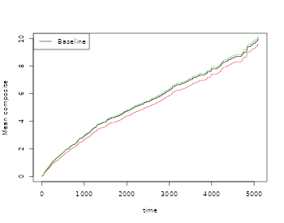

# Recurrent events

## Overview

For recurrent events data it is often of interest to compute basic
descriptive quantities to get some basic understanding of the
phenonmenon studied. We here demonstrate how one can compute:

- the marginal mean
  - efficient marginal mean estimation with fast computation of standard
    errors
- the Ghosh-Lin Cox type regression for the marginal mean, possibly with
  composite outcomes.
  - efficient regression augmentation of the Ghosh-Lin model
  - clusters can be specfied
  - allows a stratified baseline
- the variance of a recurrent events process
- the probability of exceeding k events
- the two-stage recurrent events random effects model

We also show how to improve the efficiency of recurrents events marginal
mean.

In addition several tools can be used for simulating recurrent events
and bivariate recurrent events data, also with a possible terminating
event:

- recurrent events with multiple
  - event types
  - Cox type rates
- with a terminal event with possibly multiple causes of death
  - Cox type rates
- frailty extenstions
- the Ghosh-Lin model when the survival rate is on Cox form.
  - frailty extenstions
- The general illness death model with Cox models for all hazards.

## Simulation of recurrents events

We start by simulating some recurrent events data with two type of
events with cumulative hazards

- $\Lambda_{1}(t)$ (rate among survivors)
- $\Lambda_{2}(t)$ (rate among survivors)
- $\Lambda_{D}(t)$

where we consider types 1 and 2 and with a rate of the terminal event
given by $\Lambda_{D}(t)$. We let the events be independent, but could
also specify a random effects structure to generate dependence.

When simulating data we can impose various random-effects structures to
generate dependence

- Dependence=0: The intensities can be independent.

- Dependence=1: One gamma distributed random effects $Z$. Then the
  intensities are

  - $Z\lambda_{1}(t)$
  - $Z\lambda_{2}(t)$
  - $Z\lambda_{D}(t)$

- Dependence=4: One gamma distributed random effects $Z$. Then the
  intensities are

  - $Z\lambda_{1}(t)$
  - $Z\lambda_{2}(t)$
  - $\lambda_{D}(t)$

- Dependence=2: We can draw normally distributed random effects
  $Z_{1},Z_{2},Z_{d}$ were the variance (var.z) and correlation can be
  specified (cor.mat). Then the intensities are

  - $\exp\left( Z_{1} \right)\lambda_{1}(t)$
  - $\exp\left( Z_{2} \right)\lambda_{2}(t)$
  - $\exp\left( Z_{3} \right)\lambda_{D}(t)$

- Dependence=3: We can draw gamma distributed random effects
  $Z_{1},Z_{2},Z_{d}$ were the sum-structure can be speicifed via a
  matrix cor.mat. We compute
  ${\widetilde{Z}}_{j} = \sum_{k}Z_{k}^{cor.mat{(j,k)}}$ for
  $j = 1,2,3$.  
  Then the intensities are

  - ${\widetilde{Z}}_{1}\lambda_{1}(t)$
  - ${\widetilde{Z}}_{2}\lambda_{2}(t)$
  - ${\widetilde{Z}}_{3}\lambda_{D}(t)$

We return to how to run the different set-ups later and start by
simulating independent processes.

The key functions are

- simRecurrent
  - simple simulation with only one event type and death
- simRecurrentII
  - extended version with possibly multiple types of recurrent events
    (but rates can be 0)
  - Allows Cox types rates with subject specific rates
- simRecurrentList
  - lists are allowed for multiple events and cause of death (competing
    risks)
  - Allows Cox types rates with subject specific rates
- sim.recurrent to simulate from Cox-Cox (marginals) or Ghosh-Lin-Cox

In addition we can simulate data from the Ghosh-Lin model and where
marginals of the rates among survivors are on on Cox form

- simGLcox
  - can simulate data from Ghosh-Lin model (also simRecurrentCox)
  - with frailties
    - where survival model for terminal event is on Cox form
  - can simulate data where rates among survivors are are con Cox form
    - with frailties

see examples below for specific models.

## Utility functions

We here mention two utility functions

- tie.breaker for breaking ties among jump-times which is expected in
  the functions below.
- count.history that counts the number of jumps previous for each
  subject that is $N_{1}(t - )$ and $N_{2}(t - )$.

## Marginal Mean

We start by estimating the marginal mean
$E\left( N_{1}(t \land D) \right)$ where $D$ is the timing of the
terminal event. The marginal mean is the average number of events seen
before time $t$.

This is based on a two rate models for

- the type 1 events $\sim E\left( dN_{1}(t)|D > t \right)$
- the terminal event $\sim E\left( dN_{d}(t)|D > t \right)$

and is defined as
$\mu_{1}(t) = E\left( N_{1}(t) \right)$$$\begin{array}{r}
{\int_{0}^{t}S(u)dR_{1}(u)}
\end{array}$$ where $S(t) = P(D \geq t)$ and
$dR_{1}(t) = E\left( dN_{1}(t)|D > t \right)$

and can therefore be estimated by a

- Kaplan-Meier estimator, $\widehat{S}(u)$
- Nelson-Aalen estimator for $R_{1}(t)$

$$\begin{aligned}
{{\widehat{R}}_{1}(t)} & {= \sum\limits_{i}\int_{0}^{t}\frac{1}{Y_{\bullet}(s)}dN_{1i}(s)}
\end{aligned}$$ where $Y_{\bullet}(t) = \sum_{i}Y_{i}(t)$ such that the
estimator is $$\begin{aligned}
{{\widehat{\mu}}_{1}(t)} & {= \int_{0}^{t}\widehat{S}(u)d{\widehat{R}}_{1}(u),}
\end{aligned}$$ see Cook & Lawless (1997) and Gosh & Lin (2000).

The variance can be estimated based on the asymptotic expansion of
${\widehat{\mu}}_{1}(t) - \mu_{1}(t)$$$\begin{aligned}
 & {\sum\limits_{i}\int_{0}^{t}\frac{S(s)}{\pi(s)}dM_{i1} - \mu_{1}(t)\int_{0}^{t}\frac{1}{\pi(s)}dM_{i}^{d} + \int_{0}^{t}\frac{\mu_{1}(s)}{\pi(s)}dM_{i}^{d},}
\end{aligned}$$

with mean-zero processes

- $M_{i}^{d}(t) = N_{i}^{D}(t) - \int_{0}^{t}Y_{i}(s)d\Lambda^{D}(s)$,
- $M_{i1}(t) = N_{i1}(t) - \int_{0}^{t}Y_{i}(s)dR_{1}(s)$.

as described in Gosh & Lin (2000)

## Generating data

We start by generating some data to illustrate the computation of the
marginal mean

``` r
library(mets)
set.seed(1000) # to control output in simulatins for p-values below.
```

``` r
 data(CPH_HPN_CRBSI)
 dr <- CPH_HPN_CRBSI$terminal
 base1 <- CPH_HPN_CRBSI$crbsi 
 base4 <- CPH_HPN_CRBSI$mechanical

rr <- simRecurrent(200,base1,death.cumhaz=dr)
rr$x <- rnorm(nrow(rr)) 
rr$strata <- floor((rr$id-0.01)/100)
dlist(rr,.~id| id %in% c(1,7,9))
#> id: 1
#>   entry time  status dtime fdeath death start stop  x     strata
#> 1 0     132.6 0      132.6 1      1     0     132.6 1.386 0     
#> ------------------------------------------------------------ 
#> id: 7
#>   entry time  status dtime fdeath death start stop  x      strata
#> 7 0     141.3 0      141.3 1      1     0     141.3 0.6628 0     
#> ------------------------------------------------------------ 
#> id: 9
#>     entry time  status dtime fdeath death start stop  x       strata
#> 9     0.0 433.5 1      558.7 1      0       0.0 433.5 -0.7528 0     
#> 204 433.5 558.7 0      558.7 1      1     433.5 558.7 -0.6565 0
```

The status variable keeps track of the recurrent evnts and their type,
and death the timing of death.

To compute the marginal mean we simly estimate the two rates functions
of the number of events of interest and death by using the phreg
function (to start without covariates). Then the estimates are combined
with standard error computation in the recurrentMarginal function

``` r
#  to fit non-parametric models with just a baseline 
xr <- phreg(Surv(entry,time,status)~cluster(id),data=rr)
xdr <- phreg(Surv(entry,time,death)~cluster(id),data=rr)
par(mfrow=c(1,3))
plot(xdr,se=TRUE)
title(main="death")
plot(xr,se=TRUE)
# robust standard errors 
rxr <-   robust.phreg(xr,fixbeta=1)
plot(rxr,se=TRUE,robust=TRUE,add=TRUE,col=4)

# marginal mean of expected number of recurrent events 
out <- recurrentMarginal(Event(entry,time,status)~cluster(id),data=rr,cause=1,death.code=2)
plot(out,se=TRUE,ylab="marginal mean",col=2)
```


We can also extract the estimate in different time-points

``` r
summary(out,times=c(1000,2000))
#> [[1]]
#>     new.time     mean        se  CI-2.5% CI-97.5% strata
#> 245     1000 1.929941 0.1179801 1.712020 2.175601      0
#> 384     2000 4.070540 0.2243678 3.653708 4.534926      0
```

The marginal mean can also be estimated in the stratified case:

``` r
xr <- phreg(Surv(entry,time,status)~strata(strata)+cluster(id),data=rr)
xdr <- phreg(Surv(entry,time,death)~strata(strata)+cluster(id),data=rr)
par(mfrow=c(1,3))
plot(xdr,se=TRUE)
title(main="death")
plot(xr,se=TRUE)
rxr <-   robust.phreg(xr,fixbeta=1)
plot(rxr,se=TRUE,robust=TRUE,add=TRUE,col=1:2)

out <- recurrentMarginal(Event(entry,time,status)~strata(strata)+cluster(id),
             data=rr,cause=1,death.code=2)
plot(out,se=TRUE,ylab="marginal mean",col=1:2)
```


Further, if we adjust for covariates for the two rates we can still do
predictions of marginal mean, what can be plotted is the baseline
marginal mean, that is for the covariates equal to 0 for both models.
Predictions for specific covariates can also be obtained with the
recmarg (recurren marginal mean used solely for predictions without
standard error computation).

``` r
# cox case
xr <- phreg(Surv(entry,time,status)~x+cluster(id),data=rr)
xdr <- phreg(Surv(entry,time,death)~x+cluster(id),data=rr)
par(mfrow=c(1,3))
plot(xdr,se=TRUE)
title(main="death")
plot(xr,se=TRUE)
rxr <- robust.phreg(xr)
plot(rxr,se=TRUE,robust=TRUE,add=TRUE,col=1:2)

out <- recurrentMarginalPhreg(xr,xdr)
plot(out,se=TRUE,ylab="marginal mean",col=1:2)
```


``` r

#### predictions witout se's 
###outX <- recmarg(xr,dr,Xr=1,Xd=1)
###plot(outX,add=TRUE,col=3)
```

We here simulate multiple recurrent events processes with two causes of
death causes and exponential censoring with rate $3/5000$, all processes
are assumed independent (dependence=0)

``` r
rr <- simRecurrentList(100,list(base1,base1,base4),death.cumhaz=list(dr,base4),cens=3/5000,dependence=0)
dtable(rr,~status+death,level=2)
#> 
#>      status
#> death   0   1   2   3
#>     0  31 120 109  10
#>     1  56   0   0   0
#>     2  13   0   0   0
mets:::showfitsimList(rr,list(base1,base1,base4),list(dr,base4))
```


## Improving efficiency

To illustrate how the efficiency can be improved using heterogenity in
the data, we now simulate some data with strong heterogenity. The
dynmamic augmentation is a regression on the history for each subject
consisting of the specified terms terms: Nt, Nt2 (Nt squared), expNt
(exp(-Nt)), NtexpNt (Nt\*exp(-Nt)) or by simply specifying these
directly. This was developed in Cortese and Scheike (2022).

``` r
rr <- simRecurrentII(200,base1,base4,death.cumhaz=dr,cens=3/5000,dependence=4,var.z=1)
rr <-  count.history(rr)

rr <- transform(rr,statusD=status)
rr <- dtransform(rr,statusD=3,death==1)
dtable(rr,~statusD+status+death,level=2,response=1)
#> 
#>       statusD
#> status   0   1   2   3
#>      0  79   0   0 121
#>      1   0 275   0   0
#>      2   0   0  35   0
#> 
#>      statusD
#> death   0   1   2   3
#>     0  79 275  35   0
#>     1   0   0   0 121

##xr <- phreg(Surv(start,stop,status==1)~cluster(id),data=rr)
##dr <- phreg(Surv(start,stop,death)~cluster(id),data=rr)
# marginal mean of expected number of recurrent events 
out <- recurrentMarginal(Event(start,stop,statusD)~cluster(id),data=rr,cause=1,death.code=3)

times <- 500*(1:10)
recEFF1 <- recurrentMarginalAIPCW(Event(start,stop,statusD)~cluster(id),data=rr,times=times,cens.code=0,
                   death.code=3,cause=1,augment.model=~Nt)
with( recEFF1, cbind(times,muP,semuP,muPAt,semuPAt,semuPAt/semuP))
#>       times       muP      semuP     muPAt    semuPAt          
#>  [1,]   500 0.6613768 0.08161137 0.6613573 0.08140749 0.9975018
#>  [2,]  1000 1.0744212 0.12757420 1.0663041 0.12611114 0.9885317
#>  [3,]  1500 1.4043440 0.18482988 1.4063277 0.18029148 0.9754455
#>  [4,]  2000 1.6558938 0.23411074 1.6459306 0.22412588 0.9573498
#>  [5,]  2500 1.9655087 0.31221814 1.9646959 0.29588974 0.9477020
#>  [6,]  3000 2.1616770 0.37981206 2.1950498 0.35547431 0.9359216
#>  [7,]  3500 2.4425027 0.51943450 2.5067063 0.46175008 0.8889476
#>  [8,]  4000 2.7545313 0.66543528 2.8446029 0.56805536 0.8536598
#>  [9,]  4500 2.8247378 0.66133467 2.9122268 0.57249107 0.8656602
#> [10,]  5000 2.8247378 0.66133467 2.9122268 0.57249107 0.8656602

times <- 500*(1:10)
###recEFF14 <- recurrentMarginalAIPCW(Event(start,stop,statusD)~cluster(id),data=rr,times=times,cens.code=0,
###death.code=3,cause=1,augment.model=~Nt+Nt2+expNt+NtexpNt)
###with(recEFF14,cbind(times,muP,semuP,muPAt,semuPAt,semuPAt/semuP))

recEFF14 <- recurrentMarginalAIPCW(Event(start,stop,statusD)~cluster(id),data=rr,times=times,cens.code=0,
death.code=3,cause=1,augment.model=~Nt+I(Nt^2)+I(exp(-Nt))+ I( Nt*exp(-Nt)))
with(recEFF14,cbind(times,muP,semuP,muPAt,semuPAt,semuPAt/semuP))
#>       times       muP      semuP     muPAt    semuPAt          
#>  [1,]   500 0.6613768 0.08161137 0.6656565 0.08123893 0.9954365
#>  [2,]  1000 1.0744212 0.12757420 1.0643130 0.12557776 0.9843508
#>  [3,]  1500 1.4043440 0.18482988 1.3959278 0.17882547 0.9675138
#>  [4,]  2000 1.6558938 0.23411074 1.6237759 0.21969809 0.9384366
#>  [5,]  2500 1.9655087 0.31221814 1.8801575 0.28908695 0.9259134
#>  [6,]  3000 2.1616770 0.37981206 2.0838062 0.34493993 0.9081858
#>  [7,]  3500 2.4425027 0.51943450 2.1734464 0.42984065 0.8275166
#>  [8,]  4000 2.7545313 0.66543528 2.3319579 0.51255611 0.7702569
#>  [9,]  4500 2.8247378 0.66133467 2.3579323 0.51482135 0.7784581
#> [10,]  5000 2.8247378 0.66133467 2.3579323 0.51482135 0.7784581

plot(out,se=TRUE,ylab="marginal mean",col=2)
k <- 1
for (t in times) {
    ci1 <- c(recEFF1$muPAt[k]-1.96*recEFF1$semuPAt[k],
             recEFF1$muPAt[k]+1.96*recEFF1$semuPAt[k])
    ci2 <- c(recEFF1$muP[k]-1.96*recEFF1$semuP[k],
             recEFF1$muP[k]+1.96*recEFF1$semuP[k])
    lines(rep(t,2)-2,ci2,col=2,lty=1,lwd=2)
    lines(rep(t,2)+2,ci1,col=1,lty=1,lwd=2)
    k <- k+1
}
legend("bottomright",c("Eff-pred"),lty=1,col=c(1,3))
```


In the case where covariates might be important but we are still
interested in the marginal mean we can also augment wrt these covariates

``` r
n <- 200
X <- matrix(rbinom(n*2,1,0.5),n,2)
colnames(X) <- paste("X",1:2,sep="")
###
r1 <- exp( X %*% c(0.3,-0.3))
rd <- exp( X %*% c(0.3,-0.3))
rc <- exp( X %*% c(0,0))
fz <- NULL
rr <- mets:::simGLcox(n,base1,dr,var.z=0,r1=r1,rd=rd,rc=rc,fz,model="twostage",cens=3/5000) 
rr <- cbind(rr,X[rr$id+1,])

dtable(rr,~statusD+status+death,level=2,response=1)
#> 
#>       statusD
#> status   0   1   3
#>      0  92   0 108
#>      1   0 556   0
#> 
#>      statusD
#> death   0   1   3
#>     0  92 363   0
#>     1   0 193 108

times <- seq(500,5000,by=500)
recEFF1x <- recurrentMarginalAIPCW(Event(start,stop,statusD)~cluster(id),data=rr,times=times,
                   cens.code=0,death.code=3,cause=1,augment.model=~X1+X2)
with(recEFF1x, cbind(muP,muPA,muPAt,semuP,semuPA,semuPAt,semuPAt/semuP))
#>            muP     muPA    muPAt      semuP     semuPA    semuPAt          
#>  [1,] 1.145071 1.144032 1.143158 0.08446448 0.08438871 0.08433747 0.9984963
#>  [2,] 1.992395 1.987834 1.967759 0.16163097 0.16021919 0.15987853 0.9891577
#>  [3,] 2.987070 3.041386 2.975609 0.29841261 0.29352422 0.29276652 0.9810796
#>  [4,] 3.750338 3.781183 3.742977 0.38089153 0.37347550 0.37254937 0.9780983
#>  [5,] 4.401481 4.363984 4.379360 0.45643233 0.44836832 0.44476899 0.9744467
#>  [6,] 5.058667 4.943227 4.948666 0.58230638 0.56486481 0.55682137 0.9562344
#>  [7,] 5.797576 5.777539 5.609930 0.75658794 0.72607368 0.71043739 0.9390017
#>  [8,] 6.500899 6.740989 6.188770 0.89938615 0.86946649 0.84664142 0.9413547
#>  [9,] 7.160265 7.277316 6.575000 1.02814316 1.02039663 0.99768282 0.9703734
#> [10,] 7.709737 7.297200 6.832030 1.13548187 1.11392250 1.09078010 0.9606319

out <- recurrentMarginal(Event(start,stop,statusD)~cluster(id),data=rr,cause=1,death.code=3)
summary(out,times=times)
#> [[1]]
#>     new.time     mean         se   CI-2.5%  CI-97.5% strata
#> 201      500 1.145071 0.08446448 0.9909346  1.323184      0
#> 310     1000 1.992395 0.16163097 1.6995055  2.335760      0
#> 397     1500 2.987070 0.29841261 2.4558915  3.633136      0
#> 448     2000 3.750338 0.38089153 3.0734121  4.576359      0
#> 483     2500 4.401481 0.45643233 3.5919438  5.393469      0
#> 509     3000 5.058667 0.58230638 4.0369534  6.338966      0
#> 529     3500 5.797576 0.75658794 4.4891486  7.487362      0
#> 543     4000 6.500899 0.89938615 4.9569146  8.525806      0
#> 552     4500 7.160265 1.02814316 5.4038714  9.487531      0
#> 557     5000 7.709737 1.13548187 5.7766426 10.289721      0
```

## Regression models for the marginal mean

One can also do regression modelling , using the model $$\begin{aligned}
{E\left( N_{1}(t)|X \right)} & {= \Lambda_{0}(t)\exp\left( X^{T}\beta \right)}
\end{aligned}$$ then Ghost-Lin suggested IPCW score equations that are
implemented in the recreg function of mets.

First we generate data that from a Ghosh-Lin model with regression
coefficients $\beta = ( - 0.3,0.3)$ and the baseline given by base1,
this is done under the assumption that the death rate given covariates
is on Cox form with baseline dr:

``` r
n <- 100
X <- matrix(rbinom(n*2,1,0.5),n,2)
colnames(X) <- paste("X",1:2,sep="")
###
r1 <- exp( X %*% c(0.3,-0.3))
rd <- exp( X %*% c(0.3,-0.3))
rc <- exp( X %*% c(0,0))
fz <- NULL
rr <- mets:::simGLcox(n,base1,dr,var.z=1,r1=r1,rd=rd,rc=rc,fz,cens=1/5000,type=2) 
rr <- cbind(rr,X[rr$id+1,])

out  <- recreg(Event(start,stop,statusD)~X1+X2+cluster(id),data=rr,cause=1,death.code=3,cens.code=0)
outs <- recreg(Event(start,stop,statusD)~X1+X2+cluster(id),data=rr,cause=1,death.code=3,cens.code=0,
        cens.model=~strata(X1,X2))
summary(out)$coef
#>      Estimate      S.E.    dU^-1/2   P-value
#> X1  0.5194368 0.3797930 0.07990766 0.1714110
#> X2 -0.3358640 0.3803112 0.07976036 0.3771663
summary(outs)$coef
#>      Estimate      S.E.    dU^-1/2   P-value
#> X1  0.5762836 0.3571995 0.08035274 0.1066710
#> X2 -0.2775462 0.3520266 0.08007337 0.4304488

## checking baseline
par(mfrow=c(1,1))
plot(out)
plot(outs,add=TRUE,col=2)
lines(scalecumhaz(base1,1),col=3,lwd=2)
```


We note that for the extended censoring model we gain a little
efficiency and that the estimates are close to the true values.

Also possible to do IPCW regression at fixed time-point

``` r
outipcw  <- recregIPCW(Event(start,stop,statusD)~X1+X2+cluster(id),data=rr,cause=1,death.code=3,
        cens.code=0,times=2000)
outipcws <- recregIPCW(Event(start,stop,statusD)~X1+X2+cluster(id),data=rr,cause=1,death.code=3,
        cens.code=0,times=2000,cens.model=~strata(X1,X2))
summary(outipcw)$coef
#>               Estimate   Std.Err       2.5%     97.5%      P-value
#> (Intercept) 1.19494027 0.2038193  0.7954619 1.5944187 4.552780e-09
#> X1          0.18509341 0.2825398 -0.3686743 0.7388612 5.123997e-01
#> X2          0.09805584 0.2805028 -0.4517195 0.6478312 7.266601e-01
summary(outipcws)$coef
#>               Estimate   Std.Err       2.5%     97.5%      P-value
#> (Intercept) 1.18811953 0.2024682  0.7912891 1.5849499 4.406099e-09
#> X1          0.20055180 0.2761747 -0.3407407 0.7418443 4.677301e-01
#> X2          0.09514999 0.2729203 -0.4397640 0.6300640 7.273622e-01
```

We can also do the Mao-Lin type composite outcome where we both count
the recurrent events (cause 1) and deaths (cause 3) for example
$$\begin{aligned}
{E\left( N_{1}(t) + I(D < t,\epsilon = 3)|X \right)} & {= \Lambda_{0}(t)\exp\left( X^{T}\beta \right)}
\end{aligned}$$

``` r
out  <- recreg(Event(start,stop,statusD)~X1+X2+cluster(id),data=rr,cause=c(1,3),
        death.code=3,cens.code=0)
summary(out)$coef
#>      Estimate      S.E.    dU^-1/2   P-value
#> X1  0.4896610 0.3460183 0.07609363 0.1570303
#> X2 -0.3056174 0.3459166 0.07595286 0.3769660
```

This can also be done with competing risks death $$\begin{aligned}
{E\left( w_{1}N_{1}(t) + w_{2}I(D < t,\epsilon = 3)|X \right)} & {= \Lambda_{0}(t)\exp\left( X^{T}\beta \right)}
\end{aligned}$$ and with weights $w_{1},w_{2}$ that follow the causes,
here 1 and 3. We modify the data by changing some of the cause 3 deaths
to cause 4

``` r
rr$binf <- rbinom(nrow(rr),1,0.5) 
rr$statusDC <- rr$statusD
rr <- dtransform(rr,statusDC=4, statusD==3 & binf==0)
rr$weight <- 1
rr <- dtransform(rr,weight=2,statusDC==3)

outC  <- recreg(Event(start,stop,statusDC)~X1+X2+cluster(id),data=rr,cause=c(1,3),
         death.code=c(3,4),cens.code=0)
summary(outC)$coef
#>      Estimate      S.E.    dU^-1/2   P-value
#> X1  0.5069982 0.3651533 0.07814845 0.1649991
#> X2 -0.3255327 0.3653288 0.07801576 0.3728929

outCW  <- recreg(Event(start,stop,statusDC)~X1+X2+cluster(id),data=rr,cause=c(1,3),
          death.code=c(3,4),cens.code=0,wcomp=c(1,2))
summary(outCW)$coef
#>      Estimate      S.E.    dU^-1/2   P-value
#> X1  0.4955643 0.3521275 0.07650295 0.1593256
#> X2 -0.3160290 0.3519907 0.07638286 0.3692744

plot(out,ylab="Mean composite")
plot(outC,col=2,add=TRUE)
plot(outCW,col=3,add=TRUE)
```



Predictions and standard errors can be computed via the iid
decompositions of the baseline and the regression coefficients. We
illustrate this for the standard Ghosh-Lin model

``` r
out  <- recreg(Event(start,stop,statusD)~X1+X2+cluster(id),data=rr,cause=1,death.code=3,cens.code=0)
summary(out)
#> 
#>    n events
#>  740    640
#> 
#>  100 clusters
#> coeffients:
#>     Estimate      S.E.   dU^-1/2 P-value
#> X1  0.519437  0.379793  0.079908  0.1714
#> X2 -0.335864  0.380311  0.079760  0.3772
#> 
#> exp(coeffients):
#>    Estimate    2.5%  97.5%
#> X1  1.68108 0.79856 3.5389
#> X2  0.71472 0.33917 1.5061
baseiid <- iidBaseline(out,time=3000)
GLprediid(baseiid,rr[1:5,])
#>          pred    se-log    lower     upper
#> [1,] 9.117785 0.3716211 4.401137 18.889209
#> [2,] 3.876474 0.3854773 1.821034  8.251935
#> [3,] 3.876474 0.3854773 1.821034  8.251935
#> [4,] 3.876474 0.3854773 1.821034  8.251935
#> [5,] 6.516666 0.2216876 4.220119 10.062971
```

The Ghosh-Lin model can be made more efficient by the regression
augmentation method. First computing the augmentation and then in a
second step the augmented estimator (Cortese and Scheike (2023)):

``` r
outA  <- recreg(Event(start,stop,statusD)~X1+X2+cluster(id),data=rr,cause=1,death.code=3,
         cens.code=0,augment.model=~Nt+X1+X2)
summary(outA)$coef
#>      Estimate      S.E.    dU^-1/2    P-value
#> X1  0.5716809 0.3461524 0.08022919 0.09863056
#> X2 -0.3447143 0.3480247 0.07981423 0.32193577
```

We note that the simple augmentation improves the standard errors as
expected. The data was generated assuming independence with previous
number of events so it would suffice to augment only with the
covariates.

## Two-stage modelling

We simulate data with a terminal event on Cox form and recurrent events
satisfying the Ghosh-Lin model or having a rate on Cox form.

- type=3 is Ghosh-Lin model for recurrent events and Cox for terminal
  event.
- type=2 is Cox model for recurrent events among survivors and Cox for
  terminal event.
- simulations based on time-grid to make linear approximations of
  cumulative hazards

Now we fit the two-stage model (the recreg must be called with
twostage=TRUE)

``` r
set.seed(100)
n <- 200
X <- matrix(rbinom(n*2,1,0.5),n,2)
colnames(X) <- paste("X",1:2,sep="")
###
r1 <- exp( X %*% c(0.3,-0.3))
rd <- exp( X %*% c(0.3,-0.3))
rc <- exp( X %*% c(0,0))
fz <- NULL
## type=3 is cox-cox and type=2 is Ghosh-Lin/Cox model 
rr <- mets:::simGLcox(n,base1,dr,var.z=1,r1=r1,rd=rd,rc=rc,fz,cens=1/5000,type=3) 
rr <- cbind(rr,X[rr$id+1,])
###
out  <- phreg(Event(start,stop,statusD==1)~X1+X2+cluster(id),data=rr)
outs <- phreg(Event(start,stop,statusD==3)~X1+X2+cluster(id),data=rr)
## cox/cox
tsout <- twostageREC(outs,out,data=rr)
summary(tsout)
#> Cox(recurrent)-Cox(terminal) intensity model
#> 
#>  200 clusters
#> coeffients:
#>             Estimate Std.Err    2.5%   97.5% P-value
#> dependence1  1.14651 0.14126 0.86964 1.42339       0
#> 
#> var,shared:
#>             Estimate Std.Err    2.5%   97.5% P-value
#> dependence1  1.14651 0.14126 0.86964 1.42339       0
###
rr <- mets:::simGLcox(n,base1,dr,var.z=1,r1=r1,rd=rd,rc=rc,fz,cens=1/5000,type=3,share=0.5) 
rr <- cbind(rr,X[rr$id+1,])
###
out  <- phreg(Event(start,stop,statusD==1)~X1+X2+cluster(id),data=rr)
outs <- phreg(Event(start,stop,statusD==3)~X1+X2+cluster(id),data=rr)
#
tsout <- twostageREC(outs,out,data=rr,model="shared")
summary(tsout)
#> Cox(recurrent)-Cox(terminal) intensity model
#> 
#>  200 clusters
#> coeffients:
#>             Estimate Std.Err    2.5%   97.5% P-value
#> dependence1  1.07333 0.14096 0.79707 1.34960       0
#> share1       0.67344 0.12832 0.42193 0.92495       0
#> 
#> var,shared:
#>             Estimate    2.5%  97.5%
#> dependence1  1.07333 0.79707 1.3496
#> share1       0.67344 0.42193 0.9250
###
rr <- mets:::simGLcox(n,base1,dr,var.z=1,r1=r1,rd=rd,rc=rc,fz,cens=1/5000,type=2) 
rr <- cbind(rr,X[rr$id+1,])
outs  <- phreg(Event(start,stop,statusD==3)~X1+X2+cluster(id),data=rr)
outgl  <- recreg(Event(start,stop,statusD)~X1+X2+cluster(id),data=rr,twostage=TRUE,death.code=3)
##
## ghosh-lin/cox
glout <- twostageREC(outs,outgl,data=rr,theta=1)
summary(glout)
#> Ghosh-Lin(recurrent)-Cox(terminal) mean model
#> 
#>  200 clusters
#> coeffients:
#>             Estimate Std.Err    2.5%   97.5% P-value
#> dependence1  1.04401 0.08988 0.86785 1.22017       0
#> 
#> var,shared:
#>             Estimate Std.Err    2.5%   97.5% P-value
#> dependence1  1.04401 0.08988 0.86785 1.22017       0
###
glout <- twostageREC(outs,outgl,data=rr,model="shared",theta=1,nu=0.9)
#> Warning in log(N): NaNs produced
#> Warning in log(N): NaNs produced
#> Warning in log(N): NaNs produced
#> Warning in log(N): NaNs produced
#> Warning in log(N): NaNs produced
#> Warning in log(N): NaNs produced
#> Warning in log(N): NaNs produced
#> Warning in log(N): NaNs produced
#> Warning in log(N): NaNs produced
#> Warning in log(N): NaNs produced
#> Warning in log(N): NaNs produced
#> Warning in log(N): NaNs produced
summary(glout)
#> Ghosh-Lin(recurrent)-Cox(terminal) mean model
#> 
#>  200 clusters
#> coeffients:
#>             Estimate  Std.Err     2.5%    97.5% P-value
#> dependence1 1.192629 0.094129 1.008140 1.377117       0
#> share1      1.643844 0.176676 1.297566 1.990121       0
#> 
#> var,shared:
#>             Estimate   2.5%  97.5%
#> dependence1   1.1926 1.0081 1.3771
#> share1        1.6438 1.2976 1.9901
glout$gradient
#> [1] -1.823718e-08  2.506173e-08
```

Standard errors are computed assuming that the parameters of out and
outs are both known, and therefore propobly a bit to small. We could do
a bootstrap to get more reliable standard errors.

## Simulations with specific structure

The function simGLcox can simulate data where the recurrent process has
mean on Ghosh-Lin form. The key is that $$\begin{aligned}
{E\left( N_{1}(t)|X \right)} & {= \Lambda_{0}(t)\exp\left( X^{T}\beta \right) = \int_{0}^{t}S\left( t|X,Z \right)dR\left( t|X,Z \right)}
\end{aligned}$$ where $Z$ is a possible frailty. Therefore
$$\begin{aligned}
{R\left( t|X,Z \right)} & {= \frac{Z\Lambda_{0}(t)\exp\left( X^{T}\beta \right)}{S\left( t|X,Z \right)}}
\end{aligned}$$ leads to a Ghosh-Lin model. We can choose the survival
model to have Cox form among survivors by the option model=“twostage”,
otherwise model=“frailty” uses the survival model with rate
$Z\lambda_{d}(t)rd$. The $Z$ is gamma distributed with a variance that
can be specified. The simulations are based on a piecwise-linear
approximation of the hazard functions for $S\left( t|X,Z \right)$ and
$R\left( t|X,Z \right)$.

``` r
n <- 100
X <- matrix(rbinom(n*2,1,0.5),n,2)
colnames(X) <- paste("X",1:2,sep="")
###
r1 <- exp( X %*% c(0.3,-0.3))
rd <- exp( X %*% c(0.3,-0.3))
rc <- exp( X %*% c(0,0))
rr <- mets:::simGLcox(n,base1,dr,var.z=0,r1=r1,rd=rd,rc=rc,model="twostage",cens=3/5000) 
rr <- cbind(rr,X[rr$id+1,])
```

We can also simulate from models where the terminal event is on Cox form
and the rate among survivors is on Cox form.

- $E\left( dN_{1}|D > t,X \right) = \lambda_{1}(t)r_{1}$
- $E\left( dN_{d}|D > t,X \right) = \lambda_{d}(t)r_{d}$

underlying these models we have a shared frailty model

``` r
rr <- mets:::simGLcox(100,base1,dr,var.z=1,r1=r1,rd=rd,rc=rc,type=3,cens=3/5000) 
rr <- cbind(rr,X[rr$id+1,])
margsurv <- phreg(Surv(start,stop,statusD==3)~X1+X2+cluster(id),rr)
recurrent <- phreg(Surv(start,stop,statusD==1)~X1+X2+cluster(id),rr)
estimate(margsurv)
#>    Estimate Std.Err    2.5%  97.5% P-value
#> X1   0.2535  0.2553 -0.2469 0.7538  0.3208
#> X2  -0.2595  0.2637 -0.7764 0.2574  0.3252
estimate(recurrent)
#>    Estimate Std.Err     2.5%   97.5% P-value
#> X1   0.6675  0.3019  0.07583 1.25921 0.02702
#> X2  -0.4356  0.2637 -0.95247 0.08135 0.09864
par(mfrow=c(1,2)); 
plot(margsurv); lines(dr,col=3); 
plot(recurrent); lines(base1,col=3)
```


We can simulate data with underlying dependence fromm the two-stage
model (simGLcox) or using simRecurrent random effects models, for
Cox-Cox or Ghosh-Lin-Cox models.

Here with marginals on - Cox- Cox form - Ghosh-Lin - Cox form

Draws covariates from data and simulates data that has the marginals
given.

``` r
simcoxcox <- sim.recurrent(recurrent,margsurv,n=10,data=rr)

recurrentGL <- recreg(Event(start,stop,statusD)~X1+X2+cluster(id),rr,death.code=3)
simglcox <- sim.recurrent(recurrentGL,margsurv,n=10,data=rr)
```

## Other marginal properties

The mean is a useful summary measure but it is very easy and useful to
look at other simple summary measures such as the probability of
exceeding $k$ events

- $P\left( N_{1}^{*}(t) \geq k \right)$
  - cumulative incidence of $T_{k} = \inf\{ t:N_{1}^{*}(t) = k\}$ with
    competing $D$.

that is thus equivalent to a certain cumulative incidence of $T_{k}$
occurring before $D$. We denote this cumulative incidence as
${\widehat{F}}_{k}(t)$.

We note also that $N_{1}^{*}(t)^{2}$ can be written as
$$\begin{array}{r}
{\sum\limits_{k = 0}^{K}\int_{0}^{t}I(D > s)I\left( N_{1}^{*}(s - ) = k \right)f(k)dN_{1}^{*}(s)}
\end{array}$$ with $f(k) = (k + 1)^{2} - k^{2}$, such that its mean can
be written as $$\begin{array}{r}
{\sum\limits_{k = 0}^{K}\int_{0}^{t}S(s)f(k)P\left( N_{1}^{*}(s - ) = k|D \geq s \right)E\left( dN_{1}^{*}(s)|N_{1}^{*}(s - ) = k,D > s \right)}
\end{array}$$ and estimated by $$\begin{aligned}
{{\widetilde{\mu}}_{1,2}(t)} & {= \sum\limits_{k = 0}^{K}\int_{0}^{t}\widehat{S}(s)f(k)\frac{Y_{1 \bullet}^{k}(s)}{Y_{\bullet}(s)}\frac{1}{Y_{1 \bullet}^{k}(s)}dN_{1 \bullet}^{k}(s) = \sum\limits_{i = 1}^{n}\int_{0}^{t}\widehat{S}(s)f\left( N_{i1}(s - ) \right)\frac{1}{Y_{\bullet}(s)}dN_{i1}(s),}
\end{aligned}$$ That is very similar to the “product-limit” estimator
for $E\left( \left( N_{1}^{*}(t) \right)^{2} \right)$$$\begin{aligned}
{{\widehat{\mu}}_{1,2}(t)} & {= \sum\limits_{k = 0}^{K}k^{2}\left( {\widehat{F}}_{k}(t) - {\widehat{F}}_{k + 1}(t) \right).}
\end{aligned}$$

We use the esimator of the probabilty of exceeding “k” events based on
the fact that $I\left( N_{1}^{*}(t) \geq k \right)$ is equivalent to
$$\begin{array}{r}
{\int_{0}^{t}I(D > s)I\left( N_{1}^{*}(s - ) = k - 1 \right)dN_{1}^{*}(s),}
\end{array}$$ suggesting that its mean can be computed as
$$\begin{array}{r}
{\int_{0}^{t}S(s)P\left( N_{1}^{*}(s - ) = k - 1|D \geq s \right)E\left( dN_{1}^{*}(s)|N_{1}^{*}(s - ) = k - 1,D > s \right)}
\end{array}$$ and estimated by $$\begin{array}{r}
{{\widetilde{F}}_{k}(t) = \int_{0}^{t}\widehat{S}(s)\frac{Y_{1 \bullet}^{k - 1}(s)}{Y_{\bullet}(s)}\frac{1}{Y_{1 \bullet}^{k - 1}(s)}dN_{1 \bullet}^{k - 1}(s).}
\end{array}$$

To compute these estimators we use the prob.exceed.recurrent function

``` r
rr <- simRecurrentII(200,base1,base4,death.cumhaz=dr,cens=3/5000,dependence=4,var.z=1)
rr <- transform(rr,statusD=status)
rr <- dtransform(rr,statusD=3,death==1)
rr <-  count.history(rr)
dtable(rr,~statusD)
#> 
#> statusD
#>   0   1   2   3 
#>  93 287  32 107

oo <- prob.exceed.recurrent(Event(entry,time,statusD)~cluster(id),rr,cause=1,death.code=3)
plot(oo,types=1:5)
```


We can also look at the mean and variance based on the estimators just
described

``` r
par(mfrow=c(1,2))
with(oo,plot(time,meanN,col=2,type="l"))
with(oo,plot(time,varN,type="l"))
```


## Multiple events

We now generate recurrent events with two types of events. We start by
generating data as before where all events are independent.

``` r
rr <- simRecurrentII(200,base1,cumhaz2=base4,death.cumhaz=dr)
rr <-  count.history(rr)
dtable(rr,~death+status)
#> 
#>       status   0   1   2
#> death                   
#> 0             32 651  84
#> 1            168   0   0
```

Based on this we can estimate also the joint distribution function, that
is the probability that
$\left( N_{1}(t) \geq k_{1},N_{2}(t) \geq k_{2} \right)$

``` r
# Bivariate probability of exceeding 
## oo <- prob.exceedBiRecurrent(rr,1,2,exceed1=c(1,5),exceed2=c(1,2))
## with(oo, matplot(time,pe1e2,type="s"))
## nc <- ncol(oo$pe1e2)
## legend("topleft",legend=colnames(oo$pe1e2),lty=1:nc,col=1:nc)
```

## Looking at other simulations with dependence

Using the normally distributed random effects we plot 4 different
settings. We have variance $0.5$ for all random effects and change the
correlation. We let the correlation between the random effect associated
with $N_{1}$ and $N_{2}$ be denoted $\rho_{12}$ and the correlation
between the random effects associated between $N_{j}$ and $D$ the
terminal event be denoted as $\rho_{j3}$, and organize all correlation
in a vector $\rho = \left( \rho_{12},\rho_{13},\rho_{23} \right)$.

- Scenario I $\rho = (0,0.0,0.0)$ Independence among all efects.

``` r
 data(CPH_HPN_CRBSI)
 dr <- CPH_HPN_CRBSI$terminal
 base1 <- CPH_HPN_CRBSI$crbsi 
 base4 <- CPH_HPN_CRBSI$mechanical

  par(mfrow=c(1,3))
  var.z <- c(0.5,0.5,0.5)
  # death related to  both causes in same way 
  cor.mat <- corM <- rbind(c(1.0, 0.0, 0.0), c(0.0, 1.0, 0.0), c(0.0, 0.0, 1.0))
  rr <- simRecurrentII(200,base1,base4,death.cumhaz=dr,var.z=var.z,cor.mat=cor.mat,dependence=2)
  rr <- count.history(rr,types=1:2)
###  cor(attr(rr,"z"))
###  coo <- covarianceRecurrent(rr,1,2,status="status",start="entry",stop="time")
###  plot(coo,main ="Scenario I")
```

- Scenario II $\rho = (0,0.5,0.5)$ Independence among survivors but
  dependence on terminal event

``` r
  var.z <- c(0.5,0.5,0.5)
  # death related to  both causes in same way 
  cor.mat <- corM <- rbind(c(1.0, 0.0, 0.5), c(0.0, 1.0, 0.5), c(0.5, 0.5, 1.0))
  rr <- simRecurrentII(200,base1,base4,death.cumhaz=dr,var.z=var.z,cor.mat=cor.mat,dependence=2)
  rr <- count.history(rr,types=1:2)
###  coo <- covarianceRecurrent(rr,1,2,status="status",start="entry",stop="time")
###  par(mfrow=c(1,3))
###  plot(coo,main ="Scenario II")
```

- Scenario III $\rho = (0.5,0.5,0.5)$ Positive dependence among
  survivors and dependence on terminal event

``` r
  var.z <- c(0.5,0.5,0.5)
  # positive dependence for N1 and N2 all related in same way
  cor.mat <- corM <- rbind(c(1.0, 0.5, 0.5), c(0.5, 1.0, 0.5), c(0.5, 0.5, 1.0))
  rr <- simRecurrentII(200,base1,base4,death.cumhaz=dr,var.z=var.z,cor.mat=cor.mat,dependence=2)
  rr <- count.history(rr,types=1:2)
###  coo <- covarianceRecurrent(rr,1,2,status="status",start="entry",stop="time")
###  par(mfrow=c(1,3))
###  plot(coo,main="Scenario III")
```

- Scenario IV $\rho = ( - 0.4,0.5,0.5)$ Negative dependence among
  survivors and positive dependence on terminal event

``` r
  var.z <- c(0.5,0.5,0.5)
  # negative dependence for N1 and N2 all related in same way
  cor.mat <- corM <- rbind(c(1.0, -0.4, 0.5), c(-0.4, 1.0, 0.5), c(0.5, 0.5, 1.0))
  rr <- simRecurrentII(200,base1,base4,death.cumhaz=dr,var.z=var.z,cor.mat=cor.mat,dependence=2)
  rr <- count.history(rr,types=1:2)
###  coo <- covarianceRecurrent(rr,1,2,status="status",start="entry",stop="time")
###  par(mfrow=c(1,3))
###  plot(coo,main="Scenario IV")
```

## SessionInfo

``` r
sessionInfo()
#> R version 4.5.2 (2025-10-31)
#> Platform: x86_64-pc-linux-gnu
#> Running under: Ubuntu 24.04.3 LTS
#> 
#> Matrix products: default
#> BLAS:   /usr/lib/x86_64-linux-gnu/openblas-pthread/libblas.so.3 
#> LAPACK: /usr/lib/x86_64-linux-gnu/openblas-pthread/libopenblasp-r0.3.26.so;  LAPACK version 3.12.0
#> 
#> locale:
#>  [1] LC_CTYPE=C.UTF-8       LC_NUMERIC=C           LC_TIME=C.UTF-8       
#>  [4] LC_COLLATE=C.UTF-8     LC_MONETARY=C.UTF-8    LC_MESSAGES=C.UTF-8   
#>  [7] LC_PAPER=C.UTF-8       LC_NAME=C              LC_ADDRESS=C          
#> [10] LC_TELEPHONE=C         LC_MEASUREMENT=C.UTF-8 LC_IDENTIFICATION=C   
#> 
#> time zone: UTC
#> tzcode source: system (glibc)
#> 
#> attached base packages:
#> [1] stats     graphics  grDevices utils     datasets  methods   base     
#> 
#> other attached packages:
#> [1] mets_1.3.9
#> 
#> loaded via a namespace (and not attached):
#>  [1] cli_3.6.5              knitr_1.51             rlang_1.1.7           
#>  [4] xfun_0.55              textshaping_1.0.4      jsonlite_2.0.0        
#>  [7] listenv_0.10.0         future.apply_1.20.1    lava_1.8.2            
#> [10] htmltools_0.5.9        ragg_1.5.0             sass_0.4.10           
#> [13] rmarkdown_2.30         grid_4.5.2             evaluate_1.0.5        
#> [16] jquerylib_0.1.4        fastmap_1.2.0          numDeriv_2016.8-1.1   
#> [19] yaml_2.3.12            mvtnorm_1.3-3          lifecycle_1.0.5       
#> [22] timereg_2.0.7          compiler_4.5.2         codetools_0.2-20      
#> [25] fs_1.6.6               htmlwidgets_1.6.4      Rcpp_1.1.1            
#> [28] future_1.68.0          lattice_0.22-7         systemfonts_1.3.1     
#> [31] digest_0.6.39          R6_2.6.1               parallelly_1.46.1     
#> [34] parallel_4.5.2         splines_4.5.2          Matrix_1.7-4          
#> [37] bslib_0.9.0            tools_4.5.2            RcppArmadillo_15.2.3-1
#> [40] globals_0.18.0         survival_3.8-3         pkgdown_2.2.0         
#> [43] cachem_1.1.0           desc_1.4.3
```
