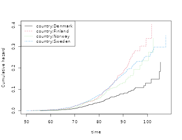
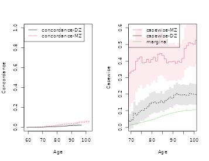

# A practical guide to Human Genetics with Lifetime Data

This vignette demonstrates how to analyze familial resemblance for twins
using the {}-package and is accompanying the review by Scheike and Holst
(2020).

We consider a data-set in that resembles the data of that were based on
the NorTwinCan a collaborative research project studying the genetic and
environmental components of prostate cancer. The data comprises around
18,000 DZ twins and 11,000 MZ twins. It was a population based register
study based on the Danish, Finnish, Norwegian, and Swedish twin
registries.

We first illustrate a hazards based analysis to show how one would study
dependence in survival data. This needs to be done under assumptions
about independent competing risks when the outcome of interest is
observed subject to competing risks (here death).

This seems reasonable here since the occurrence of cancer prior to death
only contains weak association with the risk of death for the other
twin, and vice-versa.

First looking at the data

``` r
library(mets)
 set.seed(122)
 data(prt)
 
 dtable(prt,~status+cancer)
#> 
#>        cancer     0     1
#> status                   
#> 0             21283     0
#> 1              6997     0
#> 2                 0   942
 dtable(prt,~zyg+country,level=1)
#> 
#> zyg
#>    DZ    MZ 
#> 17991 11231 
#> 
#> country
#> Denmark Finland  Norway  Sweden 
#>    9671    3926    4107   11518
```

we see that there are 21283 censorings and 6997 deaths (prior to cancer)
and a total of 942 prostate cancers. Approximately half the data consist
of DZ twins. In addition we see that there are around 10000 twins from
Denmark and Sweden, and only 4000 from Norway and Finland, respectively.

## Survival

Under assumption of random effects acting independently on different
cause specific hazards we can analyse competing risks data considering
the cause-specific hazard. Typically, this can be questionable and the
cumulative incidence modelling below does not rely on this assumption.

We consider the cause specific hazard of cancer in the competing risks
model with death and cancer.

First estimating the marginal hazards for each country.

``` r
 # Marginal Cox model here stratified on country without covariates 
 margph <- phreg(Surv(time,cancer)~strata(country)+cluster(id),data=prt)
 plot(margph)
```



We see that the marginal of Denmark in particular is quite different.

Then we fit a two-stage random effects models with country specific
marginals and random-effects variances that differ for MZ and DZ twins.

``` r
# Clayton-Oakes, MLE , overall variance
fitco1<-twostageMLE(margph,data=prt,theta=2.7)
```

``` r
 summary(fitco1)
#> Dependence parameter for Clayton-Oakes model
#> Variance of Gamma distributed random effects
#> $estimates
#>                Coef.        SE        z        P-val Kendall tau        SE
#> dependence1 2.782962 0.4225572 6.586001 4.518319e-11   0.5818491 0.0369421
#> 
#> $type
#> NULL
#> 
#> attr(,"class")
#> [1] "summary.mets.twostage"
```

``` r
fitco2 <- survival.twostage(margph,data=prt,theta=2.7,clusters=prt$id,var.link=0)
```

``` r
 summary(fitco2)
#> Dependence parameter for Clayton-Oakes model
#> Variance of Gamma distributed random effects
#> $estimates
#>                Coef.        SE        z        P-val Kendall tau         SE
#> dependence1 2.782962 0.4225529 6.586069 4.516254e-11   0.5818491 0.03694172
#> 
#> $type
#> [1] "clayton.oakes"
#> 
#> attr(,"class")
#> [1] "summary.mets.twostage"
```

With different random effects for MZ and DZ

``` r
 mm <- model.matrix(~-1+factor(zyg),prt)
 fitco3<-twostageMLE(margph,data=prt,theta=1,theta.des=mm)
```

``` r
 summary(fitco3)
#> Dependence parameter for Clayton-Oakes model
#> Variance of Gamma distributed random effects
#> $estimates
#>                  Coef.        SE        z        P-val Kendall tau         SE
#> factor(zyg)DZ 1.318966 0.3861577 3.415614 6.363831e-04   0.3974027 0.07011148
#> factor(zyg)MZ 5.421921 0.9626267 5.632423 1.776956e-08   0.7305280 0.03495065
#> 
#> $type
#> NULL
#> 
#> attr(,"class")
#> [1] "summary.mets.twostage"
```

``` r
fitco4 <- survival.twostage(margph,data=prt,theta=1,clusters=prt$id,var.link=0,theta.des=mm)
```

``` r
 summary(fitco4)
#> Dependence parameter for Clayton-Oakes model
#> Variance of Gamma distributed random effects
#> $estimates
#>                  Coef.        SE        z        P-val Kendall tau         SE
#> factor(zyg)DZ 1.318966 0.3861745 3.415466 6.367306e-04   0.3974027 0.07011454
#> factor(zyg)MZ 5.421920 0.9625027 5.633148 1.769493e-08   0.7305280 0.03494615
#> 
#> $type
#> [1] "clayton.oakes"
#> 
#> attr(,"class")
#> [1] "summary.mets.twostage"
 round(estimate(coef=fitco4$coef,vcov=fitco4$var.theta)$coefmat[,c(1,3:4)],2)
#>               Estimate 2.5% 97.5%
#> factor(zyg)DZ     1.32 0.56  2.08
#> factor(zyg)MZ     5.42 3.54  7.31

 ## mz kendalls tau
 kendall.ClaytonOakes.twin.ace(fitco4$theta[2],0,K=1000)$mz.kendall
#> [1] 0.7380818
 ## dz kendalls tau
 kendall.ClaytonOakes.twin.ace(fitco4$theta[1],0,K=1000)$mz.kendall
#> [1] 0.4154807
```

The dependence of MZ twins is much stronger, and is summarized by a
variance at $5.42$ in contrast to the $DZ$ variance at $1.32$.

Now we look at the polygenic modelling for survival data, here applied
to the cause specific hazards.

``` r
 ### setting up design for random effects and parameters of random effects
 desace <- twin.polygen.design(prt,type="ace")

 ### ace model 
 fitace <- survival.twostage(margph,data=prt,theta=1,
       clusters=prt$id,var.link=0,model="clayton.oakes",
       numDeriv=1,random.design=desace$des.rv,theta.des=desace$pardes)
```

``` r
 summary(fitace)
#> Dependence parameter for Clayton-Oakes model
#> Variance of Gamma distributed random effects
#> $estimates
#>                 Coef.       SE         z        P-val Kendall tau          SE
#> dependence1  7.223855 1.841525  3.922757 8.754161e-05   0.7831709  0.04328951
#> dependence2 -1.582396 1.088423 -1.453843 1.459898e-01  -3.7892257 12.48240540
#> 
#> $type
#> [1] "clayton.oakes"
#> 
#> $h
#>      Estimate Std.Err    2.5%   97.5%   P-value
#> [1,]   1.2805  0.1698  0.9477 1.61324 4.615e-14
#> [2,]  -0.2805  0.1698 -0.6132 0.05226 9.850e-02
#> 
#> $vare
#> NULL
#> 
#> $vartot
#>    Estimate Std.Err  2.5% 97.5%   P-value
#> p1    5.641  0.9894 3.702 7.581 1.184e-08
#> 
#> attr(,"class")
#> [1] "summary.mets.twostage"
```

``` r
 ### ace model with positive random effects variances
 # fitacee <- survival.twostage(margph,data=prt,theta=1,
 #      clusters=prt$id,var.link=1,model="clayton.oakes",
 #      numDeriv=1,random.design=desace$des.rv,theta.des=desace$pardes)
 #summary(fitacee)
 
 ### ae model 
 #desae <- twin.polygen.design(prt,type="ae")
 #fitae <- survival.twostage(margph,data=prt,theta=1,
 #      clusters=prt$id,var.link=0,model="clayton.oakes",
 #      numDeriv=1,random.design=desae$des.rv,theta.des=desae$pardes)
 #summary(fitae)

 ### de model 
 desde <- twin.polygen.design(prt,type="de")
 fitde <- survival.twostage(margph,data=prt,theta=1,clusters=prt$id,var.link=0,model="clayton.oakes",
numDeriv=1,random.design=desde$des.rv,theta.des=desde$pardes)                            
```

``` r
summary(fitde)
#> Dependence parameter for Clayton-Oakes model
#> Variance of Gamma distributed random effects
#> $estimates
#>                Coef.        SE        z        P-val Kendall tau         SE
#> dependence1 5.940643 0.9837336 6.038873 1.551941e-09   0.7481312 0.03120299
#> 
#> $type
#> [1] "clayton.oakes"
#> 
#> $h
#>      Estimate Std.Err 2.5% 97.5% P-value
#> [1,]        1       0    1     1       0
#> 
#> $vare
#> NULL
#> 
#> $vartot
#>    Estimate Std.Err  2.5% 97.5%   P-value
#> p1    5.941  0.9837 4.013 7.869 1.552e-09
#> 
#> attr(,"class")
#> [1] "summary.mets.twostage"
```

The DE model fits quite well. In summary all shared variance is due to
genes and there is no suggestion of a shared environmental effect.

## Concordance and Casewise

First we estimate the concordance of joint prostate cancer. The
two-twins are censored at the same time, otherwise we would enforce this
in the data by artificially censor both twins at the first censoring
time. Given, however, that we have the same-censoring assumption
satisfied we can do the stanadar Aalen-Johansen product-limit estimator
of the concordance probabilities for MZ and DZ twins.

For simplicity we do not do this for each country even though as we show
there are big differences between the countries.

``` r
prt <-  force.same.cens(prt,cause="status")

 dtable(prt,~status+cancer)
#> 
#>        cancer     0     1
#> status                   
#> 0             21580    77
#> 1              6700     0
#> 2                 0   865
 dtable(prt,~status+country)
#> 
#>        country Denmark Finland Norway Sweden
#> status                                      
#> 0                 7394    2622   3154   8487
#> 1                 2140    1138    830   2592
#> 2                  137     166    123    439
 dtable(prt,~zyg+country)
#> 
#>     country Denmark Finland Norway Sweden
#> zyg                                      
#> DZ             6191    2833   2393   6574
#> MZ             3480    1093   1714   4944
```

``` r
 ## cumulative incidence with cluster standard errors.
 cif1 <- cif(Event(time,status)~strata(country)+cluster(id),prt,cause=2)
 plot(cif1,se=1)
```


``` r

 cifa <- cif(Event(time,status)~+1,prt,cause=2)

 ### concordance estimator, ignoring country differences. 
 p11 <- bicomprisk(Event(time,status)~strata(zyg)+id(id),data=prt,cause=c(2,2))
#> Strata 'DZ'
#> Strata 'MZ'
p11mz <- p11$model$"MZ"
p11dz <- p11$model$"DZ" 
```

``` r
 par(mfrow=c(1,2))
 ## Concordance
 plot(p11mz,ylim=c(0,0.1));
 plot(p11dz,ylim=c(0,0.1));
```


Now we compare the concordance to the marginals to get a measure that
takes the marginals into account when evaluating the strength of the
association.

``` r
 library(prodlim)
 outm <- prodlim(Hist(time,status)~+1,data=prt)

 cifzyg <- cif(Event(time,status)~+strata(zyg)+cluster(id),data=prt,cause=2)
 cifprt <- cif(Event(time,status)~country+cluster(id),data=prt,cause=2)
     
 times <- 70:100
 cifmz <- predict(outm,cause=2,time=times,newdata=data.frame(zyg="MZ")) ## cause is 2 (second cause) 
 cifdz <- predict(outm,cause=2,time=times,newdata=data.frame(zyg="DZ"))
    
 ### concordance for MZ and DZ twins<
 cc <- bicomprisk(Event(time,status)~strata(zyg)+id(id),data=prt,cause=c(2,2),prodlim=TRUE)
#> Strata 'DZ'
#> Strata 'MZ'
 ccdz <- cc$model$"DZ"
 ccmz <- cc$model$"MZ"
     
 cdz <- casewise(ccdz,outm,cause.marg=2) 
 cmz <- casewise(ccmz,outm,cause.marg=2)

 dd <- bicompriskData(Event(time,status)~country+strata(zyg)+id(id),data=prt,cause=c(2,2))
 conczyg <- cif(Event(time,status)~strata(zyg)+cluster(id),data=dd,cause=1)

 par(mfrow=c(1,2))
 plot(conczyg,se=TRUE,col=cols[2:1], lty=ltys[2:1], legend=FALSE,xlab="Age",ylab="Concordance")
 legend("topleft",c("concordance-MZ","concordance-DZ"),col=cols[1:2],lty=ltys[1:2])

 plot(cmz,ci=NULL,ylim=c(0,.8),xlim=c(70,97),legend=FALSE,col=cols[c(1,3,3)],lty=ltys[c(1,3,3)],
      ylab="Casewise",xlab="Age")
  plot(cdz,ci=NULL,ylim=c(0,.8),xlim=c(70,97),legend=FALSE,ylab="Casewise",xlab="Age",
      col=c(cols[2],NA,NA), lty=ltys[c(2,3,3)], add=TRUE)
 with(data.frame(cmz$casewise),plotConfRegionSE(time,casewise.conc,se.casewise,col=cols[1]))
 with(data.frame(cdz$casewise),plotConfRegionSE(time,casewise.conc,se.casewise,col=cols[2]))
 legend("topleft",c("casewise-MZ","casewise-DZ","marginal"),col=cols, lty=ltys, bg="white")
```


``` r

 summary(cdz)
#> Casewise concordance and standard errors 
#>        time casewise conc se casewise
#>  [1,]  59.5        0.0866      0.0865
#>  [2,]  60.5        0.0659      0.0659
#>  [3,]  61.6        0.0593      0.0593
#>  [4,]  62.7        0.0483      0.0483
#>  [5,]  63.7        0.0358      0.0358
#>  [6,]  64.8        0.0279      0.0279
#>  [7,]  65.8        0.0223      0.0223
#>  [8,]  66.9        0.0197      0.0197
#>  [9,]  68.0        0.0415      0.0297
#> [10,]  69.0        0.0335      0.0240
#> [11,]  70.1        0.0452      0.0264
#> [12,]  71.1        0.0855      0.0352
#> [13,]  72.2        0.0728      0.0300
#> [14,]  73.2        0.0888      0.0317
#> [15,]  74.3        0.1010      0.0321
#> [16,]  75.4        0.1020      0.0310
#> [17,]  76.4        0.1130      0.0318
#> [18,]  77.5        0.1230      0.0320
#> [19,]  78.5        0.1400      0.0334
#> [20,]  79.6        0.1470      0.0332
#> [21,]  80.7        0.1530      0.0329
#> [22,]  81.7        0.1460      0.0307
#> [23,]  82.8        0.1470      0.0298
#> [24,]  83.8        0.1600      0.0307
#> [25,]  84.9        0.1470      0.0282
#> [26,]  86.0        0.1620      0.0297
#> [27,]  87.0        0.1680      0.0300
#> [28,]  88.1        0.1820      0.0311
#> [29,]  89.1        0.1760      0.0301
#> [30,]  90.2        0.1950      0.0323
#> [31,]  91.2        0.2040      0.0332
#> [32,]  92.3        0.1970      0.0321
#> [33,]  93.4        0.1940      0.0315
#> [34,]  94.4        0.1970      0.0318
#> [35,]  95.5        0.1940      0.0314
#> [36,]  96.5        0.1930      0.0312
#> [37,]  97.6        0.2040      0.0330
#> [38,]  98.7        0.2010      0.0325
#> [39,]  99.7        0.1990      0.0322
#> [40,] 101.0        0.1980      0.0321
#> [41,] 102.0        0.1950      0.0316
#> [42,] 103.0        0.1940      0.0314
#> [43,] 104.0        0.1940      0.0314
#> [44,] 105.0        0.1930      0.0312
#> [45,] 106.0        0.1920      0.0311
#> [46,] 107.0        0.1920      0.0311
#> [47,] 108.0        0.1910         NaN
 summary(cmz)
#> Casewise concordance and standard errors 
#>        time casewise conc se casewise
#>  [1,]  60.6         0.519      0.2590
#>  [2,]  61.6         0.466      0.2330
#>  [3,]  62.7         0.380      0.1900
#>  [4,]  63.7         0.285      0.1420
#>  [5,]  64.8         0.286      0.1280
#>  [6,]  65.8         0.228      0.1020
#>  [7,]  66.9         0.295      0.1120
#>  [8,]  67.9         0.306      0.1090
#>  [9,]  68.9         0.327      0.1040
#> [10,]  70.0         0.338      0.0981
#> [11,]  71.0         0.345      0.0926
#> [12,]  72.1         0.399      0.0946
#> [13,]  73.1         0.414      0.0909
#> [14,]  74.2         0.426      0.0874
#> [15,]  75.2         0.388      0.0798
#> [16,]  76.3         0.391      0.0773
#> [17,]  77.3         0.410      0.0769
#> [18,]  78.4         0.392      0.0723
#> [19,]  79.4         0.410      0.0721
#> [20,]  80.5         0.423      0.0714
#> [21,]  81.5         0.400      0.0666
#> [22,]  82.6         0.442      0.0685
#> [23,]  83.6         0.446      0.0676
#> [24,]  84.7         0.433      0.0643
#> [25,]  85.7         0.413      0.0612
#> [26,]  86.8         0.389      0.0578
#> [27,]  87.8         0.396      0.0578
#> [28,]  88.9         0.396      0.0573
#> [29,]  89.9         0.399      0.0574
#> [30,]  91.0         0.386      0.0556
#> [31,]  92.0         0.400      0.0570
#> [32,]  93.1         0.393      0.0560
#> [33,]  94.1         0.415      0.0590
#> [34,]  95.2         0.477      0.0669
#> [35,]  96.2         0.493      0.0690
#> [36,]  97.3         0.511      0.0714
#> [37,]  98.3         0.507      0.0708
#> [38,]  99.4         0.500      0.0699
#> [39,] 100.0         0.525      0.0739
#> [40,] 101.0         0.520      0.0731
#> [41,] 103.0         0.514      0.0723
#> [42,] 104.0         0.541      0.0767
#> [43,] 105.0         0.541      0.0767

 cpred(cmz$casewise,c(70,80))
#>      new.time casewise conc se casewise
#> [1,]       70     0.3381311  0.09811729
#> [2,]       80     0.4096715  0.07211013
 cpred(cdz$casewise,c(70,80))
#>      new.time casewise conc se casewise
#> [1,]       70    0.03351513  0.02398337
#> [2,]       80    0.14694869  0.03321234
```

``` r

 dd <- bicompriskData(Event(time,status)~country+strata(zyg)+id(id),data=prt,cause=c(2,2))
 conczyg <- cif(Event(time,status)~strata(zyg)+cluster(id),data=dd,cause=1)

 par(mfrow=c(1,2))
 plot(conczyg,se=TRUE,legend=FALSE,xlab="Age",ylab="Concordance")
 legend("topleft",c("concordance-DZ","concordance-MZ"),col=c(1,2),lty=1)
 plot(cmz,ci=NULL,ylim=c(0,0.6),xlim=c(70,100),legend=FALSE,col=c(2,3,3),ylab="Casewise",xlab="Age",lty=c(1,3))
 plot(cdz,ci=NULL,ylim=c(0,0.6),xlim=c(70,100),legend=FALSE,ylab="Casewise",xlab="Age",
      col=c(1,3,3), add=TRUE, lty=c(2,3))
 legend("topleft",c("casewise-MZ","casewise-DZ","marginal"),col=c(2,1,3),lty=1)
 with(data.frame(cmz$casewise),plotConfRegionSE(time,casewise.conc,se.casewise,col=2))
 with(data.frame(cdz$casewise),plotConfRegionSE(time,casewise.conc,se.casewise,col=1))
```



The standard errors above are slightly off since they only reflect the
uncertainty from the concordance estimation. This can be improved by
doing specific calculations for a specific time-point uisng the binomial
regression function that gives and iid decomposition for the paramters.
We thus apply the binomial regression to estimate the concordance as
well as the marginal, and combine the iid decompositions when estimating
the standard error. We also do this ignoring country differences.

``` r
 ### new version of Casewise for specific time-point based on binreg 
 dd <- bicompriskData(Event(time,status)~country+strata(zyg)+id(id),data=prt,cause=c(2,2))
 newdata <- data.frame(zyg=c("DZ","MZ"),id=1)

 ## concordance 
 bcif1 <- binreg(Event(time,status)~-1+factor(zyg)+cluster(id),dd,time=80,cause=1,cens.model=~strata(zyg))
 pconc <- predict(bcif1,newdata)

 ## marginal estimates
 mbcif1 <- binreg(Event(time,status)~cluster(id),prt,time=80,cause=2)
 mc <- predict(mbcif1,newdata)

 ### casewise with improved se's from log-scale 
 cse <- binregCasewise(bcif1,mbcif1)
```

``` r
 cse 
#> $coef
#>     Estimate      2.5%     97.5%
#> p1 0.1586277 0.1445496 0.1740770
#> p2 0.4041311 0.3682646 0.4434908
#> 
#> $logcoef
#>    Estimate Std.Err   2.5%   97.5%   P-value
#> p1   -1.841 0.04742 -1.934 -1.7483 0.000e+00
#> p2   -0.906 0.04742 -0.999 -0.8131 2.208e-81
```

It can be useful also to simply model the concordance given covariates,
and in this case we might find it important to adjust for country, or to
see if the differences between MZ and DZ are comparable across contries
even though clearly DK has a much lower cumulative incidence of prostate
cancer.

``` r
 ### semi-parametric modelling of concordance 
 dd <- bicompriskData(Event(time,status)~country+strata(zyg)+id(id),data=prt,cause=c(2,2))
 regconc <- cifreg(Event(time,status)~country*zyg,data=dd,prop=NULL)
 regconc
 ### interaction test
 wald.test(regconc,coef.null=5:7)

 regconc <- cifreg(Event(time,status)~country+zyg,data=dd,prop=NULL)
 regconc

 ## logistic link 
 logitregconc <- cifreg(Event(time,status)~country+zyg,data=dd)
 slr <- summary(logitregconc)
```

``` r
slr
#> 
#>      n events
#>  14222    106
#> 
#>  14222 clusters
#> coeffients:
#>                Estimate    S.E. dU^-1/2 P-value
#> countryFinland  1.30427 0.35262 0.35146  0.0002
#> countryNorway   0.94077 0.39999 0.39365  0.0187
#> countrySweden   1.08494 0.32247 0.31871  0.0008
#> zygMZ           1.02335 0.20283 0.19873  0.0000
#> 
#> exp(coeffients):
#>                Estimate   2.5%  97.5%
#> countryFinland   3.6850 1.8462 7.3552
#> countryNorway    2.5619 1.1698 5.6111
#> countrySweden    2.9592 1.5729 5.5676
#> zygMZ            2.7825 1.8697 4.1408
### library(Publish)
### publish(round(slr$exp.coef[,-c(2,5)],2),latex=TRUE,digits=2)
```

## Competing risk using additive Gamma

Here we do the cumulative incidence random effects modelling (commented
out to avoid timereg dependence)

``` r
 timereg <- 0
if (timereg==1) {
  times <- seq(50,90,length.out=5)
  cif1 <- timereg::comp.risk(Event(time,status)~-1+factor(country)+cluster(id),prt,
           cause=2,times=times,max.clust=NULL)

  mm <- model.matrix(~-1+factor(zyg),prt)
  out1<-random.cif(cif1,data=prt,cause1=2,cause2=2,theta=1,
          theta.des=mm,same.cens=TRUE,step=0.5)
  summary(out1)
  round(estimate(coef=out1$theta,vcov=out1$var.theta)$coefmat[,c(1,3:4)],2)

  desace <- twin.polygen.design(prt,type="ace")
 
  outacem <- Grandom.cif(cif1,data=prt,cause1=2,cause2=2,
     same.cens=TRUE,theta=c(0.45,0.15),var.link=0,
         step=0.5,theta.des=desace$pardes,random.design=desace$des.rv)
  ##outacem$score
}
```

``` r
timereg <- 0
if (timereg==1) {
  summary(outacem)

 ###  variances
 estimate(coef=outacem$theta,vcov=outacem$var.theta,f=function(p) p/sum(p)^2)

 ## AE polygenic model
 # desae <- twin.polygen.design(prt,type="ae")
 # outaem <- Grandom.cif(cif1,data=prt,cause1=2,cause2=2,
 #    same.cens=TRUE,theta=c(0.45,0.15),var.link=0,
 #        step=0.5,theta.des=desae$pardes,random.design=desae$des.rv)
 # outaem$score
 # summary(outaem)
 # estimate(coef=outaem$theta,vcov=outaem$var.theta,f=function(p)     p/sum(p)^2)

 ## AE polygenic model
 # desde <- twin.polygen.design(prt,type="de")
 # outaem <- Grandom.cif(cif1,data=prt,cause1=2,cause2=2,
 #   same.cens=TRUE,theta=c(0.35),var.link=0,
 #   step=0.5,theta.des=desde$pardes,random.design=desde$des.rv)
 # outaem$score
 # summary(outaem)
 # estimate(coef=outaem$theta,vcov=outaem$var.theta,f=function(p) p/sum(p)^2)

  times <- 90
  cif1 <- timereg::comp.risk(Event(time,status)~-1+factor(country)+cluster(id),prt,
           cause=2,times=times,max.clust=NULL)

  mm <- model.matrix(~-1+factor(zyg),prt)
  out1<-random.cif(cif1,data=prt,cause1=2,cause2=2,theta=1,
          theta.des=mm,same.cens=TRUE,step=0.5)
  summary(out1)
  round(estimate(coef=out1$theta,vcov=out1$var.theta)$coefmat[,c(1,3:4)],2)

 desde <- twin.polygen.design(prt,type="de")
 outaem <- Grandom.cif(cif1,data=prt,cause1=2,cause2=2,
    same.cens=TRUE,theta=c(0.35),var.link=0,
        step=0.5,theta.des=desde$pardes,random.design=desde$des.rv)
 outaem$score
 summary(outaem)
 estimate(coef=outaem$theta,vcov=outaem$var.theta,f=function(p) p/sum(p)^2)
}
```

## Competing risk modeling using the Liabilty Threshold model

First we fit the bivariate probit model (same marginals in MZ and DZ
twins but different correlation parameter). Here we evaluate the risk of
getting cancer before the last double cancer event (95 years)

``` r
rm(prt)
data(prt)
prt0 <-  force.same.cens(prt, cause="status", cens.code=0, time="time", id="id")
prt0$country <- relevel(prt0$country, ref="Sweden")
prt_wide <- fast.reshape(prt0, id="id", num="num", varying=c("time","status","cancer"))
prt_time <- subset(prt_wide,  cancer1 & cancer2, select=c(time1, time2, zyg))
tau <- 95
tt <- seq(70, tau, length.out=5) ## Time points to evaluate model in
```

``` r
b0 <- bptwin.time(cancer ~ 1, data=prt0, id="id", zyg="zyg", DZ="DZ", type="cor",
              cens.formula=Surv(time,status==0)~zyg, breaks=tau)
```

``` r
summary(b0)
#> 
#>                Estimate   Std.Err        Z   p-value    
#> (Intercept)   -1.348188  0.026276 -51.3086 < 2.2e-16 ***
#> atanh(rho) MZ  0.735992  0.087838   8.3789 < 2.2e-16 ***
#> atanh(rho) DZ  0.353023  0.068234   5.1737 2.295e-07 ***
#> ---
#> Signif. codes:  0 '***' 0.001 '**' 0.01 '*' 0.05 '.' 0.1 ' ' 1
#> 
#>  Total MZ/DZ Complete pairs MZ/DZ
#>  1994/3618   997/1809            
#> 
#>                            Estimate 2.5%    97.5%  
#> Tetrachoric correlation MZ 0.62672  0.51081 0.72024
#> Tetrachoric correlation DZ 0.33905  0.21584 0.45164
#> 
#> MZ:
#>                      Estimate 2.5%    97.5%  
#> Concordance          0.03504  0.02779 0.04409
#> Casewise Concordance 0.39458  0.31876 0.47584
#> Marginal             0.08880  0.08086 0.09743
#> Rel.Recur.Risk       4.44351  3.50521 5.38182
#> log(OR)              2.34131  1.87105 2.81157
#> DZ:
#>                      Estimate 2.5%    97.5%  
#> Concordance          0.01952  0.01449 0.02625
#> Casewise Concordance 0.21983  0.16667 0.28415
#> Marginal             0.08880  0.08086 0.09743
#> Rel.Recur.Risk       2.47556  1.81095 3.14016
#> log(OR)              1.23088  0.81020 1.65156
#> 
#>                          Estimate 2.5%    97.5%  
#> Broad-sense heritability 0.57533  0.25790 0.89276
#> 
#> 
#> Event of interest before time 95
```

Liability threshold model with ACE random effects structure

``` r
b1 <- bptwin.time(cancer ~ 1, data=prt0, id="id", zyg="zyg", DZ="DZ", type="ace",
              cens.formula=Surv(time,status==0)~zyg, breaks=tau)
```

``` r
summary(b1)
#> 
#>             Estimate  Std.Err        Z p-value    
#> (Intercept) -2.20664  0.16463 -13.4034  <2e-16 ***
#> log(var(A))  0.43260  0.39149   1.1050  0.2691    
#> log(var(C)) -1.98290  2.52343  -0.7858  0.4320    
#> ---
#> Signif. codes:  0 '***' 0.001 '**' 0.01 '*' 0.05 '.' 0.1 ' ' 1
#> 
#>  Total MZ/DZ Complete pairs MZ/DZ
#>  1994/3618   997/1809            
#> 
#>                    Estimate 2.5%     97.5%   
#> A                   0.57533  0.25790  0.89276
#> C                   0.05139 -0.20836  0.31114
#> E                   0.37328  0.26874  0.47782
#> MZ Tetrachoric Cor  0.62672  0.51081  0.72024
#> DZ Tetrachoric Cor  0.33905  0.21584  0.45164
#> 
#> MZ:
#>                      Estimate 2.5%    97.5%  
#> Concordance          0.03504  0.02779 0.04409
#> Casewise Concordance 0.39458  0.31876 0.47584
#> Marginal             0.08880  0.08086 0.09743
#> Rel.Recur.Risk       4.44351  3.50521 5.38182
#> log(OR)              2.34131  1.87105 2.81157
#> DZ:
#>                      Estimate 2.5%    97.5%  
#> Concordance          0.01952  0.01449 0.02625
#> Casewise Concordance 0.21983  0.16667 0.28415
#> Marginal             0.08880  0.08086 0.09743
#> Rel.Recur.Risk       2.47556  1.81096 3.14017
#> log(OR)              1.23088  0.81020 1.65156
#> 
#>                          Estimate 2.5%    97.5%  
#> Broad-sense heritability 0.57533  0.25790 0.89276
#> 
#> 
#> Event of interest before time 95
```

In this case the ACE model fits the data well - it is in fact
indistinguishable from the flexible bivariate Probit model as seen by
the IPCW weighted AIC measure

``` r
AIC(b0, b1)
#>    df AIC
#> b0  3   6
#> b1  3   6
```

ACE model with marginal adjusted for country

``` r
b2 <- bptwin.time(cancer ~ country, data=prt0, id="id", zyg="zyg", DZ="DZ", type="ace",
              cens.formula=Surv(time,status==0)~zyg+country, breaks=95)
```

``` r
summary(b2)
#> 
#>                Estimate  Std.Err        Z   p-value    
#> (Intercept)    -1.97165  0.15371 -12.8267 < 2.2e-16 ***
#> countryDenmark -0.72489  0.11920  -6.0812 1.193e-09 ***
#> countryFinland  0.18968  0.12518   1.5152    0.1297    
#> countryNorway  -0.11611  0.16621  -0.6986    0.4848    
#> log(var(A))     0.40388  0.40524   0.9966    0.3189    
#> log(var(C))    -3.88761 17.56413  -0.2213    0.8248    
#> ---
#> Signif. codes:  0 '***' 0.001 '**' 0.01 '*' 0.05 '.' 0.1 ' ' 1
#> 
#>  Total MZ/DZ Complete pairs MZ/DZ
#>  1994/3618   997/1809            
#> 
#>                    Estimate 2.5%     97.5%   
#> A                   0.59474  0.25169  0.93779
#> C                   0.00814 -0.27297  0.28925
#> E                   0.39712  0.28435  0.50989
#> MZ Tetrachoric Cor  0.60288  0.47809  0.70381
#> DZ Tetrachoric Cor  0.30551  0.17238  0.42767
#> 
#> MZ:
#>                      Estimate 2.5%    97.5%  
#> Concordance          0.04295  0.03307 0.05561
#> Casewise Concordance 0.40128  0.32263 0.48535
#> Marginal             0.10703  0.09453 0.12096
#> Rel.Recur.Risk       3.74923  2.94156 4.55691
#> log(OR)              2.15979  1.67935 2.64023
#> DZ:
#>                      Estimate 2.5%    97.5%  
#> Concordance          0.02439  0.01747 0.03396
#> Casewise Concordance 0.22788  0.17060 0.29749
#> Marginal             0.10703  0.09453 0.12096
#> Rel.Recur.Risk       2.12912  1.54508 2.71315
#> log(OR)              1.06262  0.62460 1.50064
#> 
#>                          Estimate 2.5%    97.5%  
#> Broad-sense heritability 0.59474  0.25169 0.93779
#> 
#> 
#> Event of interest before time 95
```

``` r
bt0 <- bptwin.time(cancer ~ 1, data=prt0, id="id", zyg="zyg", DZ="DZ", type="ace", 
              cens.formula=Surv(time,status==0)~zyg,
              summary.function=function(x) x, breaks=tt)
h2 <- Reduce(rbind, lapply(bt0$coef, function(x) x$heritability))[,c(1,3,4),drop=FALSE]
concMZ <- Reduce(rbind, lapply(bt0$coef, function(x) x$probMZ["Concordance",,drop=TRUE]))
```

``` r
par(mfrow=c(1,2))
plot(tt, h2[,1], type="s", lty=1, col=cols[3], xlab="Age", ylab="Heritability", ylim=c(0,1))
lava::confband(tt, h2[,2], h2[,3],polygon=TRUE, step=TRUE, col=lava::Col(cols[3], 0.1), border=NA)
plot(tt, concMZ[,1], type="s", lty=1, col=cols[1], xlab="Age", ylab="Concordance", ylim=c(0,.1))
lava::confband(tt, concMZ[,2], concMZ[,3],polygon=TRUE, step=TRUE, col=lava::Col(cols[1], 0.1), border=NA)
```


Bivariate probit model at time different time points

``` r
system.time(a.mz <- biprobit.time(cancer~1, id="id", data=subset(prt0, zyg=="MZ"),
                               cens.formula = Surv(time,status==0)~1, pairs.only=TRUE,
                                breaks=tt))
#>    user  system elapsed 
#>   0.263   0.291   0.225
system.time(a.dz <- biprobit.time(cancer~1, id="id", data=subset(prt0, zyg=="DZ"),
                               cens.formula = Event(time,status==0)~1, pairs.only=TRUE,
                               breaks=tt))
#>    user  system elapsed 
#>   0.374   0.276   0.322

#system.time(a.zyg <- biprobit.time(cancer~1, rho=~1+zyg, id="id", data=prt, 
#                               cens.formula = Event(time,status==0)~1,
#                               eqmarg=FALSE, fix.cens.weight
#                               breaks=seq(75,100,by=10)))

a.mz
#>                           
#>  1:Concordance            
#>  2:Casewise Concordance   
#>  3:Marginal               
#>  4:Rel.Recur.Risk         
#>  5:OR                     
#>  6:Tetrachoric correlation
#> 
#>       Time 1:Concor... 2:Casewi... 3:Marginal 4:Rel.Re...    5:OR 6:Tetrac...
#> [1,] 70.00      0.0049      0.2976     0.0166     17.9645 35.3860      0.6973
#> [2,] 76.25      0.0125      0.3468     0.0362      9.5939 21.1447      0.6834
#> [3,] 82.50      0.0247      0.3759     0.0656      5.7307 13.1452      0.6481
#> [4,] 88.75      0.0308      0.3675     0.0839      4.3780  9.4430      0.5993
#> [5,] 95.00      0.0409      0.4144     0.0988      4.1952 10.3179      0.6352
a.dz
#>                           
#>  1:Concordance            
#>  2:Casewise Concordance   
#>  3:Marginal               
#>  4:Rel.Recur.Risk         
#>  5:OR                     
#>  6:Tetrachoric correlation
#> 
#>       Time 1:Concor... 2:Casewi... 3:Marginal 4:Rel.Re...   5:OR 6:Tetrac...
#> [1,] 70.00      0.0007      0.0767     0.0088      8.6699 9.9965      0.3855
#> [2,] 76.25      0.0037      0.1612     0.0228      7.0632 9.6179      0.4682
#> [3,] 82.50      0.0074      0.1660     0.0445      3.7328 4.9289      0.3752
#> [4,] 88.75      0.0136      0.2001     0.0680      2.9417 4.0347      0.3614
#> [5,] 95.00      0.0174      0.2091     0.0831      2.5163 3.4242      0.3335

plot(conczyg,se=TRUE,legend=FALSE,xlab="Age",ylab="Concordance", ylim=c(0,0.07))
plot(a.mz, ylim=c(0,.07), col=cols[1], lty=ltys[1], legend=FALSE, add=TRUE)
plot(a.dz, col=cols[2], lty=ltys[2], add=TRUE)
```


Bivariate probit model adjusting for country

``` r
a.mz_country <- biprobit.time(cancer~country, id="id", data=subset(prt0, zyg=="MZ"),
                               cens.formula = Surv(time,status==0)~country, pairs.only=TRUE,
                                breaks=tt)
system.time(a.dz_country <- biprobit.time(cancer~country, id="id", data=subset(prt0, zyg=="DZ"),
                               cens.formula = Event(time,status==0)~country, pairs.only=TRUE,
                               breaks=tt))

s_mz_country <- summary(a.mz_country)
s_dz_country <- summary(a.dz_country)
```

``` r
s_mz_country
#> $Concordance
#>    Time    Estimate        2.5%      97.5%
#> 1 70.00 0.005921119 0.002986156 0.01170686
#> 2 76.25 0.014322088 0.008753641 0.02334935
#> 3 82.50 0.029210106 0.020110767 0.04224903
#> 4 88.75 0.040377886 0.029107601 0.05576133
#> 5 95.00 0.049707538 0.035563146 0.06907461
#> 
#> $`Casewise Concordance`
#>    Time  Estimate      2.5%     97.5%
#> 1 70.00 0.3061371 0.1804979 0.4691630
#> 2 76.25 0.3502181 0.2491875 0.4667465
#> 3 82.50 0.3867062 0.3017293 0.4791916
#> 4 88.75 0.3906921 0.3129417 0.4744209
#> 5 95.00 0.4190261 0.3369792 0.5058097
#> 
#> $Marginal
#>    Time   Estimate       2.5%      97.5%
#> 1 70.00 0.01934140 0.01265755 0.02944940
#> 2 76.25 0.04089476 0.02990124 0.05569812
#> 3 82.50 0.07553566 0.05950394 0.09544834
#> 4 88.75 0.10334964 0.08432130 0.12608075
#> 5 95.00 0.11862636 0.09701847 0.14427781
#> 
#> $Rel.Recur.Risk
#>    Time  Estimate     2.5%     97.5%
#> 1 70.00 15.828074 6.402374 25.253774
#> 2 76.25  8.563886 5.232398 11.895375
#> 3 82.50  5.119518 3.659925  6.579110
#> 4 88.75  3.780295 2.838451  4.722138
#> 5 95.00  3.532318 2.733224  4.331412
#> 
#> $OR
#>    Time  Estimate      2.5%    97.5%
#> 1 70.00 31.799055 12.251068 82.53810
#> 2 76.25 18.914711  9.701256 36.87835
#> 3 82.50 11.952397  7.033118 20.31244
#> 4 88.75  8.488885  5.238209 13.75683
#> 5 95.00  8.502483  5.276008 13.70207
#> 
#> $`Tetrachoric correlation`
#>    Time  Estimate      2.5%     97.5%
#> 1 70.00 0.6943823 0.4989166 0.8226225
#> 2 76.25 0.6744434 0.5302710 0.7807066
#> 3 82.50 0.6416812 0.5173782 0.7394660
#> 4 88.75 0.5945675 0.4712828 0.6950631
#> 5 95.00 0.6079229 0.4838930 0.7080114
s_dz_country
#> $Concordance
#>    Time     Estimate         2.5%       97.5%
#> 1 70.00 0.0009355048 0.0003014643 0.002899194
#> 2 76.25 0.0053848911 0.0030067721 0.009625755
#> 3 82.50 0.0090012330 0.0055138848 0.014661695
#> 4 88.75 0.0172555605 0.0117010082 0.025379187
#> 5 95.00 0.0221107866 0.0153703841 0.031711870
#> 
#> $`Casewise Concordance`
#>    Time   Estimate      2.5%     97.5%
#> 1 70.00 0.08242727 0.0282508 0.2172686
#> 2 76.25 0.17830235 0.1097646 0.2763507
#> 3 82.50 0.16491567 0.1103378 0.2392308
#> 4 88.75 0.20763649 0.1517489 0.2773763
#> 5 95.00 0.21840901 0.1627051 0.2866548
#> 
#> $Marginal
#>    Time   Estimate        2.5%      97.5%
#> 1 70.00 0.01134946 0.007572602 0.01697780
#> 2 76.25 0.03020090 0.022824941 0.03986318
#> 3 82.50 0.05458082 0.044179949 0.06725798
#> 4 88.75 0.08310466 0.069910511 0.09852516
#> 5 95.00 0.10123569 0.086502805 0.11815328
#> 
#> $Rel.Recur.Risk
#>    Time Estimate       2.5%     97.5%
#> 1 70.00 7.262662 -0.6527461 15.178071
#> 2 76.25 5.903876  2.9616475  8.846104
#> 3 82.50 3.021495  1.8476374  4.195352
#> 4 88.75 2.498494  1.7411952  3.255792
#> 5 95.00 2.157431  1.5524847  2.762377
#> 
#> $OR
#>    Time Estimate     2.5%     97.5%
#> 1 70.00 8.438374 2.374773 29.984401
#> 2 76.25 8.262989 4.176810 16.346681
#> 3 82.50 3.898758 2.289207  6.639992
#> 4 88.75 3.386745 2.150865  5.332756
#> 5 95.00 2.894681 1.876189  4.466063
#> 
#> $`Tetrachoric correlation`
#>    Time  Estimate      2.5%     97.5%
#> 1 70.00 0.3735045 0.1024582 0.5929219
#> 2 76.25 0.4623453 0.2958921 0.6015477
#> 3 82.50 0.3333246 0.1903659 0.4624401
#> 4 88.75 0.3304659 0.1996083 0.4497427
#> 5 95.00 0.3013345 0.1715485 0.4208396
```

``` r
## ACE model (time-varying) with and without adjustment for country
a1 <- bptwin.time(cancer~1, id="id", data=prt0, type="ace",
                              zyg="zyg", DZ="DZ", 
                              cens.formula=Surv(time,status==0)~zyg,
                              breaks=tt)

#a2 <- bptwin.time(cancer~country, id="id", data=prt0, #type="ace",
#                              zyg="zyg", DZ="DZ", 
#                              #cens.formula=Surv(time,status==0)~country+zyg,
#                              breaks=tt)
```

``` r
plot(a.mz, which=c(6), xlab="Age", ylab="Correlation", ylim=c(0,1), col=cols[1], lty=ltys[1], legend=NULL, alpha=.1)
plot(a.dz, which=c(6), col=cols[2], lty=ltys[2], legend=NULL, add=TRUE, alpha=.1)
legend("topleft", c("MZ tetrachoric correlation", "DZ tetrachoric correlation"),
       col=cols, lty=ltys, lwd=2)
```


``` r

plot(a.mz, which=c(4), xlab="Age", ylab="Relative Recurrence Risk",
     ylim=c(1,20), col=cols[1], lty=ltys[1], legend=NULL, lwd=2, alpha=.1)
plot(a.dz, which=c(4), col=cols[2], lty=ltys[2], legend=NULL, add=TRUE, lwd=2, alpha=.1)
legend("topright", c("MZ relative recurrence risk", "DZ relative recurrence risk"),
       col=cols, lty=ltys, lwd=2)
```


``` r

plot(a1, which=c(5,6), xlab="Age", ylab="Correlation", ylim=c(0,1), col=cols[1:2], lty=ltys[1:2], lwd=2, alpha=0.1,
     legend=c("MZ tetrachoric correlation", "DZ tetrachoric correlation"))
```


``` r

plot(a1, which=c(1), xlab="Age", ylim=c(0,1), col="black", lty=1, ylab="Heritability", legend=NULL, alpha=.1)
```


## SessionInfo

``` r
sessionInfo()
#> R version 4.5.2 (2025-10-31)
#> Platform: x86_64-pc-linux-gnu
#> Running under: Ubuntu 24.04.3 LTS
#> 
#> Matrix products: default
#> BLAS:   /usr/lib/x86_64-linux-gnu/openblas-pthread/libblas.so.3 
#> LAPACK: /usr/lib/x86_64-linux-gnu/openblas-pthread/libopenblasp-r0.3.26.so;  LAPACK version 3.12.0
#> 
#> locale:
#>  [1] LC_CTYPE=C.UTF-8       LC_NUMERIC=C           LC_TIME=C.UTF-8       
#>  [4] LC_COLLATE=C.UTF-8     LC_MONETARY=C.UTF-8    LC_MESSAGES=C.UTF-8   
#>  [7] LC_PAPER=C.UTF-8       LC_NAME=C              LC_ADDRESS=C          
#> [10] LC_TELEPHONE=C         LC_MEASUREMENT=C.UTF-8 LC_IDENTIFICATION=C   
#> 
#> time zone: UTC
#> tzcode source: system (glibc)
#> 
#> attached base packages:
#> [1] stats     graphics  grDevices utils     datasets  methods   base     
#> 
#> other attached packages:
#> [1] prodlim_2025.04.28 mets_1.3.9        
#> 
#> loaded via a namespace (and not attached):
#>  [1] Matrix_1.7-4           future.apply_1.20.1    jsonlite_2.0.0        
#>  [4] compiler_4.5.2         Rcpp_1.1.1             parallel_4.5.2        
#>  [7] jquerylib_0.1.4        globals_0.18.0         splines_4.5.2         
#> [10] systemfonts_1.3.1      textshaping_1.0.4      yaml_2.3.12           
#> [13] fastmap_1.2.0          lattice_0.22-7         R6_2.6.1              
#> [16] knitr_1.51             htmlwidgets_1.6.4      future_1.68.0         
#> [19] desc_1.4.3             bslib_0.9.0            rlang_1.1.7           
#> [22] cachem_1.1.0           xfun_0.55              fs_1.6.6              
#> [25] sass_0.4.10            cli_3.6.5              pkgdown_2.2.0         
#> [28] digest_0.6.39          grid_4.5.2             mvtnorm_1.3-3         
#> [31] lifecycle_1.0.5        lava_1.8.2             RcppArmadillo_15.2.3-1
#> [34] timereg_2.0.7          evaluate_1.0.5         data.table_1.18.0     
#> [37] numDeriv_2016.8-1.1    listenv_0.10.0         codetools_0.2-20      
#> [40] ragg_1.5.0             survival_3.8-3         parallelly_1.46.1     
#> [43] rmarkdown_2.30         tools_4.5.2            htmltools_0.5.9
```
