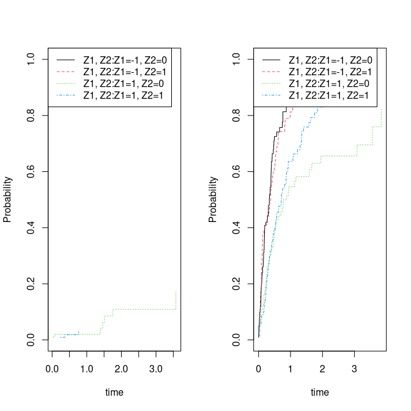
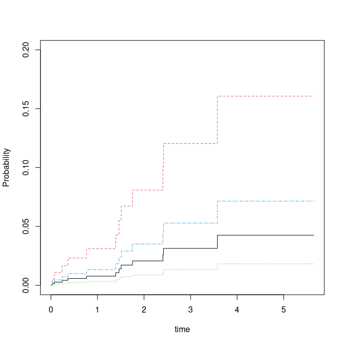
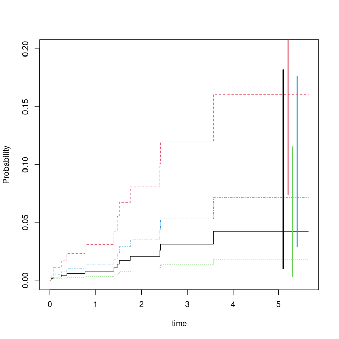

<!-- DO NOT EDIT: auto-generated from the .Rmd.orig source -->


The `cifreg` function fits the Fine-Gray model and the logit-link cumulative incidence
model for the cause of interest in competing risks settings. Computation is linear in
data size, making it suitable for large datasets.
For the Fine-Gray model, predictions with standard errors can be provided for specific
time-points based on influence functions for the baseline and the regression coefficients.

Key features:

  - the baseline can be stratified
  - the censoring weights can be stratum-dependent
  - predictions can be computed with standard errors (Fine-Gray only)
  - computation time is linear in data size, including standard errors
  - Fine-Gray only: influence functions of baseline and regression coefficients are computed and available via `IC`, `iid`, and `iidBaseline`
  - cluster-corrected standard errors are available via the `clusters` argument


Fine-Gray model
================

Fine and Gray (1999) considered a cumulative incidence of the form
\begin{align*}
 F_1(t,X) & = P(T \leq t, \epsilon=1) = 1 - \exp( - \Lambda_0(t) \exp(X^T \beta)).
\end{align*}

In the case of independent right-censoring with the censoring distribution $G_c(t,X) = P(C > t | S(X))$ where
$S(X)$ is a set of strata defined from $X$, then an unbiased estimating equation is given by
\begin{align*}
  U^{FG}_{n}(\beta) = \sum_{i=0}^{n} \int_0^{+\infty} \left( X_i- E_n(t,\beta) \right) w_i(t,X_i) dN_{1,i}(t)  \text{ where }
	E_n(t,\beta)=\frac{\tilde S_1(t,\beta) }{\tilde S_0(t,\beta)},
\end{align*}
with \(w_i(t,X_i) = \frac{G_c(t,X_i)}{G_c(T_i \wedge t,X_i)} I( C_i > T_i \wedge t ) \)
,$\tilde S_k(t,\beta) = \sum_{j=1}^n X_j^k \exp(X_j^T\beta) Y_{1,j}(t)$
for $k=0,1$, and with $\tilde Y_{1,i}(t) = Y_{1,i}(t) w_i(t,X_i)$ for $i=1,...,n$.
$w_i(t)$ needs to be replaced by an estimator of the
censoring distribution; since it does not depend on $X$, we use
$\hat w_i(t) = \frac{\hat G_c(t,X_i)}{\hat G_c(T_i \wedge t,X_i)} I(C_i > T_i \wedge t)$
where $\hat G_c$ is the Kaplan-Meier estimator of the censoring distribution.

First we simulate some competing risks data using some utility functions.

We simulate data with two causes based on the Fine-Gray model:
\begin{align}
F_1(t,X) &  = P(T\leq t, \epsilon=1|X)=( 1 - exp(-\Lambda_1(t) \exp(X^T \beta_1))) \\
F_2(t,X) & = P(T\leq t, \epsilon=2|X)= ( 1 - exp(-\Lambda_2(t) \exp(X^T \beta_2))) \cdot (1 - F_1(\infty,X))  
\end{align}
where the baselines are given as $\Lambda_j(t) = \rho_j (1- exp(-t/\nu_j))$ for $j=1,2$, and the 
$X$ being two independent binomials. 
Alternatively, one can also replace the FG-model with a logistic link 
$\mbox{expit}( \Lambda_j(t) + \exp(X^T \beta_j))$.

The advantage of the Fine-Gray model is that it is easy to fit, easy to obtain
standard errors for, and quite flexible. On the downside,
the coefficients must be interpreted on the $\mbox{cloglog}$ scale.
Specifically, 
\begin{align}
\log(-\log( 1-F_1(t,X_1+1,X_2))) - \log(-\log( 1-F_1(t,X_1,X_2))) & =  \beta_1,
\end{align}
so the effect of an increase in $X_1$ is $\beta_1$ and leads to $1-F_1(t,X)$ on the $cloglog$ scale. 


``` r
 library(mets)
 options(warn=-1)
 set.seed(1000) # to control output in simulations for p-values below.

 rho1 <- 0.2; rho2 <- 10
 n <- 400
 beta=c(0.0,-0.1,-0.5,0.3)
 ## beta1=c(0.0,-0.1); beta2=c(-0.5,0.3)
 dats <- simul_cifs(n,rho1,rho2,beta,rc=0.5,rate=7)
 dtable(dats,~status)
#> 
#> status
#>   0   1   2 
#> 127  12 261
 dsort(dats) <- ~time
```

We have a look at the non-parametric cumulative incidence curves


``` r
 par(mfrow=c(1,2))
 cifs1 <- cif(Event(time,status)~strata(Z1,Z2),dats,cause=1)
 plot(cifs1)

 cifs2 <- cif(Event(time,status)~strata(Z1,Z2),dats,cause=2)
 plot(cifs2)
```



Now fitting the Fine-Gray model 


``` r
 fg <- cifregFG(Event(time,status)~Z1+Z2,data=dats,cause=1)
 summary(fg)
#> 
#>    n events
#>  400     12
#> 
#>  400 clusters
#> coefficients:
#>    Estimate     S.E.  dU^-1/2 P-value
#> Z1  0.69686  0.38760  0.38882  0.0722
#> Z2 -0.85929  0.62453  0.61478  0.1689
#> 
#> exp(coefficients):
#>    Estimate    2.5%  97.5%
#> Z1  2.00744 0.93911 4.2911
#> Z2  0.42346 0.12451 1.4402

 dd <- expand.grid(Z1=c(-1,1),Z2=0:1)
 pfg <- predict(fg,dd)
 plot(pfg,ylim=c(0,0.2))
```



and GOF based on cumulative residuals (Li et al. 2015) 


``` r
gofFG(Event(time,status)~Z1+Z2,data=dats,cause=1)
#> Cumulative score process test for Proportionality:
#>    Sup|U(t)|  pval
#> Z1  3.011461 0.124
#> Z2  1.373513 0.227
```

showing no problem with the proportionality of the model. 


SE's for the baseline and predictions of FG
===========================================

The standard errors reported for the Fine-Gray estimator are based on the i.i.d.
decomposition (influence functions) of the estimator. A similar decomposition
exists for the baseline and is needed when standard errors of predictions are computed. These
are somewhat harder to compute for all time-points simultaneously, but they can be
obtained for specific time-points jointly with the i.i.d. decomposition of the regression coefficients,
and then used to obtain standard errors for predictions.

We plot the predictions with confidence intervals for predictions at time point 5:


``` r
### predictions with CI based on iid decomposition of baseline and beta
fg <- cifregFG(Event(time,status)~Z1+Z2,data=dats,cause=1)
Biid <- iidBaseline(fg,time=5)
pfgse <- FGprediid(Biid,dd)
pfgse
#>            pred    se-log       lower     upper
#> [1,] 0.04253879 0.7418354 0.009938793 0.1820692
#> [2,] 0.16069100 0.3946377 0.074143886 0.3482633
#> [3,] 0.01823957 0.9410399 0.002884032 0.1153531
#> [4,] 0.07149610 0.4611261 0.028958169 0.1765199
plot(pfg,ylim=c(0,0.2))
for (i in 1:4) lines(c(5,5)+i/10,pfgse[i,3:4],col=i,lwd=2)
```



The i.i.d. decompositions are stored inside `Biid`; the
i.i.d. decomposition for $\hat \beta - \beta_0$ is obtained via the `iid()` function.

# Comparison 

We compare with the `cmprsk` function, which gives exactly the same results, but omit the code to avoid dependencies:


``` r
run <- 0
if (run==1) {
library(cmprsk)
mm <- model.matrix(~Z1+Z2,dats)[,-1]
cr <- with(dats,crr(time,status,mm))
cbind(cr$coef,diag(cr$var)^.5,fg$coef,fg$se.coef,cr$coef-fg$coef,diag(cr$var)^.5-fg$se.coef)
#          [,1]      [,2]       [,3]      [,4]          [,5]          [,6]
# Z1  0.6968603 0.3876029  0.6968603 0.3876029 -2.442491e-15 -2.553513e-15
# Z2 -0.8592892 0.6245258 -0.8592892 0.6245258 -2.997602e-15  1.776357e-15
}
```

When comparing with the results from `coxph` based on setting up the data using
the `finegray` function, we get the same estimates but note that the standard errors
from `coxph` are missing a term and therefore slightly different. When comparing to
the estimates from `coxph` without the additional censoring term, we also get
the same standard errors.


``` r
if (run==1) {
 library(survival)
 dats$id <- 1:nrow(dats)
 dats$event <- factor(dats$status,0:2, labels=c("censor", "death", "other"))
 fgdats <- finegray(Surv(time,event)~.,data=dats)
 coxfg <- survival::coxph(Surv(fgstart, fgstop, fgstatus) ~ Z1+Z2 + cluster(id), weight=fgwt, data=fgdats)

 fg0 <- cifreg(Event(time,status)~Z1+Z2,data=dats,cause=1,propodds=NULL)
 cbind( coxfg$coef,fg0$coef, coxfg$coef-fg0$coef)
#          [,1]       [,2]          [,3]
# Z1  0.6968603  0.6968603 -1.110223e-16
# Z2 -0.8592892 -0.8592892 -1.110223e-15
 cbind(diag(coxfg$var)^.5,fg0$se.coef,diag(coxfg$var)^.5-fg0$se.coef)
#           [,1]      [,2]          [,3]
# [1,] 0.3889129 0.3876029  0.0013099915
# [2,] 0.6241225 0.6245258 -0.0004033148
 cbind(diag(coxfg$var)^.5,fg0$se1.coef,diag(coxfg$var)^.5-fg0$se1.coef)
#           [,1]      [,2]          [,3]
# [1,] 0.3889129 0.3889129 -2.331468e-15
# [2,] 0.6241225 0.6241225  2.553513e-15
}
```

We also remove all censorings from the data to compare the estimates with those
based on `coxph`, and observe that both the estimates and the standard errors agree.


``` r
datsnc <- dtransform(dats,status=2,status==0)
dtable(datsnc,~status)
#> 
#> status
#>   1   2 
#>  12 388
datsnc$id <- 1:n
datsnc$entry <- 0
max <- max(dats$time)+1
## for cause 2 add risk interaval 
datsnc2 <- subset(datsnc,status==2)
datsnc2 <- transform(datsnc2,entry=time)
datsnc2 <- transform(datsnc2,time=max)
datsncf <- rbind(datsnc,datsnc2)
#
cifnc <- cifreg(Event(time,status)~Z1+Z2,data=datsnc,cause=1,propodds=NULL)
cc <- phreg(Surv(entry,time,status==1)~Z1+Z2+cluster(id),datsncf)
cbind(cc$coef-cifnc$coef, diag(cc$var)^.5-diag(cifnc$var)^.5)
#>            [,1]          [,2]
#> Z1 1.221245e-15 -1.498801e-15
#> Z2 3.996803e-15  1.998401e-15
#            [,1]          [,2]
# Z1 1.332268e-15 -4.440892e-16
# Z2 4.218847e-15  2.220446e-16
```

the cmprsk also gives the same 


``` r
if (run==1) {
 library(cmprsk)
 mm <- model.matrix(~Z1+Z2,datsnc)[,-1]
 cr <- with(datsnc,crr(time,status,mm))
 cbind(cc$coef-cr$coef, diag(cr$var)^.5-diag(cc$var)^.5)
#             [,1]         [,2]
# Z1 -4.218847e-15 1.443290e-15
# Z2  7.549517e-15 1.110223e-16
}
```


# Strata dependent Censoring weights 

We can improve efficiency and reduce bias by allowing the censoring weights to depend on
the covariates.


``` r
 fgcm <- cifregFG(Event(time,status)~Z1+Z2,data=dats,cause=1,cens.model=~strata(Z1,Z2))
 summary(fgcm)
#> 
#>    n events
#>  400     12
#> 
#>  400 clusters
#> coefficients:
#>    Estimate     S.E.  dU^-1/2 P-value
#> Z1  0.54277  0.37188  0.39352  0.1444
#> Z2 -0.91846  0.61886  0.61447  0.1378
#> 
#> exp(coefficients):
#>    Estimate    2.5%  97.5%
#> Z1  1.72077 0.83019 3.5667
#> Z2  0.39913 0.11867 1.3424
 summary(fg)
#> 
#>    n events
#>  400     12
#> 
#>  400 clusters
#> coefficients:
#>    Estimate     S.E.  dU^-1/2 P-value
#> Z1  0.69686  0.38760  0.38882  0.0722
#> Z2 -0.85929  0.62453  0.61478  0.1689
#> 
#> exp(coefficients):
#>    Estimate    2.5%  97.5%
#> Z1  2.00744 0.93911 4.2911
#> Z2  0.42346 0.12451 1.4402
```

We note that the standard errors are slightly smaller for the more efficient estimator.

The influence functions of the Fine-Gray estimator are given by Fine and Gray (1999),
\begin{align*}
\phi_i^{FG}  & = \int (X_i- e(t))  \tilde w_i(t) dM_{i1}(t,X_i)  + \int \frac{q(t)}{\pi(t)} dM_{ic}(t),  \\
             & = \phi_i^{FG,1}  + \phi_i^{FG,2},
\end{align*}
where the first term is what would be achieved for a known censoring distribution, and the second term is
due to the variability from the Kaplan-Meier estimator. 
Where $M_{ic}(t) = N_{ic}(t) - \int_0^t Y_i(s) d\Lambda_c (s)$
with $M_{ic}$ the standard censoring martingale. 

The function $q(t)$ that reflects that the censoring only affects the terms related 
to cause "2" jumps, can be written as 
\begin{align*} 
	q(t) & =   E( H(t,X) I(T  \leq t, \epsilon=2) I(C > T)/G_c(T)) = E( H(t,X) F_2(t,X) ), 
\end{align*}
with $H(t,X) =  \int_t^{\infty} (X- e(s))  G(s) d \Lambda_1(s,X)$ and since $\pi(t)=E(Y(t))=S(t) G_c(t)$.

In the case where the censoring weights are stratified (based on $X$)
we get the influence functions related to the censoring term with 
\begin{align*} 
	q(t,X) & =   E( H(t,X) I(T  \leq t, \epsilon=2) I(T < C)/G_c(T,X) | X) = H(t,X) F_2(t,X), 
\end{align*}
so that the influence function becomes 
\begin{align*}
\int (X-e(t)) w(t) dM_1(t,X) +  \int H(t,X) \frac{F_2(t,X)}{S(t,X)} \frac{1}{G_c(t,X)} dM_c(t,X).
\end{align*}
with $H(t,X) =  \int_t^{\infty} (X- e(s))  G(s,X) d \Lambda_1(s,X)$.


Logistic-link 
================


``` r
 rho1 <- 0.2; rho2 <- 10
 n <- 400
 beta=c(0.0,-0.1,-0.5,0.3)
 dats <- simul_cifs(n,rho1,rho2,beta,rc=0.5,rate=7,type="logistic")
 dtable(dats,~status)
#> 
#> status
#>   0   1   2 
#> 166  16 218
 dsort(dats) <- ~time
```

The model
\begin{align*}
 \mbox{logit}(F_1(t,X)) & =  \alpha(t) + X^T \beta
\end{align*}
leads to an odds-ratio interpretation of $F_1$ and can be fitted easily; however, the standard errors
are harder to compute and only approximate
(assuming that the censoring weights are known), though this typically introduces only a small error.
In the `timereg` package the model can be
fitted using different estimators that are more efficient but considerably slower.

Fitting the model and getting OR's 


``` r
 or <- cifreg(Event(time,status)~Z1+Z2,data=dats,cause=1)
 summary(or)
#> 
#>    n events
#>  400     16
#> 
#>  400 clusters
#> coefficients:
#>    Estimate    S.E. dU^-1/2 P-value
#> Z1  0.10017 0.25562 0.25215  0.6952
#> Z2  0.21763 0.50407 0.50346  0.6659
#> 
#> exp(coefficients):
#>    Estimate    2.5%  97.5%
#> Z1  1.10535 0.66976 1.8242
#> Z2  1.24313 0.46287 3.3387
```


Administrative Censoring
===========================

In the case with administrative censoring we can give the risk-set defined by the administrative censoring 
times for the Fine-Gray or logistic link cumulative incidence regression models. 

 - when an administrative censoring time is given, the risk-set is extended for all subjects experiencing the alternative event
 - if there are also additional random censorings, these can be adjusted for via IPCW weights, specified using `cens.code`
 - alternative causes are found by considering `cause`, `cens.code`, and the total number of values for the status variable; it can therefore be useful to also specify the other `death.code`(s)


``` r
library(mets)
rho1 <- 0.3; rho2 <- 5.9
set.seed(100)
n <- 100
beta=c(0.3,-0.3,-0.5,0.3)
rc <- 0.5
###
dats <- mets:::simul_cifsRA(n,rho1,rho2,beta,bin=1,rc=rc,rate=c(3,7))
dats$status07 <- dats$status
dats$status07[dats$status %in% c(0,7)] <- 0
tt <- seq(0,6,by=0.1)
base1 <- rho1*(1-exp(-tt/3))
dtable(dats,~status+statusA,level=1)
#> 
#> status
#>  0  1  2  7 
#> 17 16 58  9 
#> 
#> statusA
#>  1  2  7 
#> 21 64 15

## only admin censoring 
ccA  <-  cifregFG(Event(timeA,statusA)~Z1+Z2,dats,
		  adm.cens.time=dats$censorA,death.code=2)
estimate(ccA)
#>    Estimate Std.Err    2.5%  97.5% P-value
#> Z1  0.08665  0.2116 -0.3280 0.5014  0.6821
#> Z2  0.40535  0.4276 -0.4328 1.2435  0.3432

## admin and random censoring  via IPCW for C=min(C_A,C_R) 
ccAR_ipcw1  <-  cifregFG(Event(time,status)~Z1+Z2,dats,cens.code=c(0,7))
estimate(ccAR_ipcw1)
#>    Estimate Std.Err    2.5% 97.5% P-value
#> Z1  0.02131  0.2376 -0.4444 0.487  0.9285
#> Z2  0.32213  0.4844 -0.6272 1.271  0.5060

## admin and random censoring  via IPCW for C_R 
ccAR_ipcw2  <-  cifregFG(Event(time,status)~Z1+Z2,dats,cens.code=0,
		  adm.cens.time=dats$censorA,no.codes=7)
estimate(ccAR_ipcw2)
#>    Estimate Std.Err    2.5% 97.5% P-value
#> Z1  0.03723  0.2381 -0.4295 0.504  0.8758
#> Z2  0.34502  0.4859 -0.6074 1.297  0.4777
```

When there is only administrative censoring, the Fine-Gray model
can similarly be estimated using the modified risk-set and the
`phreg`/`coxph` function (equivalent to `ccA` above).


``` r
dats$entry <- 0
dats$id <- 1:n
datA <- dats
datA2 <- subset(datA,statusA==2)
datA2$entry <- datA2$timeA
datA2$timeA <- datA2$censorA
datA2$statusA <- 0
datA <- rbind(datA,datA2)
ddA <- phreg(Event(entry,timeA,statusA==1)~Z1+Z2+cluster(id),datA)
estimate(ddA)
#>    Estimate Std.Err    2.5%  97.5% P-value
#> Z1  0.08665  0.2116 -0.3280 0.5014  0.6821
#> Z2  0.40535  0.4276 -0.4328 1.2435  0.3432

## also checking the cumulative baseline 
###plotl(tt,base1) 
###plot(ccA,add=TRUE,col=3)
###plot(ddA,col=2,add=TRUE)
```


SessionInfo
============


``` r
sessionInfo()
#> R version 4.6.0 (2026-04-24)
#> Platform: x86_64-pc-linux-gnu
#> Running under: Ubuntu 24.04.4 LTS
#> 
#> Matrix products: default
#> BLAS:   /home/kkzh/.asdf/installs/r/4.6.0/lib/R/lib/libRblas.so 
#> LAPACK: /usr/lib/x86_64-linux-gnu/lapack/liblapack.so.3.12.0  LAPACK version 3.12.0
#> 
#> locale:
#>  [1] LC_CTYPE=en_US.UTF-8       LC_NUMERIC=C              
#>  [3] LC_TIME=en_US.UTF-8        LC_COLLATE=en_US.UTF-8    
#>  [5] LC_MONETARY=en_US.UTF-8    LC_MESSAGES=en_US.UTF-8   
#>  [7] LC_PAPER=en_US.UTF-8       LC_NAME=C                 
#>  [9] LC_ADDRESS=C               LC_TELEPHONE=C            
#> [11] LC_MEASUREMENT=en_US.UTF-8 LC_IDENTIFICATION=C       
#> 
#> time zone: Europe/Copenhagen
#> tzcode source: system (glibc)
#> 
#> attached base packages:
#> [1] stats     graphics  grDevices utils     datasets  methods   base     
#> 
#> other attached packages:
#> [1] timereg_2.0.7  survival_3.8-6 mets_1.3.10   
#> 
#> loaded via a namespace (and not attached):
#>  [1] cli_3.6.6              knitr_1.51             rlang_1.2.0           
#>  [4] xfun_0.57              otel_0.2.0             future.apply_1.20.2   
#>  [7] listenv_0.10.1         lava_1.9.1             stats4_4.6.0          
#> [10] grid_4.6.0             evaluate_1.0.5         mvtnorm_1.3-7         
#> [13] numDeriv_2016.8-1.1    compiler_4.6.0         codetools_0.2-20      
#> [16] Rcpp_1.1.1-1.1         ucminf_1.2.3           future_1.70.0         
#> [19] lattice_0.22-9         digest_0.6.39          parallelly_1.47.0     
#> [22] parallel_4.6.0         splines_4.6.0          Matrix_1.7-5          
#> [25] tools_4.6.0            RcppArmadillo_15.2.6-1 globals_0.19.1
```


