<!-- DO NOT EDIT: auto-generated from the .Rmd.orig source -->


# Overview 

Simulation of survival data is important for both
theoretical and practical work. In a practical setting we might wish to
validate that standard errors are valid even in a rather small sample,
or validate that a complicated procedure is doing as intended.
Therefore it is useful to have simple tools for generating survival data
that resembles a particular dataset as closely as possible. In a theoretical
setting we are often interested in evaluating the finite-sample
properties of a new procedure in different settings that are
motivated by a specific practical problem. The aim is to provide such tools.

Bender et al. discussed how to generate survival data based on the Cox model,
and considered only a subset of the available parametric survival models (Weibull, exponential).
We start by restricting attention to piecewise linear baseline functions, which make it easy to simulate
data that follows closely the baseline estimated from the data using semi- or
nonparametric models. This makes it straightforward to capture important aspects of the
data. We later return to extended Weibull baseline hazard models.

Different survival models can be cooked, and we here give recipes for
hazard and cumulative incidence based simulations. More recipes are
given in vignette about recurrent events. 

  - hazard based. 
    - Cox Regression  models.
       - piecewise constant baselines 
       - parametric Weibull models
  - cumulative incidence. 
    - Regression models with cloglog or logistic link. 
  - recurrent events (see recurrent events vignette).
    - Regression models with exp link, for rates or Ghosh-Lin type.


``` r
 library(mets)
 options(warn=-1)
 set.seed(10) # to control output in simulations
```

# Hazard based, Cox models  


Given a survival time $T$ with cumulative hazard $\Lambda(t)=\int_0^t \lambda(s) ds$, it
follows that, with $E \sim Exp(1)$ (exponential with rate 1), $\Lambda^{-1}(E)$ will have the
same distribution as $T$.

This provides the basis for simulations of survival times with a given hazard and is
a consequence of this simple calculation
$$
  P(\Lambda^{-1}(E) > t) = P(E > \Lambda(t)) = \exp( - \Lambda(t)) = P(T > t).
$$

Similarly if $T$ given $X$ has hazard on Cox form
$$
  \lambda_0(t) \exp( X^T \beta)
$$
where $\beta$ is a $p$-dimensional regression coefficient and $\lambda_0(t)$ a baseline
hazard function,
then it is useful to observe also that
$\Lambda^{-1}(E/HR)$ with $HR=\exp(X^T \beta)$ has the same distribution as $T$ given $X$.

Therefore, if the inverse of the cumulative hazard can be computed, we can generate survival times with
a specified hazard function. One useful observation is that for a piecewise linear continuous
cumulative hazard on an interval $[0,\tau]$, $\Lambda_l(t)$, it is easy to compute the inverse.

Further, any cumulative hazard can be approximated by a piecewise linear continuous
cumulative hazard, enabling simulation from this approximation. Recall that fitting
the Cox model to data yields a piecewise constant cumulative hazard and regression coefficients;
with these in hand we can approximate the piecewise constant Breslow estimator
by simply connecting the jump points with straight lines.

The engine is to simulate data with a given linear cumulative hazard. First generating survival data based on
the cumulative hazard `cumhaz`:


``` r
 nsim <- 1000
 chaz <-  c(0,1,1.5,2,2.1)
 breaks <- c(0,10,   20,  30,   40)
 cumhaz <- cbind(breaks,chaz)
 X <- rbinom(nsim,1,0.5)
 beta <- 0.2
 rrcox <- exp(X * beta)
 
 pctime <- rchaz(cumhaz,n=nsim)
 pctimecox <- rchaz(cumhaz,rrcox)
```

Now we fit a simple Cox model


``` r
 library(mets)
 n <- nsim
 data(bmt)
 bmt$bmi <- rnorm(408)
 dcut(bmt) <- gage~age
 data <- bmt
 cox1 <- phreg(Surv(time,cause==1)~tcell+platelet+age,data=bmt)

 dd <- sim_phreg(cox1,n,data=bmt)
 dtable(dd,~cause)
#> 
#> cause
#>   0   1 
#> 529 471
 scox1 <- phreg(Surv(time,cause==1)~tcell+platelet+age,data=dd)
 cbind(coef(cox1),coef(scox1))
#>                [,1]       [,2]
#> tcell    -0.6517920 -0.4564152
#> platelet -0.5207454 -0.5113844
#> age       0.4083098  0.3860139
 par(mfrow=c(1,1))
 plot(scox1,col=2); plot(cox1,add=TRUE,col=1)
```

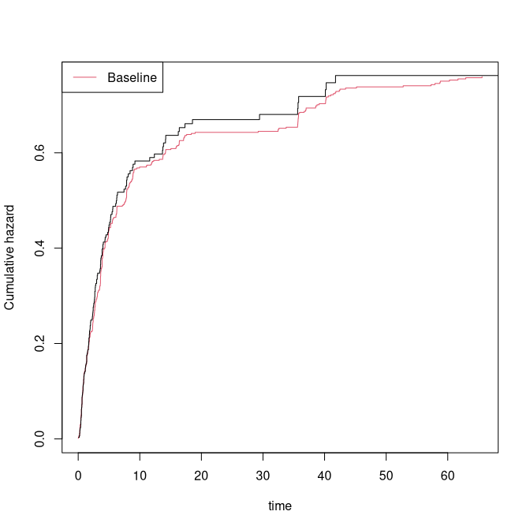

``` r

 ## modify regression coefficients 
 cox10 <- cox1
 cox10$coef <- c(0,0.4,0.3)
 dd <- sim_phreg(cox10,n,data=bmt)
 dtable(dd,~cause)
#> 
#> cause
#>   0   1 
#> 427 573
 scox1 <- phreg(Surv(time,cause==1)~tcell+platelet+age,data=dd)
 cbind(coef(cox10),coef(scox1))
#>          [,1]       [,2]
#> tcell     0.0 0.05615982
#> platelet  0.4 0.34930321
#> age       0.3 0.42496872
 par(mfrow=c(1,1))
 plot(scox1,col=2); plot(cox10,add=TRUE,col=1)
```

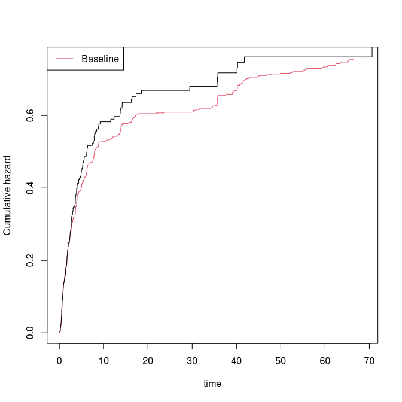

Multiple Cox models for cause-specific hazards can be combined. Below we draw the
covariates manually; alternatively, `sim_phregs` draws covariates directly from
the data.


``` r
 data(bmt); 
 cox1 <- phreg(Surv(time,cause==1)~tcell+platelet,data=bmt)
 cox2 <- phreg(Surv(time,cause==2)~tcell+platelet,data=bmt)

 X1 <- bmt[,c("tcell","platelet")]
 n <- nsim
 xid <- sample(1:nrow(X1),n,replace=TRUE)
 Z1 <- X1[xid,]
 Z2 <- X1[xid,]
 rr1 <- exp(as.matrix(Z1) %*% cox1$coef)
 rr2 <- exp(as.matrix(Z2) %*% cox2$coef)

 d <-  rcrisk(cox1$cum,cox2$cum,rr1,rr2)
 dd <- cbind(d,Z1)

 scox1 <- phreg(Surv(time,status==1)~tcell+platelet,data=dd)
 scox2 <- phreg(Surv(time,status==2)~tcell+platelet,data=dd)
 par(mfrow=c(1,2))
 plot(cox1); plot(scox1,add=TRUE,col=2)
 plot(cox2); plot(scox2,add=TRUE,col=2)
```

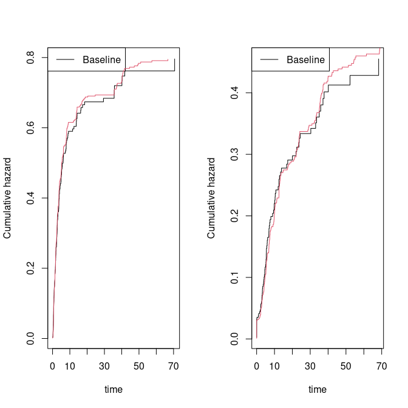

``` r
 cbind(cox1$coef,scox1$coef,cox2$coef,scox2$coef)
#>                [,1]       [,2]       [,3]       [,4]
#> tcell    -0.4232606 -0.3727007  0.3991068  0.8167564
#> platelet -0.5654438 -0.5834273 -0.2461474 -0.3190683
```

We now consider a fully nonparametric model with stratified baselines.


``` r
 data(sTRACE)
 dtable(sTRACE,~chf+diabetes)
#> 
#>     diabetes   0   1
#> chf                 
#> 0            223  16
#> 1            230  31
 coxs <-   phreg(Surv(time,status==9)~strata(diabetes,chf),data=sTRACE)
 strata <- sample(0:3,nsim,replace=TRUE)
 simb <- sim_phreg(coxs,nsim,data=NULL,strata=strata)

 cc <-   phreg(Surv(time,status)~strata(strata),data=simb)
 plot(coxs,col=1); plot(cc,add=TRUE,col=2)

 simb1 <- sim_phreg(coxs,nsim,data=sTRACE)
 cc1 <-   phreg(Surv(time,status)~strata(diabetes,chf),data=simb1)
 plot(cc1,add=TRUE,col=3)
```

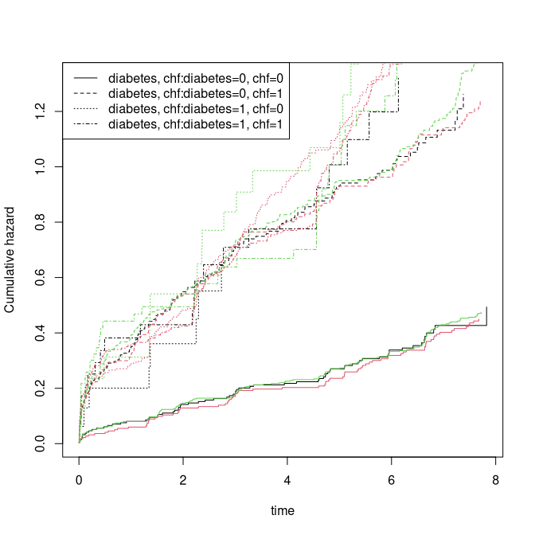

We now fit cause-specific hazard models with three causes (treating censoring as one of them)
and generate competing risks data with hazards taken from the fitted Cox models.
The following example includes stratified baselines for some of the models:


``` r
 ## competing risks with phreg 
 cox0 <- phreg(Surv(time,cause==0)~tcell+platelet,data=bmt)
 cox1 <- phreg(Surv(time,cause==1)~tcell+platelet,data=bmt)
 cox2 <- phreg(Surv(time,cause==2)~strata(tcell)+platelet,data=bmt)
 coxs <- list(cox0,cox1,cox2)
 dd <- sim_phregs(coxs,n,data=bmt)

 ## verify cause-specific hazards match fitted model; increase n for better agreement
 scox0 <- phreg(Surv(time,cause==1)~tcell+platelet,data=dd)
 scox1 <- phreg(Surv(time,cause==2)~tcell+platelet,data=dd)
 scox2 <- phreg(Surv(time,cause==3)~strata(tcell)+platelet,data=dd)
 cbind(cox0$coef,scox0$coef)
#>               [,1]      [,2]
#> tcell    0.1912407 0.3053846
#> platelet 0.1563789 0.2586927
 cbind(cox1$coef,scox1$coef)
#>                [,1]       [,2]
#> tcell    -0.4232606 -0.6611783
#> platelet -0.5654438 -0.4566101
 cbind(cox2$coef,scox2$coef)
#>                [,1]       [,2]
#> platelet -0.2271912 -0.1857664
 par(mfrow=c(1,3))
 plot(cox0); plot(scox0,add=TRUE,col=2); 
 plot(cox1); plot(scox1,add=TRUE,col=2); 
 plot(cox2); plot(scox2,add=TRUE,col=2); 
```

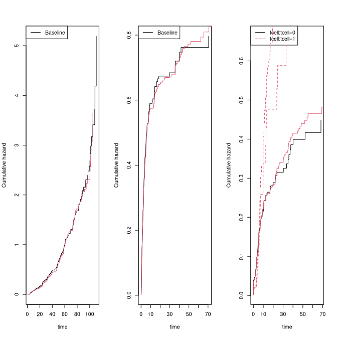

``` r
 
 ########################################
 ## second example 
 ########################################

 cox1 <- phreg(Surv(time,cause==1)~strata(tcell)+platelet,data=bmt)
 cox2 <- phreg(Surv(time,cause==2)~tcell+strata(platelet),data=bmt)
 coxs <- list(cox1,cox2)
 dd <- sim_phregs(coxs,n,data=bmt)
 scox1 <- phreg(Surv(time,cause==1)~strata(tcell)+platelet,data=dd)
 scox2 <- phreg(Surv(time,cause==2)~tcell+strata(platelet),data=dd)
 cbind(cox1$coef,scox1$coef)
#>                [,1]       [,2]
#> platelet -0.5658612 -0.6949669
 cbind(cox2$coef,scox2$coef)
#>            [,1]      [,2]
#> tcell 0.4153706 0.2554993
 par(mfrow=c(1,2))
 plot(cox1); plot(scox1,add=TRUE); 
 plot(cox2); plot(scox2,add=TRUE); 
```

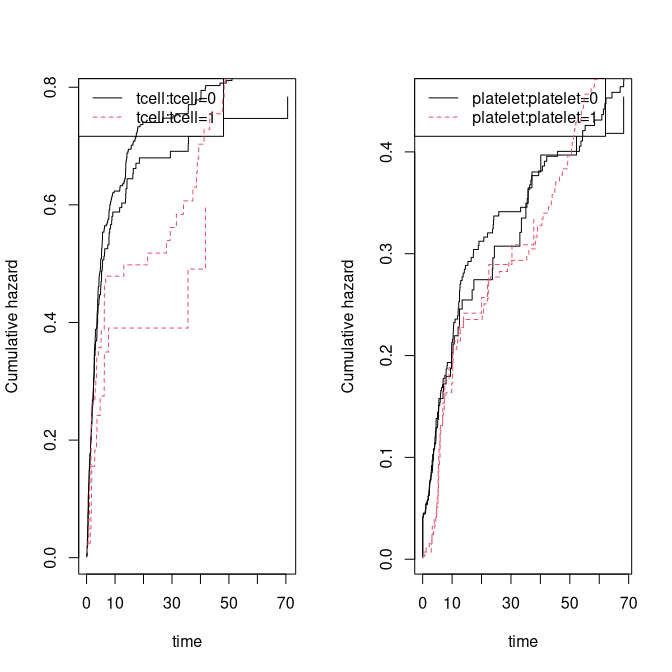

One further example, again fully nonparametric:


``` r
 library(mets)
 n <- nsim
 data(bmt)
 bmt$bmi <- rnorm(408)
 dcut(bmt) <- gage~age
 data <- bmt
 cox1 <- phreg(Surv(time,cause==1)~strata(tcell,platelet),data=bmt)
 cox2 <- phreg(Surv(time,cause==2)~strata(gage,tcell),data=bmt)
 cox3 <- phreg(Surv(time,cause==0)~strata(platelet)+bmi,data=bmt)
 coxs <- list(cox1,cox2,cox3)

 dd <- sim_phregs(coxs,n,data=bmt,extend=0.002)
 dtable(dd,~cause)
#> 
#> cause
#>   0   1   2   3 
#>   1 397 241 361
 scox1 <- phreg(Surv(time,cause==1)~strata(tcell,platelet),data=dd)
 scox2 <- phreg(Surv(time,cause==2)~strata(gage,tcell),data=dd)
 scox3 <- phreg(Surv(time,cause==3)~strata(platelet)+bmi,data=dd)
 cbind(coef(cox1),coef(scox1), coef(cox2),coef(scox2), coef(cox3),coef(scox3))
#>           [,1]        [,2]
#> bmi -0.1353399 -0.04444255
 par(mfrow=c(1,3))
 plot(scox1,col=2); plot(cox1,add=TRUE,col=1)
 plot(scox2,col=2); plot(cox2,add=TRUE,col=1)
 plot(scox3,col=2); plot(cox3,add=TRUE,col=1)
```

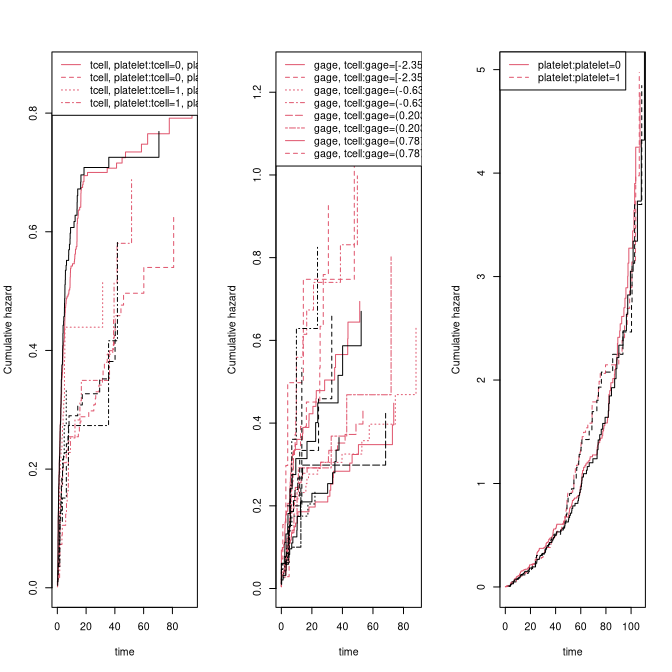

**Summary of simulation functions**

| Function      | Purpose                                                     |
|---------------|-------------------------------------------------------------|
| `sim_phreg`   | Single `phreg` model; supports stratified baselines         |
| `sim_phregs`  | List of cause-specific `phreg` models; draws covariates automatically |


# Delayed entry

If $T$ given $X$ have hazard  on Cox form 
$$
  \lambda_0(t) \exp( X^T \beta)
$$
and we wish to generate data according to this hazard for those that are alive at time $s$, that is 
draw from the distribution of $T$ given $T>s$ (all given $X$ ), then we note that  
$$
\Lambda_0^{-1}( \Lambda_0(s) + E/HR)) 
$$
with $HR=\exp(X^T \beta))$ and with $E \sim Exp(1)$ has the distribution we are after. 

This is again a consequence of a simple calculation
$$
P_X\!\left(\Lambda^{-1}\!\left(\Lambda(s) + E/HR\right) > t\right)
= P_X\!\left(E > HR\!\left(\Lambda(t) - \Lambda(s)\right)\right)
= P_X(T > t \mid T > s).
$$

We here illustrate how to simulate from a competing risks model based on 
Cox hazards. 


``` r
data(bmt)
cox0 <- phreg(Surv(time, cause == 0) ~ tcell + platelet+age,          data = bmt)
cox1 <- phreg(Surv(time, cause == 1) ~ tcell + platelet+age,          data = bmt)
cox2 <- phreg(Surv(time, cause == 2) ~ strata(tcell) + platelet+age,  data = bmt)

nsim <- 800
entry <- rbinom(nsim, 1, 0.5) * runif(nsim) * 60

dd <- sim_phreg(cox0,nsim, data = bmt,entry=entry)
scox0 <- phreg(Surv(entry,time, cause == 1) ~ tcell + platelet+age,         data = dd)
cbind(cox0$coef, scox0$coef)
#>                [,1]       [,2]
#> tcell    0.09091888 0.11554247
#> platelet 0.15733517 0.09307867
#> age      0.10230287 0.11156111
par(mfrow = c(2, 2))
plot(cox0); plot(scox0, add = TRUE, col = 2)

dd <- sim_phregs(list(cox0, cox1, cox2), nsim, data = bmt,entry=entry)

scox0 <- phreg(Surv(entry,time, cause == 1) ~ tcell + platelet+age,         data = dd)
scox1 <- phreg(Surv(entry,time, cause == 2) ~ tcell + platelet+age,         data = dd)
scox2 <- phreg(Surv(entry,time, cause == 3) ~ strata(tcell) + platelet+age, data = dd)

cbind(cox0$coef, scox0$coef)
#>                [,1]         [,2]
#> tcell    0.09091888  0.006447759
#> platelet 0.15733517  0.074976667
#> age      0.10230287 -0.042215864
cbind(cox1$coef, scox1$coef)
#>                [,1]       [,2]
#> tcell    -0.6517920 -0.6996524
#> platelet -0.5207454 -0.3419084
#> age       0.4083098  0.5513612
cbind(cox2$coef, scox2$coef)
#>                [,1]        [,2]
#> platelet -0.2178543 -0.20179035
#> age       0.1306184  0.02950711

plot(cox0); plot(scox0, add = TRUE, col = 2)
plot(cox1); plot(scox1, add = TRUE, col = 2)
plot(cox2); plot(scox2, add = TRUE, col = 2)
```

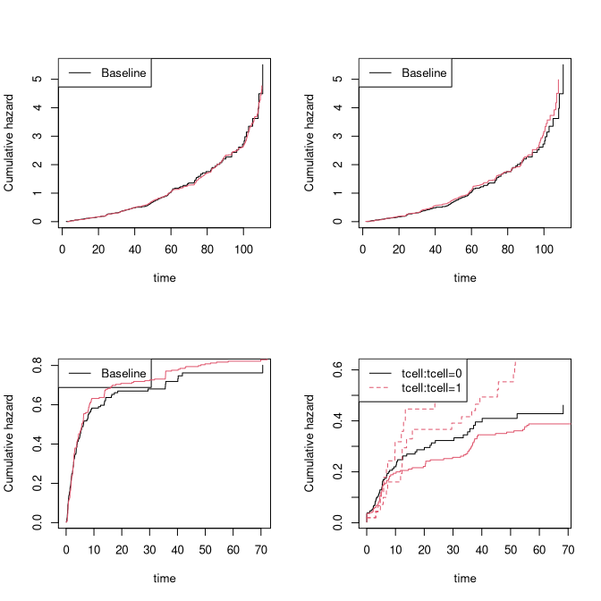

# Parametric hazard models
While the semi‑parametric Cox model provides substantial flexibility for
simulating survival data, there are situations where a fully parametric
simulation model is convenient or preferable. Here we consider a Weibull model
 parametrized so that the cumulative hazard is given by $$\Lambda(t) = \lambda
 \cdot t^s$$ where $s$ is the **shape parameter**, and $\lambda$ the **rate
 parameter**. We allow regression on both parameters
 \begin{align*} \lambda :=
 \exp(\beta^\top X), \quad s := \exp(\gamma^\top Z) \end{align*}
  where $X$ and
 $Z$ are covariate vectors. Specifically, this opens up for exploring
 non‑proportional hazards when $s$ depends on covariates.

Revisiting the TRACE data example we can compare the predictions from the Cox
and the Weibull-Cox model stratified by `chf` and with a proportional hazard
effect of `age` 

``` r
data(sTRACE, package = "mets")
dat <- sTRACE
cox1 <- phreg(Surv(time, status > 0) ~ strata(chf) + I(age - 67), data = sTRACE)
coxw <- phreg_weibull(Surv(time, status > 0) ~ chf + age,
    shape.formula = ~chf,
    data = sTRACE
    )
coxw
#> 
#> - Weibull-Cox model -
#> 
#> Call:
#> phreg_weibull(formula = Surv(time, status > 0) ~ chf + age, shape.formula = ~chf, 
#>     data = sTRACE)
#> 
#> log-Likelihood: -684.750499 
#> 
#>    n events obs.time
#>  500    264 2228.481
#> 
#>               Estimate  Std.Err     2.5%   97.5%   P-value
#> (Intercept)   -5.59626 0.465886 -6.50938 -4.6831 3.070e-33
#> chf            0.83250 0.197629  0.44516  1.2198 2.526e-05
#> age            0.05331 0.006165  0.04123  0.0654 5.241e-18
#> ─────────────                                             
#> s:(Intercept) -0.44096 0.116740 -0.66977 -0.2122 1.585e-04
#> s:chf         -0.11794 0.133078 -0.37877  0.1429 3.755e-01

tt <- seq(0, max(sTRACE$time), length.out = 100)
newd <- data.frame(chf = c(1, 0), age=67)
pr <- predict(coxw, newdata = newd, times = tt, type="chaz")
plot(cox1, col = 1)
lines(tt, pr[, 1, 1], lty=2, lwd=2)
lines(tt, pr[, 1, 2], lty = 1, lwd = 2)
```

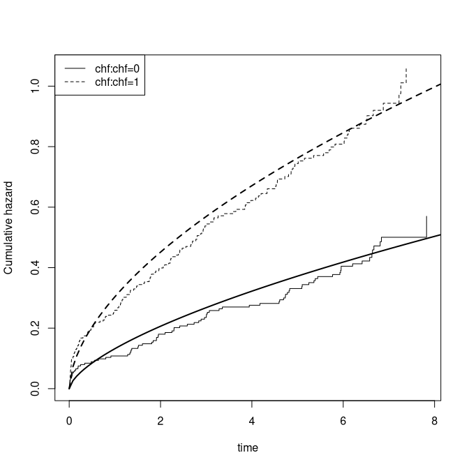

To simulate data we can use the `rweibullcox()` function. Note that the
`stats::rweibull()` function gives a different parametrization where the
cumulative hazard is given by $H(t) = (t/b)^s$, i.e., with the same scale
parameter but where the scale parameter $b$ is related to the rate parameter we consider by $r := b^{-s}$.


``` r
n <- 5000
newd <- mets::dsample(size=n, sTRACE[,c("chf","age")]) # bootstrap covariates
lp <- predict(coxw, newdata=newd, type="lp") # linear-predictors
head(lp)
#>            [,1]       [,2]
#> X4522 -1.641818 -0.4409608
#> X1337 -1.576030 -0.4409608
#> X4490 -3.052267 -0.4409608
#> X5363 -2.003547 -0.4409608
#> X4518 -2.093627 -0.5589006
#> X1354 -1.154411 -0.5589006

## simulate event times
tt <- rweibullcox(nrow(lp), rate = exp(lp[,1]), shape= exp(lp[,2]))

# censoring model
censw <- phreg_weibull(Surv(time, status==0) ~ 1, data=sTRACE)
censpar <- exp(coef(censw))
censtime <- pmin(8, rweibullcox(nrow(lp), censpar[1], censpar[2]))

# combined simulated data
newd <- transform(newd, time=pmin(tt, censtime), status=(tt<=censtime))
head(newd)
#>       chf    age     time status
#> X4522   0 74.174 4.104843   TRUE
#> X1337   0 75.408 4.239002   TRUE
#> X4490   0 47.718 8.000000  FALSE
#> X5363   0 67.389 1.402283   TRUE
#> X4518   1 50.084 1.246696   TRUE
#> X1354   1 67.701 6.829409  FALSE

# estimate weibull model on new data
phreg_weibull(Surv(time,status) ~ chf + age, ~chf, data=newd)
#> 
#> - Weibull-Cox model -
#> 
#> Call:
#> phreg_weibull(formula = Surv(time, status) ~ chf + age, shape.formula = ~chf, 
#>     data = newd)
#> 
#> log-Likelihood: -6692.027131 
#> 
#>     n events obs.time
#>  5000   2613 21578.83
#> 
#>               Estimate  Std.Err     2.5%    97.5%    P-value
#> (Intercept)   -5.70070 0.157299 -6.00900 -5.39240 1.365e-287
#> chf            0.86612 0.059267  0.74996  0.98229  2.290e-48
#> age            0.05453 0.002144  0.05033  0.05873 9.532e-143
#> ─────────────                                               
#> s:(Intercept) -0.42290 0.033445 -0.48845 -0.35735  1.199e-36
#> s:chf         -0.13715 0.039317 -0.21421 -0.06009  4.859e-04
```

All these steps are wrapped in the `simulate` method:

``` r
# simulate(coxw, n = 5, cens.model = NULL, data=newd, var.names = c("time", "status"))
simulate(coxw, nsim = 5)
#>         no wmi status chf    age sex diabetes     time vf
#> X6167 6167 1.8   TRUE   0 54.418   1        0 1.329640  0
#> X3847 3847 1.6  FALSE   1 66.119   0        0 7.635526  1
#> X695   695 0.8   TRUE   1 74.377   1        1 4.424567  0
#> X1599 1599 2.0   TRUE   0 74.986   0        0 3.600678  0
#> X6045 6045 2.0   TRUE   0 79.997   0        0 3.737537  0
```


# Multistate models: The Illness Death model 

Using hazard-based simulation with delayed entry we can simulate data
from the general illness-death model. The cumulative hazards for each transition
must be specified.

We specify

 - $\Lambda_{12}(t)$ the cumulative hazard for $1 \rightarrow 2$ transitions
 - $\Lambda_{21}(t)$ the cumulative hazard for $2 \rightarrow 1$ transitions
 - $\Lambda_{13}(t)$ the cumulative hazard for $1 \rightarrow 3$ transitions
 - $\Lambda_{23}(t)$ the cumulative hazard for $2 \rightarrow 3$ transitions

Transitions are then generated using these hazards. Covariate effects can be included
via proportional hazards models by supplying hazard ratios for all components,
as well as an exponential censoring model. Dependence between transitions can be introduced via:

 - `dependence=0`: independence
 - `dependence=1`: all hazards share a common gamma-distributed frailty (variance `var.z`)


\begin{tikzpicture}[
    >=Stealth,
    node distance=4cm,
    state/.style={
        rectangle,
        draw=black,
        thick,
        minimum width=3cm,
        minimum height=1cm,
        align=center
    }
]

  % Top states
  \node[state] (H) {Healthy \\ (1)};
  \node[state] (I) [right=of H] {Ill \\ (2)};

  % Dead centered below
  \node[state] (D) at ($(H)!0.5!(I) + (0,-3)$) {Dead \\ (3)};

  % Two straight arrows between Healthy and Ill
  \draw[->, thick] 
    ($(H.east)+(0,0.15)$) -- ($(I.west)+(0,0.15)$)
    node[midway, above] {$\lambda_{12}$};

  \draw[->, thick] 
    ($(I.west)+(0,-0.15)$) -- ($(H.east)+(0,-0.15)$)
    node[midway, below] {$\lambda_{21}$};

  % Death transitions
  \draw[->, thick] (H) -- node[left] {$\lambda_{13}$} (D);
  \draw[->, thick] (I) -- node[right] {$\lambda_{23}$} (D);

\end{tikzpicture}

We pass the cumulative hazards for each transition to `simMultistate`
to simulate data from the model, then re-estimate the parameters on the simulated
data to validate the procedure.


``` r
 data(CPH_HPN_CRBSI)
 dr <- CPH_HPN_CRBSI$terminal
 base1 <- CPH_HPN_CRBSI$crbsi 
 base4 <- CPH_HPN_CRBSI$mechanical
 dr2 <- scalecumhaz(dr,1.5)
 cens <- rbind(c(0,0),c(2000,0.5),c(5110,3))

 iddata <- sim_multistate(nsim,base1,base1,dr,dr2,cens=cens)
 dlist(iddata,.~id|id<3,n=0)
#> id: 1
#>   entry     time status rr death from to start     stop
#> 1     0 201.9469      3  1     1    1  3     0 201.9469
#> ------------------------------------------------------------ 
#> id: 2
#>        entry     time status rr death from to    start     stop
#> 2     0.0000 395.3879      2  1     0    1  2   0.0000 395.3879
#> 801 395.3879 555.8022      3  1     1    2  3 395.3879 555.8022
  
 ### estimating rates from simulated data  
 c0 <- phreg(Surv(start,stop,status==0)~+1,iddata)
 c3 <- phreg(Surv(start,stop,status==3)~+strata(from),iddata)
 c1 <- phreg(Surv(start,stop,status==1)~+1,subset(iddata,from==2))
 c2 <- phreg(Surv(start,stop,status==2)~+1,subset(iddata,from==1))
 ###
 par(mfrow=c(2,2))
 plot(c0)
 lines(cens,col=2) 
 plot(c3,main="rates 1-> 3 , 2->3")
 lines(dr,col=1,lwd=2)
 lines(dr2,col=2,lwd=2)
 ###
 plot(c1,main="rate 1->2")
 lines(base1,lwd=2)
 ###
 plot(c2,main="rate 2->1")
 lines(base1,lwd=2)
```

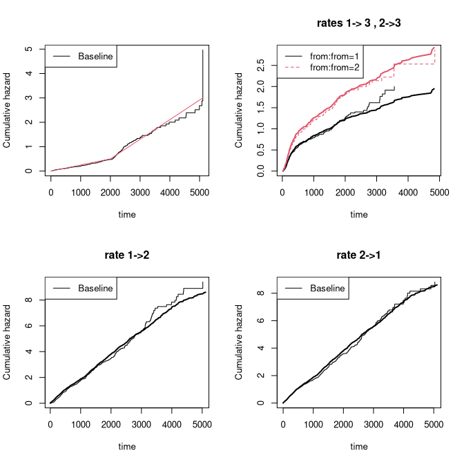


# Cumulative incidence 

In this section we discuss how to simulate competing risks data with a specified cumulative
incidence function. We consider for simplicity a competing risks model with two causes and denote the
cumulative incidence functions as $F_1(t,X) = P(T < t, \epsilon=1|X)$ and $F_2(t,X) = P(T < t, \epsilon=2|X)$,
given covariate $X$.

To generate data with the required cumulative incidence functions, a simple approach is to first determine
whether the subject experiences an event and, if so, from which cause; then draw the event time according to the
conditional distribution.

For simplicity we consider survival times in a fixed interval $[0,\tau]$. Given $X$:

  - first, flip a three-sided coin with probabilities $F_1(\tau,X)$, $F_2(\tau,X)$, $1-F_1(\tau,X)-F_2(\tau,X)$ to decide whether the subject survives or
     experiences one of the two causes.
  - second, draw the event time using the cumulative incidence distribution. The timing of a cause $j$ event is
       $T = \tilde F_j^{-1}(U,X)$ with $\tilde F_j(s,X) = F_j(s,X)/F_j(\tau,X)$ and $U$ uniform.

Then indeed $P(T \leq t, \epsilon=j|X) = F_j(t,X)$ for $j=1,2$.

We again note and use that if $\tilde F_j(s)$ and $F_j(s)$ are piecewise linear
continuous functions then the inverse is easy to compute. 

A couple of details worth noting:

 - the coin flip to determine cause is based on an underlying uniform, $pU$, which can be supplied and shared across subjects
     to generate dependence in the risk.
 - the uniform used for generating the timing, $U$, can also be supplied and shared across subjects to
    generate dependence in the timing.


## Cumulative incidence I

Here we simulate two causes of death with two binary covariates using a logistic link
\begin{align*}
F_1(t,X)  &= \frac{ \Lambda_1(t,\rho_1) exp(X^T  \beta_1)}{1+\Lambda_1(t,\rho_1) exp(X^T  \beta_1)}
\end{align*}
and $F_2$ here enforcing the sum condition $F_1+F_2 \leq 1$
\begin{align*}
F_2(t,X)  & =  \frac{ \Lambda_2(t,\rho_2) exp(X^T  \beta_2)}{1+\Lambda_2(t,\rho_2) exp(X^T  \beta_2)} [ 1- F_1(\tau,X) ]
\end{align*}
or without the constraint
\begin{align*}
F_2(t,X)  & =  \frac{ \Lambda_2(t,\rho_2) exp(X^T  \beta_2)}{1+\Lambda_2(t,\rho_2) exp(X^T  \beta_2)}.
\end{align*}
When the sum condition is not enforced through the construction, then 
it is enforced ad-hoc when drawing the cause of death. 

The baselines are given as $\Lambda_j(t) = \rho_1 (1- exp(-t/r_j))$ where $\rho_j$ 
and $r_j$ are positive constants, and here $\tau=6$. 

To simulate the survival time we use a piecewise linear approximation of the cumulative
incidence functions and will thus depends on some grid for linear approximation. Our linear 
approximation can be made arbitrarily close to any specific smooth cumulative incidence function.

The function `simul_cifs`

 - uses a time-scale $[0,6]$, which can obviously be rescaled.
 - takes regression coefficients as a single vector, with $\beta_1$ followed by $\beta_2$.
 - defaults to two binary covariates, but a covariate matrix $Z$ can be supplied (dimensions must match the coefficient vector).
 - uses exponential censoring with rate `rc=0.5`, which can be made covariate-dependent (`dependence=1`) with covariate effects given by
   `rcZ`, giving rate $rc \cdot \exp(Z^T rcZ)$ (dimensions must match). Censoring can be disabled by setting `rc=NULL`.


The function `sim_cifs` takes the output from `cifregFG` or `cifreg` and simulates using the
baselines and covariate effects stored in those objects.


``` r
library(mets)
nsim <- 400
rho1 <- 0.4; rho2 <- 2
beta <- c(0.3,-0.3,-0.3,0.3)

dats <- simul_cifs(nsim,rho1,rho2,beta,rc=0.5,depcens=0,type="logistic")

par(mfrow=c(1,2))
# Fitting regression model with CIF logistic-link 
cif1 <- cifreg(Event(time,status)~Z1+Z2,dats)
summary(cif1)
#> 
#>    n events
#>  400     74
#> 
#>  400 clusters
#> coefficients:
#>    Estimate     S.E.  dU^-1/2 P-value
#> Z1  0.45731  0.13528  0.12180  0.0007
#> Z2 -0.21636  0.26451  0.23259  0.4134
#> 
#> exp(coefficients):
#>    Estimate    2.5%  97.5%
#> Z1  1.57982 1.21187 2.0595
#> Z2  0.80545 0.47961 1.3527
plot(cif1)
lines(attr(dats,"Lam1"))

dats <- simul_cifs(nsim,rho1,rho2,beta,rc=0.5,depcens=0,type="cloglog")
ciff <- cifregFG(Event(time,status)~Z1+Z2,dats)
summary(ciff)
#> 
#>    n events
#>  400     83
#> 
#>  400 clusters
#> coefficients:
#>    Estimate     S.E.  dU^-1/2 P-value
#> Z1  0.27811  0.11066  0.11175  0.0120
#> Z2 -0.57140  0.22567  0.22874  0.0113
#> 
#> exp(coefficients):
#>    Estimate    2.5%  97.5%
#> Z1  1.32063 1.06314 1.6405
#> Z2  0.56474 0.36288 0.8789
plot(ciff)
lines(attr(dats,"Lam1"))
```

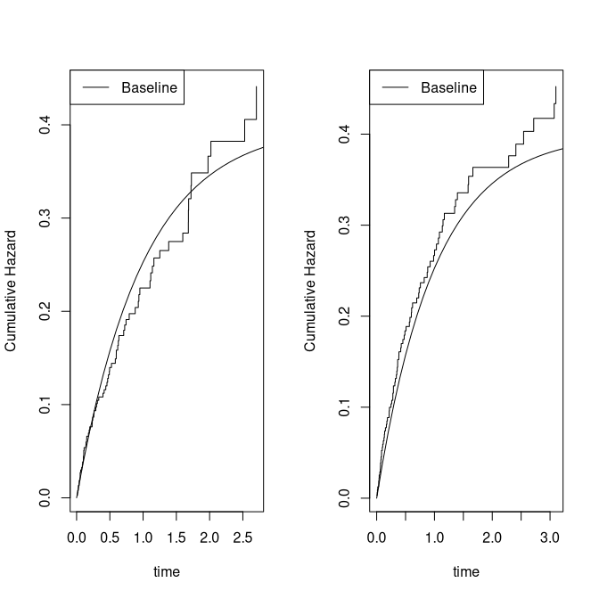

We can also use the parameters based on fitted models 


``` r
 data(bmt)
 ################################################################
 #  simulating several causes with specific cumulatives 
 ################################################################
 ## two logistic link models 
 cif1 <-  cifreg(Event(time,cause)~tcell+age,data=bmt,cause=1)
 cif2 <-  cifreg(Event(time,cause)~tcell+age,data=bmt,cause=2)

 dd <- sim_cifs(list(cif1,cif2),nsim,data=bmt)

 ## still logistic link 
 scif1 <-  cifreg(Event(time,cause)~tcell+age,data=dd,cause=1)
 ## 2nd cause not on logistic form due to restriction
 scif2 <-  cifreg(Event(time,cause)~tcell+age,data=dd,cause=2)
    
 cbind(cif1$coef,scif1$coef)
#>             [,1]       [,2]
#> tcell -0.7966259 -0.9373498
#> age    0.4164286  0.4779627
 cbind(cif2$coef,scif2$coef)
#>              [,1]       [,2]
#> tcell  0.66687029  0.7791722
#> age   -0.03248846 -0.3603559
 par(mfrow=c(1,2))   
 plot(cif1); plot(scif1,add=TRUE,col=2)
 plot(cif2); plot(scif2,add=TRUE,col=2)
```

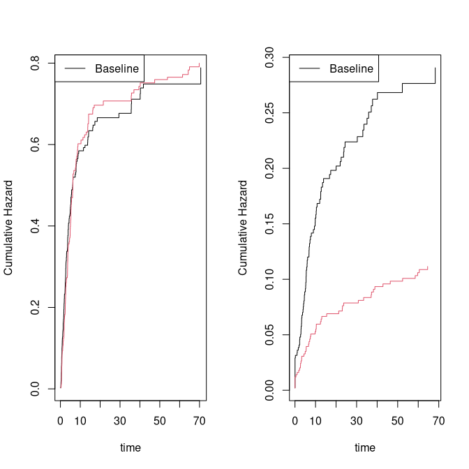


## CIF Delayed entry

Now assume that given covariates $F_1(t;X) = P(T < t, \epsilon=1|X)$ and  $F_2(t;X) = P(T < t, \epsilon=2|X)$ are two 
cumulative incidence functions that satisfies the needed constraints. We wish to generate data that follows these two
piecewise linear cumulative incidence functions with delayed entry at time $s$.  Given delayed entry at time $s$ we 
should thus generate data that follows the cumulative incidence functions
$$
\tilde F_1(t,s;X)=   \frac{F_1(t;X) - F_1(s;X)}{ 1 - F_1(s;X) - F_2(s;X)}
$$
and 
$$
\tilde F_2(t,s;X)=   \frac{F_2(t;X) - F_2(s;X)}{ 1 - F_1(s;X) - F_2(s;X)}
$$
This can be done according to the recipe in the previous section.

 - First draw event type with conditional probabilities $\tilde F_j(t,sX)$ for $j=1,2$ and the remaining survivors
 - Second draw event time (timing) of chosen type with distribution  (still conditional on being a survivor at entry)
   \begin{align*}
  \frac{\tilde F_j(t,sX)}{\tilde F_j(\tau,X)} & = \frac{F_j(t,X)- F_j(s,X)}{F_j(\tau,X)-F_j(s,X)} \mbox{for} j=1,2.
   \end{align*}

If only $F_1$ is specified, the function assumes a pure survival setting with $F_2 \equiv 0$. Note also that 
given event type the timing is unaffected by the truncation probability.

For the cloglog link the Fine-Gray model the timing can be drawn as 
\begin{align*}
 \Lambda_0^{-1}[ -\log(1-U ( F_j(\tau,X)-F_j(s,X)) - F_j(s,X) ] \exp(- X^T \beta)
\end{align*}
and for the logit-link as 
\begin{align*}
 \Lambda_0^{-1}[ \exp(logit( U ( F_j(\tau,X)-F_j(s,X)) + F_j(s,X)))] \exp(- X^T \beta)
\end{align*}


``` r
 data(bmt)
 ## two cloglog 
 cif1 <-  cifregFG(Event(time,cause)~tcell+platelet,data=bmt,cause=1)
 cif2 <-  cifregFG(Event(time,cause)~tcell+platelet,data=bmt,cause=2)

 nsim <- 800
 entry <- rbinom(nsim,1,0.5)*runif(nsim)*60
 dd <- sim_cif(cif1,nsim,data=bmt,entry=entry)

 scif1 <-  cif(Event(entry,time,cause)~strata(tcell,platelet),data=dd,cause=1)
 plot(scif1); 
 ###
 pcif1 <- predict(cif1,expand.grid(tcell=0:1,platelet=0:1))
 plot(pcif1,add=TRUE)
```

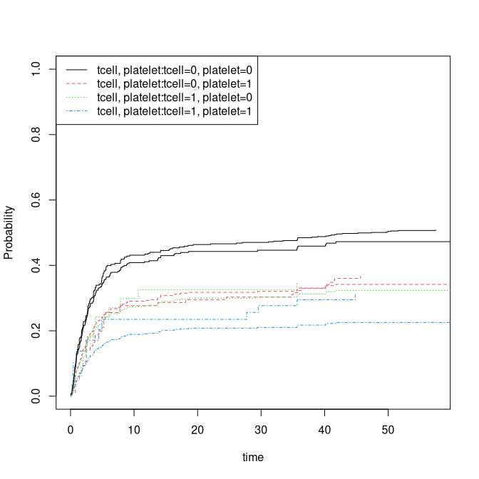

Combining two causes drawn with restriction $F_1+\tilde F_2 \leq 1$, thus modifying $\tilde F_2= F_2 (1-F_1(\tau))$ where 
$F_1$ and $F_2$ are the two input cumulative incidence models 


``` r
 dd <- sim_cifs(list(cif1,cif2),nsim,data=bmt,entry=entry)

 ## logistic link; nonparametric Aalen-Johansen with delayed entry
 scif1 <-  cif(Event(entry,time,cause)~strata(tcell,platelet),data=dd,cause=1)
 plot(scif1); 
 ###
 pcif1 <- predict(cif1,expand.grid(tcell=0:1,platelet=0:1))
 plot(pcif1,add=TRUE)
```

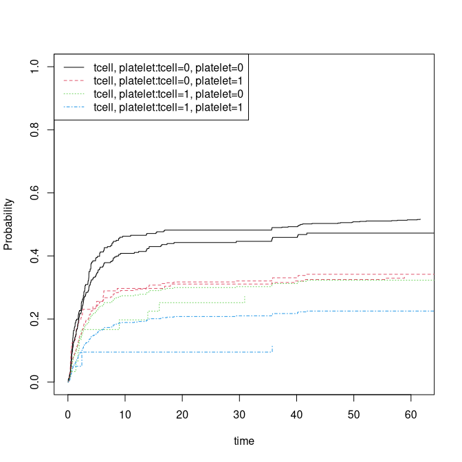

Here we again combine two causes, now using parametric baselines via `simul_cifs`.
The baselines for $F_1$ and $F_2$ are returned as attributes; note that $F_2$ is modified
to satisfy the constraint $F_1 + F_2 \leq 1$ (remember that due to the restriction the $F_2$ model is modified).


``` r
rho1 <- 0.3; rho2 <- 4
set.seed(100)
beta=c(0.3,-0.3,-0.3,0.3)
dep=0
rc <- 0.9

n <- nsim
entry <- rbinom(n,1,0.5)*runif(n)*6
data <- simul_cifs(n,rho1,rho2,beta,bin=1,rc=0.5,rate=c(3,7),entry=entry) 
###
scif1 <- cif(Event(entry,time,status)~strata(Z1,Z2),data)
plot(scif1,ylim=c(0,0.4))
###

## and without delayed entry for comparison
data <- simul_cifs(n,rho1,rho2,beta,bin=1,rc=0.5,rate=c(3,7)) 
scif1 <- cif(Event(entry,time,status)~strata(Z1,Z2),data)
plot(scif1,add=TRUE)

## true baseline cif, cloglog link 
baset <- attr(data,"Lam1")[,2]
timet <- attr(data,"Lam1")[,1]
F1base <- 1-exp(-baset)
lines(timet,F1base,lwd=3)
```

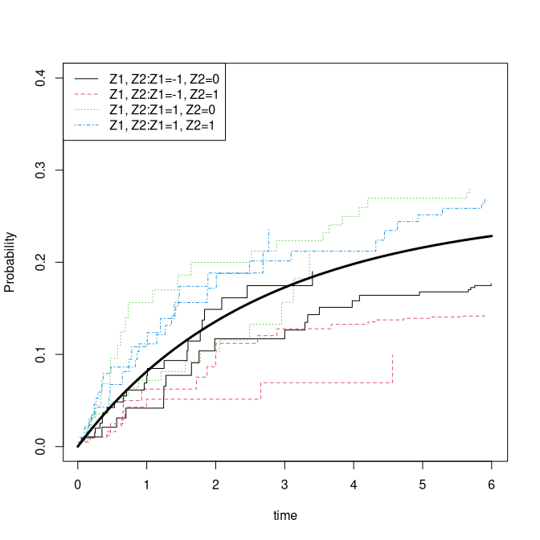


# Recurrent events

See also recurrent events vignette

 - `sim_recurrent_ts` simulates from the Two-Stage model where:
    - Rate of the terminal event among survivors is on Cox form (`phreg`)
    - Rate of recurrent events among survivors is on Cox form (`phreg`)
    - Marginal rate of recurrent events follows a Ghosh-Lin model (`recreg`)
    - Simulations are based on piecewise linear approximations on a grid
    - Events can be dependent via a gamma-distributed frailty
  - `sim_recurrentII`, `sim_recurrent`, `sim_recurrent_list`:
    - Frailty gamma models where the rates of recurrent events and the terminal event are specified via
       cumulative baselines and relative risk covariate effects, yielding a Cox model given the frailty and covariates
    - `simRecurrentList` supports multiple recurrent event types and multiple causes of death


Two-stage models

The following example fits Cox models for recurrent events and the terminal event on the `hfactioncpx12` dataset,
then simulates data from the estimated two-stage model and re-estimates to verify recovery of the parameters.


``` r
library(mets)
 data(hfactioncpx12)
 hf <- hfactioncpx12
 hf$x <- as.numeric(hf$treatment) 
 n <- 200

 ##  to fit Cox  models 
 xr <- phreg(Surv(entry,time,status==1)~treatment+cluster(id),data=hf)
 dr <- phreg(Surv(entry,time,status==2)~treatment+cluster(id),data=hf)
 estimate(xr)
#>            Estimate Std.Err   2.5%    97.5% P-value
#> treatment1  -0.1534 0.08145 -0.313 0.006286 0.05973
 estimate(dr)
#>            Estimate Std.Err    2.5%    97.5% P-value
#> treatment1  -0.4301  0.1831 -0.7889 -0.07132  0.0188

 simcoxcox <- sim_recurrent_ts(xr,dr,n=n,data=hf)

 xrs <- phreg(Surv(entry,time,status==1)~treatment+cluster(id),data=simcoxcox)
 drs <- phreg(Surv(entry,time,status==3)~treatment+cluster(id),data=simcoxcox)
 estimate(xrs)
#>            Estimate Std.Err    2.5%     97.5% P-value
#> treatment1  -0.3901  0.1969 -0.7762 -0.004138 0.04759
 estimate(drs)
#>            Estimate Std.Err    2.5%  97.5% P-value
#> treatment1  -0.2158  0.2827 -0.7698 0.3382  0.4453

 par(mfrow=c(1,2))
 plot(xrs); 
 plot(xr,add=TRUE)
###
 plot(drs)
 plot(dr,add=TRUE)
```

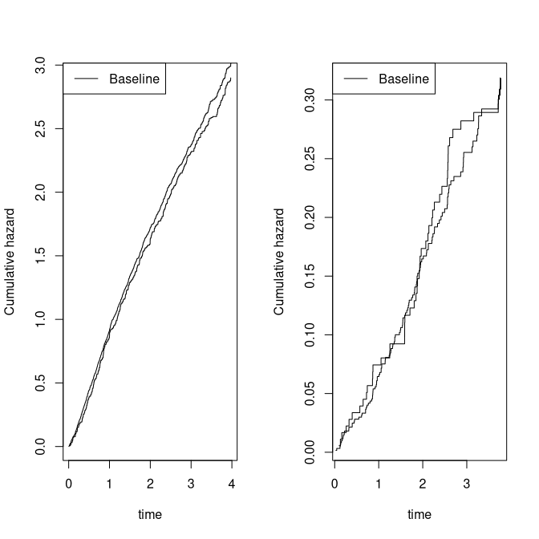

Now with Ghosh-Lin and Cox marginals:


``` r
 recGL <- recreg(Event(entry,time,status)~treatment+cluster(id),hf,death.code=2)
 estimate(recGL)
#>            Estimate Std.Err    2.5%   97.5% P-value
#> treatment1  -0.1104 0.07866 -0.2646 0.04376  0.1604
 estimate(dr)
#>            Estimate Std.Err    2.5%    97.5% P-value
#> treatment1  -0.4301  0.1831 -0.7889 -0.07132  0.0188

 simglcox <- sim_recurrent_ts(recGL,dr,n=n,data=hf)

 GLs <- recreg(Event(entry,time,status)~treatment+cluster(id),data=simglcox,death.code=3)
 drs <- phreg(Surv(entry,time,status==3)~treatment+cluster(id),data=simglcox)
 estimate(GLs)
#>            Estimate Std.Err    2.5%  97.5% P-value
#> treatment1 -0.05645  0.1593 -0.3687 0.2558   0.723
 estimate(drs)
#>            Estimate Std.Err   2.5%   97.5% P-value
#> treatment1  -0.7905  0.3202 -1.418 -0.1629 0.01355

 par(mfrow=c(1,2))
 plot(GLs); 
 plot(recGL,add=TRUE)
 plot(drs)
 plot(dr,add=TRUE)
```

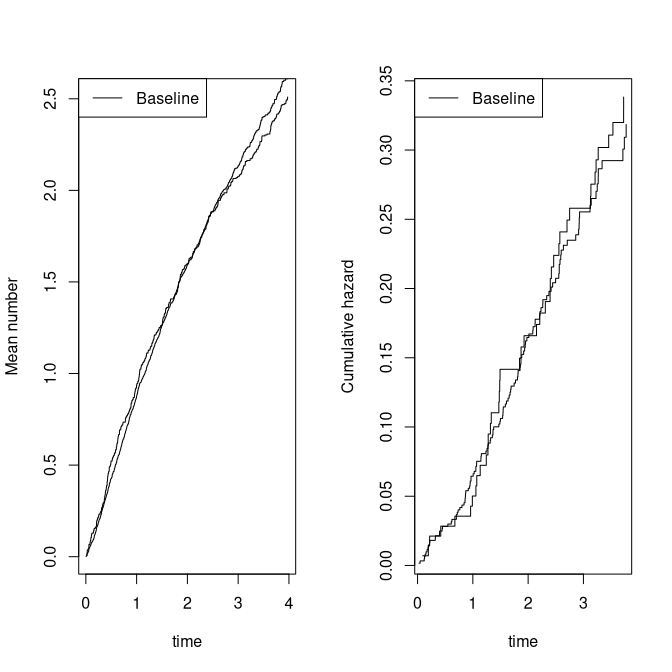

We can also fit and simulate from stratified models:


``` r
data(hfactioncpx12)
hf <- hfactioncpx12
hf$x <- as.numeric(hf$treatment)
hf$age <- rnorm(741)[hf$id]
hf$Z1 <- rbinom(741,1,0.5)[hf$id]

xr <- phreg(Surv(entry,time,status==1)~strata(x)+age+cluster(id),data=hf)
dr <- phreg(Surv(entry,time,status==2)~x+strata(Z1)+age+cluster(id),data=hf)
n <- 400 
rr <- sim_recurrent_ts(xr,dr,n=n,data=hf)
rxr <- phreg(Surv(entry,time,status==1)~strata(x)+age+cluster(id),data=rr)
rdr <- phreg(Surv(entry,time,status==3)~x+strata(Z1)+age+cluster(id),data=rr)
estimate(xr)
#>     Estimate Std.Err     2.5%  97.5% P-value
#> age   0.0273 0.03922 -0.04958 0.1042  0.4864
estimate(rxr)
#>      Estimate Std.Err   2.5%  97.5% P-value
#> age 0.0002297 0.05522 -0.108 0.1085  0.9967
estimate(dr)
#>     Estimate Std.Err     2.5%    97.5% P-value
#> x   -0.42738 0.18252 -0.78510 -0.06965  0.0192
#> age  0.09527 0.08586 -0.07301  0.26354  0.2672
estimate(rdr)
#>     Estimate Std.Err    2.5%    97.5% P-value
#> x   -0.48230 0.20942 -0.8928 -0.07185 0.02128
#> age  0.04296 0.09506 -0.1433  0.22927 0.65130
plot(xr); plot(rxr,add=TRUE)
plot(dr,add=TRUE,col=2); plot(rdr,add=TRUE,col=2)
```

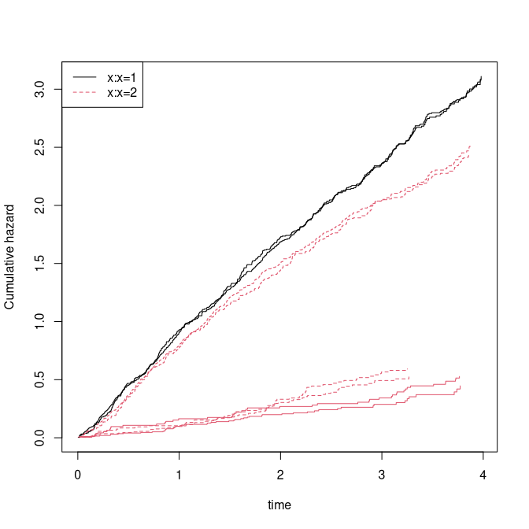

``` r
###

glr <- recreg(Event(entry,time,status)~strata(x)+age+cluster(id),data=hf,death.code=2)
dr <- phreg(Surv(entry,time,status==2)~x+strata(Z1)+age+cluster(id),data=hf)
n <- 400
rr <- sim_recurrent_ts(glr,dr,n=n,data=hf)
rxr <- recreg(Event(entry,time,status)~strata(x)+age+cluster(id),data=rr,death.code=3)
rdr <- phreg(Surv(entry,time,status==3)~x+strata(Z1)+age+cluster(id),data=rr)
estimate(xr)
#>     Estimate Std.Err     2.5%  97.5% P-value
#> age   0.0273 0.03922 -0.04958 0.1042  0.4864
estimate(rxr)
#>     Estimate Std.Err     2.5%  97.5% P-value
#> age  0.06015 0.06414 -0.06556 0.1859  0.3483
estimate(dr)
#>     Estimate Std.Err     2.5%    97.5% P-value
#> x   -0.42738 0.18252 -0.78510 -0.06965  0.0192
#> age  0.09527 0.08586 -0.07301  0.26354  0.2672
estimate(rdr)
#>     Estimate Std.Err    2.5%    97.5% P-value
#> x   -0.48433  0.2076 -0.8913 -0.07738 0.01967
#> age  0.05767  0.1067 -0.1515  0.26682 0.58887
plot(glr); plot(rxr,add=TRUE)
plot(dr,add=TRUE,col=2); plot(rdr,add=TRUE,col=2)
```

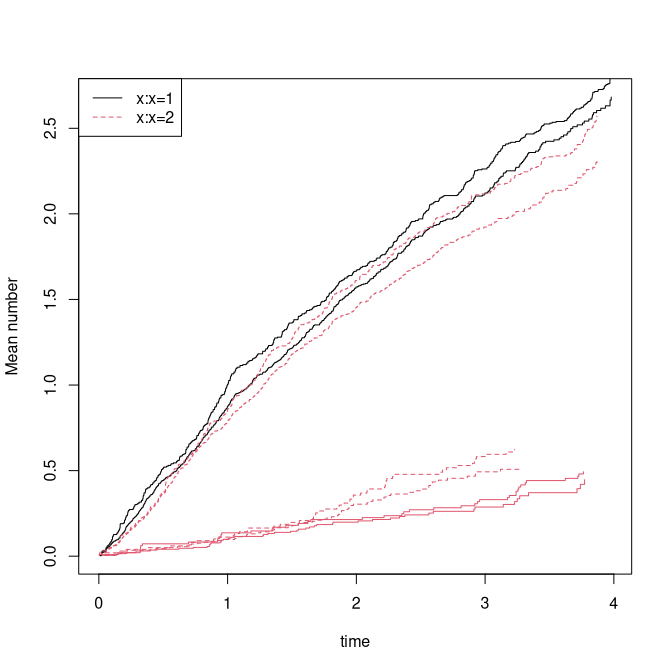


Frailty models (simulations based on the rates/intensities) 


``` r
 data(CPH_HPN_CRBSI)
 dr <- CPH_HPN_CRBSI$terminal
 base1 <- CPH_HPN_CRBSI$crbsi 
 base4 <- CPH_HPN_CRBSI$mechanical

 n <- 400
 rr <- sim_recurrent(n,base1,death.cumhaz=dr)
 ###
 mets:::showfitsim(causes=1,rr,dr,base1,base1,which=1:2)
```

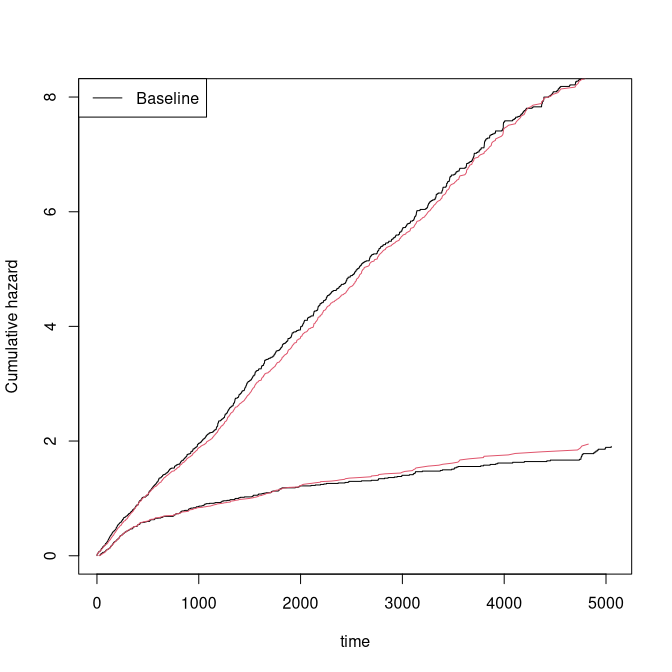

``` r

 rr <- sim_recurrentII(n,base1,base4,death.cumhaz=dr)
 dtable(rr,~death+status)
#> 
#>       status    0    1    2
#> death                      
#> 0              41 1123  161
#> 1             359    0    0
 mets:::showfitsim(causes=2,rr,dr,base1,base4,which=1:2)
```

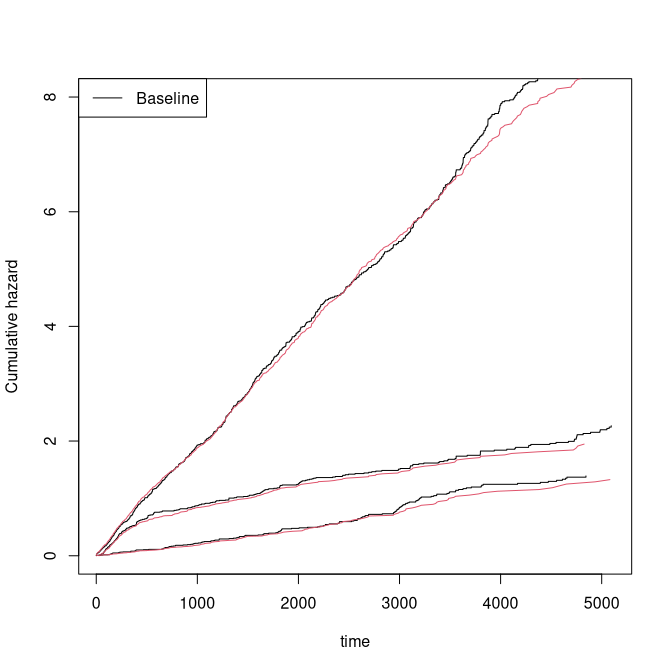

``` r

 cumhaz <- list(base1,base1,base4)
 drl <- list(dr,base4)
 rr <- sim_recurrent_list(n,cumhaz,death.cumhaz=drl)
 dtable(rr,~death+status)
#> 
#>       status   0   1   2   3
#> death                       
#> 0             10 832 847 111
#> 1            277   0   0   0
#> 2            113   0   0   0
 mets:::showfitsimList(rr,cumhaz,drl) 
```

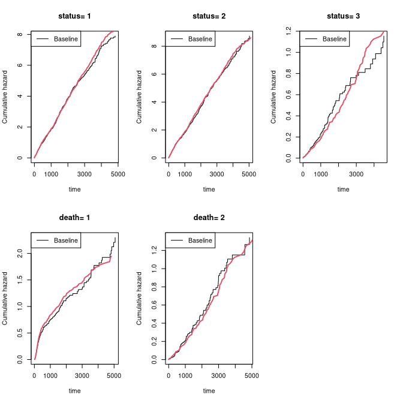


# SessionInfo


``` r
sessionInfo()
#> R version 4.6.0 (2026-04-24)
#> Platform: x86_64-pc-linux-gnu
#> Running under: Ubuntu 24.04.4 LTS
#> 
#> Matrix products: default
#> BLAS:   /home/kkzh/.asdf/installs/r/4.6.0/lib/R/lib/libRblas.so 
#> LAPACK: /usr/lib/x86_64-linux-gnu/lapack/liblapack.so.3.12.0  LAPACK version 3.12.0
#> 
#> locale:
#>  [1] LC_CTYPE=en_US.UTF-8       LC_NUMERIC=C              
#>  [3] LC_TIME=en_US.UTF-8        LC_COLLATE=en_US.UTF-8    
#>  [5] LC_MONETARY=en_US.UTF-8    LC_MESSAGES=en_US.UTF-8   
#>  [7] LC_PAPER=en_US.UTF-8       LC_NAME=C                 
#>  [9] LC_ADDRESS=C               LC_TELEPHONE=C            
#> [11] LC_MEASUREMENT=en_US.UTF-8 LC_IDENTIFICATION=C       
#> 
#> time zone: Europe/Copenhagen
#> tzcode source: system (glibc)
#> 
#> attached base packages:
#> [1] stats     graphics  grDevices utils     datasets  methods   base     
#> 
#> other attached packages:
#> [1] timereg_2.0.7  survival_3.8-6 mets_1.3.10   
#> 
#> loaded via a namespace (and not attached):
#>  [1] cli_3.6.6              knitr_1.51             rlang_1.2.0           
#>  [4] xfun_0.57              otel_0.2.0             future.apply_1.20.2   
#>  [7] listenv_0.10.1         lava_1.9.1             stats4_4.6.0          
#> [10] grid_4.6.0             evaluate_1.0.5         mvtnorm_1.3-7         
#> [13] numDeriv_2016.8-1.1    compiler_4.6.0         codetools_0.2-20      
#> [16] Rcpp_1.1.1-1.1         ucminf_1.2.3           future_1.70.0         
#> [19] lattice_0.22-9         digest_0.6.39          parallelly_1.47.0     
#> [22] parallel_4.6.0         splines_4.6.0          Matrix_1.7-5          
#> [25] tools_4.6.0            RcppArmadillo_15.2.6-1 globals_0.19.1
```
