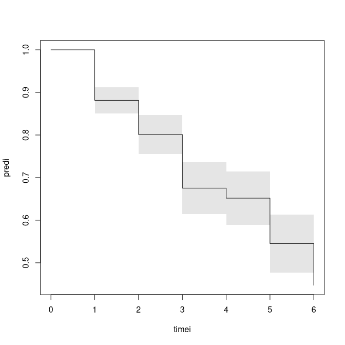

<!-- DO NOT EDIT: auto-generated from the .Rmd.orig source -->


Discrete Interval Censored survival times 
========================================

We consider the cumulative odds model for the probability of dying before time t: 
\begin{align*}
   \mbox{logit}(P(T \leq t | x)) & = \log(G(t)) + x^T \beta              \\
                P(T \leq t | x)  & =  \frac{G(t) exp( x^T \beta)}{1 + G(t) exp( x^T \beta) }          \\
                P(T >t | x)  & =  \frac{1}{1 + G(t) exp( x^T \beta) }          
\end{align*}

Input are intervals given by $]t_l,t_r]$ where t_r can be infinity
for right-censored intervals. When the data is discrete,
in contrast to grouping of continuous data, $]0,1]$ then
the intervals $]j,j+1]$ will be equivalent to an observation at j+1 (see below example).

Likelihood is maximized:
\begin{align*}
    \prod_i  P(T_i >t_{il} | x) - P(T_i> t_{ir}| x).            
\end{align*}

This model is also called the cumulative odds model 
\begin{align*}
     P(T \leq t | x)  & =  \frac{ G(t) exp( x^T \beta) }{1 + G(t) exp( x^T \beta) }.
\end{align*}
and $\beta$ captures the odds ratio for the probability of being before $t$.

The baseline is parametrized as 
\begin{align*}
       G(t)  & =  \sum_{j \leq t} \exp( \alpha_j ) 
\end{align*}

An important consequence of the model is that for all cut-points $t$ we have the same OR parameters for the 
OR of being early or later than $t$. 

Discrete TTP 
=============

First we look at some time to pregnancy data (simulated discrete survival data) that is
right-censored, and set it up to fit the cumulative odds model by 
constructing the intervals appropriately: 


``` r
library(mets)

data(ttpd) 
dtable(ttpd,~entry+time2)
#> 
#>       time2   1   2   3   4   5   6 Inf
#> entry                                  
#> 0           316   0   0   0   0   0   0
#> 1             0 133   0   0   0   0   0
#> 2             0   0 150   0   0   0   0
#> 3             0   0   0  23   0   0   0
#> 4             0   0   0   0  90   0   0
#> 5             0   0   0   0   0  68   0
#> 6             0   0   0   0   0   0 220
out <- interval_logitsurv_discrete(Interval(entry,time2)~X1+X2+X3+X4,ttpd)
summary(out)
#> $baseline
#>       Estimate Std.Err   2.5%   97.5%   P-value
#> time1  -2.0064  0.1523 -2.305 -1.7079 1.273e-39
#> time2  -2.1749  0.1599 -2.488 -1.8614 4.118e-42
#> time3  -1.4581  0.1544 -1.761 -1.1554 3.636e-21
#> time4  -2.9260  0.2453 -3.407 -2.4453 8.379e-33
#> time5  -1.2051  0.1706 -1.539 -0.8706 1.633e-12
#> time6  -0.9102  0.1860 -1.275 -0.5457 9.843e-07
#> 
#> $logor
#>    Estimate Std.Err    2.5%  97.5%   P-value
#> X1   0.9913  0.1179 0.76024 1.2223 4.100e-17
#> X2   0.6962  0.1162 0.46847 0.9238 2.064e-09
#> X3   0.3466  0.1159 0.11941 0.5738 2.788e-03
#> X4   0.3223  0.1151 0.09668 0.5478 5.111e-03
#> 
#> $or
#>    Estimate     2.5%    97.5%
#> X1 2.694610 2.138791 3.394874
#> X2 2.006032 1.597554 2.518953
#> X3 1.414239 1.126834 1.774950
#> X4 1.380231 1.101503 1.729490

dfactor(ttpd) <- entry.f~entry
out <- cumoddsreg(entry.f~X1+X2+X3+X4,ttpd)
summary(out)
#> $baseline
#>       Estimate Std.Err   2.5%   97.5%   P-value
#> time1  -2.0064  0.1523 -2.305 -1.7079 1.273e-39
#> time2  -2.1749  0.1599 -2.488 -1.8614 4.118e-42
#> time3  -1.4581  0.1544 -1.761 -1.1554 3.636e-21
#> time4  -2.9260  0.2453 -3.407 -2.4453 8.379e-33
#> time5  -1.2051  0.1706 -1.539 -0.8706 1.633e-12
#> time6  -0.9102  0.1860 -1.275 -0.5457 9.843e-07
#> 
#> $logor
#>    Estimate Std.Err    2.5%  97.5%   P-value
#> X1   0.9913  0.1179 0.76024 1.2223 4.100e-17
#> X2   0.6962  0.1162 0.46847 0.9238 2.064e-09
#> X3   0.3466  0.1159 0.11941 0.5738 2.788e-03
#> X4   0.3223  0.1151 0.09668 0.5478 5.111e-03
#> 
#> $or
#>    Estimate     2.5%    97.5%
#> X1 2.694610 2.138791 3.394874
#> X2 2.006032 1.597554 2.518953
#> X3 1.414239 1.126834 1.774950
#> X4 1.380231 1.101503 1.729490
```

We note that the probability of an event (pregnancy) is considerably higher for all covariates.

Now using this discrete survival model we simulate some data from this model 


``` r
set.seed(1000) # to control output in simulations for p-values below.
n <- 200
Z <- matrix(rbinom(n*4,1,0.5),n,4)
outsim <- simlogitSurvd(out$coef,Z)
outsim <- transform(outsim,left=time,right=time+1)
outsim <- dtransform(outsim,right=Inf,status==0)
outss <- interval_logitsurv_discrete(Interval(left,right)~+X1+X2+X3+X4,outsim)
summary(outss)
#> $baseline
#>       Estimate Std.Err    2.5%   97.5%   P-value
#> time1  -2.0154  0.3698 -2.7402 -1.2906 5.036e-08
#> time2  -1.5474  0.3473 -2.2281 -0.8666 8.385e-06
#> time3  -0.8119  0.3411 -1.4804 -0.1434 1.729e-02
#> time4  -2.0085  0.5102 -3.0084 -1.0086 8.248e-05
#> time5  -0.2185  0.3858 -0.9746  0.5376 5.711e-01
#> time6   0.2637  0.4618 -0.6415  1.1689 5.681e-01
#> 
#> $logor
#>    Estimate Std.Err    2.5%  97.5%   P-value
#> X1  1.27893  0.2804  0.7293 1.8286 5.106e-06
#> X2  0.39293  0.2635 -0.1235 0.9094 1.359e-01
#> X3 -0.09008  0.2524 -0.5847 0.4045 7.211e-01
#> X4  0.20766  0.2627 -0.3072 0.7225 4.292e-01
#> 
#> $or
#>    Estimate      2.5%    97.5%
#> X1 3.592796 2.0735647 6.225116
#> X2 1.481310 0.8838237 2.482711
#> X3 0.913858 0.5572845 1.498582
#> X4 1.230798 0.7355301 2.059553

pred <- predictlogitSurvd(out,se=TRUE)
plotSurvd(pred,se=TRUE)
```



Finally, we look at some data and compare with the icenReg package that can also fit 
the proportional odds model for continuous or discrete data.
We make the data fully interval censored/discrete by
letting also exact observations be only observed to be in an interval.

We consider the interval censored survival times for time from onset 
of diabetes to diabetic nephropathy, then modify it to
observe only that the event times are in certain intervals. 


``` r
test <- 0 
if (test==1) {

require(icenReg)
data(IR_diabetes)
IRdia <- IR_diabetes
## removing fully observed data in continuous version, here making it a discrete observation 
IRdia <- dtransform(IRdia,left=left-1,left==right)
dtable(IRdia,~left+right,level=1)

ints <- with(IRdia,dInterval(left,right,cuts=c(0,5,10,20,30,40,Inf),show=TRUE) )
}
```

We note that the gender effect is equivalent for the two approaches. 


``` r
if (test==1) {
ints$Ileft <- ints$left
ints$Iright <- ints$right
IRdia <- cbind(IRdia,data.frame(Ileft=ints$Ileft,Iright=ints$Iright))
dtable(IRdia,~Ileft+Iright)
# 
#       Iright   1   2   3   4   5 Inf
# Ileft                               
# 0             10   1  34  25   4   0
# 1              0  55  19  17   1   1
# 2              0   0 393  16   4   0
# 3              0   0   0 127   1   0
# 4              0   0   0   0  21   0
# 5              0   0   0   0   0   2

outss <- interval.logitsurv.discrete(Interval(Ileft,Iright)~+gender,IRdia)
#            Estimate Std.Err    2.5%    97.5%   P-value
# time1        -3.934  0.3316 -4.5842 -3.28418 1.846e-32
# time2        -2.042  0.1693 -2.3742 -1.71038 1.710e-33
# time3         1.443  0.1481  1.1530  1.73340 1.911e-22
# time4         3.545  0.2629  3.0295  4.06008 1.976e-41
# time5         6.067  0.7757  4.5470  7.58784 5.217e-15
# gendermale   -0.385  0.1691 -0.7165 -0.05351 2.283e-02
summary(outss)
outss$ploglik
# [1] -646.1946

fit <- ic_sp(cbind(Ileft, Iright) ~ gender, data = IRdia, model = "po")
# 
# Model:  Proportional Odds
# Dependency structure assumed: Independence
# Baseline:  semi-parametric 
# Call: ic_sp(formula = cbind(Ileft, Iright) ~ gender, data = IRdia, 
#     model = "po")
# 
#            Estimate Exp(Est)
# gendermale    0.385     1.47
# 
# final llk =  -646.1946 
# Iterations =  6 
# Bootstrap Samples =  0 
# WARNING: only  0  bootstrap samples used for standard errors. 
# Suggest using more bootstrap samples for inference
summary(fit)

## sometimes NR-algorithm needs modifications of stepsize to run 
## outss <- interval_logitsurv_discrete(Interval(Ileft,Iright)~+gender,IRdia,control=list(trace=TRUE,stepsize=1.0))
}

```

This also agrees with the cumulative link regression of the `ordinal` package,
although the baseline is parametrised differently. Note that `clm` models the
probability of surviving rather than the probability of
dying. 


``` r

data(ttpd) 
dtable(ttpd,~entry+time2)
#> 
#>       time2   1   2   3   4   5   6 Inf
#> entry                                  
#> 0           316   0   0   0   0   0   0
#> 1             0 133   0   0   0   0   0
#> 2             0   0 150   0   0   0   0
#> 3             0   0   0  23   0   0   0
#> 4             0   0   0   0  90   0   0
#> 5             0   0   0   0   0  68   0
#> 6             0   0   0   0   0   0 220
ttpd <- dfactor(ttpd,fentry~entry)
out <- cumoddsreg(fentry~X1+X2+X3+X4,ttpd)
summary(out)
#> $baseline
#>       Estimate Std.Err   2.5%   97.5%   P-value
#> time1  -2.0064  0.1523 -2.305 -1.7079 1.273e-39
#> time2  -2.1749  0.1599 -2.488 -1.8614 4.118e-42
#> time3  -1.4581  0.1544 -1.761 -1.1554 3.636e-21
#> time4  -2.9260  0.2453 -3.407 -2.4453 8.379e-33
#> time5  -1.2051  0.1706 -1.539 -0.8706 1.633e-12
#> time6  -0.9102  0.1860 -1.275 -0.5457 9.843e-07
#> 
#> $logor
#>    Estimate Std.Err    2.5%  97.5%   P-value
#> X1   0.9913  0.1179 0.76024 1.2223 4.100e-17
#> X2   0.6962  0.1162 0.46847 0.9238 2.064e-09
#> X3   0.3466  0.1159 0.11941 0.5738 2.788e-03
#> X4   0.3223  0.1151 0.09668 0.5478 5.111e-03
#> 
#> $or
#>    Estimate     2.5%    97.5%
#> X1 2.694610 2.138791 3.394874
#> X2 2.006032 1.597554 2.518953
#> X3 1.414239 1.126834 1.774950
#> X4 1.380231 1.101503 1.729490

out$ploglik
#> [1] -1676.456

if (test==1) {
### library(ordinal)
### out1 <- clm(fentry~X1+X2+X3+X4,data=ttpd)
### summary(out1)

# formula: fentry ~ X1 + X2 + X3 + X4
# data:    ttpd
# 
#  link  threshold nobs logLik   AIC     niter max.grad cond.H 
#  logit flexible  1000 -1676.46 3372.91 6(2)  1.17e-12 5.3e+02
# 
# Coefficients:
#    Estimate Std. Error z value Pr(>|z|)    
# X1  -0.9913     0.1171  -8.465  < 2e-16 ***
# X2  -0.6962     0.1156  -6.021 1.74e-09 ***
# X3  -0.3466     0.1150  -3.013  0.00259 ** 
# X4  -0.3223     0.1147  -2.810  0.00495 ** 
# ---
# Signif. codes:  0 ‘***’ 0.001 ‘**’ 0.01 ‘*’ 0.05 ‘.’ 0.1 ‘ ’ 1
# 
# Threshold coefficients:
#     Estimate Std. Error z value
# 0|1  -2.0064     0.1461 -13.733
# 1|2  -1.3940     0.1396  -9.984
# 2|3  -0.7324     0.1347  -5.435
# 3|4  -0.6266     0.1343  -4.667
# 4|5  -0.1814     0.1333  -1.361
# 5|6   0.2123     0.1342   1.582
}

```


SessionInfo
============


``` r
sessionInfo()
#> R version 4.6.0 (2026-04-24)
#> Platform: x86_64-pc-linux-gnu
#> Running under: Ubuntu 24.04.4 LTS
#> 
#> Matrix products: default
#> BLAS:   /home/kkzh/.asdf/installs/r/4.6.0/lib/R/lib/libRblas.so 
#> LAPACK: /usr/lib/x86_64-linux-gnu/lapack/liblapack.so.3.12.0  LAPACK version 3.12.0
#> 
#> locale:
#>  [1] LC_CTYPE=en_US.UTF-8       LC_NUMERIC=C              
#>  [3] LC_TIME=en_US.UTF-8        LC_COLLATE=en_US.UTF-8    
#>  [5] LC_MONETARY=en_US.UTF-8    LC_MESSAGES=en_US.UTF-8   
#>  [7] LC_PAPER=en_US.UTF-8       LC_NAME=C                 
#>  [9] LC_ADDRESS=C               LC_TELEPHONE=C            
#> [11] LC_MEASUREMENT=en_US.UTF-8 LC_IDENTIFICATION=C       
#> 
#> time zone: Europe/Copenhagen
#> tzcode source: system (glibc)
#> 
#> attached base packages:
#> [1] stats     graphics  grDevices utils     datasets  methods   base     
#> 
#> other attached packages:
#> [1] timereg_2.0.7  survival_3.8-6 mets_1.3.10   
#> 
#> loaded via a namespace (and not attached):
#>  [1] cli_3.6.6              knitr_1.51             rlang_1.2.0           
#>  [4] xfun_0.57              otel_0.2.0             future.apply_1.20.2   
#>  [7] listenv_0.10.1         lava_1.9.1             stats4_4.6.0          
#> [10] grid_4.6.0             evaluate_1.0.5         yaml_2.3.12           
#> [13] mvtnorm_1.3-7          numDeriv_2016.8-1.1    compiler_4.6.0        
#> [16] codetools_0.2-20       Rcpp_1.1.1-1.1         ucminf_1.2.3          
#> [19] future_1.70.0          lattice_0.22-9         digest_0.6.39         
#> [22] parallelly_1.47.0      parallel_4.6.0         splines_4.6.0         
#> [25] Matrix_1.7-5           tools_4.6.0            RcppArmadillo_15.2.6-1
#> [28] globals_0.19.1
```


