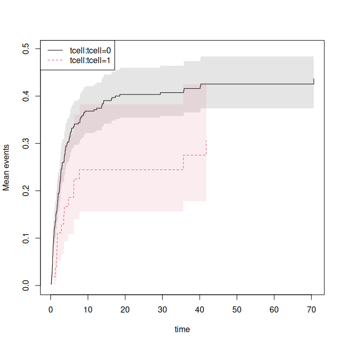
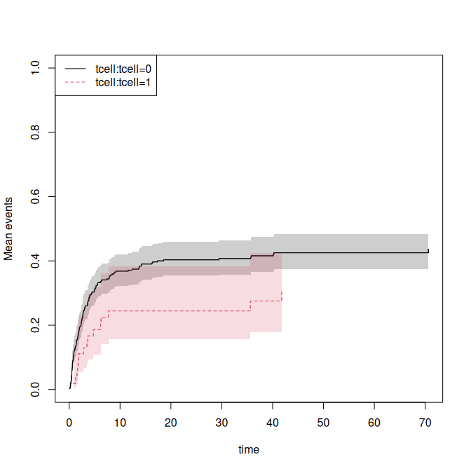

<!-- DO NOT EDIT: auto-generated from the .Rmd.orig source -->


Influence functions are available from many models in the mets package. We here illustrate some of these models and how to 
get the influence functions, they can be combined using the estimate function of the lava-package.  

First setting up some data 
=========================


``` r
 data(bmt)
 set.seed(123)
 bmt$time <- bmt$time+runif(408)*.001
 bmt$id <- sample(200,408,replace=TRUE)
 dfactor(bmt) <- cause1f~cause
 drelevel(bmt,ref=3) <- cause3f~cause
 dlevels(bmt)
#> cause1f #levels=:3 
#> [1] "0" "1" "2"
#> -----------------------------------------
#> cause3f #levels=:3 
#> [1] "2" "0" "1"
#> -----------------------------------------

 data(hfactioncpx12)
 hf <- hfactioncpx12
 head(hf)
#>   id      entry       time status trt treatment Count1
#> 1  1 0.00000000 0.60506502      1   0         0      0
#> 2  1 0.60506502 1.04859685      0   0         0      1
#> 3  2 0.00000000 0.06297057      1   0         0      0
#> 4  2 0.06297057 0.35865845      1   0         0      1
#> 5  2 0.35865845 0.39698836      1   0         0      2
#> 6  2 0.39698836 3.83299110      0   0         0      3
 hf <- tie_breaker(hf,status="status",cause=1:2)
 hf$x <- as.numeric(hf$treatment)
 hf$z <- rnorm(741)[hf$id]
 dd <- data.frame(treatment=levels(hf$treatment),id=1)
 sum(duplicated(hf$time[hf$status %in% c(1,2)]))
#> [1] 0
 sum(duplicated(hf$time[hf$status %in% c(0,1,2)]))
#> [1] 143

 ## also break ties for censorings
 hf <- tie_breaker(hf,status="status",cause=0:2,cens.code=9)
#> 143 tied event time(s) found and perturbed.
 sum(duplicated(hf$time[hf$status %in% c(0,1,2)]))
#> [1] 0
```

Semi-parametric regression models 
=================================

We can do Cox regression and get the influence functions of the baselines and regression coefficients


``` r
 ph1 <- phreg(Event(time,cause==1)~tcell+platelet+age+cluster(id),bmt)
 summary(ph1)
#> 
#>    n events
#>  408    161
#> coefficients:
#>           Estimate      S.E.   dU^-1/2 P-value
#> tcell    -0.652054  0.277897  0.276346  0.0190
#> platelet -0.519994  0.181005  0.187212  0.0041
#> age       0.408536  0.083495  0.089034  0.0000
#> 
#> exp(coefficients):
#>          Estimate    2.5%  97.5%
#> tcell     0.52097 0.30218 0.8982
#> platelet  0.59452 0.41696 0.8477
#> age       1.50461 1.27748 1.7721
 head(iid(ph1))
#>          tcell     platelet          age
#> 2  0.014946038 -0.006100130 -0.006682784
#> 3 -0.004200813 -0.005792569 -0.000102572
#> 4  0.007924581 -0.011634959  0.002771897
#> 5 -0.004747317 -0.005136761  0.001412101
#> 6 -0.006131101 -0.010574502 -0.002935765
#> 7  0.002535806  0.008858763  0.007097627
 head(iid(ph1,time=50,all=TRUE))
#>          tcell     platelet          age      strata0
#> 2  0.014946038 -0.006100130 -0.006682784 -0.007516968
#> 3 -0.004200813 -0.005792569 -0.000102572  0.004284386
#> 4  0.007924581 -0.011634959  0.002771897 -0.004987960
#> 5 -0.004747317 -0.005136761  0.001412101  0.003937137
#> 6 -0.006131101 -0.010574502 -0.002935765  0.009912292
#> 7  0.002535806  0.008858763  0.007097627 -0.008365665
 head(iid(ph1,time=50))
#>        strata0
#> 2 -0.007516968
#> 3  0.004284386
#> 4 -0.004987960
#> 5  0.003937137
#> 6  0.009912292
#> 7 -0.008365665
 ###
 e1 <- estimate(ph1,time=50,all=TRUE)
 head(iid(e1))
#>          tcell     platelet          age      strata0
#> 2  0.014946038 -0.006100130 -0.006682784 -0.007516968
#> 3 -0.004200813 -0.005792569 -0.000102572  0.004284386
#> 4  0.007924581 -0.011634959  0.002771897 -0.004987960
#> 5 -0.004747317 -0.005136761  0.001412101  0.003937137
#> 6 -0.006131101 -0.010574502 -0.002935765  0.009912292
#> 7  0.002535806  0.008858763  0.007097627 -0.008365665

 ph1 <- phreg(Event(time,cause==1)~strata(tcell)+platelet+age+cluster(id),bmt)
 summary(ph1)
#> 
#>    n events
#>  408    161
#> coefficients:
#>           Estimate      S.E.   dU^-1/2 P-value
#> platelet -0.520764  0.180913  0.187374   0.004
#> age       0.406167  0.082754  0.089045   0.000
#> 
#> exp(coefficients):
#>          Estimate    2.5%  97.5%
#> platelet  0.59407 0.41672 0.8469
#> age       1.50105 1.27631 1.7654
 head(iid(ph1))
#>       platelet           age
#> 2 -0.006372121 -0.0066329508
#> 3 -0.005695993 -0.0001085265
#> 4 -0.011361595  0.0027228930
#> 5 -0.005137212  0.0014291557
#> 6 -0.010656401 -0.0027991372
#> 7  0.008925732  0.0070148058
 head(iid(ph1,time=50,all=TRUE))
#>       platelet           age      strata0       strata1
#> 2 -0.006372121 -0.0066329508 -0.007295809  0.0031900773
#> 3 -0.005695993 -0.0001085265  0.004157620  0.0010895333
#> 4 -0.011361595  0.0027228930 -0.004781941  0.0012834304
#> 5 -0.005137212  0.0014291557  0.003879996  0.0005203758
#> 6 -0.010656401 -0.0027991372  0.010019273  0.0028242705
#> 7  0.008925732  0.0070148058 -0.008306753 -0.0037794022
 head(iid(ph1,time=50))
#>        strata0       strata1
#> 2 -0.007295809  0.0031900773
#> 3  0.004157620  0.0010895333
#> 4 -0.004781941  0.0012834304
#> 5  0.003879996  0.0005203758
#> 6  0.010019273  0.0028242705
#> 7 -0.008306753 -0.0037794022
 ###
 e1 <- estimate(ph1,time=50,all=TRUE)
 head(iid(e1))
#>       platelet           age      strata0       strata1
#> 2 -0.006372121 -0.0066329508 -0.007295809  0.0031900773
#> 3 -0.005695993 -0.0001085265  0.004157620  0.0010895333
#> 4 -0.011361595  0.0027228930 -0.004781941  0.0012834304
#> 5 -0.005137212  0.0014291557  0.003879996  0.0005203758
#> 6 -0.010656401 -0.0027991372  0.010019273  0.0028242705
#> 7  0.008925732  0.0070148058 -0.008306753 -0.0037794022
```

We can do Fine-Gray regression and get the influence functions of the baselines and regression coefficients


``` r
 ph1 <- cifregFG(Event(time,cause)~tcell+platelet+age+cluster(id),data=bmt)
 summary(ph1)
#> 
#>    n events
#>  408    161
#> 
#>  178 clusters
#> coefficients:
#>           Estimate      S.E.   dU^-1/2 P-value
#> tcell    -0.597004  0.273172  0.275787  0.0289
#> platelet -0.425813  0.183551  0.187722  0.0203
#> age       0.343796  0.079112  0.086281  0.0000
#> 
#> exp(coefficients):
#>          Estimate    2.5%  97.5%
#> tcell     0.55046 0.32226 0.9403
#> platelet  0.65324 0.45586 0.9361
#> age       1.41029 1.20773 1.6468
 head(iid(ph1))
#>          tcell     platelet           age
#> 2  0.012151181 -0.007082555 -5.018590e-03
#> 3 -0.004157820 -0.006032051 -8.474379e-05
#> 4  0.007330627 -0.009981470  2.278336e-03
#> 5 -0.004453002 -0.005149744  1.234029e-03
#> 6 -0.005880690 -0.011202951 -3.590135e-03
#> 7  0.002420534  0.008177986  6.283606e-03
 head(iid(ph1,time=50,all=TRUE))
#>          tcell     platelet           age      strata0
#> 2  0.012151181 -0.007082555 -5.018590e-03 -0.004182423
#> 3 -0.004157820 -0.006032051 -8.474379e-05  0.003883112
#> 4  0.007330627 -0.009981470  2.278336e-03 -0.003302660
#> 5 -0.004453002 -0.005149744  1.234029e-03  0.003498871
#> 6 -0.005880690 -0.011202951 -3.590135e-03  0.008350805
#> 7  0.002420534  0.008177986  6.283606e-03 -0.005867509
 head(iid(ph1,time=50))
#>        strata0
#> 2 -0.004182423
#> 3  0.003883112
#> 4 -0.003302660
#> 5  0.003498871
#> 6  0.008350805
#> 7 -0.005867509
 ###
 e1 <- estimate(ph1,time=50,all=TRUE)
 head(iid(e1))
#>          tcell     platelet           age      strata0
#> 2  0.012151181 -0.007082555 -5.018590e-03 -0.004182423
#> 3 -0.004157820 -0.006032051 -8.474379e-05  0.003883112
#> 4  0.007330627 -0.009981470  2.278336e-03 -0.003302660
#> 5 -0.004453002 -0.005149744  1.234029e-03  0.003498871
#> 6 -0.005880690 -0.011202951 -3.590135e-03  0.008350805
#> 7  0.002420534  0.008177986  6.283606e-03 -0.005867509

 ph1 <- cifregFG(Event(time,cause==1)~strata(tcell)+platelet+age+cluster(id),data=bmt)
 summary(ph1)
#> 
#>    n events
#>  408    161
#> 
#>  178 clusters
#> coefficients:
#>           Estimate      S.E.   dU^-1/2 P-value
#> platelet -0.520764  0.180913  0.187374   0.004
#> age       0.406167  0.082754  0.089045   0.000
#> 
#> exp(coefficients):
#>          Estimate    2.5%  97.5%
#> platelet  0.59407 0.41672 0.8469
#> age       1.50105 1.27631 1.7654
 head(iid(ph1))
#>       platelet           age
#> 2 -0.006372121 -0.0066329508
#> 3 -0.005695993 -0.0001085265
#> 4 -0.011361595  0.0027228930
#> 5 -0.005137212  0.0014291557
#> 6 -0.010656401 -0.0027991372
#> 7  0.008925732  0.0070148058
 head(iid(ph1,time=50,all=TRUE))
#>       platelet           age      strata0       strata1
#> 2 -0.006372121 -0.0066329508 -0.007295809  0.0031900773
#> 3 -0.005695993 -0.0001085265  0.004157620  0.0010895333
#> 4 -0.011361595  0.0027228930 -0.004781941  0.0012834304
#> 5 -0.005137212  0.0014291557  0.003879996  0.0005203758
#> 6 -0.010656401 -0.0027991372  0.010019273  0.0028242705
#> 7  0.008925732  0.0070148058 -0.008306753 -0.0037794022
 head(iid(ph1,time=50))
#>        strata0       strata1
#> 2 -0.007295809  0.0031900773
#> 3  0.004157620  0.0010895333
#> 4 -0.004781941  0.0012834304
#> 5  0.003879996  0.0005203758
#> 6  0.010019273  0.0028242705
#> 7 -0.008306753 -0.0037794022
 ###
 e1 <- estimate(ph1,time=50,all=TRUE)
#> Warning in check_ic_mean_zero(ic_theta): IC does not have mean zero (max
#> |mean|/rms = 0.038). Using lava.options(check.ic = FALSE) disables the warning
#> globally.
 head(iid(e1))
#>       platelet           age      strata0       strata1
#> 2 -0.006372121 -0.0066329508 -0.007295809  0.0031900773
#> 3 -0.005695993 -0.0001085265  0.004157620  0.0010895333
#> 4 -0.011361595  0.0027228930 -0.004781941  0.0012834304
#> 5 -0.005137212  0.0014291557  0.003879996  0.0005203758
#> 6 -0.010656401 -0.0027991372  0.010019273  0.0028242705
#> 7  0.008925732  0.0070148058 -0.008306753 -0.0037794022
```

For recurrent events we can fit  a Ghosh-Lin regression model and get the influence functions of the baselines and regression coefficients


``` r
 gl <- recreg(Event(entry,time,status)~treatment+z+cluster(id),data=hf,cause=1,death.code=2)
 summary(gl)
#> 
#>     n events
#>  2132   1391
#> 
#>  741 clusters
#> coefficients:
#>              Estimate       S.E.    dU^-1/2 P-value
#> treatment1 -0.1105209  0.0789015  0.0538356  0.1613
#> z           0.0012211  0.0367129  0.0266279  0.9735
#> 
#> exp(coefficients):
#>            Estimate    2.5%  97.5%
#> treatment1  0.89537 0.76708 1.0451
#> z           1.00122 0.93171 1.0759
 head(iid(gl))
#>      treatment1             z
#> 1 -0.0001275342  1.283095e-05
#> 2 -0.0006361929  2.997455e-04
#> 3  0.0029926573 -1.089994e-03
#> 4  0.0013303978 -2.216254e-04
#> 5  0.0000509391  3.181415e-05
#> 6  0.0023710641 -1.429849e-03
 head(iid(gl,time=50,all=TRUE))
#>      treatment1             z       strata0
#> 1 -0.0001275342  1.283095e-05  0.0003978164
#> 2 -0.0006361929  2.997455e-04 -0.0006983220
#> 3  0.0029926573 -1.089994e-03 -0.0004957541
#> 4  0.0013303978 -2.216254e-04 -0.0039680220
#> 5  0.0000509391  3.181415e-05 -0.0001140898
#> 6  0.0023710641 -1.429849e-03 -0.0043844982
 head(iid(gl,time=50))
#>         strata0
#> 1  0.0003978164
#> 2 -0.0006983220
#> 3 -0.0004957541
#> 4 -0.0039680220
#> 5 -0.0001140898
#> 6 -0.0043844982
 ###
 e1 <- estimate(gl,time=50,all=TRUE)
 head(iid(e1))
#>      treatment1             z       strata0
#> 1 -0.0001275342  1.283095e-05  0.0003978164
#> 2 -0.0006361929  2.997455e-04 -0.0006983220
#> 3  0.0029926573 -1.089994e-03 -0.0004957541
#> 4  0.0013303978 -2.216254e-04 -0.0039680220
#> 5  0.0000509391  3.181415e-05 -0.0001140898
#> 6  0.0023710641 -1.429849e-03 -0.0043844982

 gls <- recreg(Event(entry,time,status)~strata(treatment)+z+cluster(id),data=hf,cause=1,death.code=2)
 summary(gls)
#> 
#>     n events
#>  2132   1391
#> 
#>  741 clusters
#> coefficients:
#>   Estimate     S.E.  dU^-1/2 P-value
#> z 0.001616 0.036671 0.026638  0.9649
#> 
#> exp(coefficients):
#>   Estimate    2.5%  97.5%
#> z  1.00162 0.93215 1.0763
 head(iid(gls))
#>               z
#> 1  1.532050e-05
#> 2  2.739468e-04
#> 3 -1.104076e-03
#> 4 -2.252370e-04
#> 5  3.345811e-05
#> 6 -1.510453e-03
 head(iid(gls,time=50,all=TRUE))
#>               z       strata0       strata1
#> 1  1.532050e-05  0.0004849534 -6.164305e-07
#> 2  2.739468e-04 -0.0028708288 -1.102243e-05
#> 3 -1.104076e-03 -0.0002250150  6.937035e-03
#> 4 -2.252370e-04 -0.0044967699  9.062561e-06
#> 5  3.345811e-05 -0.0001007888 -1.346210e-06
#> 6 -1.510453e-03 -0.0037431090  6.077407e-05
 head(iid(gls,time=50))
#>         strata0       strata1
#> 1  0.0004849534 -6.164305e-07
#> 2 -0.0028708288 -1.102243e-05
#> 3 -0.0002250150  6.937035e-03
#> 4 -0.0044967699  9.062561e-06
#> 5 -0.0001007888 -1.346210e-06
#> 6 -0.0037431090  6.077407e-05
 ###
 e1 <- estimate(gls,time=50,all=TRUE)
#> Warning in check_ic_mean_zero(ic_theta): IC does not have mean zero (max
#> |mean|/rms = 0.0003). Using lava.options(check.ic = FALSE) disables the warning
#> globally.
 head(iid(e1))
#>               z       strata0       strata1
#> 1  1.532050e-05  0.0004849534 -6.164305e-07
#> 2  2.739468e-04 -0.0028708288 -1.102243e-05
#> 3 -1.104076e-03 -0.0002250150  6.937035e-03
#> 4 -2.252370e-04 -0.0044967699  9.062561e-06
#> 5  3.345811e-05 -0.0001007888 -1.346210e-06
#> 6 -1.510453e-03 -0.0037431090  6.077407e-05

 gls <- recreg(Event(entry,time,status)~strata(treatment)+cluster(id),data=hf,cause=1,death.code=2)
 summary(gls)
#> 
#>     n events
#>  2132   1391
 head(iid(gls,time=50,all=TRUE))
#>         strata0     strata1
#> 1  0.0004826020 0.000000000
#> 2 -0.0029119802 0.000000000
#> 3  0.0000000000 0.006881006
#> 4 -0.0044466374 0.000000000
#> 5 -0.0001078009 0.000000000
#> 6 -0.0034098234 0.000000000
 head(iid(gls,time=50))
#>         strata0     strata1
#> 1  0.0004826020 0.000000000
#> 2 -0.0029119802 0.000000000
#> 3  0.0000000000 0.006881006
#> 4 -0.0044466374 0.000000000
#> 5 -0.0001078009 0.000000000
#> 6 -0.0034098234 0.000000000
 ###
 e1 <- estimate(gls,time=50,all=TRUE)
#> Warning in check_ic_mean_zero(ic_theta): IC does not have mean zero (max
#> |mean|/rms = 0.0003). Using lava.options(check.ic = FALSE) disables the warning
#> globally.
 head(iid(e1))
#>         strata0     strata1
#> 1  0.0004826020 0.000000000
#> 2 -0.0029119802 0.000000000
#> 3  0.0000000000 0.006881006
#> 4 -0.0044466374 0.000000000
#> 5 -0.0001078009 0.000000000
#> 6 -0.0034098234 0.000000000
 e1
#>         Estimate Std.Err  2.5% 97.5%   P-value
#> strata0    2.682  0.1544 2.379 2.985 1.399e-67
#> strata1    2.313  0.1497 2.019 2.606 7.910e-54
```


Non-parametric marginal mean 
=============================

We can estimate marginal mean or cumulative incidence for recurrent events or competing risks data 


``` r
 ############# Marginal mean recurrent/cif
 ms <- recurrent_marginal(Event(entry,time,status)~strata(treatment)+
			  cluster(id),data=hf,cause=1,death.code=2)
 head(iid(ms,time=50))
#>         strata0     strata1
#> 1  5.822025e-04 0.000000000
#> 2 -3.032866e-03 0.000000000
#> 3  0.000000e+00 0.006979682
#> 4 -4.441553e-03 0.000000000
#> 5 -8.948593e-05 0.000000000
#> 6 -3.704212e-03 0.000000000
 ###
 e1 <- estimate(ms,time=50,all=TRUE)
 head(iid(e1))
#>              p1          p2
#> 1  5.822025e-04 0.000000000
#> 2 -3.032866e-03 0.000000000
#> 3  0.000000e+00 0.006979682
#> 4 -4.441553e-03 0.000000000
#> 5 -8.948593e-05 0.000000000
#> 6 -3.704212e-03 0.000000000
 e1
#>    Estimate Std.Err  2.5% 97.5%   P-value
#> p1    2.682  0.1545 2.379 2.984 1.808e-67
#> p2    2.313  0.1496 2.020 2.607 6.405e-54

 ms <- recurrent_marginal(Event(time,cause)~strata(tcell)+
			  cluster(id),data=bmt,cause=1,death.code=1:2)
 plot(ms,se=1)
```



``` r
 head(iid(ms,time=50))
#>        strata0 strata1
#> 2 -0.002454943       0
#> 3  0.001625555       0
#> 4 -0.002657680       0
#> 5  0.001632639       0
#> 6  0.003336579       0
#> 7 -0.002453013       0
 ###
 e1 <- estimate(ms,time=50,all=TRUE)
#> Warning in check_ic_mean_zero(ic_theta): IC does not have mean zero (max
#> |mean|/rms = 0.019). Using lava.options(check.ic = FALSE) disables the warning
#> globally.
 head(iid(e1))
#>             p1 p2
#> 2 -0.002454943  0
#> 3  0.001625555  0
#> 4 -0.002657680  0
#> 5  0.001632639  0
#> 6  0.003336579  0
#> 7 -0.002453013  0
 e1
#>    Estimate Std.Err   2.5%  97.5%   P-value
#> p1   0.4254 0.06292 0.3021 0.5487 1.366e-11
#> p2   0.3062 0.04177 0.2243 0.3881 2.302e-13
 summary(ms,time=50)
#> [[1]]
#>     new.time      mean         se   CI-2.5%  CI-97.5% strata
#> 146       50 0.4254232 0.02791034 0.3740909 0.4837992      0
#> 
#> [[2]]
#>    new.time      mean         se  CI-2.5%  CI-97.5% strata
#> 16       50 0.3061988 0.07142631 0.193841 0.4836836      1
```
 
 Cumulative incidence 


``` r
 cif1 <- cif(Event(time,cause)~strata(tcell)+cluster(id),data=bmt,cause=1)
 class(cif1)
#> [1] "recurrent" "recurrent"
 plot(cif1,se=1,ylim=c(0,1))
 summary(cif1,time=50)
#> [[1]]
#>     new.time      mean         se   CI-2.5%  CI-97.5% strata
#> 146       50 0.4254232 0.02791034 0.3740909 0.4837992      0
#> 
#> [[2]]
#>    new.time      mean         se  CI-2.5%  CI-97.5% strata
#> 16       50 0.3061988 0.07142631 0.193841 0.4836836      1
 head(iid(cif1,time=50))
#>        strata0 strata1
#> 2 -0.002454943       0
#> 3  0.001625555       0
#> 4 -0.002657680       0
#> 5  0.001632639       0
#> 6  0.003336579       0
#> 7 -0.002453013       0
 ###
 e1 <- estimate(cif1,time=50,all=TRUE)
#> Warning in check_ic_mean_zero(ic_theta): IC does not have mean zero (max
#> |mean|/rms = 0.019). Using lava.options(check.ic = FALSE) disables the warning
#> globally.
 head(iid(e1))
#>             p1 p2
#> 2 -0.002454943  0
#> 3  0.001625555  0
#> 4 -0.002657680  0
#> 5  0.001632639  0
#> 6  0.003336579  0
#> 7 -0.002453013  0
 e1
#>    Estimate Std.Err   2.5%  97.5%   P-value
#> p1   0.4254 0.06292 0.3021 0.5487 1.366e-11
#> p2   0.3062 0.04177 0.2243 0.3881 2.302e-13
 ###
 plot(ms,add=TRUE,se=1)
```



``` r

 cif1 <- cif(Event(time,cause)~strata(tcell),data=bmt,cause=1)
 summary(cif1,time=50)
#> [[1]]
#>     new.time      mean        se   CI-2.5%  CI-97.5% strata
#> 146       50 0.4254232 0.0272902 0.3751613 0.4824189      0
#> 
#> [[2]]
#>    new.time      mean         se   CI-2.5%  CI-97.5% strata
#> 16       50 0.3061988 0.06841022 0.1976196 0.4744353      1
```

IPCW binomial regression 
=========================

The binomial regression or ATE estimation 


``` r

 out <- binreg(Event(time,cause)~tcell+platelet,bmt,time=50)
 summary(out)
#>    n events
#>  408    160
#> 
#>  408 clusters
#> coeffients:
#>              Estimate   Std.Err      2.5%     97.5% P-value
#> (Intercept) -0.180344  0.126755 -0.428779  0.068092  0.1548
#> tcell       -0.418150  0.345415 -1.095152  0.258852  0.2261
#> platelet    -0.437620  0.240971 -0.909914  0.034675  0.0694
#> 
#> exp(coeffients):
#>             Estimate    2.5%  97.5%
#> (Intercept)  0.83498 0.65130 1.0705
#> tcell        0.65826 0.33449 1.2954
#> platelet     0.64557 0.40256 1.0353
 head(iid(out))
#>           [,1]        [,2]        [,3]
#> 1 -0.006946365 0.004004187 0.006176992
#> 2 -0.006946365 0.004004187 0.006176992
#> 3 -0.006946365 0.004004187 0.006176992
#> 4 -0.006946365 0.004004187 0.006176992
#> 5 -0.006946365 0.004004187 0.006176992
#> 6 -0.006946365 0.004004187 0.006176992
 ###
 e1 <- estimate(out)
 e1
#>             Estimate Std.Err    2.5%   97.5% P-value
#> (Intercept)  -0.1803  0.1268 -0.4288 0.06809 0.15480
#> tcell        -0.4181  0.3454 -1.0952 0.25885 0.22606
#> platelet     -0.4376  0.2410 -0.9099 0.03467 0.06936

############# binregATE

 dfactor(bmt) <- tcellf~tcell
 out <- binregATE(Event(time,cause)~tcellf+platelet+age,bmt,time=50,
                         treat.model=tcellf~platelet+age)
 summary(out)
#>    n events
#>  408    160
#> 
#>  408 clusters
#> coeffients:
#>              Estimate   Std.Err      2.5%     97.5% P-value
#> (Intercept) -0.198959  0.130988 -0.455690  0.057772  0.1288
#> tcellf1     -0.636904  0.356598 -1.335824  0.062015  0.0741
#> platelet    -0.344862  0.246012 -0.827036  0.137312  0.1610
#> age          0.437247  0.107267  0.227007  0.647486  0.0000
#> 
#> exp(coeffients):
#>             Estimate    2.5%  97.5%
#> (Intercept)  0.81958 0.63401 1.0595
#> tcellf1      0.52893 0.26294 1.0640
#> platelet     0.70832 0.43734 1.1472
#> age          1.54844 1.25484 1.9107
#> 
#> Average Treatment effects (G-formula) :
#>             Estimate    Std.Err       2.5%      97.5% P-value
#> treat0     0.4287591  0.0275128  0.3748351  0.4826831  0.0000
#> treat1     0.2900054  0.0659082  0.1608277  0.4191832  0.0000
#> treat:1-0 -0.1387537  0.0717769 -0.2794339  0.0019265  0.0532
#> 
#> Average Treatment effects (double robust) :
#>            Estimate   Std.Err      2.5%     97.5% P-value
#> treat0     0.428172  0.027614  0.374049  0.482295  0.0000
#> treat1     0.250479  0.064788  0.123497  0.377461  0.0001
#> treat:1-0 -0.177693  0.070143 -0.315171 -0.040214  0.0113
 head(iid(out))
#>         iidriskDR     iidriskDR     iidriskG      iidriskG
#> [1,] -0.001158950 -3.559294e-05 -0.001190662 -0.0001527258
#> [2,] -0.001201015  7.575169e-05 -0.001242361  0.0001091005
#> [3,] -0.001326438  3.357935e-04 -0.001355194  0.0006919586
#> [4,] -0.001320297  3.245871e-04 -0.001350607  0.0006680374
#> [5,] -0.001140698 -9.128235e-05 -0.001164429 -0.0002837906
#> [6,] -0.001398210  4.593159e-04 -0.001404039  0.0009475896
 ###
 e1 <- estimate(out)
 e1
#>           Estimate Std.Err   2.5%  97.5%   P-value
#> G-treat0    0.4288 0.02751 0.3748 0.4827 9.350e-55
#> G-treat1    0.2900 0.06591 0.1608 0.4192 1.082e-05
#> DR-treat0   0.4282 0.02761 0.3740 0.4823 3.190e-54
#> DR-treat1   0.2505 0.06479 0.1235 0.3775 1.106e-04
```


IPCW RMST,RMTL for competing risks 
==================================


The RMST, RMTL regression or ATE estimation 


``` r

 ## rmst regression, exp-link
 out <- resmeanIPCW(Event(time,cause!=0)~tcell+platelet,bmt,time=50)
 summary(out)
 head(iid(out))
 e1 <- estimate(out)
 e1

 ## rmtl for cause 1 regression, exp link 
 out <- resmeanIPCW(Event(time,cause)~tcell+platelet,bmt,time=50,cause=1)
 summary(out)
 head(iid(out))
 e1 <- estimate(out)
 e1

 ############# rmst for tcell 
 dfactor(bmt) <- tcellf~tcell
 out <- resmeanATE(Event(time,cause!=0)~tcellf+platelet+age,bmt,time=50,
                         treat.model=tcellf~platelet+age)
 summary(out)
 head(iid(out))
 e1 <- estimate(out)
 e1

 ############# rmtl for tcell 
 dfactor(bmt) <- tcellf~tcell
 out <- resmeanATE(Event(time,cause)~tcellf+platelet+age,bmt,time=50,
                         treat.model=tcellf~platelet+age)
 summary(out)
 head(iid(out))
 e1 <- estimate(out)
 e1
```


Multinomial regression or cumulative odds regression
=====================================================

mlogit/cumoddsreg/ordreg


``` r
 mreg <- mlogit(cause1f~tcell+platelet+age+cluster(id),bmt)
 summary(mreg)
#> 
#>     n events
#>  1224    408
#> 
#>  1224 clusters
#> coefficients:
#>             Estimate     S.E.  dU^-1/2 P-value
#> Intercept_2  0.24467  0.14043  0.14216  0.0815
#> tcell_2     -0.53542  0.37547  0.37184  0.1539
#> platelet_2  -0.58808  0.25515  0.25586  0.0212
#> age_2        0.49490  0.10891  0.12175  0.0000
#> Intercept_3 -0.53964  0.16632  0.17204  0.0012
#> tcell_3      0.38680  0.36536  0.37086  0.2897
#> platelet_3  -0.31502  0.29177  0.28939  0.2803
#> age_3        0.19712  0.14056  0.13719  0.1608
#> 
#> exp(coefficients):
#>             Estimate    2.5%  97.5%
#> Intercept_2  1.27720 0.96990 1.6819
#> tcell_2      0.58542 0.28046 1.2220
#> platelet_2   0.55540 0.33684 0.9158
#> age_2        1.64033 1.32502 2.0307
#> Intercept_3  0.58296 0.42079 0.8076
#> tcell_3      1.47227 0.71943 3.0129
#> platelet_3   0.72977 0.41194 1.2928
#> age_3        1.21789 0.92462 1.6042
 head(iid(mreg))
#>    Intercept_2      tcell_2   platelet_2        age_2   Intercept_3
#> 2 -0.014254447  0.025694132 -0.012491589 -0.012440992 -1.453649e-02
#> 3  0.008359254 -0.005394066 -0.007348669  0.001187646  4.586367e-05
#> 4 -0.010036278  0.016471078 -0.013916981  0.001523439 -1.098403e-02
#> 5  0.007824367 -0.005810729 -0.006774654  0.002565090 -2.281226e-05
#> 6  0.018645474 -0.008881344 -0.016854869 -0.003379725  3.247483e-04
#> 7 -0.018517557  0.005132049  0.018218926  0.009378807 -1.867587e-02
#>         tcell_3    platelet_3         age_3
#> 2  2.474362e-02 -1.104609e-02 -0.0121956488
#> 3  7.538407e-05 -7.627335e-05  0.0003152862
#> 4  1.652340e-02 -1.005109e-02  0.0004255889
#> 5  1.726132e-04  2.313986e-05  0.0001591605
#> 6 -5.969866e-05 -6.086186e-04  0.0009349518
#> 7  5.291768e-03  1.899612e-02  0.0087013726
 dim(iid(mreg))
#> [1] 178   8

 head(predict(mreg,bmt))
#>        pred         se       lower     upper
#> 1 0.2010931 0.06872502  0.06639454 0.3357917
#> 2 0.1938713 0.08223453  0.03269461 0.3550481
#> 3 0.1769981 0.12488450 -0.06777102 0.4217672
#> 4 0.1776947 0.12294999 -0.06328282 0.4186723
#> 5 0.2044721 0.06455910  0.07793853 0.3310056
#> 6 0.1695809 0.14614854 -0.11686495 0.4560268
 head(predict(mreg,bmt,response=FALSE))
#>           0         1         2
#> 1 0.3319013 0.4670056 0.2010931
#> 2 0.2937226 0.5124061 0.1938713
#> 3 0.2289264 0.5940755 0.1769981
#> 4 0.2311887 0.5911166 0.1776947
#> 5 0.3542815 0.4412465 0.2044721
#> 6 0.2063692 0.6240499 0.1695809

 mmreg <- cumoddsreg(cause~tcell+platelet+age+cluster(id),bmt)
 summary(mmreg)
#> $baseline
#>    Estimate Std.Err    2.5% 97.5%   P-value
#> p1   0.7707  0.1731  0.4314  1.11 8.494e-06
#> p2  15.5881  0.1780 15.2392 15.94 0.000e+00
#> 
#> $logor
#>    Estimate Std.Err      2.5%    97.5% P-value
#> p1  -0.8830  0.4057 -1.678060 -0.08793 0.02950
#> p2  -0.2371  0.3092 -0.843188  0.36890 0.44313
#> p3   0.2796  0.1410  0.003137  0.55604 0.04746
#> 
#> $or
#>     Estimate      2.5%    97.5%
#> p1 0.4135423 0.1867359 0.915824
#> p2 0.7888793 0.4303365 1.446148
#> p3 1.3225835 1.0031415 1.743749
 estimate(mmreg)
#>    Estimate Std.Err      2.5%    97.5%   P-value
#> p1   0.7707  0.1731  0.431409  1.10991 8.494e-06
#> p2  15.5881  0.1614 15.271680 15.90444 0.000e+00
#> p3  -0.8830  0.4057 -1.678060 -0.08793 2.950e-02
#> p4  -0.2371  0.3092 -0.843188  0.36890 4.431e-01
#> p5   0.2796  0.1410  0.003137  0.55604 4.746e-02
 head(iid(mmreg))
#>           [,1]         [,2]        [,3]        [,4]         [,5]
#> 2  0.000000000  0.000000000 0.000000000 0.000000000  0.000000000
#> 3 -0.008227177 -0.007003913 0.005301104 0.006896107 -0.000783069
#> 4  0.000000000  0.000000000 0.000000000 0.000000000  0.000000000
#> 5 -0.007677318 -0.006768413 0.005616101 0.006128991 -0.002215658
#> 6 -0.018543496 -0.014837900 0.009219265 0.016791973  0.004289844
#> 7  0.000000000  0.000000000 0.000000000 0.000000000  0.000000000
 dim(iid(mmreg))
#> [1] 178   5
 mmreg$ploglik
#> [1] -155.7988

 library(lava)
 or <- ordreg(cause ~ tcell+platelet+age,bmt,family=binomial(logit)) 
 head(iid(or))
#>                                    tcell     platelet           age
#> 1 -0.006894447 -0.004041466 -0.006128506 -0.007554247  0.0004011368
#> 2 -0.006644534 -0.003711172 -0.007426401 -0.006858489  0.0036114073
#> 3 -0.006164955 -0.003119347 -0.009569669 -0.005619761  0.0090349103
#> 4 -0.006183237 -0.003140944 -0.009495939 -0.005664770  0.0088450762
#> 5 -0.007032935 -0.004231371 -0.005352427 -0.007955581 -0.0014984436
#> 6 -0.005974851 -0.002899117 -0.010300426 -0.005161717  0.0109326740
 e1 <- estimate(or,id=bmt$id)
 head(iid(e1))
#>              0|1           1|2        tcell     platelet          age
#> 73  -0.010227718  0.0002072243 -0.006129221 -0.008786970  0.001386248
#> 36  -0.014840551  0.0040305513 -0.003491995 -0.025086608  0.010439204
#> 22  -0.011597941  0.0053142831 -0.015784041 -0.001864079  0.012038650
#> 122  0.019414693 -0.0068338141  0.002729122  0.027182651 -0.005539114
#> 172 -0.007032935 -0.0042313709 -0.005352427 -0.007955581 -0.001498444
#> 41   0.007316945 -0.0064915690 -0.066104936  0.018538767  0.022799084
 e1
#>          Estimate Std.Err     2.5%    97.5%   P-value
#> 0|1       -0.5172 0.11425 -0.74109 -0.29325 5.989e-06
#> 1|2        0.5778 0.06921  0.44217  0.71348 6.907e-17
#> tcell      0.2003 0.32508 -0.43681  0.83748 5.377e-01
#> platelet  -0.3624 0.22225 -0.79804  0.07318 1.030e-01
#> age        0.2615 0.10541  0.05487  0.46806 1.312e-02

 mmreg <- cumoddsreg(cause1f~tcell+platelet+age,bmt)
 head(iid(mmreg))
#>             [,1]       [,2]         [,3]         [,4]          [,5]
#> [1,] 0.006894058 0.01555460 -0.006128464 -0.007553989  0.0004011703
#> [2,] 0.006644190 0.01459695 -0.007426362 -0.006858282  0.0036114117
#> [3,] 0.006164689 0.01284924 -0.009569636 -0.005619644  0.0090348644
#> [4,] 0.006182969 0.01291380 -0.009495905 -0.005664650  0.0088450321
#> [5,] 0.007032521 0.01610000 -0.005352383 -0.007955292 -0.0014983929
#> [6,] 0.005974614 0.01218723 -0.010300394 -0.005161632  0.0109326101
 e1 <- estimate(mmreg)
 e1
#>          Estimate Std.Err     2.5%    97.5%   P-value
#> time1     -0.5172  0.1158 -0.74410 -0.29024 7.940e-06
#> time2      1.0807  0.1483  0.79011  1.37138 3.142e-13
#> tcell     -0.2003  0.3379 -0.86267  0.46200 5.533e-01
#> platelet   0.3624  0.2225 -0.07369  0.79855 1.034e-01
#> age       -0.2615  0.1116 -0.48017 -0.04276 1.912e-02
 head(iid(e1))
#>            time1      time2        tcell     platelet           age
#> [1,] 0.006894058 0.01555460 -0.006128464 -0.007553989  0.0004011703
#> [2,] 0.006644190 0.01459695 -0.007426362 -0.006858282  0.0036114117
#> [3,] 0.006164689 0.01284924 -0.009569636 -0.005619644  0.0090348644
#> [4,] 0.006182969 0.01291380 -0.009495905 -0.005664650  0.0088450321
#> [5,] 0.007032521 0.01610000 -0.005352383 -0.007955292 -0.0014983929
#> [6,] 0.005974614 0.01218723 -0.010300394 -0.005161632  0.0109326101

 mmreg <- cumoddsreg(cause1f~tcell+platelet+age+cluster(id),bmt)
 e1 <- estimate(mmreg)
 e1
#>          Estimate Std.Err     2.5%    97.5%   P-value
#> time1     -0.5172  0.1142 -0.74109 -0.29325 5.992e-06
#> time2      1.0807  0.1389  0.80859  1.35290 7.071e-15
#> tcell     -0.2003  0.3251 -0.83748  0.43681 5.377e-01
#> platelet   0.3624  0.2223 -0.07318  0.79805 1.030e-01
#> age       -0.2615  0.1054 -0.46805 -0.05487 1.312e-02
 head(iid(e1))
#>          time1        time2         tcell     platelet           age
#> 2 -0.011462855 -0.002720214  0.0185842607 -0.011803244 -0.0089772767
#> 3  0.004401152 -0.004556289 -0.0005263659 -0.002219572  0.0008051609
#> 4 -0.009939091 -0.003696645  0.0127157129 -0.011483192  0.0023344962
#> 5  0.004092121 -0.004921416 -0.0004432176 -0.001915816  0.0010014485
#> 6  0.009903966 -0.007748873 -0.0010381759 -0.005604048  0.0002601614
#> 7 -0.016979762 -0.010428201  0.0027494753  0.014864687  0.0095584017
```


SessionInfo
============


``` r
sessionInfo()
#> R version 4.5.2 (2025-10-31)
#> Platform: x86_64-pc-linux-gnu
#> Running under: Ubuntu 26.04 LTS
#> 
#> Matrix products: default
#> BLAS:   /usr/lib/x86_64-linux-gnu/blas/libblas.so.3.12.1 
#> LAPACK: /usr/lib/x86_64-linux-gnu/lapack/liblapack.so.3.12.1;  LAPACK version 3.12.0
#> 
#> locale:
#>  [1] LC_CTYPE=en_US.UTF-8       LC_NUMERIC=C              
#>  [3] LC_TIME=en_US.UTF-8        LC_COLLATE=en_US.UTF-8    
#>  [5] LC_MONETARY=en_US.UTF-8    LC_MESSAGES=en_US.UTF-8   
#>  [7] LC_PAPER=en_US.UTF-8       LC_NAME=C                 
#>  [9] LC_ADDRESS=C               LC_TELEPHONE=C            
#> [11] LC_MEASUREMENT=en_US.UTF-8 LC_IDENTIFICATION=C       
#> 
#> time zone: Europe/Copenhagen
#> tzcode source: system (glibc)
#> 
#> attached base packages:
#> [1] stats     graphics  grDevices utils     datasets  methods   base     
#> 
#> other attached packages:
#> [1] lava_1.9.3     mets_1.3.13    colorout_1.3-3
#> 
#> loaded via a namespace (and not attached):
#>  [1] cli_3.6.6              knitr_1.51             rlang_1.3.0           
#>  [4] xfun_0.60              otel_0.2.0             future.apply_1.20.2   
#>  [7] listenv_1.0.0          grid_4.5.2             evaluate_1.0.5        
#> [10] mvtnorm_1.4-2          numDeriv_2016.8-1.1    timereg_2.0.7         
#> [13] compiler_4.5.2         codetools_0.2-20       Rcpp_1.1.2            
#> [16] future_1.75.0          lattice_0.23-1         digest_0.6.39         
#> [19] parallelly_1.48.0      parallel_4.5.2         splines_4.5.2         
#> [22] Matrix_1.7-6           tools_4.5.2            RcppArmadillo_15.4.2-1
#> [25] globals_0.19.1         survival_3.8-11
```

