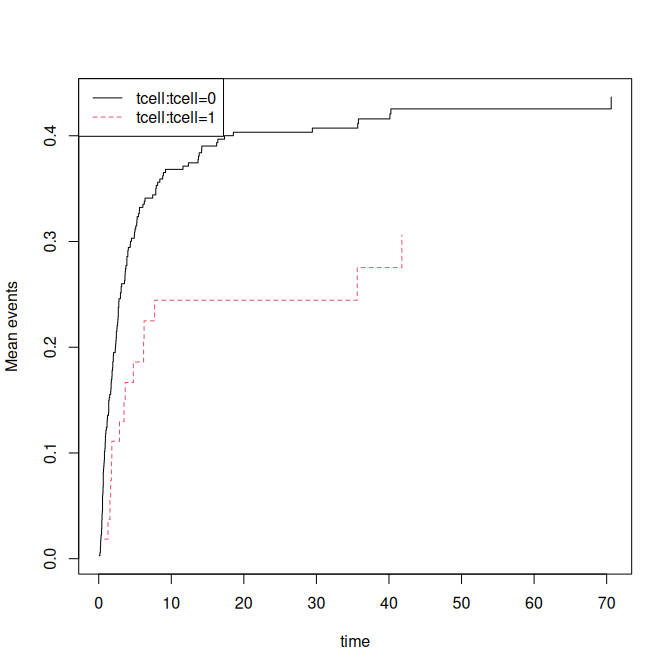

<!-- DO NOT EDIT: auto-generated from the .Rmd.orig source -->


Influence functions are available from many models in the mets package. We here illustrate some of these models and how to get the 
influence functions. 

Examples 
==========


``` r
 data(bmt)
 bmt$time <- bmt$time+runif(408)*.001
 bmt$id <- sample(200,408,replace=TRUE)
 dfactor(bmt) <- cause1f~cause
 drelevel(bmt,ref=3) <- cause3f~cause
 dlevels(bmt)
#> cause1f #levels=:3 
#> [1] "0" "1" "2"
#> -----------------------------------------
#> cause3f #levels=:3 
#> [1] "2" "0" "1"
#> -----------------------------------------
### sum(duplicated(bmt$time[bmt$cause %in% c(1,2)]))
### sum(duplicated(bmt$time[bmt$cause %in% c(0,1,2)]))

 data(hfactioncpx12)
 hf <- hfactioncpx12
 head(hf)
#>   id      entry       time status trt treatment Count1
#> 1  1 0.00000000 0.60506502      1   0         0      0
#> 2  1 0.60506502 1.04859685      0   0         0      1
#> 3  2 0.00000000 0.06297057      1   0         0      0
#> 4  2 0.06297057 0.35865845      1   0         0      1
#> 5  2 0.35865845 0.39698836      1   0         0      2
#> 6  2 0.39698836 3.83299110      0   0         0      3
 hf <- tie_breaker(hf,status="status",cause=1:2)
 hf$x <- as.numeric(hf$treatment)
 hf$z <- rnorm(741)[hf$id]
 dd <- data.frame(treatment=levels(hf$treatment),id=1)
 sum(duplicated(hf$time[hf$status %in% c(1,2)]))
#> [1] 0
 sum(duplicated(hf$time[hf$status %in% c(0,1,2)]))
#> [1] 143

 ## also break ties for censorings
 hf <- tie_breaker(hf,status="status",cause=0:2,cens.code=9)
#> 143 tied event time(s) found and perturbed.
 sum(duplicated(hf$time[hf$status %in% c(0,1,2)]))
#> [1] 0
```

Cox-phreg 


``` r
 ph1 <- phreg(Event(time,cause==1)~tcell+platelet+age+cluster(id),bmt)
 summary(ph1)
#> 
#>    n events
#>  408    161
#> coefficients:
#>           Estimate      S.E.   dU^-1/2 P-value
#> tcell    -0.651354  0.268584  0.276341  0.0153
#> platelet -0.520161  0.178522  0.187210  0.0036
#> age       0.408419  0.078885  0.089033  0.0000
#> 
#> exp(coefficients):
#>          Estimate    2.5%  97.5%
#> tcell     0.52134 0.30796 0.8826
#> platelet  0.59442 0.41893 0.8434
#> age       1.50444 1.28892 1.7560
 head(iid(ph1))
#>          tcell     platelet           age
#> 1 -0.016410612  0.023967277  0.0050722607
#> 2 -0.004030321 -0.005562855 -0.0000197646
#> 3 -0.004218559 -0.003378683  0.0034059370
#> 4  0.002657762  0.005779877  0.0026003198
#> 5 -0.004044643 -0.007314081  0.0038329133
#> 7  0.008015630 -0.003984185 -0.0180241722
 head(iid(ph1,time=50,all=TRUE))
#>          tcell     platelet           age      strata0
#> 1 -0.016410612  0.023967277  0.0050722607  0.001359711
#> 2 -0.004030321 -0.005562855 -0.0000197646  0.004190000
#> 3 -0.004218559 -0.003378683  0.0034059370  0.002802192
#> 4  0.002657762  0.005779877  0.0026003198 -0.005613391
#> 5 -0.004044643 -0.007314081  0.0038329133  0.003466361
#> 7  0.008015630 -0.003984185 -0.0180241722  0.007069134
 head(iid(ph1,time=50))
#>        strata0
#> 1  0.001359711
#> 2  0.004190000
#> 3  0.002802192
#> 4 -0.005613391
#> 5  0.003466361
#> 7  0.007069134
 ###
 e1 <- estimate(ph1,time=50,all=TRUE)
 head(iid(e1))
#>          tcell     platelet           age      strata0
#> 1 -0.016410612  0.023967277  0.0050722607  0.001359711
#> 2 -0.004030321 -0.005562855 -0.0000197646  0.004190000
#> 3 -0.004218559 -0.003378683  0.0034059370  0.002802192
#> 4  0.002657762  0.005779877  0.0026003198 -0.005613391
#> 5 -0.004044643 -0.007314081  0.0038329133  0.003466361
#> 7  0.008015630 -0.003984185 -0.0180241722  0.007069134

 ph1 <- phreg(Event(time,cause==1)~strata(tcell)+platelet+age+cluster(id),bmt)
 summary(ph1)
#> 
#>    n events
#>  408    161
#> coefficients:
#>           Estimate      S.E.   dU^-1/2 P-value
#> platelet -0.521081  0.178564  0.187372  0.0035
#> age       0.406074  0.078151  0.089042  0.0000
#> 
#> exp(coefficients):
#>          Estimate    2.5%  97.5%
#> platelet  0.59388 0.41851 0.8427
#> age       1.50091 1.28776 1.7494
 head(iid(ph1))
#>       platelet           age
#> 1  0.024091482  5.016557e-03
#> 2 -0.005574936 -2.205532e-05
#> 3 -0.003362146  3.462115e-03
#> 4  0.005716517  2.543445e-03
#> 5 -0.007376650  3.904857e-03
#> 7 -0.004218218 -1.795342e-02
 head(iid(ph1,time=50,all=TRUE))
#>       platelet           age      strata0       strata1
#> 1  0.024091482  5.016557e-03  0.001230443 -0.0059880801
#> 2 -0.005574936 -2.205532e-05  0.004118792  0.0010408948
#> 3 -0.003362146  3.462115e-03  0.002867690 -0.0004244779
#> 4  0.005716517  2.543445e-03 -0.005387998 -0.0018305402
#> 5 -0.007376650  3.904857e-03  0.003492137  0.0001862154
#> 7 -0.004218218 -1.795342e-02  0.007352887  0.0062181394
 head(iid(ph1,time=50))
#>        strata0       strata1
#> 1  0.001230443 -0.0059880801
#> 2  0.004118792  0.0010408948
#> 3  0.002867690 -0.0004244779
#> 4 -0.005387998 -0.0018305402
#> 5  0.003492137  0.0001862154
#> 7  0.007352887  0.0062181394
 ###
 e1 <- estimate(ph1,time=50,all=TRUE)
 head(iid(e1))
#>       platelet           age      strata0       strata1
#> 1  0.024091482  5.016557e-03  0.001230443 -0.0059880801
#> 2 -0.005574936 -2.205532e-05  0.004118792  0.0010408948
#> 3 -0.003362146  3.462115e-03  0.002867690 -0.0004244779
#> 4  0.005716517  2.543445e-03 -0.005387998 -0.0018305402
#> 5 -0.007376650  3.904857e-03  0.003492137  0.0001862154
#> 7 -0.004218218 -1.795342e-02  0.007352887  0.0062181394
```

Fine-Gray 


``` r
 ph1 <- cifregFG(Event(time,cause)~tcell+platelet+age+cluster(id),bmt)
 summary(ph1)
#> 
#>    n events
#>  408    161
#> 
#>  176 clusters
#> coefficients:
#>           Estimate      S.E.   dU^-1/2 P-value
#> tcell    -0.596517  0.257018  0.275783  0.0203
#> platelet -0.426121  0.181361  0.187720  0.0188
#> age       0.343809  0.076352  0.086284  0.0000
#> 
#> exp(coefficients):
#>          Estimate    2.5%  97.5%
#> tcell     0.55073 0.33278 0.9114
#> platelet  0.65304 0.45768 0.9318
#> age       1.41031 1.21429 1.6380
 head(iid(ph1))
#>          tcell      platelet          age
#> 1 -0.017036160  0.0238899117  0.005775963
#> 2  0.007240020  0.0005877234 -0.012275504
#> 3 -0.004347561 -0.0033747109  0.003580556
#> 4  0.002258940  0.0048972378  0.002217462
#> 5 -0.002758108 -0.0102290904  0.004868174
#> 7  0.005436991 -0.0057776866 -0.016675341
 head(iid(ph1,time=50,all=TRUE))
#>          tcell      platelet          age       strata0
#> 1 -0.017036160  0.0238899117  0.005775963  0.0018552048
#> 2  0.007240020  0.0005877234 -0.012275504 -0.0005152881
#> 3 -0.004347561 -0.0033747109  0.003580556  0.0025082311
#> 4  0.002258940  0.0048972378  0.002217462 -0.0036377236
#> 5 -0.002758108 -0.0102290904  0.004868174  0.0025801464
#> 7  0.005436991 -0.0057776866 -0.016675341  0.0055432927
 head(iid(ph1,time=50))
#>         strata0
#> 1  0.0018552048
#> 2 -0.0005152881
#> 3  0.0025082311
#> 4 -0.0036377236
#> 5  0.0025801464
#> 7  0.0055432927
 ###
 e1 <- estimate(ph1,time=50,all=TRUE)
 head(iid(e1))
#>          tcell      platelet          age       strata0
#> 1 -0.017036160  0.0238899117  0.005775963  0.0018552048
#> 2  0.007240020  0.0005877234 -0.012275504 -0.0005152881
#> 3 -0.004347561 -0.0033747109  0.003580556  0.0025082311
#> 4  0.002258940  0.0048972378  0.002217462 -0.0036377236
#> 5 -0.002758108 -0.0102290904  0.004868174  0.0025801464
#> 7  0.005436991 -0.0057776866 -0.016675341  0.0055432927

 ph1 <- cifregFG(Event(time,cause==1)~strata(tcell)+platelet+age+cluster(id),bmt)
 summary(ph1)
#> 
#>    n events
#>  408    161
#> 
#>  176 clusters
#> coefficients:
#>           Estimate      S.E.   dU^-1/2 P-value
#> platelet -0.521081  0.178564  0.187372  0.0035
#> age       0.406074  0.078151  0.089042  0.0000
#> 
#> exp(coefficients):
#>          Estimate    2.5%  97.5%
#> platelet  0.59388 0.41851 0.8427
#> age       1.50091 1.28776 1.7494
 head(iid(ph1))
#>       platelet           age
#> 1  0.024091482  5.016557e-03
#> 2 -0.005574936 -2.205532e-05
#> 3 -0.003362146  3.462115e-03
#> 4  0.005716517  2.543445e-03
#> 5 -0.007376650  3.904857e-03
#> 7 -0.004218218 -1.795342e-02
 head(iid(ph1,time=50,all=TRUE))
#>       platelet           age      strata0       strata1
#> 1  0.024091482  5.016557e-03  0.001230443 -0.0059880801
#> 2 -0.005574936 -2.205532e-05  0.004118792  0.0010408948
#> 3 -0.003362146  3.462115e-03  0.002867690 -0.0004244779
#> 4  0.005716517  2.543445e-03 -0.005387998 -0.0018305402
#> 5 -0.007376650  3.904857e-03  0.003492137  0.0001862154
#> 7 -0.004218218 -1.795342e-02  0.007352887  0.0062181394
 head(iid(ph1,time=50))
#>        strata0       strata1
#> 1  0.001230443 -0.0059880801
#> 2  0.004118792  0.0010408948
#> 3  0.002867690 -0.0004244779
#> 4 -0.005387998 -0.0018305402
#> 5  0.003492137  0.0001862154
#> 7  0.007352887  0.0062181394
 ###
 e1 <- estimate(ph1,time=50,all=TRUE)
 head(iid(e1))
#>       platelet           age      strata0       strata1
#> 1  0.024091482  5.016557e-03  0.001230443 -0.0059880801
#> 2 -0.005574936 -2.205532e-05  0.004118792  0.0010408948
#> 3 -0.003362146  3.462115e-03  0.002867690 -0.0004244779
#> 4  0.005716517  2.543445e-03 -0.005387998 -0.0018305402
#> 5 -0.007376650  3.904857e-03  0.003492137  0.0001862154
#> 7 -0.004218218 -1.795342e-02  0.007352887  0.0062181394
```

Ghosh-Lin


``` r
 gl <- recreg(Event(entry,time,status)~treatment+z+cluster(id),data=hf,cause=1,death.code=2)
 summary(gl)
#> 
#>     n events
#>  2132   1391
#> 
#>  741 clusters
#> coefficients:
#>              Estimate       S.E.    dU^-1/2 P-value
#> treatment1 -0.1106157  0.0787428  0.0537864  0.1601
#> z          -0.0055977  0.0435059  0.0282658  0.8976
#> 
#> exp(coefficients):
#>            Estimate    2.5%  97.5%
#> treatment1  0.89528 0.76725 1.0447
#> z           0.99442 0.91314 1.0829
 head(iid(gl))
#>      treatment1             z
#> 1 -1.230293e-04 -3.571233e-05
#> 2 -6.099461e-04 -2.566923e-04
#> 3  2.996264e-03  2.185131e-03
#> 4  1.282697e-03 -4.526232e-04
#> 5  5.484381e-05  1.681245e-05
#> 6  2.288358e-03  1.110322e-03
 head(iid(gl,time=50,all=TRUE))
#>      treatment1             z       strata0
#> 1 -1.230293e-04 -3.571233e-05  0.0003866828
#> 2 -6.099461e-04 -2.566923e-04 -0.0007641645
#> 3  2.996264e-03  2.185131e-03 -0.0003970638
#> 4  1.282697e-03 -4.526232e-04 -0.0038724341
#> 5  5.484381e-05  1.681245e-05 -0.0001220190
#> 6  2.288358e-03  1.110322e-03 -0.0041926534
 head(iid(gl,time=50))
#>         strata0
#> 1  0.0003866828
#> 2 -0.0007641645
#> 3 -0.0003970638
#> 4 -0.0038724341
#> 5 -0.0001220190
#> 6 -0.0041926534
 ###
 e1 <- estimate(gl,time=50,all=TRUE)
 head(iid(e1))
#>      treatment1             z       strata0
#> 1 -1.230293e-04 -3.571233e-05  0.0003866828
#> 2 -6.099461e-04 -2.566923e-04 -0.0007641645
#> 3  2.996264e-03  2.185131e-03 -0.0003970638
#> 4  1.282697e-03 -4.526232e-04 -0.0038724341
#> 5  5.484381e-05  1.681245e-05 -0.0001220190
#> 6  2.288358e-03  1.110322e-03 -0.0041926534

 gls <- recreg(Event(entry,time,status)~strata(treatment)+z+cluster(id),data=hf,cause=1,death.code=2)
 summary(gls)
#> 
#>     n events
#>  2132   1391
#> 
#>  741 clusters
#> coefficients:
#>    Estimate      S.E.   dU^-1/2 P-value
#> z -0.005712  0.043420  0.028251  0.8953
#> 
#> exp(coefficients):
#>   Estimate    2.5%  97.5%
#> z  0.99430 0.91319 1.0826
 head(iid(gls))
#>               z
#> 1 -3.760111e-05
#> 2 -2.496108e-04
#> 3  2.220970e-03
#> 4 -4.554302e-04
#> 5  1.765966e-05
#> 6  1.170154e-03
 head(iid(gls,time=50,all=TRUE))
#>               z       strata0       strata1
#> 1 -3.760111e-05  0.0004742957 -9.890602e-07
#> 2 -2.496108e-04 -0.0029322907 -6.565768e-06
#> 3  2.220970e-03 -0.0001019878  7.011619e-03
#> 4 -4.554302e-04 -0.0044023409 -1.197964e-05
#> 5  1.765966e-05 -0.0001089951  4.645200e-07
#> 6  1.170154e-03 -0.0035212591  3.077975e-05
 head(iid(gls,time=50))
#>         strata0       strata1
#> 1  0.0004742957 -9.890602e-07
#> 2 -0.0029322907 -6.565768e-06
#> 3 -0.0001019878  7.011619e-03
#> 4 -0.0044023409 -1.197964e-05
#> 5 -0.0001089951  4.645200e-07
#> 6 -0.0035212591  3.077975e-05
 ###
 e1 <- estimate(gls,time=50,all=TRUE)
 head(iid(e1))
#>               z       strata0       strata1
#> 1 -3.760111e-05  0.0004742957 -9.890602e-07
#> 2 -2.496108e-04 -0.0029322907 -6.565768e-06
#> 3  2.220970e-03 -0.0001019878  7.011619e-03
#> 4 -4.554302e-04 -0.0044023409 -1.197964e-05
#> 5  1.765966e-05 -0.0001089951  4.645200e-07
#> 6  1.170154e-03 -0.0035212591  3.077975e-05

 gls <- recreg(Event(entry,time,status)~strata(treatment)+cluster(id),data=hf,cause=1,death.code=2)
 summary(gls)
#> 
#>     n events
#>  2132   1391
 head(iid(gls))
#> Error in `IC.recreg()`:
#> ! supply 'time' argument
 head(iid(gls,time=50,all=TRUE))
#>         strata0     strata1
#> 1  0.0004826020 0.000000000
#> 2 -0.0029119802 0.000000000
#> 3  0.0000000000 0.006881006
#> 4 -0.0044466374 0.000000000
#> 5 -0.0001078009 0.000000000
#> 6 -0.0034098234 0.000000000
 head(iid(gls,time=50))
#>         strata0     strata1
#> 1  0.0004826020 0.000000000
#> 2 -0.0029119802 0.000000000
#> 3  0.0000000000 0.006881006
#> 4 -0.0044466374 0.000000000
#> 5 -0.0001078009 0.000000000
#> 6 -0.0034098234 0.000000000
 ###
 e1 <- estimate(gls,time=50,all=TRUE)
 head(iid(e1))
#>         strata0     strata1
#> 1  0.0004826020 0.000000000
#> 2 -0.0029119802 0.000000000
#> 3  0.0000000000 0.006881006
#> 4 -0.0044466374 0.000000000
#> 5 -0.0001078009 0.000000000
#> 6 -0.0034098234 0.000000000
 e1
#>         Estimate Std.Err  2.5% 97.5%   P-value
#> strata0    2.682  0.1544 2.379 2.985 1.399e-67
#> strata1    2.313  0.1497 2.019 2.606 7.910e-54

 ############# Marginal mean recurrent/cif
 ms <- recurrent_marginal(Event(entry,time,status)~strata(treatment)+
			  cluster(id),data=hf,cause=1,death.code=2)
 head(iid(ms,time=50))
#>         strata0     strata1
#> 1  5.822025e-04 0.000000000
#> 2 -3.032866e-03 0.000000000
#> 3  0.000000e+00 0.006979682
#> 4 -4.441553e-03 0.000000000
#> 5 -8.948593e-05 0.000000000
#> 6 -3.704212e-03 0.000000000
 ###
 e1 <- estimate(ms,time=50,all=TRUE)
 head(iid(e1))
#>              p1          p2
#> 1  5.822025e-04 0.000000000
#> 2 -3.032866e-03 0.000000000
#> 3  0.000000e+00 0.006979682
#> 4 -4.441553e-03 0.000000000
#> 5 -8.948593e-05 0.000000000
#> 6 -3.704212e-03 0.000000000
 e1
#>    Estimate Std.Err  2.5% 97.5%   P-value
#> p1    2.682  0.1545 2.379 2.984 1.808e-67
#> p2    2.313  0.1496 2.020 2.607 6.405e-54

 ms <- recurrent_marginal(Event(time,cause)~strata(tcell)+
			  cluster(id),data=bmt,cause=1,death.code=1:2)
 plot(ms)
```



``` r
 head(iid(ms,time=50))
#>         strata0 strata1
#> 1  0.0032520335       0
#> 2  0.0004271108       0
#> 3  0.0016410242       0
#> 4 -0.0013288967       0
#> 5  0.0004378108       0
#> 7  0.0013722374       0
 ###
 e1 <- estimate(ms,time=50,all=TRUE)
 head(iid(e1))
#>              p1 p2
#> 1  0.0032520335  0
#> 2  0.0004271108  0
#> 3  0.0016410242  0
#> 4 -0.0013288967  0
#> 5  0.0004378108  0
#> 7  0.0013722374  0
 e1
#>    Estimate Std.Err   2.5%  97.5%   P-value
#> p1   0.4254 0.05220 0.3231 0.5277 3.649e-16
#> p2   0.3062 0.04419 0.2196 0.3928 4.247e-12
 summary(ms,time=50)
#> [[1]]
#>     new.time      mean         se   CI-2.5%  CI-97.5% strata
#> 146       50 0.4254253 0.02694806 0.3757551 0.4816612      0
#> 
#> [[2]]
#>    new.time      mean         se   CI-2.5%  CI-97.5% strata
#> 16       50 0.3061988 0.06459731 0.2025021 0.4629962      1
```
 
 Cumulative incidence 


``` r
 cif1 <- cif(Event(time,cause)~strata(tcell)+cluster(id),data=bmt,cause=1)
 class(cif1)
#> [1] "recurrent" "recurrent"
 plot(cif1,se=1,ylim=c(0,1))
 summary(cif1,time=50)
#> [[1]]
#>     new.time      mean         se   CI-2.5%  CI-97.5% strata
#> 146       50 0.4254253 0.02694806 0.3757551 0.4816612      0
#> 
#> [[2]]
#>    new.time      mean         se   CI-2.5%  CI-97.5% strata
#> 16       50 0.3061988 0.06459731 0.2025021 0.4629962      1
 head(iid(cif1,time=50))
#>         strata0 strata1
#> 1  0.0032520335       0
#> 2  0.0004271108       0
#> 3  0.0016410242       0
#> 4 -0.0013288967       0
#> 5  0.0004378108       0
#> 7  0.0013722374       0
 ###
 e1 <- estimate(cif1,time=50,all=TRUE)
 head(iid(e1))
#>              p1 p2
#> 1  0.0032520335  0
#> 2  0.0004271108  0
#> 3  0.0016410242  0
#> 4 -0.0013288967  0
#> 5  0.0004378108  0
#> 7  0.0013722374  0
 e1
#>    Estimate Std.Err   2.5%  97.5%   P-value
#> p1   0.4254 0.05220 0.3231 0.5277 3.649e-16
#> p2   0.3062 0.04419 0.2196 0.3928 4.247e-12
 ###
 plot(ms,add=TRUE,se=1)
```


``` r

 cif1 <- cif(Event(time,cause)~strata(tcell),data=bmt,cause=1)
 summary(cif1,time=50)
#> [[1]]
#>     new.time      mean         se   CI-2.5%  CI-97.5% strata
#> 146       50 0.4254253 0.02729043 0.3751629 0.4824215      0
#> 
#> [[2]]
#>    new.time      mean         se   CI-2.5%  CI-97.5% strata
#> 16       50 0.3061988 0.06841022 0.1976196 0.4744353      1

 library(prodlim)
 cif1 <- prodlim(Hist(time,cause)~tcell,data=bmt)
 ## MG-standard errors 
 summary(cif1,time=50,cause=1)
#>   tcell time cause n.risk n.event n.lost cuminc se.cuminc lower upper
#> 1     0   50     1     64       0      0  0.425    0.0273 0.372 0.479
#> 2     1   50     1      7       0      0  0.306    0.0682 0.173 0.440
```

 binreg 


``` r

 out <- binreg(Event(time,cause)~tcell+platelet,bmt,time=50)
 summary(out)
#>    n events
#>  408    160
#> 
#>  408 clusters
#> coeffients:
#>              Estimate   Std.Err      2.5%     97.5% P-value
#> (Intercept) -0.180320  0.126754 -0.428755  0.068114  0.1549
#> tcell       -0.418194  0.345430 -1.095224  0.258836  0.2260
#> platelet    -0.437677  0.240978 -0.909985  0.034631  0.0693
#> 
#> exp(coeffients):
#>             Estimate    2.5%  97.5%
#> (Intercept)  0.83500 0.65132 1.0705
#> tcell        0.65823 0.33446 1.2954
#> platelet     0.64553 0.40253 1.0352
 head(iid(out))
#>           [,1]        [,2]       [,3]
#> 1 -0.006946444 0.004004277 0.00617707
#> 2 -0.006946444 0.004004277 0.00617707
#> 3 -0.006946444 0.004004277 0.00617707
#> 4 -0.006946444 0.004004277 0.00617707
#> 5 -0.006946444 0.004004277 0.00617707
#> 6 -0.006946444 0.004004277 0.00617707
 ###
 e1 <- estimate(out)
 e1
#>             Estimate Std.Err    2.5%   97.5% P-value
#> (Intercept)  -0.1803  0.1268 -0.4288 0.06811 0.15485
#> tcell        -0.4182  0.3454 -1.0952 0.25884 0.22603
#> platelet     -0.4377  0.2410 -0.9100 0.03463 0.06933

############# binregATE

 dfactor(bmt) <- tcellf~tcell
 out <- binregATE(Event(time,cause)~tcellf+platelet+age,bmt,time=50,
                         treat.model=tcellf~platelet+age)
 summary(out)
#>    n events
#>  408    160
#> 
#>  408 clusters
#> coeffients:
#>              Estimate   Std.Err      2.5%     97.5% P-value
#> (Intercept) -0.198935  0.130987 -0.455664  0.057794  0.1288
#> tcellf1     -0.636947  0.356613 -1.335895  0.062000  0.0741
#> platelet    -0.344922  0.246018 -0.827109  0.137265  0.1609
#> age          0.437245  0.107267  0.227005  0.647485  0.0000
#> 
#> exp(coeffients):
#>             Estimate    2.5%  97.5%
#> (Intercept)  0.81960 0.63403 1.0595
#> tcellf1      0.52890 0.26292 1.0640
#> platelet     0.70828 0.43731 1.1471
#> age          1.54844 1.25484 1.9107
#> 
#> Average Treatment effects (G-formula) :
#>             Estimate    Std.Err       2.5%      97.5% P-value
#> treat0     0.4287606  0.0275128  0.3748366  0.4826846  0.0000
#> treat1     0.2899983  0.0659102  0.1608167  0.4191799  0.0000
#> treat:1-0 -0.1387622  0.0717788 -0.2794460  0.0019216  0.0532
#> 
#> Average Treatment effects (double robust) :
#>            Estimate   Std.Err      2.5%     97.5% P-value
#> treat0     0.428173  0.027614  0.374050  0.482297  0.0000
#> treat1     0.250474  0.064789  0.123491  0.377458  0.0001
#> treat:1-0 -0.177699  0.070144 -0.315179 -0.040220  0.0113
 head(iid(out))
#>         iidriskDR     iidriskDR     iidriskG      iidriskG
#> [1,] -0.001158954 -3.558109e-05 -0.001190668 -0.0001527156
#> [2,] -0.001201019  7.576246e-05 -0.001242366  0.0001091081
#> [3,] -0.001326442  3.358013e-04 -0.001355199  0.0006919595
#> [4,] -0.001320302  3.245950e-04 -0.001350613  0.0006680386
#> [5,] -0.001140701 -9.126999e-05 -0.001164434 -0.0002837793
#> [6,] -0.001398214  4.593220e-04 -0.001404044  0.0009475873
 ###
 e1 <- estimate(out)
 e1
#>           Estimate Std.Err   2.5%  97.5%   P-value
#> G-treat0    0.4288 0.02751 0.3748 0.4827 9.342e-55
#> G-treat1    0.2900 0.06591 0.1608 0.4192 1.083e-05
#> DR-treat0   0.4282 0.02761 0.3741 0.4823 3.187e-54
#> DR-treat1   0.2505 0.06479 0.1235 0.3775 1.106e-04
```

mlogit/cumoddsreg/ordreg


``` r
 mreg <- mlogit(cause1~tcell+platelet+age+cluster(id),bmt)
#> Error in `mlogit()`:
#> ! The response variable must be a factor.
 summary(mreg)
#> Error:
#> ! object 'mreg' not found
 head(iid(mreg))
#> Error:
#> ! object 'mreg' not found
 dim(iid(mreg))
#> Error:
#> ! object 'mreg' not found

 head(predict(mreg,bmt))
#> Error:
#> ! object 'mreg' not found
 head(predict(mreg,bmt,response=FALSE))
#> Error:
#> ! object 'mreg' not found

 mmreg <- cumoddsreg(cause~tcell+platelet+age+cluster(id),bmt)
 summary(mmreg)
#> $baseline
#>    Estimate Std.Err    2.5%  97.5%   P-value
#> p1   0.7707  0.1660  0.4452  1.096 3.455e-06
#> p2  15.5881  0.1761 15.2429 15.933 0.000e+00
#> 
#> $logor
#>    Estimate Std.Err     2.5%   97.5% P-value
#> p1  -0.8830  0.3725 -1.61302 -0.1530 0.01776
#> p2  -0.2371  0.3137 -0.85196  0.3777 0.44966
#> p3   0.2796  0.1525 -0.01934  0.5785 0.06678
#> 
#> $or
#>     Estimate      2.5%     97.5%
#> p1 0.4135423 0.1992854 0.8581523
#> p2 0.7888793 0.4265789 1.4588872
#> p3 1.3225835 0.9808434 1.7833909
 estimate(mmreg)
#>    Estimate Std.Err     2.5%   97.5%   P-value
#> p1   0.7707  0.1660  0.44525  1.0961 3.455e-06
#> p2  15.5881  0.1591 15.27614 15.9000 0.000e+00
#> p3  -0.8830  0.3725 -1.61302 -0.1530 1.776e-02
#> p4  -0.2371  0.3137 -0.85196  0.3777 4.497e-01
#> p5   0.2796  0.1525 -0.01934  0.5785 6.678e-02
 head(iid(mmreg))
#>           [,1]         [,2]          [,3]         [,4]         [,5]
#> 1 -0.007316928 -0.004752181  0.0203115768 -0.020831855 -0.009343062
#> 2  0.009905972  0.003630246 -0.0179489458 -0.003011482  0.026604022
#> 3 -0.006235159 -0.006096573  0.0062863884  0.004188332 -0.005627183
#> 4  0.000000000  0.000000000  0.0000000000  0.000000000  0.000000000
#> 5 -0.003311598 -0.022914606 -0.0077831480  0.037779829 -0.018196189
#> 7 -0.015132166 -0.009257456 -0.0006797038  0.017455926  0.021700138
 dim(iid(mmreg))
#> [1] 176   5
 mmreg$ploglik
#> [1] -155.7988

 library(lava)
 or <- ordreg(cause ~ tcell+platelet+age,bmt,family=binomial(logit)) 
 head(iid(or))
#>                                    tcell     platelet           age
#> 1 -0.006894447 -0.004041466 -0.006128506 -0.007554247  0.0004011368
#> 2 -0.006644534 -0.003711172 -0.007426401 -0.006858489  0.0036114073
#> 3 -0.006164955 -0.003119347 -0.009569669 -0.005619761  0.0090349103
#> 4 -0.006183237 -0.003140944 -0.009495939 -0.005664770  0.0088450762
#> 5 -0.007032935 -0.004231371 -0.005352427 -0.007955581 -0.0014984436
#> 6 -0.005974851 -0.002899117 -0.010300426 -0.005161717  0.0109326740
 e1 <- estimate(or,id=bmt$id)
 head(iid(e1))
#>              0|1           1|2        tcell     platelet          age
#> 60  -0.003043554 -0.0046651268  0.048620590  0.008315056 -0.003775529
#> 160 -0.009601965  0.0005465257 -0.007074794 -0.007787786  0.004310454
#> 198  0.012433071 -0.0115235866  0.060234627 -0.022638173  0.009238502
#> 181 -0.004501933 -0.0020168466 -0.052484560 -0.013604610  0.015813852
#> 12  -0.026008931 -0.0106991010 -0.006129952 -0.029952035 -0.027410979
#> 2   -0.010363139  0.0012820765 -0.010824427 -0.007368487  0.011747982
 e1
#>          Estimate Std.Err     2.5%    97.5%   P-value
#> 0|1       -0.5172 0.11528 -0.74312 -0.29122 7.253e-06
#> 1|2        0.5778 0.07082  0.43902  0.71664 3.381e-16
#> tcell      0.2003 0.33164 -0.44966  0.85034 5.458e-01
#> platelet  -0.3624 0.21099 -0.77597  0.05111 8.585e-02
#> age        0.2615 0.12000  0.02627  0.49665 2.934e-02

 mmreg <- cumoddsreg(cause1f~tcell+platelet+age,bmt)
 head(iid(mmreg))
#>             [,1]       [,2]         [,3]         [,4]          [,5]
#> [1,] 0.006894058 0.01555460 -0.006128464 -0.007553989  0.0004011703
#> [2,] 0.006644190 0.01459695 -0.007426362 -0.006858282  0.0036114117
#> [3,] 0.006164689 0.01284924 -0.009569636 -0.005619644  0.0090348644
#> [4,] 0.006182969 0.01291380 -0.009495905 -0.005664650  0.0088450321
#> [5,] 0.007032521 0.01610000 -0.005352383 -0.007955292 -0.0014983929
#> [6,] 0.005974614 0.01218723 -0.010300394 -0.005161632  0.0109326101
 e1 <- estimate(mmreg)
 e1
#>          Estimate Std.Err     2.5%    97.5%   P-value
#> time1     -0.5172  0.1158 -0.74410 -0.29024 7.940e-06
#> time2      1.0807  0.1483  0.79011  1.37138 3.142e-13
#> tcell     -0.2003  0.3379 -0.86267  0.46200 5.533e-01
#> platelet   0.3624  0.2225 -0.07369  0.79855 1.034e-01
#> age       -0.2615  0.1116 -0.48017 -0.04276 1.912e-02
 head(iid(e1))
#>            time1      time2        tcell     platelet           age
#> [1,] 0.006894058 0.01555460 -0.006128464 -0.007553989  0.0004011703
#> [2,] 0.006644190 0.01459695 -0.007426362 -0.006858282  0.0036114117
#> [3,] 0.006164689 0.01284924 -0.009569636 -0.005619644  0.0090348644
#> [4,] 0.006182969 0.01291380 -0.009495905 -0.005664650  0.0088450321
#> [5,] 0.007032521 0.01610000 -0.005352383 -0.007955292 -0.0014983929
#> [6,] 0.005974614 0.01218723 -0.010300394 -0.005161632  0.0109326101

 mmreg <- cumoddsreg(cause1f~tcell+platelet+age+cluster(id),bmt)
 e1 <- estimate(mmreg)
 e1
#>          Estimate Std.Err     2.5%    97.5%   P-value
#> time1     -0.5172  0.1153 -0.74312 -0.29122 7.255e-06
#> time2      1.0807  0.1526  0.78167  1.37982 1.416e-12
#> tcell     -0.2003  0.3316 -0.85034  0.44966 5.458e-01
#> platelet   0.3624  0.2110 -0.05111  0.77598 8.585e-02
#> age       -0.2615  0.1200 -0.49665 -0.02628 2.934e-02
 head(iid(e1))
#>          time1        time2         tcell      platelet           age
#> 1  0.006331247 -0.011219643 -4.906693e-03  0.0065004013  0.0027749007
#> 2  0.010363264  0.007615965 -1.082445e-02 -0.0073686388  0.0117479062
#> 3  0.003216602 -0.005895866  9.913367e-05 -0.0011359007  0.0009165154
#> 4 -0.009025042 -0.005050022  2.910716e-03  0.0074715244  0.0019466821
#> 5  0.001553369  0.006393954 -1.162315e-02  0.0261636318 -0.0116346717
#> 7 -0.002716938 -0.004108640  1.031228e-02  0.0007907454 -0.0168994714
```


SessionInfo
============


``` r
sessionInfo()
#> R version 4.5.2 (2025-10-31)
#> Platform: x86_64-pc-linux-gnu
#> Running under: Ubuntu 26.04 LTS
#> 
#> Matrix products: default
#> BLAS:   /usr/lib/x86_64-linux-gnu/blas/libblas.so.3.12.1 
#> LAPACK: /usr/lib/x86_64-linux-gnu/lapack/liblapack.so.3.12.1;  LAPACK version 3.12.0
#> 
#> locale:
#>  [1] LC_CTYPE=en_US.UTF-8       LC_NUMERIC=C              
#>  [3] LC_TIME=en_US.UTF-8        LC_COLLATE=en_US.UTF-8    
#>  [5] LC_MONETARY=en_US.UTF-8    LC_MESSAGES=en_US.UTF-8   
#>  [7] LC_PAPER=en_US.UTF-8       LC_NAME=C                 
#>  [9] LC_ADDRESS=C               LC_TELEPHONE=C            
#> [11] LC_MEASUREMENT=en_US.UTF-8 LC_IDENTIFICATION=C       
#> 
#> time zone: Europe/Copenhagen
#> tzcode source: system (glibc)
#> 
#> attached base packages:
#> [1] stats     graphics  grDevices utils     datasets  methods   base     
#> 
#> other attached packages:
#> [1] lava_1.9.3         prodlim_2026.03.11 timereg_2.0.7      survival_3.8-9    
#> [5] mets_1.3.13        colorout_1.3-3    
#> 
#> loaded via a namespace (and not attached):
#>  [1] vctrs_0.7.3            cli_3.6.6              knitr_1.51            
#>  [4] rlang_1.3.0            xfun_0.60              otel_0.2.0            
#>  [7] data.table_1.18.4      glue_1.8.1             future.apply_1.20.2   
#> [10] listenv_1.0.0          grid_4.5.2             evaluate_1.0.5        
#> [13] lifecycle_1.0.5        yaml_2.3.12            mvtnorm_1.4-2         
#> [16] numDeriv_2016.8-1.1    compiler_4.5.2         codetools_0.2-20      
#> [19] ucminf_1.2.3           Rcpp_1.1.2             future_1.75.0         
#> [22] lattice_0.23-1         digest_0.6.39          pillar_1.11.1         
#> [25] parallelly_1.48.0      parallel_4.5.2         splines_4.5.2         
#> [28] Matrix_1.7-6           tools_4.5.2            RcppArmadillo_15.4.2-1
#> [31] globals_0.19.1
```

