<!-- DO NOT EDIT: auto-generated from the .Rmd.orig source -->


Overview 
========

For recurrent events data it is often of interest to compute basic descriptive
quantities to gain some understanding of the phenomenon being studied.
We demonstrate how to compute:

 * the marginal mean 
   * AUC and logrank test for comparison of marginal means (also for special case with cumulative incidence)
   * efficient marginal mean estimation with fast computation of standard errors
 * the Ghosh-Lin Cox type regression for the marginal mean, possibly with composite outcomes. 
   * efficient regression augmentation of the Ghosh-Lin model
   * clusters can be specified
   * allows a stratified baseline 
 * the variance of a recurrent events process
 * the probability of exceeding k events
 * the two-stage recurrent events random effects model

In addition several tools can be used for simulating recurrent events and
bivariate recurrent events data, also with a possible terminating event: 

 * recurrent events with multiple 
   * event types 
   * Cox type rates 
 * with a terminal event with possibly multiple causes of death
   * Cox type rates 
 * frailty extensions
 * the Ghosh-Lin model when the survival rate is on Cox form.
   * frailty extensions
 * The general illness death model with  Cox models for all hazards. 

\begin{tikzpicture}[
    sharp corners=2pt,
    inner sep=4pt,
    node distance=0.9cm,
    >=latex,
    mynode/.style={draw,minimum height=0.9cm,minimum width=2.6cm}
]

\node[mynode] (healthy) {healthy $(h)$};
\node[mynode, right=of healthy] (e1) {1st event};
\node[mynode, right=of e1] (e2) {2nd event};

% Dots indicating continuation
\node[right=0.6cm of e2] (dots) {$\cdots$};

% Dead
\node[mynode, below=of e1] (dead) {dead $(d)$};

% Arrows along the event chain
\draw[->] (healthy) -- (e1);
\draw[->] (e1) -- (e2);
\draw[->] (e2) -- (dots);

% Arrows to 'dead'
\draw[->] (healthy) -- (dead);
\draw[->] (e1) -- (dead);
\draw[->] (e2) -- (dead);

\end{tikzpicture}


Simulation of recurrent events
==============================

We start by simulating some recurrent events data with two event types having cumulative hazards

 * $\Lambda_1(t)$ (rate among survivors)
 * $\Lambda_2(t)$ (rate among survivors)
 * $\Lambda_D(t)$

 where types 1 and 2 are considered and the terminal event rate is given by
 $\Lambda_D(t)$. The events are independent by default, but a random effects
 structure can also be specified to generate dependence.

 When simulating data, various random effects structures can be imposed to generate dependence:

* Dependence=0: The intensities are independent.

* Dependence=1: One gamma-distributed random effect $Z$. The intensities are
    + $Z \lambda_1(t)$
    + $Z \lambda_2(t)$
    + $Z \lambda_D(t)$

* Dependence=4: One gamma-distributed random effect $Z$. The intensities are
    + $Z \lambda_1(t)$
    + $Z \lambda_2(t)$
    + $\lambda_D(t)$

* Dependence=2: Normally distributed random effects $Z_1,Z_2,Z_d$ with variance (`var.z`) 
  and correlation (`cor.mat`) that can be specified. The intensities are
    + $\exp(Z_1) \lambda_1(t)$
    + $\exp(Z_2) \lambda_2(t)$
    + $\exp(Z_3) \lambda_D(t)$

* Dependence=3: Gamma-distributed random effects $Z_1,Z_2,Z_d$ where the sum structure can be specified via a matrix
   `cor.mat`. We compute $\tilde Z_j = \sum_k  Z_k^{cor.mat(j,k)}$ for $j=1,2,3$.
   The intensities are
    + $\tilde Z_1 \lambda_1(t)$
    + $\tilde Z_2 \lambda_2(t)$
    + $\tilde Z_3 \lambda_D(t)$

We return to how to run the different set-ups later and start by simulating independent processes. 

The key simulation functions are:

 * `sim_recurrent`: simple simulation with one event type and death
 * `sim_recurrentII`: extended version with possibly multiple types of recurrent events (rates can be zero);
   allows Cox-type rates with subject-specific effects
 * `sim_recurrent_list`: lists allowed for multiple event types and causes of death (competing risks);
   allows Cox-type rates with subject-specific effects
 * `sim_recurrent`: simulates from Cox-Cox (marginals) or Ghosh-Lin-Cox models

Data can also be simulated from the Ghosh-Lin model where marginal rates among survivors are on Cox form:

 * `simGLcox` (also `simRecurrentCox`): simulates from the Ghosh-Lin model
   * with frailties, where the survival model for the terminal event is on Cox form
   * simulates data where rates among survivors are on Cox form, with or without frailties

see examples below for specific models. 


Utility functions
=================

Two utility functions worth noting:

 * `tie.breaker`: breaks ties among jump times, which is expected by the functions below.
 * `count_history`: counts the number of previous jumps for each subject, i.e. $N_1(t-)$ and $N_2(t-)$.

Marginal Mean 
=============

We start by estimating the marginal mean $E(N_1(t \wedge D))$ where $D$ is the time of the terminal event.
The marginal mean is the average number of events observed before time $t$.

This is based on a two-rate model for

 * the type 1 events: $E(dN_1(t) | D > t)$
 * the terminal event: $E(dN_d(t) | D > t)$

and is defined as $\mu_1(t)=E(N_1(t))$ 
\begin{align}
   \int_0^t S(u) d R_1(u)	
\end{align}
where $S(t)=P(D \geq t)$ and $dR_1(t) = E(dN_1(t) | D > t)$ 

and can therefore be estimated by a 

 * Kaplan-Meier estimator, $\hat S(u)$ 
 * Nelson-Aalen estimator for $R_1(t)$

\begin{align}
  \hat R_1(t) & =   \sum_i \int_0^t  \frac{1}{Y_\bullet (s)}  dN_{1i}(s)
\end{align}
where $Y_{\bullet}(t)= \sum_i Y_i(t)$ such that the estimator is 
\begin{align}
  \hat \mu_1(t) & =    \int_0^t \hat S(u) d\hat R_1(u),
\end{align}
see Cook & Lawless (1997) and Ghosh & Lin (2000).

The variance can be estimated based on the asymptotic expansion
of $\hat \mu_1(t) - \mu_1(t)$
\begin{align*}
  & \sum_i \int_0^t \frac{S(s)}{\pi(s)} dM_{i1}  - \mu_1(t) \int_0^t  \frac{1}{\pi(s)} dM_i^d +  \int_0^t \frac{\mu_1(s) }{\pi(s)} dM_i^d,
\end{align*}

with mean-zero processes 

 * $M_i^d(t) = N_i^D(t)- \int_0^t Y_i(s) d \Lambda^D(s)$, 
 * $M_{i1}(t) = N_{i1}(t) - \int_0^t Y_{i}(s) dR_1(s)$. 

as described in Ghosh & Lin (2000).


Generating data
==================

We start by generating some data to illustrate the computation of the marginal mean 


``` r
library(mets)
set.seed(1000) # to control output in simulations for p-values below.
```


``` r
 data(CPH_HPN_CRBSI)
 dr <- CPH_HPN_CRBSI$terminal
 base1 <- CPH_HPN_CRBSI$crbsi 
 base4 <- CPH_HPN_CRBSI$mechanical

rr <- sim_recurrent(400,base1,death.cumhaz=dr)
rr$x <- rnorm(nrow(rr)) 
rr$strata <- floor((rr$id-0.01)/100)
dlist(rr,.~id| id %in% c(1,7,9))
#> id: 1
#>      entry  time   status dtime fdeath death start  stop   x        strata
#> 1       0.0  451.1 1      3291  1      0        0.0  451.1 -0.39707 0     
#> 401   451.1  485.6 1      3291  1      0      451.1  485.6 -1.04577 0     
#> 679   485.6 1276.1 1      3291  1      0      485.6 1276.1  0.09424 0     
#> 867  1276.1 1278.8 1      3291  1      0     1276.1 1278.8  2.58113 0     
#> 1019 1278.8 1618.3 1      3291  1      0     1278.8 1618.3  0.00696 0     
#> 1148 1618.3 1752.9 1      3291  1      0     1618.3 1752.9 -0.81183 0     
#> 1256 1752.9 2466.3 1      3291  1      0     1752.9 2466.3 -0.52972 0     
#> 1344 2466.3 2550.8 1      3291  1      0     2466.3 2550.8  0.03179 0     
#> 1411 2550.8 3290.8 0      3291  1      1     2550.8 3290.8 -0.72717 0     
#> ------------------------------------------------------------ 
#> id: 7
#>   entry time  status dtime fdeath death start stop  x       strata
#> 7 0     658.3 0      658.3 1      1     0     658.3 -0.2209 0     
#> ------------------------------------------------------------ 
#> id: 9
#>     entry time  status dtime fdeath death start stop  x      strata
#> 9     0.0 433.5 1      505.3 1      0       0.0 433.5 0.3552 0     
#> 405 433.5 505.3 0      505.3 1      1     433.5 505.3 0.2355 0
```

The status variable keeps track of the recurrent events and their type, and death the timing of 
death.

To compute the marginal mean we simply estimate the two rates functions of the 
number of events of interest and death by using the phreg function 
(to start without covariates). Then the estimates are combined with standard 
error computation in the recurrent_marginal function


``` r
#  to fit non-parametric models with just a baseline 
xr <- phreg(Surv(entry,time,status)~cluster(id),data=rr)
xdr <- phreg(Surv(entry,time,death)~cluster(id),data=rr)
par(mfrow=c(1,3))
plot(xdr,se=TRUE)
title(main="death")
plot(xr,se=TRUE)
# robust standard errors 
rxr <-   robust_phreg(xr,fixbeta=1)
plot(rxr,se=TRUE,robust=TRUE,add=TRUE,col=4)

# marginal mean of expected number of recurrent events 
out <- recurrent_marginal(Event(entry,time,status)~cluster(id),data=rr,cause=1,death.code=2)
plot(out,se=TRUE,ylab="marginal mean",col=2)
```

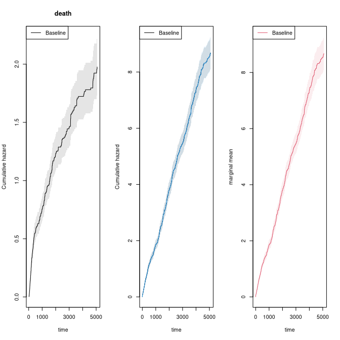

We can also extract the estimate in different time-points 


``` r
summary(out,times=c(1000,2000))
#> [[1]]
#>     new.time     mean         se  CI-2.5% CI-97.5% strata
#> 495     1000 1.857035 0.08767256 1.692911 2.037072      0
#> 779     2000 3.802964 0.14690314 3.525668 4.102068      0
```

The marginal mean can also be estimated in the stratified case:


``` r
xr <- phreg(Surv(entry,time,status)~strata(strata)+cluster(id),data=rr)
xdr <- phreg(Surv(entry,time,death)~strata(strata)+cluster(id),data=rr)
par(mfrow=c(1,3))
plot(xdr,se=TRUE)
title(main="death")
plot(xr,se=TRUE)
rxr <-   robust_phreg(xr,fixbeta=1)
plot(rxr,se=TRUE,robust=TRUE,add=TRUE,col=1:2)

out <- recurrent_marginal(Event(entry,time,status)~strata(strata)+cluster(id),
			 data=rr,cause=1,death.code=2)
plot(out,se=TRUE,ylab="marginal mean",col=1:2)
```

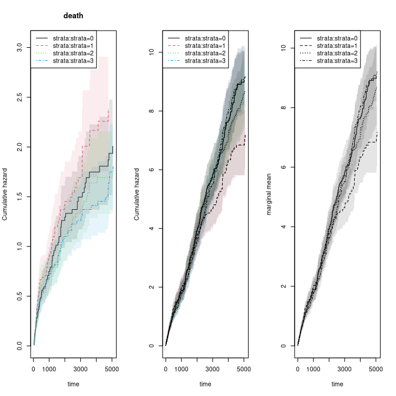

We can compare different marginal mean test (IPCW based) with a log-rank test  


``` r
test_logrankRecurrent(out)
#>    Estimate Std.Err   2.5%  97.5% P-value
#> p1   10.368   14.44 -17.93 38.661 0.47264
#> p2  -22.069   12.43 -46.43  2.288 0.07575
#> p3    2.019   15.72 -28.80 32.838 0.89785
#> ────────────────────────────────────────────────────────────
#> Null Hypothesis: 
#>   [p1] = 0
#>   [p2] = 0
#>   [p3] = 0 
#>  
#> chisq = 3.3471, df = 3, p-value = 0.3411

dd <- test_marginalMean(Event(entry,time,status)~strata(strata)+cluster(id),
			 data=rr,cause=1,death.code=2)
dd
#> coeffients:
#>                              p-value
#> time                       5079.7045
#> Pepe-Mori                         NA
#> Ratio-AUC                     0.2147
#> Proportionality               0.3865
#> Proportionality-score-test    0.3920
summary(dd)
#> coeffients:
#>                              p-value
#> time                       5079.7045
#> Pepe-Mori                         NA
#> Ratio-AUC                     0.2147
#> Proportionality               0.3865
#> Proportionality-score-test    0.3920
dd$RAUCl
#>    n events
#>  400   1184
#> 
#>  400 clusters
#> coeffients:
#>                          Estimate  Std.Err     2.5%    97.5% P-value
#> (Intercept)              24707.72  1498.20 21771.30 27644.15  0.0000
#> factor(strata__)strata=1 -3840.23  2028.83 -7816.67   136.20  0.0584
#> factor(strata__)strata=2 -1015.76  2026.74 -4988.10  2956.57  0.6162
#> factor(strata__)strata=3  -351.09  1948.38 -4169.84  3467.66  0.8570
```

The AUC suggest that strata 2 looses 3840 days less than strata 0. 


If we adjust for covariates for the two rates we can still do
predictions of marginal mean, what can be plotted is the baseline marginal mean, 
that is for the covariates equal to 0 for both models. Predictions for specific 
covariates can also be obtained with the recmarg (recurren marginal mean used 
solely for predictions without standard error computation). 


``` r
# cox case
xr <- phreg(Surv(entry,time,status)~x+cluster(id),data=rr)
xdr <- phreg(Surv(entry,time,death)~x+cluster(id),data=rr)
par(mfrow=c(1,3))
plot(xdr,se=TRUE)
title(main="death")
plot(xr,se=TRUE)
rxr <- robust_phreg(xr)
plot(rxr,se=TRUE,robust=TRUE,add=TRUE,col=1:2)

out <- recurrentMarginalPhreg(xr,xdr)
plot(out,se=TRUE,ylab="marginal mean",col=1:2)
```

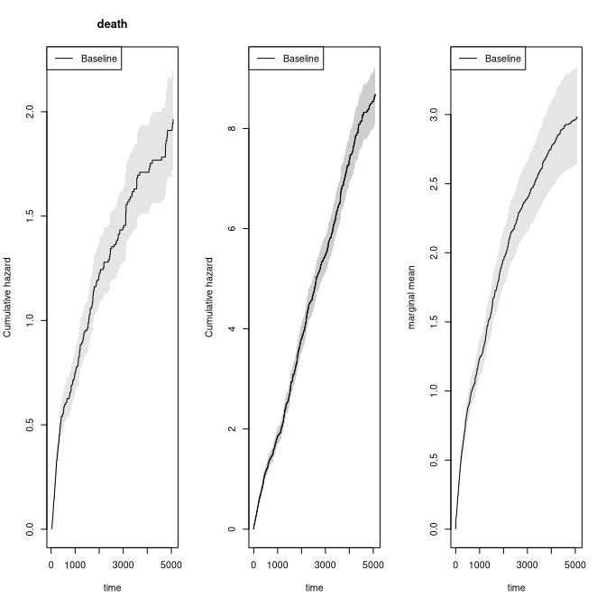

``` r

#### predictions witout se's 
###outX <- recmarg(xr,dr,Xr=1,Xd=1)
###plot(outX,add=TRUE,col=3)
```

We here simulate multiple recurrent events processes with two causes of death causes  and exponential censoring with
rate $3/5000$, all processes are assumed independent (dependence=0)


``` r
rr <- sim_recurrent_list(100,list(base1,base1,base4),death.cumhaz=list(dr,base4),cens=3/5000,dependence=0)
dtable(rr,~status+death,level=2)
#> 
#>      status
#> death   0   1   2   3
#>     0  37 135 165  12
#>     1  54   0   0   0
#>     2   9   0   0   0
mets:::showfitsimList(rr,list(base1,base1,base4),list(dr,base4))
```

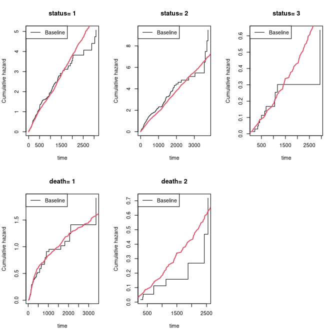

Improving efficiency 
======================

To illustrate how the efficiency can be improved using heterogenity in the data, we
now simulate some data with strong heterogenity. The dynamic augmentation is 
a regression on the history  for each subject consisting of the specified terms 
terms:  Nt, Nt2 (Nt squared), expNt (exp(-Nt)), NtexpNt (Nt*exp(-Nt)) or by simply
specifying these directly.  This was developed in Cortese and Scheike (2022).


``` r
rr <- sim_recurrentII(200,base1,base4,death.cumhaz=dr,cens=3/5000,dependence=4,var.z=1)
rr <-  count_history(rr)

rr <- transform(rr,statusD=status)
rr <- dtransform(rr,statusD=3,death==1)
dtable(rr,~statusD+status+death,level=2,response=1)
#> 
#>       statusD
#> status   0   1   2   3
#>      0  83   0   0 117
#>      1   0 375   0   0
#>      2   0   0  44   0
#> 
#>      statusD
#> death   0   1   2   3
#>     0  83 375  44   0
#>     1   0   0   0 117

##xr <- phreg(Surv(start,stop,status==1)~cluster(id),data=rr)
##dr <- phreg(Surv(start,stop,death)~cluster(id),data=rr)
# marginal mean of expected number of recurrent events 
out <- recurrent_marginal(Event(start,stop,statusD)~cluster(id),data=rr,cause=1,death.code=3)

times <- 500*(1:10)
recEFF1 <- recurrent_marginalAIPCW(Event(start,stop,statusD)~cluster(id),data=rr,times=times,cens.code=0,
				   death.code=3,cause=1,augment.model=~Nt)
with( recEFF1, cbind(times,muP,semuP,muPAt,semuPAt,semuPAt/semuP))
#>       times       muP     semuP     muPAt   semuPAt          
#>  [1,]   500 0.8744004 0.1059068 0.8670372 0.1055614 0.9967382
#>  [2,]  1000 1.2696069 0.1458220 1.2621656 0.1447864 0.9928981
#>  [3,]  1500 1.7921498 0.2291966 1.7957473 0.2240253 0.9774373
#>  [4,]  2000 2.1216192 0.3047378 2.1595208 0.2937613 0.9639804
#>  [5,]  2500 2.4775306 0.3934784 2.5544338 0.3713749 0.9438254
#>  [6,]  3000 2.7947412 0.5183678 2.9101041 0.4625630 0.8923451
#>  [7,]  3500 3.0289847 0.6033927 3.1307552 0.5193403 0.8607004
#>  [8,]  4000 3.3163659 0.7183096 3.3392837 0.5769952 0.8032681
#>  [9,]  4500 3.6229966 0.8415333 3.5349425 0.6152266 0.7310781
#> [10,]  5000 3.8810150 0.9255727 3.6777784 0.6159133 0.6654402

times <- 500*(1:10)
###recEFF14 <- recurrent_marginalAIPCW(Event(start,stop,statusD)~cluster(id),data=rr,times=times,cens.code=0,
###death.code=3,cause=1,augment.model=~Nt+Nt2+expNt+NtexpNt)
###with(recEFF14,cbind(times,muP,semuP,muPAt,semuPAt,semuPAt/semuP))

recEFF14 <- recurrent_marginalAIPCW(Event(start,stop,statusD)~cluster(id),data=rr,times=times,cens.code=0,
death.code=3,cause=1,augment.model=~Nt+I(Nt^2)+I(exp(-Nt))+ I( Nt*exp(-Nt)))
with(recEFF14,cbind(times,muP,semuP,muPAt,semuPAt,semuPAt/semuP))
#>       times       muP     semuP     muPAt   semuPAt          
#>  [1,]   500 0.8744004 0.1059068 0.8666135 0.1054672 0.9958484
#>  [2,]  1000 1.2696069 0.1458220 1.2643398 0.1444958 0.9909053
#>  [3,]  1500 1.7921498 0.2291966 1.8063914 0.2218548 0.9679670
#>  [4,]  2000 2.1216192 0.3047378 2.1433122 0.2888682 0.9479237
#>  [5,]  2500 2.4775306 0.3934784 2.4921659 0.3607250 0.9167593
#>  [6,]  3000 2.7947412 0.5183678 2.6962370 0.4264556 0.8226892
#>  [7,]  3500 3.0289847 0.6033927 2.7724842 0.4558824 0.7555319
#>  [8,]  4000 3.3163659 0.7183096 2.8716708 0.4752409 0.6616101
#>  [9,]  4500 3.6229966 0.8415333 2.9362144 0.4519118 0.5370100
#> [10,]  5000 3.8810150 0.9255727 2.9717225 0.3831618 0.4139726

plot(out,se=TRUE,ylab="marginal mean",col=2)
k <- 1
for (t in times) {
	ci1 <- c(recEFF1$muPAt[k]-1.96*recEFF1$semuPAt[k],
  	         recEFF1$muPAt[k]+1.96*recEFF1$semuPAt[k])
	ci2 <- c(recEFF1$muP[k]-1.96*recEFF1$semuP[k],
  	         recEFF1$muP[k]+1.96*recEFF1$semuP[k])
	lines(rep(t,2)-2,ci2,col=2,lty=1,lwd=2)
	lines(rep(t,2)+2,ci1,col=1,lty=1,lwd=2)
	k <- k+1
}
legend("bottomright",c("Eff-pred"),lty=1,col=c(1,3))
```

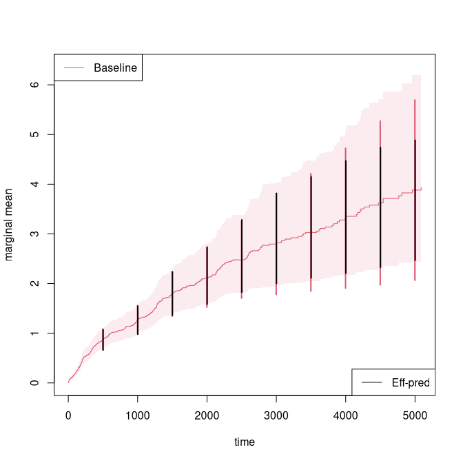

In the case where covariates might be important but we are still interested in the marginal mean 
we can also augment wrt these covariates 


``` r
n <- 200
X <- matrix(rbinom(n*2,1,0.5),n,2)
colnames(X) <- paste("X",1:2,sep="")
###
r1 <- exp( X %*% c(0.3,-0.3))
rd <- exp( X %*% c(0.3,-0.3))
rc <- exp( X %*% c(0,0))
fz <- NULL
rr <- mets:::sim_GLcox(n,base1,dr,var.z=0,r1=r1,rd=rd,rc=rc,fz,model="twostage",cens=3/5000) 
rr <- cbind(rr,X[rr$id+1,])

dtable(rr,~statusD+status+death,level=2,response=1)
#> 
#>       statusD
#> status   0   1   3
#>      0  92   0 108
#>      1   0 529   0
#> 
#>      statusD
#> death   0   1   3
#>     0  92 314   0
#>     1   0 215 108

times <- seq(500,5000,by=500)
recEFF1x <- recurrent_marginalAIPCW(Event(start,stop,statusD)~cluster(id),data=rr,times=times,
				   cens.code=0,death.code=3,cause=1,augment.model=~X1+X2)
with(recEFF1x, cbind(muP,muPA,muPAt,semuP,semuPA,semuPAt,semuPAt/semuP))
#>            muP     muPA    muPAt      semuP     semuPA    semuPAt          
#>  [1,] 1.050317 1.052415 1.048871 0.08835005 0.08801111 0.08789822 0.9948859
#>  [2,] 1.843830 1.863996 1.838716 0.14730045 0.14606950 0.14556961 0.9882496
#>  [3,] 2.714728 2.768829 2.724566 0.24272224 0.23810724 0.23756192 0.9787398
#>  [4,] 3.546522 3.636583 3.591319 0.36401457 0.35109326 0.34874650 0.9580564
#>  [5,] 4.492684 4.658458 4.537357 0.51416355 0.50043401 0.49610099 0.9648700
#>  [6,] 5.080889 5.209681 5.047836 0.60551061 0.58818767 0.58285931 0.9625914
#>  [7,] 5.638012 5.701306 5.495962 0.70065049 0.67382134 0.66728557 0.9523801
#>  [8,] 6.895109 6.830233 6.447130 0.95745240 0.89622952 0.87919085 0.9182606
#>  [9,] 7.723651 6.794796 6.727887 1.15096828 0.99740795 0.96198463 0.8358046
#> [10,] 8.923607 7.170763 7.179372 1.45783461 1.07670415 1.01334938 0.6951059

out <- recurrent_marginal(Event(start,stop,statusD)~cluster(id),data=rr,cause=1,death.code=3)
summary(out,times=times)
#> [[1]]
#>     new.time     mean         se   CI-2.5%  CI-97.5% strata
#> 181      500 1.050317 0.08835005 0.8906755  1.238572      0
#> 279     1000 1.843830 0.14730045 1.5765935  2.156363      0
#> 355     1500 2.714728 0.24272224 2.2783527  3.234684      0
#> 413     2000 3.546522 0.36401457 2.9002498  4.336805      0
#> 462     2500 4.492684 0.51416355 3.5899669  5.622395      0
#> 480     3000 5.080889 0.60551061 4.0225230  6.417723      0
#> 492     3500 5.638012 0.70065049 4.4192133  7.192950      0
#> 514     4000 6.895109 0.95745240 5.2522287  9.051878      0
#> 523     4500 7.723651 1.15096828 5.7673685 10.343501      0
#> 530     5000 8.923607 1.45783461 6.4785990 12.291356      0
```

Regression models for the marginal mean 
========================================

One can also do regression modelling , using the model
\begin{align*}
E(N_1(t) | X) &  = \Lambda_0(t)  \exp(X^T \beta)
\end{align*}
then Ghosh-Lin suggested IPCW score equations that are implemented in the recreg function of mets. 

First we generate data that from a Ghosh-Lin model with regression coefficients 
$\beta=(-0.3,0.3)$ and the baseline given by base1, this is done under the assumption that the death 
rate given covariates is on Cox form with baseline dr: 


``` r
n <- 100
X <- matrix(rbinom(n*2,1,0.5),n,2)
colnames(X) <- paste("X",1:2,sep="")
###
r1 <- exp( X %*% c(0.3,-0.3))
rd <- exp( X %*% c(0.3,-0.3))
rc <- exp( X %*% c(0,0))
fz <- NULL
rr <- mets:::sim_GLcox(n,base1,dr,var.z=1,r1=r1,rd=rd,rc=rc,fz,cens=1/5000,type=2) 
rr <- cbind(rr,X[rr$id+1,])

out  <- recreg(Event(start,stop,statusD)~X1+X2+cluster(id),data=rr,cause=1,death.code=3,cens.code=0)
outs <- recreg(Event(start,stop,statusD)~X1+X2+cluster(id),data=rr,cause=1,death.code=3,cens.code=0,
		cens.model=~strata(X1,X2))
summary(out)$coef
#>       Estimate      S.E.    dU^-1/2   P-value
#> X1  0.39075785 0.3162028 0.10070725 0.2165394
#> X2 -0.09651179 0.3581337 0.09682266 0.7875562
summary(outs)$coef
#>      Estimate      S.E.    dU^-1/2   P-value
#> X1  0.2122279 0.2946370 0.10162550 0.4713386
#> X2 -0.1576775 0.3523691 0.09699948 0.6545299

## checking baseline
par(mfrow=c(1,1))
plot(out)
plot(outs,add=TRUE,col=2)
lines(scalecumhaz(base1,1),col=3,lwd=2)
```

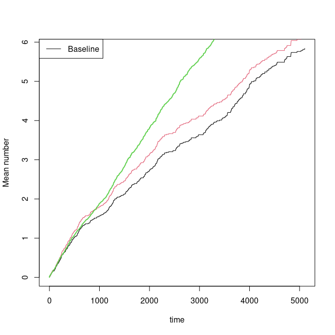

We note that for the extended censoring model we gain a little efficiency and that the estimates are close to the true values. 

Also possible to do IPCW regression at fixed time-point


``` r
outipcw  <- recregIPCW(Event(start,stop,statusD)~X1+X2+cluster(id),data=rr,cause=1,death.code=3,
		cens.code=0,times=2000)
outipcws <- recregIPCW(Event(start,stop,statusD)~X1+X2+cluster(id),data=rr,cause=1,death.code=3,
	    cens.code=0,times=2000,cens.model=~strata(X1,X2))
summary(outipcw)$coef
#>               Estimate   Std.Err       2.5%     97.5%      P-value
#> (Intercept)  1.1590100 0.2775235  0.6150739 1.7029462 2.963428e-05
#> X1           0.2337768 0.2783519 -0.3117830 0.7793365 4.009866e-01
#> X2          -0.2114258 0.2758703 -0.7521217 0.3292701 4.434409e-01
summary(outipcws)$coef
#>               Estimate   Std.Err       2.5%     97.5%      P-value
#> (Intercept)  1.1681460 0.2766323  0.6259567 1.7103353 2.413511e-05
#> X1           0.2312122 0.2785043 -0.3146462 0.7770705 4.064300e-01
#> X2          -0.2321638 0.2747766 -0.7707160 0.3063885 3.981565e-01
```

We can also do the Mao-Lin type composite outcome where we both count the recurrent events (cause 1) and deaths (cause 3)
for example 
\begin{align*}
E(N_1(t) + I(D<t,\epsilon=3) | X) &  = \Lambda_0(t)  \exp(X^T \beta)
\end{align*}


``` r
out  <- recreg(Event(start,stop,statusD)~X1+X2+cluster(id),data=rr,cause=c(1,3),
		death.code=3,cens.code=0)
summary(out)$coef
#>      Estimate      S.E.    dU^-1/2   P-value
#> X1  0.3677911 0.2642911 0.09289221 0.1640393
#> X2 -0.1056515 0.2995438 0.08962337 0.7243074
```

This can also be done with competing risks death 
\begin{align*}
E(w_1 N_1(t) + w_2 I(D<t,\epsilon=3) | X) &  = \Lambda_0(t)  \exp(X^T \beta)
\end{align*}
and with weights  $w_1,w_2$ that follow the causes, here 1 and 3. 
We modify the data by changing some of the cause 3 deaths to cause 4


``` r
rr$binf <- rbinom(nrow(rr),1,0.5) 
rr$statusDC <- rr$statusD
rr <- dtransform(rr,statusDC=4, statusD==3 & binf==0)
rr$weight <- 1
rr <- dtransform(rr,weight=2,statusDC==3)

outC  <- recreg(Event(start,stop,statusDC)~X1+X2+cluster(id),data=rr,cause=c(1,3),
		 death.code=c(3,4),cens.code=0)
summary(outC)$coef
#>       Estimate      S.E.    dU^-1/2   P-value
#> X1  0.40121614 0.2943567 0.09755943 0.1728740
#> X2 -0.09714896 0.3323313 0.09368958 0.7700377

outCW  <- recreg(Event(start,stop,statusDC)~X1+X2+cluster(id),data=rr,cause=c(1,3),
		  death.code=c(3,4),cens.code=0,wcomp=c(1,2))
summary(outCW)$coef
#>       Estimate      S.E.    dU^-1/2   P-value
#> X1  0.41043629 0.2765368 0.09469049 0.1377555
#> X2 -0.09770279 0.3106702 0.09084228 0.7531486

plot(out,ylab="Mean composite")
plot(outC,col=2,add=TRUE)
plot(outCW,col=3,add=TRUE)
```

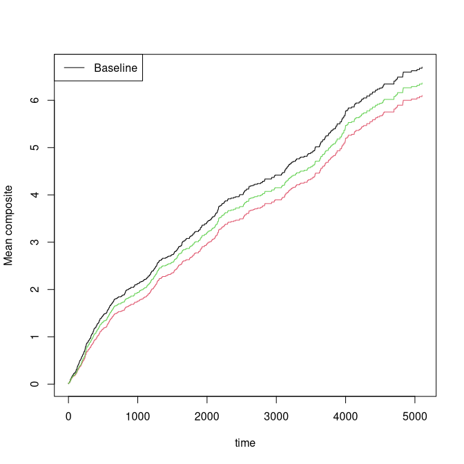

Predictions and standard errors can be computed via the iid decompositions of the baseline and the regression coefficients. We illustrate this
for the standard Ghosh-Lin model 


``` r
out  <- recreg(Event(start,stop,statusD)~X1+X2+cluster(id),data=rr,cause=1,death.code=3,cens.code=0)
summary(out)
#> 
#>    n events
#>  541    441
#> 
#>  100 clusters
#> coefficients:
#>     Estimate      S.E.   dU^-1/2 P-value
#> X1  0.390758  0.316203  0.100707  0.2165
#> X2 -0.096512  0.358134  0.096823  0.7876
#> 
#> exp(coefficients):
#>    Estimate    2.5% 97.5%
#> X1  1.47810 0.79534 2.747
#> X2  0.90800 0.45003 1.832
baseiid <- iidBaseline(out,time=3000)
GLprediid(baseiid,rr[1:5,])
#>          pred    se-log    lower    upper
#> [1,] 3.303778 0.2373066 2.074985 5.260253
#> [2,] 3.303778 0.2373066 2.074985 5.260253
#> [3,] 3.303778 0.2373066 2.074985 5.260253
#> [4,] 4.883316 0.2753957 2.846410 8.377841
#> [5,] 4.883316 0.2753957 2.846410 8.377841
```

The Ghosh-Lin model can be made more efficient by the regression augmentation method.
First computing the augmentation and then in a second step the augmented estimator (Cortese and Scheike (2023)): 


``` r
outA  <- recreg(Event(start,stop,statusD)~X1+X2+cluster(id),data=rr,cause=1,death.code=3,
		 cens.code=0,augment.model=~Nt+X1+X2)
summary(outA)$coef
#>       Estimate      S.E.    dU^-1/2   P-value
#> X1  0.16625713 0.2854224 0.09827540 0.5602333
#> X2 -0.06801445 0.3288907 0.09702398 0.8361664
```

We note that the simple augmentation improves the standard errors as expected. The data was generated assuming independence with
previous number of events so it would suffice to augment only with the covariates. 


Administrative censoring for the Ghosh-Lin model
===============================================

In the case of administative censoring with possible additional random censorering we can fit the Ghosh-Lin model using 
risk-set adjustment for the administrative censorering and IPCW adjustment for the  random cenouring. We illustrate it using 
simulated data from the two-stage model described below. 
The advantage of this procedure is that we do not rely on any modelling assumptions for the administrative censoring that will
often be the important part of the total censoring. 


``` r
library(mets)
rho1 <- 1; rho2 <- 0.5
rate <- c(1,1)
tt <- seq(0, 6, by = 0.01)
base1 <- cbind(tt,rho1 * (1 - exp(-tt/rate[1])))
drcumhaz <- cbind(tt,rho2 * (1 - exp(-tt/rate[2])))
base13 <- cpred(base1,c(1,3))[,2]

dats <- mets:::sim_GLRA(100,base1,drcumhaz,varz=1)
datsA <- dats[[1]]
dtable(datsA,~statusD)
#> 
#> statusD
#>  1  3  7 
#> 88 35 65
datsRA <- dats[[2]]
dtable(datsRA,~statusD)
#> 
#> statusD
#>  0  1  3  7 
#> 23 73 32 45
```

We get two data-sets, one with only administrative censoring datsA 
and one with additional random censoring datsRA. 
 
  - datsA: statusD has events (1) death (3) and administrative censorings at the  time censorA
  - datsRA: statusD has events (1) death (3),  administrative censorings (7) and random censorings (0). The time 
     of the administriative censoring is given by censorA

First we deal only  with the administriative censoring. 


``` r
   ## handling admin censoring with IPCW 
    outRR  <- recreg(Event(start,stop,statusD)~Z1+Z2+cluster(id), datsA, cause = 1, 
		       cens.code = c(7),death.code=3)
    estimate(outRR)
#>    Estimate Std.Err    2.5%  97.5% P-value
#> Z1   0.2244  0.1918 -0.1515 0.6004  0.2420
#> Z2  -0.2565  0.3637 -0.9694 0.4565  0.4808

    ## Full Adm-censoring statusA, timeA
    out0  <- recreg(Event(start,stop,statusD) ~ Z1 + Z2+cluster(id) , datsA, cause = 1, 
		       cens.code = 9, death.code=3, adm.cens.time=datsA$censorA)
    estimate(out0)
#>    Estimate Std.Err    2.5%  97.5% P-value
#> Z1   0.2501  0.1930 -0.1283 0.6284  0.1952
#> Z2  -0.1517  0.3636 -0.8642 0.5609  0.6765
```

The additional random censoring can be handled by combining the two censoring times, or by handling the 
administrative censoring (via risk-set adjustment) and random censoring (via IPCW) separately


``` r
    ## std Right censoring  on combined censoring time 
    outR  <- recreg(Event(start,stop,statusD)~Z1 + Z2+cluster(id) , datsRA, cause = 1, 
		       cens.code = c(0,7),death.code=3)
    estimate(outR)
#>    Estimate Std.Err     2.5%  97.5% P-value
#> Z1   0.3036  0.1724 -0.03434 0.6415 0.07827
#> Z2  -0.2023  0.3457 -0.87997 0.4753 0.55839

    ## Combined R-IPCW + Adm-censoring status, time
    out1  <- recreg(Event(start,stop,statusD) ~ Z1 + Z2+cluster(id) , datsRA, cause = 1, 
		       cens.code = 0, death.code=3, adm.cens.time=datsRA$censorA)
    estimate(out1)
#>    Estimate Std.Err     2.5%  97.5% P-value
#> Z1   0.3284  0.1732 -0.01105 0.6679 0.05794
#> Z2  -0.1040  0.3418 -0.77397 0.5660 0.76105

    ## Combined R-IPCW + Adm-censoring status + censoring modelling time
    out1c  <- recreg(Event(start,stop,statusD) ~ Z1 + Z2+cluster(id) , datsRA, cause = 1, 
		     cens.code = 0, death.code=3, adm.cens.time=datsRA$censorA,cens.model=~strata(Z1,Z2))
     estimate(out1c)
#>    Estimate Std.Err     2.5%  97.5% P-value
#> Z1   0.3468  0.1741  0.00545 0.6881 0.04645
#> Z2  -0.1024  0.3417 -0.77220 0.5674 0.76440
```

We have influence functions of all parameters and can thus also make predictions with confindence intervals

 - this is based on going through a grid of time-points if se=1
   - when se=0 the predictions are done for all jump-times 


``` r
predR0 <- predict(outR,data.frame(Z1=0:1,Z2=0))
plot(predR0,ylim=c(0,1.5))

predR <- predict(outR,data.frame(Z1=0:1,Z2=0),se=1)
plot(predR,se=1,add=TRUE)

pred1c <- predict(out1c,data.frame(Z1=0:1,Z2=0),se=1)
plot(pred1c,se=1,add=TRUE)
```

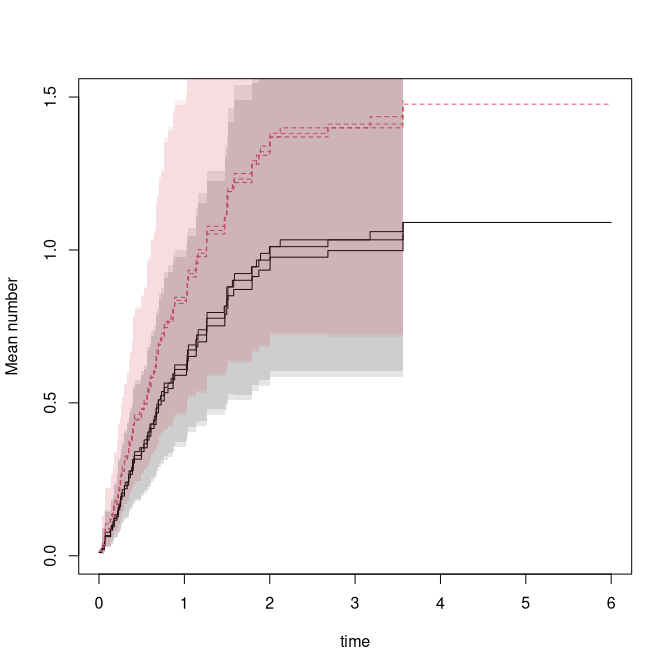

The censoring weights for the random censoring and the combined censoring


``` r
km07 <- km(Event(start,stop,statusD %in% c(0,7))~strata(Z1,Z2),datsRA)
km0 <- km(Event(start,stop,statusD==0)~strata(Z1,Z2),datsRA)
plot(km07,col=1)
plot(km0,add=TRUE,col=2,lwd=2)
```

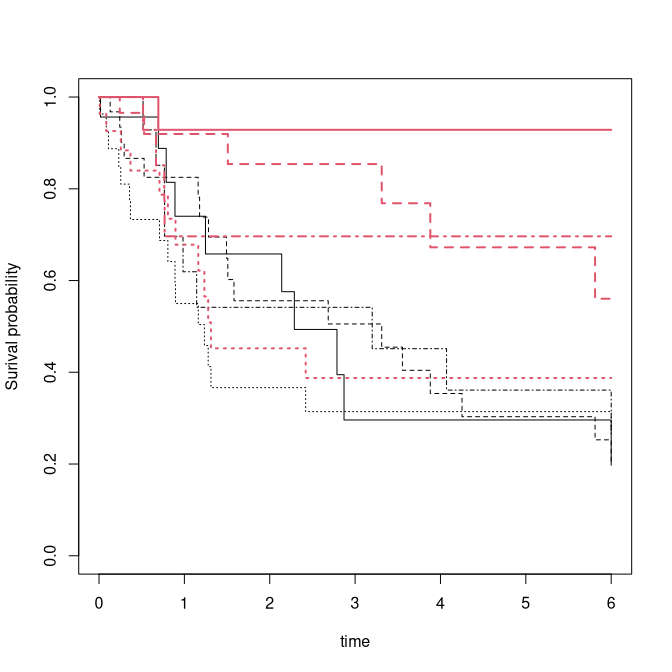


Two-stage modelling 
====================

We simulate data with a terminal event on Cox form and recurrent events
satisfying the Ghosh-Lin model or having a rate on Cox form.

 - type=3 is Ghosh-Lin model for recurrent events and Cox for terminal event.
 - type=2 is Cox model for recurrent events among survivors and Cox for terminal event.
 - simulations based on time-grid to make linear approximations of cumulative hazards

Now we fit the two-stage model (the recreg must be called with twostage=TRUE)


``` r
set.seed(100)
dr <- CPH_HPN_CRBSI$terminal
base1 <- CPH_HPN_CRBSI$crbsi 
n <- 200
X <- matrix(rbinom(n*2,1,0.5),n,2)
colnames(X) <- paste("X",1:2,sep="")
###
r1 <- exp( X %*% c(0.3,-0.3))
rd <- exp( X %*% c(0.3,-0.3))
rc <- exp( X %*% c(0,0))
fz <- NULL
## type=3 is cox-cox and type=2 is Ghosh-Lin/Cox model 
rr <- mets:::sim_GLcox(n,base1,dr,var.z=1,r1=r1,rd=rd,rc=rc,cens=1/5000,type=3) 
dtable(rr,~statusD)
#> 
#> statusD
#>   0   1   3 
#>  55 375 145
rr <- cbind(rr,X[rr$id+1,])
###
out  <- phreg(Event(start,stop,statusD==1)~X1+X2+cluster(id),data=rr)
outs <- phreg(Event(start,stop,statusD==3)~X1+X2+cluster(id),data=rr)
## cox/cox
tsout <- twostageREC(outs,out,data=rr)
summary(tsout)
#> Cox(recurrent)-Cox(terminal) intensity model
#> 
#>  200 clusters
#> coeffients:
#>             Estimate Std.Err    2.5%   97.5% P-value
#> dependence1  1.14651 0.14126 0.86964 1.42339       0
#> 
#> var,shared:
#>             Estimate Std.Err    2.5%   97.5% P-value
#> dependence1  1.14651 0.14126 0.86964 1.42339       0
###
rr <- mets:::sim_GLcox(n,base1,dr,var.z=1,r1=r1,rd=rd,rc=rc,fz,cens=1/5000,type=3,share=0.5) 
rr <- cbind(rr,X[rr$id+1,])
###
out  <- phreg(Event(start,stop,statusD==1)~X1+X2+cluster(id),data=rr)
outs <- phreg(Event(start,stop,statusD==3)~X1+X2+cluster(id),data=rr)
#
tsout <- twostageREC(outs,out,data=rr,model="shared")
summary(tsout)
#> Cox(recurrent)-Cox(terminal) intensity model
#> 
#>  200 clusters
#> coeffients:
#>             Estimate Std.Err    2.5%   97.5% P-value
#> dependence1  1.07333 0.14096 0.79707 1.34960       0
#> share1       0.67344 0.12832 0.42193 0.92495       0
#> 
#> var,shared:
#>             Estimate    2.5%  97.5%
#> dependence1  1.07333 0.79707 1.3496
#> share1       0.67344 0.42193 0.9250
###
rr <- mets:::sim_GLcox(n,base1,dr,var.z=1,r1=r1,rd=rd,rc=rc,fz,cens=1/5000,type=2) 
rr <- cbind(rr,X[rr$id+1,])
outs  <- phreg(Event(start,stop,statusD==3)~X1+X2+cluster(id),data=rr)
outgl  <- recreg(Event(start,stop,statusD)~X1+X2+cluster(id),data=rr,twostage=TRUE,death.code=3)
##
## ghosh-lin/cox
glout <- twostageREC(outs,outgl,data=rr,theta=1)
summary(glout)
#> Ghosh-Lin(recurrent)-Cox(terminal) mean model
#> 
#>  200 clusters
#> coeffients:
#>             Estimate Std.Err    2.5%   97.5% P-value
#> dependence1  1.04401 0.08988 0.86785 1.22017       0
#> 
#> var,shared:
#>             Estimate Std.Err    2.5%   97.5% P-value
#> dependence1  1.04401 0.08988 0.86785 1.22017       0
###
glout <- twostageREC(outs,outgl,data=rr,model="shared",theta=1,nu=0.9)
summary(glout)
#> Ghosh-Lin(recurrent)-Cox(terminal) mean model
#> 
#>  200 clusters
#> coeffients:
#>             Estimate  Std.Err     2.5%    97.5% P-value
#> dependence1 1.192629 0.094129 1.008140 1.377117       0
#> share1      1.643844 0.176676 1.297566 1.990121       0
#> 
#> var,shared:
#>             Estimate   2.5%  97.5%
#> dependence1   1.1926 1.0081 1.3771
#> share1        1.6438 1.2976 1.9901
glout$gradient
#> [1] -1.823718e-08  2.506173e-08
```

Standard errors are computed assuming that the parameters of `out` and `outs` are
both known, and are therefore probably a little too small. A bootstrap could be used to
obtain more reliable standard errors.


Simulations with specific structure
===================================

The function `simGLcox` can simulate data where the recurrent process has a mean on Ghosh-Lin form. The key identity is that
\begin{align*}
E(N_1(t) | X) &  = \Lambda_0(t)  \exp(X^T \beta) = \int_0^t S(t|X,Z) dR(t|X,Z)
\end{align*}
where $Z$ is a possible frailty, so that
\begin{align*}
 R(t|X,Z) & = \frac{Z \Lambda_0(t)  \exp(X^T \beta) }{S(t|X,Z)}
\end{align*}
leads to a Ghosh-Lin model. The survival model can be specified to have Cox form among survivors via
`model="twostage"`; otherwise `model="frailty"` uses a survival model with rate $Z \lambda_d(t) r_d$.
The frailty $Z$ is gamma distributed with a variance that can be specified. Simulations are based on
a piecewise linear approximation of the hazard functions for $S(t|X,Z)$ and $R(t|X,Z)$.


``` r
n <- 100
X <- matrix(rbinom(n*2,1,0.5),n,2)
colnames(X) <- paste("X",1:2,sep="")
###
r1 <- exp( X %*% c(0.3,-0.3))
rd <- exp( X %*% c(0.3,-0.3))
rc <- exp( X %*% c(0,0))
rr <- mets:::sim_GLcox(n,base1,dr,var.z=0,r1=r1,rd=rd,rc=rc,model="twostage",cens=3/5000) 
rr <- cbind(rr,X[rr$id+1,])
```

We can also simulate from models where the terminal event is on Cox form and the rate among survivors is on Cox form. 

 * $E(dN_1 | D>t, X) = \lambda_1(t) r_1$
 * $E(dN_d | D>t, X) = \lambda_d(t) r_d$

underlying these models we have a shared frailty model


``` r
rr <- mets:::sim_GLcox(100,base1,dr,var.z=1,r1=r1,rd=rd,rc=rc,type=3,cens=3/5000) 
rr <- cbind(rr,X[rr$id+1,])
margsurv <- phreg(Surv(start,stop,statusD==3)~X1+X2+cluster(id),rr)
recurrent <- phreg(Surv(start,stop,statusD==1)~X1+X2+cluster(id),rr)
estimate(margsurv)
#>    Estimate Std.Err    2.5%  97.5% P-value
#> X1   0.2535  0.2553 -0.2469 0.7538  0.3208
#> X2  -0.2595  0.2637 -0.7764 0.2574  0.3252
estimate(recurrent)
#>    Estimate Std.Err     2.5%   97.5% P-value
#> X1   0.6675  0.3019  0.07583 1.25921 0.02702
#> X2  -0.4356  0.2637 -0.95247 0.08135 0.09864
par(mfrow=c(1,2)); 
plot(margsurv); lines(dr,col=3); 
plot(recurrent); lines(base1,col=3)
```

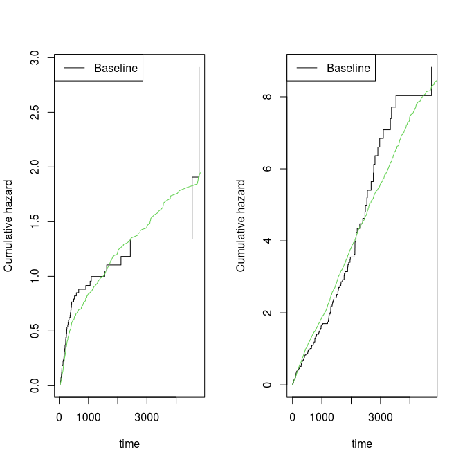

We can also simulate data with underlying dependence from the two-stage model (`simGLcox`) or using
`simRecurrent` random effects models, for Cox-Cox or Ghosh-Lin-Cox models.

Here with marginals on Cox-Cox and Ghosh-Lin-Cox form, drawing covariates from data:


``` r
simcoxcox <- sim_recurrent_ts(recurrent,margsurv,n=10,data=rr)

recurrentGL <- recreg(Event(start,stop,statusD)~X1+X2+cluster(id),rr,death.code=3)
simglcox <- sim_recurrent_ts(recurrentGL,margsurv,n=10,data=rr)
```


Other marginal properties
=========================

The mean is a useful summary measure, but it is also easy and informative to examine other
simple summary measures such as the probability of exceeding $k$ events,

 * $P(N_1^*(t) \ge k)$
   * cumulative incidence of $T_{k} = \inf \{ t: N_1^*(t)=k \}$ with competing event $D$.

This is equivalent to a cumulative incidence of $T_k$ occurring before $D$, denoted $\hat F_k(t)$.

We note also that $N_1^*(t)^2$ can be written as
\begin{align*}
   \sum_{k=0}^K  \int_0^t I(D > s) I(N_1^*(s-)=k) f(k) dN_1^*(s)
\end{align*}
with $f(k)=(k+1)^2 - k^2$, such that its mean can be written as 
\begin{align*}
	\sum_{k=0}^K \int_0^t S(s) f(k) P(N_1^*(s-)= k  | D  \geq s) E( dN_1^*(s)  | N_1^*(s-)=k, D> s) 
\end{align*}
and estimated by
\begin{align*}
\tilde \mu_{1,2}(t) & = 
	\sum_{k=0}^K \int_0^t \hat S(s) f(k) 
	\frac{Y_{1\bullet}^k(s)}{Y_\bullet (s)} \frac{1}{Y_{1\bullet}^k(s)} d N_{1\bullet}^k(s)= \sum_{i=1}^n \int_0^t \hat S(s) f(N_{i1}(s-)) \frac{1}{Y_\bullet (s)} d N_{i1}(s),
\end{align*}
That is very similar to the "product-limit" estimator for $E( (N_1^*(t))^2 )$ 
\begin{align}
  \hat \mu_{1,2}(t) & =    \sum_{k=0}^K k^2 ( \hat F_{k}(t) - \hat F_{k+1}(t) ).
\end{align}

We use the estimator of the probability of exceeding $k$ events based on the fact that
$I(N_1^*(t) \geq k)$ is  equivalent to 
\begin{align*}
	\int_0^t I(D > s) I(N_1^*(s-)=k-1) dN_1^*(s),
\end{align*}
suggesting that its mean can be computed as
\begin{align*}
\int_0^t S(s) P(N_1^*(s-)= k-1  | D  \geq s) E( dN_1^*(s)  | N_1^*(s-)=k-1, D> s) 
\end{align*}
and estimated by 
\begin{align*}
\tilde F_k(t) = \int_0^t \hat S(s)  \frac{Y_{1\bullet}^{k-1}(s)}{Y_\bullet (s)} 
          	\frac{1}{Y_{1\bullet}^{k-1}(s)} d N_{1\bullet}^{k-1}(s).
\end{align*}

To compute these estimators we use the prob.exceed.recurrent function


``` r
rr <- sim_recurrentII(200,base1,base4,death.cumhaz=dr,cens=3/5000,dependence=4,var.z=1)
rr <- transform(rr,statusD=status)
rr <- dtransform(rr,statusD=3,death==1)
rr <-  count_history(rr)
dtable(rr,~statusD)
#> 
#> statusD
#>   0   1   2   3 
#>  93 287  32 107

oo <- prob_exceed_recurrent(Event(entry,time,statusD)~cluster(id),rr,cause=1,death.code=3)
plot(oo,types=1:5)
```

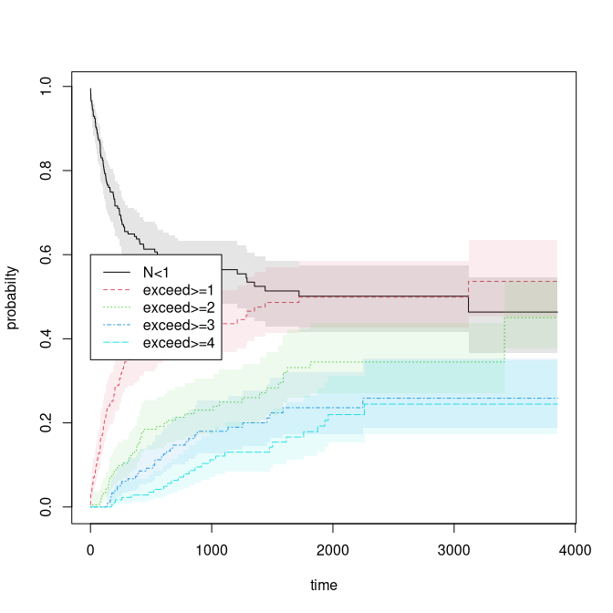

We can also look at the mean and variance based on the estimators just described 


``` r
par(mfrow=c(1,2))
with(oo,plot(time,meanN,col=2,type="l"))
with(oo,plot(time,varN,type="l"))
```

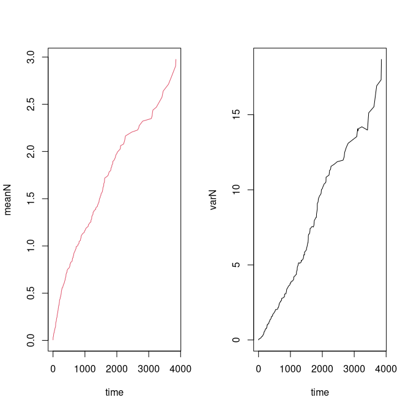


Multiple events
================

We now generate recurrent events data with two event types, starting with
independent events.


``` r
rr <- sim_recurrentII(200,base1,cumhaz2=base4,death.cumhaz=dr)
rr <-  count_history(rr)
dtable(rr,~death+status)
#> 
#>       status   0   1   2
#> death                   
#> 0             32 651  84
#> 1            168   0   0
```

Based on this we can estimate also the joint distribution function, that is
the probability that $(N_1(t) \geq k_1, N_2(t) \geq k_2)$


``` r
# Bivariate probability of exceeding 
## oo <- prob.exceedBiRecurrent(rr,1,2,exceed1=c(1,5),exceed2=c(1,2))
## with(oo, matplot(time,pe1e2,type="s"))
## nc <- ncol(oo$pe1e2)
## legend("topleft",legend=colnames(oo$pe1e2),lty=1:nc,col=1:nc)
```

Looking at simulations with dependence
=============================================

Using normally distributed random effects we illustrate four settings. We set variance $0.5$ for all
random effects and vary the correlation. We denote the correlation between the random effect associated with
$N_1$ and $N_2$ as $\rho_{12}$, and the correlation between the random effects
associated with $N_j$ and $D$ (the terminal event) as $\rho_{j3}$, organised in the vector $\rho=(\rho_{12},\rho_{13},\rho_{23})$.

 * Scenario I: $\rho=(0,0.0,0.0)$ — independence among all effects.


``` r
 data(CPH_HPN_CRBSI)
 dr <- CPH_HPN_CRBSI$terminal
 base1 <- CPH_HPN_CRBSI$crbsi 
 base4 <- CPH_HPN_CRBSI$mechanical

  par(mfrow=c(1,3))
  var.z <- c(0.5,0.5,0.5)
  # death related to  both causes in same way 
  cor.mat <- corM <- rbind(c(1.0, 0.0, 0.0), c(0.0, 1.0, 0.0), c(0.0, 0.0, 1.0))
  rr <- sim_recurrentII(200,base1,base4,death.cumhaz=dr,var.z=var.z,cor.mat=cor.mat,dependence=2)
  rr <- count_history(rr,types=1:2)
###  cor(attr(rr,"z"))
###  coo <- covarianceRecurrent(rr,1,2,status="status",start="entry",stop="time")
###  plot(coo,main ="Scenario I")
```
 * Scenario II: $\rho=(0,0.5,0.5)$ — independence among survivors but dependence on terminal event.


``` r
  var.z <- c(0.5,0.5,0.5)
  # death related to  both causes in same way 
  cor.mat <- corM <- rbind(c(1.0, 0.0, 0.5), c(0.0, 1.0, 0.5), c(0.5, 0.5, 1.0))
  rr <- sim_recurrentII(200,base1,base4,death.cumhaz=dr,var.z=var.z,cor.mat=cor.mat,dependence=2)
  rr <- count_history(rr,types=1:2)
###  coo <- covarianceRecurrent(rr,1,2,status="status",start="entry",stop="time")
###  par(mfrow=c(1,3))
###  plot(coo,main ="Scenario II")
```

 * Scenario III: $\rho=(0.5,0.5,0.5)$ — positive dependence among survivors and dependence on terminal event.


``` r
  var.z <- c(0.5,0.5,0.5)
  # positive dependence for N1 and N2 all related in same way
  cor.mat <- corM <- rbind(c(1.0, 0.5, 0.5), c(0.5, 1.0, 0.5), c(0.5, 0.5, 1.0))
  rr <- sim_recurrentII(200,base1,base4,death.cumhaz=dr,var.z=var.z,cor.mat=cor.mat,dependence=2)
  rr <- count_history(rr,types=1:2)
###  coo <- covarianceRecurrent(rr,1,2,status="status",start="entry",stop="time")
###  par(mfrow=c(1,3))
###  plot(coo,main="Scenario III")
```

 * Scenario IV: $\rho=(-0.4,0.5,0.5)$ — negative dependence among survivors and positive dependence on terminal event.


``` r
  var.z <- c(0.5,0.5,0.5)
  # negative dependence for N1 and N2 all related in same way
  cor.mat <- corM <- rbind(c(1.0, -0.4, 0.5), c(-0.4, 1.0, 0.5), c(0.5, 0.5, 1.0))
  rr <- sim_recurrentII(200,base1,base4,death.cumhaz=dr,var.z=var.z,cor.mat=cor.mat,dependence=2)
  rr <- count_history(rr,types=1:2)
###  coo <- covarianceRecurrent(rr,1,2,status="status",start="entry",stop="time")
###  par(mfrow=c(1,3))
###  plot(coo,main="Scenario IV")
```


SessionInfo
============


``` r
sessionInfo()
#> R version 4.6.0 (2026-04-24)
#> Platform: x86_64-pc-linux-gnu
#> Running under: Ubuntu 24.04.4 LTS
#> 
#> Matrix products: default
#> BLAS:   /home/kkzh/.asdf/installs/r/4.6.0/lib/R/lib/libRblas.so 
#> LAPACK: /usr/lib/x86_64-linux-gnu/lapack/liblapack.so.3.12.0  LAPACK version 3.12.0
#> 
#> locale:
#>  [1] LC_CTYPE=en_US.UTF-8       LC_NUMERIC=C              
#>  [3] LC_TIME=en_US.UTF-8        LC_COLLATE=en_US.UTF-8    
#>  [5] LC_MONETARY=en_US.UTF-8    LC_MESSAGES=en_US.UTF-8   
#>  [7] LC_PAPER=en_US.UTF-8       LC_NAME=C                 
#>  [9] LC_ADDRESS=C               LC_TELEPHONE=C            
#> [11] LC_MEASUREMENT=en_US.UTF-8 LC_IDENTIFICATION=C       
#> 
#> time zone: Europe/Copenhagen
#> tzcode source: system (glibc)
#> 
#> attached base packages:
#> [1] splines   stats     graphics  grDevices utils     datasets  methods  
#> [8] base     
#> 
#> other attached packages:
#> [1] timereg_2.0.7  survival_3.8-6 mets_1.3.10   
#> 
#> loaded via a namespace (and not attached):
#>  [1] vctrs_0.7.3            cli_3.6.6              knitr_1.51            
#>  [4] rlang_1.2.0            xfun_0.57              KernSmooth_2.23-26    
#>  [7] otel_0.2.0             glue_1.8.1             future.apply_1.20.2   
#> [10] listenv_0.10.1         lava_1.9.1             stats4_4.6.0          
#> [13] grid_4.6.0             evaluate_1.0.5         lifecycle_1.0.5       
#> [16] yaml_2.3.12            mvtnorm_1.3-7          numDeriv_2016.8-1.1   
#> [19] compiler_4.6.0         codetools_0.2-20       Rcpp_1.1.1-1.1        
#> [22] ucminf_1.2.3           future_1.70.0          lattice_0.22-9        
#> [25] digest_0.6.39          pillar_1.11.1          parallelly_1.47.0     
#> [28] parallel_4.6.0         Matrix_1.7-5           tools_4.6.0           
#> [31] RcppArmadillo_15.2.6-1 globals_0.19.1
```
