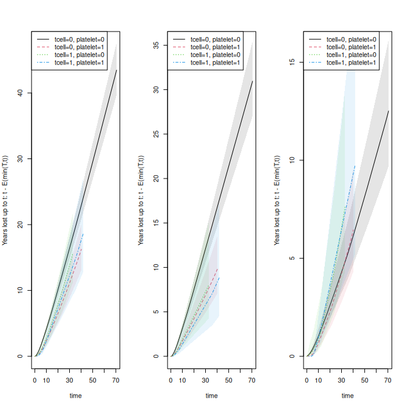

<!-- DO NOT EDIT: auto-generated from the .Rmd.orig source -->


The `resmeanATE` or `resmeanIPCW`/`rmstIPCW` functions fit an exponential or linear link model with
IPCW adjustment at a specific time point for the restricted mean survival or years lost in
competing risks. The computation is linear in the data size, making it suitable for large datasets.
Influence functions are computed and available for downstream inference.

Key features:

  - censoring weights can be stratum-dependent
  - predictions can be computed with standard errors
  - computation time is linear in data size, including standard errors
  - cluster-corrected standard errors are available via the `clusters` argument


RMST 
====

Regression for rmst outcome $E(T \wedge t | X) = exp(X^T \beta)$ based on IPCW adjustment for censoring, thus solving
the estimating equation 
\begin{align*}
 & X^T [ (T \wedge t) \frac{I(C > T \wedge t)}{G_C(T \wedge t,X)} - exp(X^T \beta) ] = 0 .
\end{align*}
This is done with the resmeanIPCW function. 
For a fully saturated model with a complete censoring model this is equal to the integral of the Kaplan-Meier estimator, as
illustrated below.

We can also compute the integral of the Kaplan-Meier or Cox-based survival estimator to
get the RMST (using the `resmean_phreg` function):
\[ \int_0^t S(s|X) ds. \]

For competing risks, the years lost can be computed via cumulative incidence functions (`cif_yearslost`)
or as an IPCW estimator, since
\[ E( I(\epsilon=1) ( t - T \wedge t ) | X) = \int_0^t F_1(s) ds. \]
For a fully saturated model with a complete censoring model these estimators are equivalent, as illustrated below.


``` r
set.seed(101)

     data(bmt); bmt$time <- bmt$time+runif(nrow(bmt))*0.001

     # E( min(T;t) | X ) = exp( a+b X) with IPCW estimation 
     out <- resmeanIPCW(Event(time,cause!=0)~tcell+platelet+age,bmt,
                     time=50,cens.model=~strata(platelet),model="exp")
     summary(out)
#>    n events
#>  408    245
#> 
#>  408 clusters
#> coeffients:
#>              Estimate   Std.Err      2.5%     97.5% P-value
#> (Intercept)  3.014321  0.065114  2.886700  3.141941  0.0000
#> tcell        0.106526  0.138268 -0.164473  0.377525  0.4410
#> platelet     0.247103  0.097337  0.056325  0.437880  0.0111
#> age         -0.185936  0.043566 -0.271324 -0.100548  0.0000
#> 
#> exp(coeffients):
#>             Estimate     2.5%   97.5%
#> (Intercept) 20.37524 17.93403 23.1488
#> tcell        1.11241  0.84834  1.4587
#> platelet     1.28031  1.05794  1.5494
#> age          0.83033  0.76237  0.9043
     
      ### same as Kaplan-Meier for full censoring model 
     bmt$int <- with(bmt,strata(tcell,platelet))
     out <- resmeanIPCW(Event(time,cause!=0)~-1+int,bmt,time=30,
                                  cens.model=~strata(platelet,tcell),model="lin")
     estimate(out)
#>                        Estimate Std.Err  2.5% 97.5%   P-value
#> inttcell=0, platelet=0    13.60  0.8316 11.97 15.23 3.826e-60
#> inttcell=0, platelet=1    18.90  1.2696 16.41 21.39 3.997e-50
#> inttcell=1, platelet=0    16.19  2.4061 11.48 20.91 1.705e-11
#> inttcell=1, platelet=1    17.77  2.4536 12.96 22.58 4.463e-13
     out1 <- phreg(Surv(time,cause!=0)~strata(tcell,platelet),data=bmt)
     rm1 <- resmean_phreg(out1,times=30)
     summary(rm1)
#>                     Estimate Std.Err  2.5% 97.5%   P-value
#> tcell=0, platelet=0    13.60  0.8315 11.97 15.23 3.771e-60
#> tcell=0, platelet=1    18.90  1.2693 16.41 21.39 3.783e-50
#> tcell=1, platelet=0    16.19  2.4006 11.49 20.90 1.534e-11
#> tcell=1, platelet=1    17.77  2.4422 12.98 22.55 3.474e-13
     
     ## competing risks years-lost for cause 1  
     out <- resmeanIPCW(Event(time,cause)~-1+int,bmt,time=30,cause=1,
                                 cens.model=~strata(platelet,tcell),model="lin")
     estimate(out)
#>                        Estimate Std.Err   2.5%  97.5%   P-value
#> inttcell=0, platelet=0   12.105  0.8508 10.438 13.773 6.162e-46
#> inttcell=0, platelet=1    6.884  1.1741  4.583  9.185 4.536e-09
#> inttcell=1, platelet=0    7.261  2.3533  2.648 11.873 2.033e-03
#> inttcell=1, platelet=1    5.780  2.0925  1.679  9.882 5.737e-03
     ## same as integrated cumulative incidence 
     rmc1 <- cif_yearslost(Event(time,cause)~strata(tcell,platelet),data=bmt,times=30,cause=1)
     summary(rmc1)
#> cause1 
#>                     Estimate Std.Err   2.5%  97.5%   P-value
#> tcell=0, platelet=0   12.105  0.8508 10.438 13.773 6.162e-46
#> tcell=0, platelet=1    6.884  1.1741  4.583  9.185 4.536e-09
#> tcell=1, platelet=0    7.261  2.3533  2.648 11.873 2.033e-03
#> tcell=1, platelet=1    5.780  2.0925  1.679  9.882 5.737e-03
#> cause2 
#>                     Estimate Std.Err  2.5% 97.5%   P-value
#> tcell=0, platelet=0    4.292  0.6161 3.084  5.50 3.266e-12
#> tcell=0, platelet=1    4.215  0.9057 2.439  5.99 3.266e-06
#> tcell=1, platelet=0    6.548  1.9703 2.686 10.41 8.896e-04
#> tcell=1, platelet=1    6.454  2.0815 2.374 10.53 1.933e-03

     ## plotting the years lost for different horizon's and the two causes 
     par(mfrow=c(1,3))
     plot(rm1,years.lost=TRUE,se=1)
     ## cause refers to column of cumhaz for the different causes
     plot(rmc1,cause=1,se=1)
     plot(rmc1,cause=2,se=1)
```



Based on the output from the IPCW estimators we can derive any measure of interest


``` r
estimate(out)
#>                        Estimate Std.Err   2.5%  97.5%   P-value
#> inttcell=0, platelet=0   12.105  0.8508 10.438 13.773 6.162e-46
#> inttcell=0, platelet=1    6.884  1.1741  4.583  9.185 4.536e-09
#> inttcell=1, platelet=0    7.261  2.3533  2.648 11.873 2.033e-03
#> inttcell=1, platelet=1    5.780  2.0925  1.679  9.882 5.737e-03

measures <- function(p) {
 ratio1 <- p[1]/p[2]; ratio2 <- p[2]/p[1]; dif1 <- p[4]-p[1]; dif2 <- p[3]-p[1]
 m <- c(dif1,dif2,ratio1,ratio2)
 return(m)
}

 labs <- c("dif4-1","dif3-1","ratio 1/2","ratio 2/1")
 estimate(out,f=measures,labels=labs)
#>           Estimate Std.Err     2.5%    97.5%   P-value
#> dif4-1     -6.3248  2.2589 -10.7520 -1.89748 5.111e-03
#> dif3-1     -4.8444  2.5024  -9.7489  0.06018 5.288e-02
#> ratio 1/2   1.7584  0.3244   1.1227  2.39414 5.924e-08
#> ratio 2/1   0.5687  0.1049   0.3631  0.77431 5.924e-08
```

Average treatment effect
=========================

This section computes the average treatment effect for restricted mean survival and years lost in the competing risks setting.


``` r
 dfactor(bmt) <- tcell~tcell
 bmt$event <- (bmt$cause!=0)*1
 out <- resmeanATE(Event(time,event)~tcell+platelet,data=bmt,time=40,treat.model=tcell~platelet)
 summary(out)
#>    n events
#>  408    241
#> 
#>  408 clusters
#> coeffients:
#>              Estimate   Std.Err      2.5%     97.5% P-value
#> (Intercept)  2.852670  0.062493  2.730187  2.975153  0.0000
#> tcell1       0.021401  0.122907 -0.219493  0.262295  0.8618
#> platelet     0.303489  0.090758  0.125606  0.481372  0.0008
#> 
#> exp(coeffients):
#>             Estimate     2.5%   97.5%
#> (Intercept) 17.33400 15.33575 19.5926
#> tcell1       1.02163  0.80293  1.2999
#> platelet     1.35458  1.13383  1.6183
#> 
#> Average Treatment effects (G-formula) :
#>           Estimate  Std.Err     2.5%    97.5% P-value
#> treat0    19.26223  0.95926 17.38212 21.14234  0.0000
#> treat1    19.67890  2.22777 15.31255 24.04526  0.0000
#> treat:1-0  0.41667  2.41067 -4.30815  5.14150  0.8628
#> 
#> Average Treatment effects (double robust) :
#>           Estimate  Std.Err     2.5%    97.5% P-value
#> treat0    19.28131  0.95807 17.40352 21.15910  0.0000
#> treat1    20.34466  2.54101 15.36438 25.32494  0.0000
#> treat:1-0  1.06335  2.70979 -4.24773  6.37443  0.6948
 
 out1 <- resmeanATE(Event(time,cause)~tcell+platelet,data=bmt,cause=1,time=40,
		    treat.model=tcell~platelet)
 summary(out1)
#>    n events
#>  408    157
#> 
#>  408 clusters
#> coeffients:
#>              Estimate   Std.Err      2.5%     97.5% P-value
#> (Intercept)  2.806295  0.069619  2.669845  2.942745  0.0000
#> tcell1      -0.374065  0.247669 -0.859488  0.111358  0.1310
#> platelet    -0.491736  0.164946 -0.815025 -0.168447  0.0029
#> 
#> exp(coeffients):
#>             Estimate     2.5%   97.5%
#> (Intercept) 16.54849 14.43773 18.9678
#> tcell1       0.68793  0.42338  1.1178
#> platelet     0.61156  0.44263  0.8450
#> 
#> Average Treatment effects (G-formula) :
#>           Estimate  Std.Err     2.5%    97.5% P-value
#> treat0    14.53185  0.95707 12.65604 16.40767  0.0000
#> treat1     9.99693  2.37814  5.33587 14.65800  0.0000
#> treat:1-0 -4.53492  2.57516 -9.58213  0.51229  0.0782
#> 
#> Average Treatment effects (double robust) :
#>             Estimate    Std.Err       2.5%      97.5% P-value
#> treat0     14.513742   0.958025  12.636048  16.391436  0.0000
#> treat1      9.365012   2.417032   4.627717  14.102307  0.0001
#> treat:1-0  -5.148730   2.597947 -10.240612  -0.056848  0.0475

 out2 <- resmeanATE(Event(time,cause)~tcell+platelet,data=bmt,cause=2,time=40,
		    treat.model=tcell~platelet)
 summary(out2)
#>    n events
#>  408     84
#> 
#>  408 clusters
#> coeffients:
#>               Estimate    Std.Err       2.5%      97.5% P-value
#> (Intercept)  1.8266090  0.1312181  1.5694263  2.0837918  0.0000
#> tcell1       0.4751558  0.2403839  0.0040121  0.9462996  0.0481
#> platelet    -0.0090724  0.2168469 -0.4340845  0.4159397  0.9666
#> 
#> exp(coeffients):
#>             Estimate    2.5%  97.5%
#> (Intercept)  6.21278 4.80389 8.0349
#> tcell1       1.60826 1.00402 2.5762
#> platelet     0.99097 0.64786 1.5158
#> 
#> Average Treatment effects (G-formula) :
#>           Estimate  Std.Err     2.5%    97.5% P-value
#> treat0     6.19518  0.71372  4.79631  7.59405  0.0000
#> treat1     9.96349  2.09256  5.86216 14.06482  0.0000
#> treat:1-0  3.76831  2.21654 -0.57602  8.11264  0.0891
#> 
#> Average Treatment effects (double robust) :
#>           Estimate  Std.Err     2.5%    97.5% P-value
#> treat0     6.20484  0.71392  4.80559  7.60410  0.0000
#> treat1    10.30065  2.21700  5.95542 14.64588  0.0000
#> treat:1-0  4.09581  2.32897 -0.46889  8.66050  0.0786
```


SessionInfo
============


``` r
sessionInfo()
#> R version 4.5.2 (2025-10-31)
#> Platform: x86_64-pc-linux-gnu
#> Running under: Ubuntu 26.04 LTS
#> 
#> Matrix products: default
#> BLAS:   /usr/lib/x86_64-linux-gnu/blas/libblas.so.3.12.1 
#> LAPACK: /usr/lib/x86_64-linux-gnu/lapack/liblapack.so.3.12.1;  LAPACK version 3.12.0
#> 
#> locale:
#>  [1] LC_CTYPE=en_US.UTF-8       LC_NUMERIC=C              
#>  [3] LC_TIME=en_US.UTF-8        LC_COLLATE=en_US.UTF-8    
#>  [5] LC_MONETARY=en_US.UTF-8    LC_MESSAGES=en_US.UTF-8   
#>  [7] LC_PAPER=en_US.UTF-8       LC_NAME=C                 
#>  [9] LC_ADDRESS=C               LC_TELEPHONE=C            
#> [11] LC_MEASUREMENT=en_US.UTF-8 LC_IDENTIFICATION=C       
#> 
#> time zone: Europe/Copenhagen
#> tzcode source: system (glibc)
#> 
#> attached base packages:
#> [1] splines   stats     graphics  grDevices utils     datasets  methods  
#> [8] base     
#> 
#> other attached packages:
#> [1] lava_1.9.3         prodlim_2026.03.11 timereg_2.0.7      survival_3.8-9    
#> [5] mets_1.3.13        colorout_1.3-3    
#> 
#> loaded via a namespace (and not attached):
#>  [1] vctrs_0.7.3            cli_3.6.6              knitr_1.51            
#>  [4] rlang_1.3.0            xfun_0.60              KernSmooth_2.23-27    
#>  [7] otel_0.2.0             data.table_1.18.4      glue_1.8.1            
#> [10] future.apply_1.20.2    listenv_1.0.0          grid_4.5.2            
#> [13] evaluate_1.0.5         lifecycle_1.0.5        yaml_2.3.12           
#> [16] mvtnorm_1.4-2          numDeriv_2016.8-1.1    compiler_4.5.2        
#> [19] codetools_0.2-20       ucminf_1.2.3           Rcpp_1.1.2            
#> [22] future_1.75.0          lattice_0.23-1         digest_0.6.39         
#> [25] pillar_1.11.1          parallelly_1.48.0      parallel_4.5.2        
#> [28] Matrix_1.7-6           tools_4.5.2            RcppArmadillo_15.4.2-1
#> [31] globals_0.19.1
```


