<!-- DO NOT EDIT: auto-generated from the .Rmd.orig source -->


This vignette demonstrates how to analyze familial resemblance for 
twins using the \texttt{mets} {\bf R}-package and is accompanying the
review by Scheike and Holst (2020). 

We consider a data-set in  that resembles the data of \cite{Hjelmborg2014} that
were based on the NorTwinCan a collaborative research project studying the  genetic and environmental components of prostate
cancer.  The data comprises around 18,000 DZ twins and 11,000 MZ twins.
It was a population based register study based on the Danish, Finnish, Norwegian, and Swedish twin registries.

We first illustrate a hazards based analysis to show how one would study 
dependence in survival data. This needs to be done under assumptions about independent 
competing risks
when the outcome of interest is observed subject to competing risks (here death). 

This seems reasonable here since the occurrence of cancer prior to death only contains weak
association with the risk of death for the other twin, and vice-versa. 

First looking at the data


``` r
library(mets)
 set.seed(122)
 data(prt)
 
 dtable(prt,~status+cancer)
#> 
#>        cancer     0     1
#> status                   
#> 0             21283     0
#> 1              6997     0
#> 2                 0   942
 dtable(prt,~zyg+country,level=1)
#> 
#> zyg
#>    DZ    MZ 
#> 17991 11231 
#> 
#> country
#> Denmark Finland  Norway  Sweden 
#>    9671    3926    4107   11518
```

we see that there are 21283 censorings and 6997 deaths (prior to cancer) and
a total of 942 prostate cancers. 
Approximately half the data consist of DZ twins. 
In addition we see that there are around 10000 twins from Denmark and Sweden, and only 4000 from Norway and Finland, respectively.

Survival 
==========

Under assumption of random effects acting independently on different cause
specific hazards we can analyse competing risks data considering the
cause-specific hazard.  Typically, this can be questionable and the cumulative
incidence modelling below does not rely on this assumption. 

We consider the cause specific hazard of cancer in the competing risks
model with death and cancer.  

First estimating the marginal hazards for each country. 


``` r
 # Marginal Cox model here stratified on country without covariates 
 margph <- phreg(Surv(time,cancer)~strata(country)+cluster(id),data=prt)
 plot(margph)
```

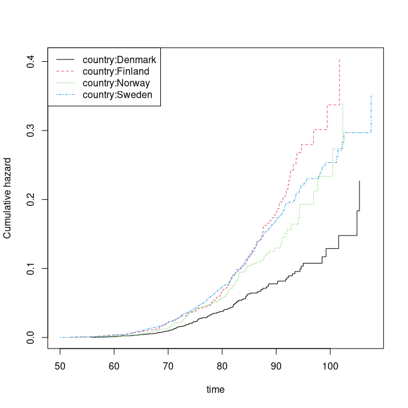

We see that the marginal of Denmark in particular is quite different. 

Then we fit a two-stage random effects models with country specific 
marginals and random-effects variances that differ for MZ and DZ twins. 


``` r
# Clayton-Oakes, MLE , overall variance
fitco1<-twostageMLE(margph,data=prt,theta=2.7)
```


``` r
 summary(fitco1)
#> Dependence parameter for Clayton-Oakes model
#> Variance of Gamma distributed random effects
#> $estimates
#>                Coef.        SE        z        P-val Kendall tau        SE
#> dependence1 2.782962 0.4225572 6.586001 4.518319e-11   0.5818491 0.0369421
#> 
#> $type
#> NULL
#> 
#> attr(,"class")
#> [1] "summary.mets.twostage"
```


``` r
fitco2 <- survival_twostage(margph,data=prt,theta=2.7,clusters=prt$id,var.link=0)
```


``` r
 summary(fitco2)
#> Dependence parameter for Clayton-Oakes model
#> Variance of Gamma distributed random effects
#> $estimates
#>                Coef.        SE        z        P-val Kendall tau         SE
#> dependence1 2.782962 0.4225529 6.586069 4.516254e-11   0.5818491 0.03694172
#> 
#> $type
#> [1] "clayton.oakes"
#> 
#> attr(,"class")
#> [1] "summary.mets.twostage"
```

With different random effects for MZ and DZ

``` r
 mm <- model.matrix(~-1+factor(zyg),prt)
 fitco3<-twostageMLE(margph,data=prt,theta=1,theta.des=mm)
```


``` r
 summary(fitco3)
#> Dependence parameter for Clayton-Oakes model
#> Variance of Gamma distributed random effects
#> $estimates
#>                  Coef.        SE        z        P-val Kendall tau         SE
#> factor(zyg)DZ 1.318966 0.3861577 3.415614 6.363831e-04   0.3974027 0.07011148
#> factor(zyg)MZ 5.421921 0.9626267 5.632423 1.776956e-08   0.7305280 0.03495065
#> 
#> $type
#> NULL
#> 
#> attr(,"class")
#> [1] "summary.mets.twostage"
```


``` r
fitco4 <- survival_twostage(margph,data=prt,theta=1,clusters=prt$id,var.link=0,theta.des=mm)
```


``` r
 summary(fitco4)
#> Dependence parameter for Clayton-Oakes model
#> Variance of Gamma distributed random effects
#> $estimates
#>                  Coef.        SE        z        P-val Kendall tau         SE
#> factor(zyg)DZ 1.318966 0.3861745 3.415466 6.367306e-04   0.3974027 0.07011454
#> factor(zyg)MZ 5.421920 0.9625027 5.633148 1.769493e-08   0.7305280 0.03494615
#> 
#> $type
#> [1] "clayton.oakes"
#> 
#> attr(,"class")
#> [1] "summary.mets.twostage"
 round(estimate(coef=fitco4$coef,vcov=fitco4$var.theta)$coefmat[,c(1,3:4)],2)
#>               Estimate 2.5% 97.5%
#> factor(zyg)DZ     1.32 0.56  2.08
#> factor(zyg)MZ     5.42 3.54  7.31

 ## mz kendalls tau
 kendall_ClaytonOakes_twin_ace(fitco4$theta[2],0,K=1000)$mz.kendall
#> [1] 0.7380818
 ## dz kendalls tau
 kendall_ClaytonOakes_twin_ace(fitco4$theta[1],0,K=1000)$mz.kendall
#> [1] 0.4154807
```


The dependence of MZ twins is much stronger, and is summarized by a 
variance at $5.42$ in contrast to the $DZ$ variance at $1.32$.


Now we look at the polygenic modelling for survival data, here applied to
the cause specific hazards. 


``` r
 ### setting up design for random effects and parameters of random effects
 desace <- twin_polygen_design(prt,type="ace")

 ### ace model 
 fitace <- survival_twostage(margph,data=prt,theta=1,
       clusters=prt$id,var.link=0,model="clayton.oakes",
       numDeriv=1,random.design=desace$des.rv,theta.des=desace$pardes)
```


``` r
 summary(fitace)
#> Dependence parameter for Clayton-Oakes model
#> Variance of Gamma distributed random effects
#> $estimates
#>                 Coef.       SE         z        P-val Kendall tau          SE
#> dependence1  7.223855 1.841525  3.922757 8.754161e-05   0.7831709  0.04328951
#> dependence2 -1.582396 1.088423 -1.453843 1.459898e-01  -3.7892257 12.48240540
#> 
#> $type
#> [1] "clayton.oakes"
#> 
#> $h
#>      Estimate Std.Err    2.5%   97.5%   P-value
#> [1,]   1.2805  0.1698  0.9477 1.61324 4.615e-14
#> [2,]  -0.2805  0.1698 -0.6132 0.05226 9.850e-02
#> 
#> $vare
#> NULL
#> 
#> $vartot
#>    Estimate Std.Err  2.5% 97.5%   P-value
#> p1    5.641  0.9894 3.702 7.581 1.184e-08
#> 
#> attr(,"class")
#> [1] "summary.mets.twostage"
```


``` r
 ### ace model with positive random effects variances
 # fitacee <- survival.twostage(margph,data=prt,theta=1,
 #      clusters=prt$id,var.link=1,model="clayton.oakes",
 #      numDeriv=1,random.design=desace$des.rv,theta.des=desace$pardes)
 #summary(fitacee)
 
 ### ae model 
 #desae <- twin_polygen_design(prt,type="ae")
 #fitae <- survival.twostage(margph,data=prt,theta=1,
 #      clusters=prt$id,var.link=0,model="clayton.oakes",
 #      numDeriv=1,random.design=desae$des.rv,theta.des=desae$pardes)
 #summary(fitae)

 ### de model 
 desde <- twin_polygen_design(prt,type="de")
 fitde <- survival.twostage(margph,data=prt,theta=1,clusters=prt$id,var.link=0,model="clayton.oakes",
numDeriv=1,random.design=desde$des.rv,theta.des=desde$pardes)                            

```

``` r
summary(fitde)
#> Dependence parameter for Clayton-Oakes model
#> Variance of Gamma distributed random effects
#> $estimates
#>                Coef.        SE        z        P-val Kendall tau         SE
#> dependence1 5.940643 0.9837336 6.038873 1.551941e-09   0.7481312 0.03120299
#> 
#> $type
#> [1] "clayton.oakes"
#> 
#> $h
#>      Estimate Std.Err 2.5% 97.5% P-value
#> [1,]        1       0    1     1       0
#> 
#> $vare
#> NULL
#> 
#> $vartot
#>    Estimate Std.Err  2.5% 97.5%   P-value
#> p1    5.941  0.9837 4.013 7.869 1.552e-09
#> 
#> attr(,"class")
#> [1] "summary.mets.twostage"
```

The DE model  fits quite well. In summary all shared variance is due to 
genes and there is no suggestion of a shared environmental effect. 


Concordance and Casewise 
========================

First we estimate the concordance of joint prostate cancer. The two-twins are
censored at the same time, otherwise we would enforce this in the data by
artificially censor both twins at the first censoring time.  Given, however,
that we have the same-censoring assumption satisfied we can do the stanadar
Aalen-Johansen product-limit estimator of the concordance probabilities for MZ
and DZ twins.

For simplicity we do not do this for each country even though as we show there are big
differences between the countries. 


``` r
prt <-  force.same.cens(prt,cause="status")

 dtable(prt,~status+cancer)
#> 
#>        cancer     0     1
#> status                   
#> 0             21580    77
#> 1              6700     0
#> 2                 0   865
 dtable(prt,~status+country)
#> 
#>        country Denmark Finland Norway Sweden
#> status                                      
#> 0                 7394    2622   3154   8487
#> 1                 2140    1138    830   2592
#> 2                  137     166    123    439
 dtable(prt,~zyg+country)
#> 
#>     country Denmark Finland Norway Sweden
#> zyg                                      
#> DZ             6191    2833   2393   6574
#> MZ             3480    1093   1714   4944
```


``` r
 ## cumulative incidence with cluster standard errors.
 cif1 <- cif(Event(time,status)~strata(country)+cluster(id),prt,cause=2)
 plot(cif1,se=1)
```

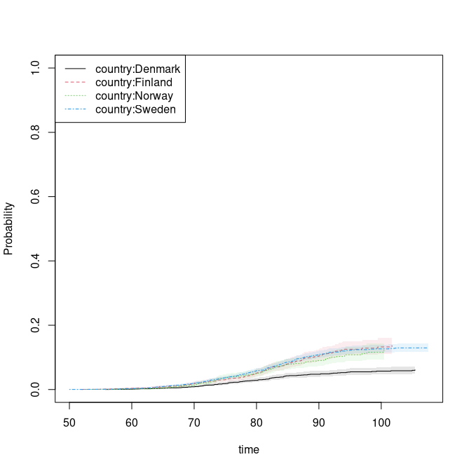

``` r

 cifa <- cif(Event(time,status)~+1,prt,cause=2)

 ### concordance estimator, ignoring country differences. 
 p11 <- bicomprisk(Event(time,status)~strata(zyg)+id(id),data=prt,cause=c(2,2))
#> Strata 'DZ'
#> Strata 'MZ'
p11mz <- p11$model$"MZ"
p11dz <- p11$model$"DZ" 
```
 

``` r
 par(mfrow=c(1,2))
 ## Concordance
 plot(p11mz,ylim=c(0,0.1));
 plot(p11dz,ylim=c(0,0.1));
```

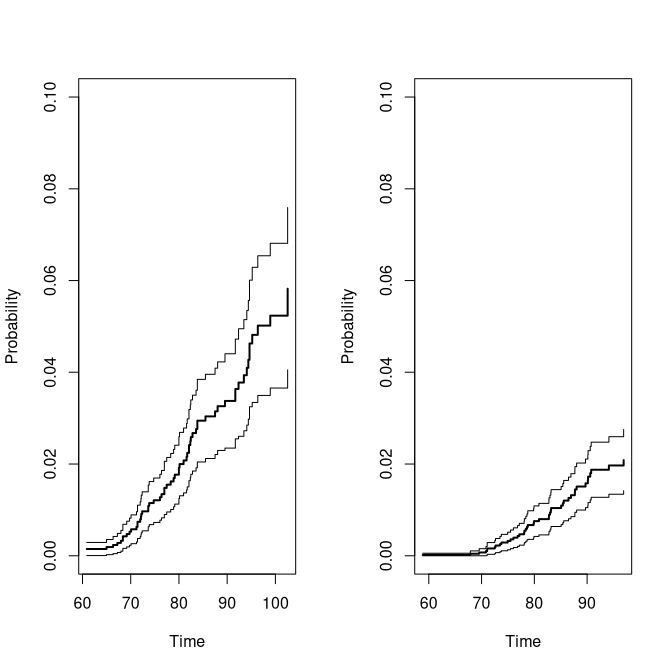

Now we compare the concordance to the marginals to get a measure 
that takes the marginals into account when evaluating the strength 
of the association. 
     

``` r
 library(prodlim)
 outm <- prodlim(Hist(time,status)~+1,data=prt)

 cifzyg <- cif(Event(time,status)~+strata(zyg)+cluster(id),data=prt,cause=2)
 cifprt <- cif(Event(time,status)~country+cluster(id),data=prt,cause=2)
     
 times <- 70:100
 cifmz <- predict(outm,cause=2,time=times,newdata=data.frame(zyg="MZ")) ## cause is 2 (second cause) 
 cifdz <- predict(outm,cause=2,time=times,newdata=data.frame(zyg="DZ"))
    
 ### concordance for MZ and DZ twins<
 cc <- bicomprisk(Event(time,status)~strata(zyg)+id(id),data=prt,cause=c(2,2),prodlim=TRUE)
#> Strata 'DZ'
#> Strata 'MZ'
 ccdz <- cc$model$"DZ"
 ccmz <- cc$model$"MZ"
     
 cdz <- casewise(ccdz,outm,cause.marg=2) 
 cmz <- casewise(ccmz,outm,cause.marg=2)

 dd <- bicompriskData(Event(time,status)~country+strata(zyg)+id(id),data=prt,cause=c(2,2))
 conczyg <- cif(Event(time,status)~strata(zyg)+cluster(id),data=dd,cause=1)

 par(mfrow=c(1,2))
 plot(conczyg,se=TRUE,col=cols[2:1], lty=ltys[2:1], legend=FALSE,xlab="Age",ylab="Concordance")
 legend("topleft",c("concordance-MZ","concordance-DZ"),col=cols[1:2],lty=ltys[1:2])

 plot(cmz,ci=NULL,ylim=c(0,.8),xlim=c(70,97),legend=FALSE,col=cols[c(1,3,3)],lty=ltys[c(1,3,3)],
      ylab="Casewise",xlab="Age")
  plot(cdz,ci=NULL,ylim=c(0,.8),xlim=c(70,97),legend=FALSE,ylab="Casewise",xlab="Age",
      col=c(cols[2],NA,NA), lty=ltys[c(2,3,3)], add=TRUE)
 with(data.frame(cmz$casewise),plotConfRegionSE(time,casewise.conc,se.casewise,col=cols[1]))
 with(data.frame(cdz$casewise),plotConfRegionSE(time,casewise.conc,se.casewise,col=cols[2]))
 legend("topleft",c("casewise-MZ","casewise-DZ","marginal"),col=cols, lty=ltys, bg="white")
```

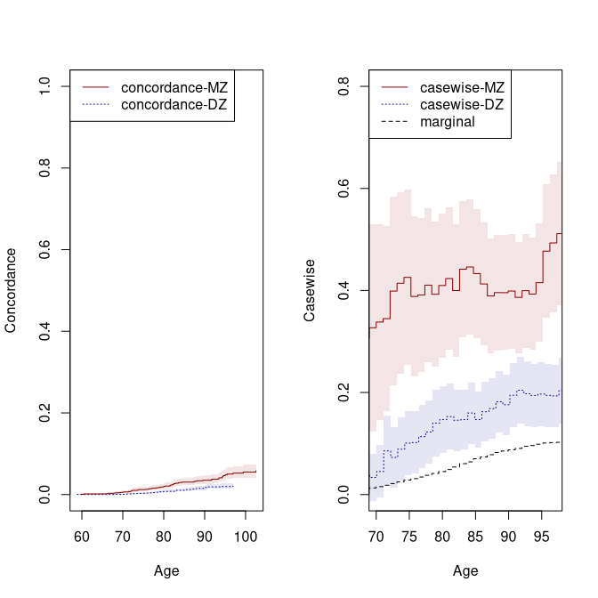

``` r

 summary(cdz)
#> Casewise concordance and standard errors 
#>        time casewise conc se casewise
#>  [1,]  59.5        0.0866      0.0865
#>  [2,]  60.5        0.0659      0.0659
#>  [3,]  61.6        0.0593      0.0593
#>  [4,]  62.7        0.0483      0.0483
#>  [5,]  63.7        0.0358      0.0358
#>  [6,]  64.8        0.0279      0.0279
#>  [7,]  65.8        0.0223      0.0223
#>  [8,]  66.9        0.0197      0.0197
#>  [9,]  68.0        0.0415      0.0297
#> [10,]  69.0        0.0335      0.0240
#> [11,]  70.1        0.0452      0.0264
#> [12,]  71.1        0.0855      0.0352
#> [13,]  72.2        0.0728      0.0300
#> [14,]  73.2        0.0888      0.0317
#> [15,]  74.3        0.1010      0.0321
#> [16,]  75.4        0.1020      0.0310
#> [17,]  76.4        0.1130      0.0318
#> [18,]  77.5        0.1230      0.0320
#> [19,]  78.5        0.1400      0.0334
#> [20,]  79.6        0.1470      0.0332
#> [21,]  80.7        0.1530      0.0329
#> [22,]  81.7        0.1460      0.0307
#> [23,]  82.8        0.1470      0.0298
#> [24,]  83.8        0.1600      0.0307
#> [25,]  84.9        0.1470      0.0282
#> [26,]  86.0        0.1620      0.0297
#> [27,]  87.0        0.1680      0.0300
#> [28,]  88.1        0.1820      0.0311
#> [29,]  89.1        0.1760      0.0301
#> [30,]  90.2        0.1950      0.0323
#> [31,]  91.2        0.2040      0.0332
#> [32,]  92.3        0.1970      0.0321
#> [33,]  93.4        0.1940      0.0315
#> [34,]  94.4        0.1970      0.0318
#> [35,]  95.5        0.1940      0.0314
#> [36,]  96.5        0.1930      0.0312
#> [37,]  97.6        0.2040      0.0330
#> [38,]  98.7        0.2010      0.0325
#> [39,]  99.7        0.1990      0.0322
#> [40,] 101.0        0.1980      0.0321
#> [41,] 102.0        0.1950      0.0316
#> [42,] 103.0        0.1940      0.0314
#> [43,] 104.0        0.1940      0.0314
#> [44,] 105.0        0.1930      0.0312
#> [45,] 106.0        0.1920      0.0311
#> [46,] 107.0        0.1920      0.0311
#> [47,] 108.0        0.1910         NaN
 summary(cmz)
#> Casewise concordance and standard errors 
#>        time casewise conc se casewise
#>  [1,]  60.6         0.519      0.2590
#>  [2,]  61.6         0.466      0.2330
#>  [3,]  62.7         0.380      0.1900
#>  [4,]  63.7         0.285      0.1420
#>  [5,]  64.8         0.286      0.1280
#>  [6,]  65.8         0.228      0.1020
#>  [7,]  66.9         0.295      0.1120
#>  [8,]  67.9         0.306      0.1090
#>  [9,]  68.9         0.327      0.1040
#> [10,]  70.0         0.338      0.0981
#> [11,]  71.0         0.345      0.0926
#> [12,]  72.1         0.399      0.0946
#> [13,]  73.1         0.414      0.0909
#> [14,]  74.2         0.426      0.0874
#> [15,]  75.2         0.388      0.0798
#> [16,]  76.3         0.391      0.0773
#> [17,]  77.3         0.410      0.0769
#> [18,]  78.4         0.392      0.0723
#> [19,]  79.4         0.410      0.0721
#> [20,]  80.5         0.423      0.0714
#> [21,]  81.5         0.400      0.0666
#> [22,]  82.6         0.442      0.0685
#> [23,]  83.6         0.446      0.0676
#> [24,]  84.7         0.433      0.0643
#> [25,]  85.7         0.413      0.0612
#> [26,]  86.8         0.389      0.0578
#> [27,]  87.8         0.396      0.0578
#> [28,]  88.9         0.396      0.0573
#> [29,]  89.9         0.399      0.0574
#> [30,]  91.0         0.386      0.0556
#> [31,]  92.0         0.400      0.0570
#> [32,]  93.1         0.393      0.0560
#> [33,]  94.1         0.415      0.0590
#> [34,]  95.2         0.477      0.0669
#> [35,]  96.2         0.493      0.0690
#> [36,]  97.3         0.511      0.0714
#> [37,]  98.3         0.507      0.0708
#> [38,]  99.4         0.500      0.0699
#> [39,] 100.0         0.525      0.0739
#> [40,] 101.0         0.520      0.0731
#> [41,] 103.0         0.514      0.0723
#> [42,] 104.0         0.541      0.0767
#> [43,] 105.0         0.541      0.0767

 cpred(cmz$casewise,c(70,80))
#>      new.time casewise conc se casewise
#> [1,]       70     0.3381311  0.09811729
#> [2,]       80     0.4096715  0.07211013
 cpred(cdz$casewise,c(70,80))
#>      new.time casewise conc se casewise
#> [1,]       70    0.03351513  0.02398337
#> [2,]       80    0.14694869  0.03321234
```


``` r

 dd <- bicompriskData(Event(time,status)~country+strata(zyg)+id(id),data=prt,cause=c(2,2))
 conczyg <- cif(Event(time,status)~strata(zyg)+cluster(id),data=dd,cause=1)

 par(mfrow=c(1,2))
 plot(conczyg,se=TRUE,legend=FALSE,xlab="Age",ylab="Concordance")
 legend("topleft",c("concordance-DZ","concordance-MZ"),col=c(1,2),lty=1)
 plot(cmz,ci=NULL,ylim=c(0,0.6),xlim=c(70,100),legend=FALSE,col=c(2,3,3),ylab="Casewise",xlab="Age",lty=c(1,3))
 plot(cdz,ci=NULL,ylim=c(0,0.6),xlim=c(70,100),legend=FALSE,ylab="Casewise",xlab="Age",
      col=c(1,3,3), add=TRUE, lty=c(2,3))
 legend("topleft",c("casewise-MZ","casewise-DZ","marginal"),col=c(2,1,3),lty=1)
 with(data.frame(cmz$casewise),plotConfRegionSE(time,casewise.conc,se.casewise,col=2))
 with(data.frame(cdz$casewise),plotConfRegionSE(time,casewise.conc,se.casewise,col=1))
```

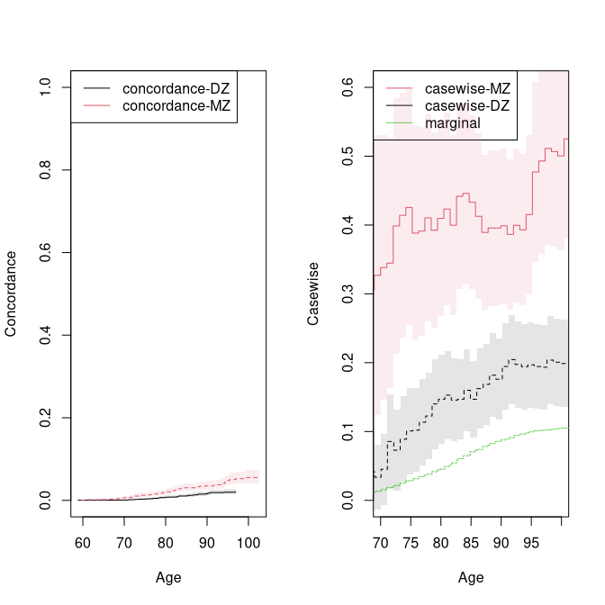

The standard errors above are slightly off since they only reflect the 
uncertainty from the concordance estimation. This can be improved by
doing specific calculations for a specific time-point uisng the 
binomial regression function that gives and iid decomposition for the 
paramters.  We thus apply the binomial regression to estimate the
concordance as well as the marginal, and combine the iid decompositions
when estimating the standard error.  We also do this ignoring country differences. 


``` r
 ### new version of Casewise for specific time-point based on binreg 
 dd <- bicompriskData(Event(time,status)~country+strata(zyg)+id(id),data=prt,cause=c(2,2))
 newdata <- data.frame(zyg=c("DZ","MZ"),id=1)

 ## concordance 
 bcif1 <- binreg(Event(time,status)~-1+factor(zyg)+cluster(id),dd,time=80,cause=1,cens.model=~strata(zyg))
 pconc <- predict(bcif1,newdata)

 ## marginal estimates
 mbcif1 <- binreg(Event(time,status)~cluster(id),prt,time=80,cause=2)
 mc <- predict(mbcif1,newdata)

 ### casewise with improved se's from log-scale 
 cse <- binregCasewise(bcif1,mbcif1)
```


``` r
 cse 
#> $coef
#>     Estimate      2.5%     97.5%
#> p1 0.1586277 0.1445496 0.1740770
#> p2 0.4041311 0.3682646 0.4434908
#> 
#> $logcoef
#>    Estimate Std.Err   2.5%   97.5%   P-value
#> p1   -1.841 0.04742 -1.934 -1.7483 0.000e+00
#> p2   -0.906 0.04742 -0.999 -0.8131 2.208e-81
```

It can be useful also to simply model the concordance given covariates, and in
this case we might find it important to adjust for country, or to see if the
differences between MZ and DZ are comparable across contries even though
clearly DK has a much lower cumulative incidence of prostate cancer. 


``` r
 ### semi-parametric modelling of concordance 
 dd <- bicompriskData(Event(time,status)~country+strata(zyg)+id(id),data=prt,cause=c(2,2))
 regconc <- cifreg(Event(time,status)~country*zyg,data=dd,prop=NULL)
 regconc
#> Call:
#> cifreg(formula = Event(time, status) ~ country * zyg, data = dd, 
#>     propodds = NULL)
#> 
#>      n events
#>  14222    106
#> 
#> coefficients:
#>       countryFinland        countryNorway        countrySweden 
#>             2.207372             2.316572             2.022366 
#>                zygMZ countryFinland:zygMZ  countryNorway:zygMZ 
#>             2.308718            -1.267368            -2.146122 
#>  countrySweden:zygMZ 
#>            -1.325599
 ### interaction test
 wald.test(regconc,coef.null=5:7)
#>       lin.comb        se     lower      upper       pval
#> [1,] -1.267368 0.8706047 -2.973722  0.4389863 0.14546656
#> [2,] -2.146122 0.9434922 -3.995332 -0.2969109 0.02292648
#> [3,] -1.325599 0.8219447 -2.936581  0.2853827 0.10679673
#> 
#> 	Wald test
#> 
#> data:  
#> chisq = 5.2661, df = 3, p-value = 0.1533

 regconc <- cifreg(Event(time,status)~country+zyg,data=dd,prop=NULL)
 regconc
#> Call:
#> cifreg(formula = Event(time, status) ~ country + zyg, data = dd, 
#>     propodds = NULL)
#> 
#>      n events
#>  14222    106
#> 
#> coefficients:
#> countryFinland  countryNorway  countrySweden          zygMZ 
#>      1.2924623      0.9333627      1.0743929      1.0105487

 ## logistic link 
 logitregconc <- cifreg(Event(time,status)~country+zyg,data=dd)
 slr <- summary(logitregconc)
```


``` r
slr
#> 
#>      n events
#>  14222    106
#> 
#>  14222 clusters
#> coefficients:
#>                Estimate    S.E. dU^-1/2 P-value
#> countryFinland  1.30427 0.35262 0.35146  0.0002
#> countryNorway   0.94077 0.39999 0.39365  0.0187
#> countrySweden   1.08494 0.32247 0.31871  0.0008
#> zygMZ           1.02335 0.20283 0.19873  0.0000
#> 
#> exp(coefficients):
#>                Estimate   2.5%  97.5%
#> countryFinland   3.6850 1.8462 7.3552
#> countryNorway    2.5619 1.1698 5.6111
#> countrySweden    2.9592 1.5729 5.5676
#> zygMZ            2.7825 1.8697 4.1408
### library(Publish)
### publish(round(slr$exp.coef[,-c(2,5)],2),latex=TRUE,digits=2)
```

Competing risk using additive Gamma
====================================

Here we do the cumulative incidence random effects modelling  (commented out to avoid timereg dependence) 


``` r
 timereg <- 0
if (timereg==1) {
  times <- seq(50,90,length.out=5)
  cif1 <- timereg::comp.risk(Event(time,status)~-1+factor(country)+cluster(id),prt,
		   cause=2,times=times,max.clust=NULL)

  mm <- model.matrix(~-1+factor(zyg),prt)
  out1<-random.cif(cif1,data=prt,cause1=2,cause2=2,theta=1,
		  theta.des=mm,same.cens=TRUE,step=0.5)
  summary(out1)
  round(estimate(coef=out1$theta,vcov=out1$var.theta)$coefmat[,c(1,3:4)],2)

  desace <- twin.polygen.design(prt,type="ace")
 
  outacem <- Grandom.cif(cif1,data=prt,cause1=2,cause2=2,
  	 same.cens=TRUE,theta=c(0.45,0.15),var.link=0,
         step=0.5,theta.des=desace$pardes,random.design=desace$des.rv)
  ##outacem$score
}
```


``` r
timereg <- 0
if (timereg==1) {
  summary(outacem)

 ###  variances
 estimate(coef=outacem$theta,vcov=outacem$var.theta,f=function(p) p/sum(p)^2)

 ## AE polygenic model
 # desae <- twin.polygen.design(prt,type="ae")
 # outaem <- Grandom.cif(cif1,data=prt,cause1=2,cause2=2,
 #    same.cens=TRUE,theta=c(0.45,0.15),var.link=0,
 #        step=0.5,theta.des=desae$pardes,random.design=desae$des.rv)
 # outaem$score
 # summary(outaem)
 # estimate(coef=outaem$theta,vcov=outaem$var.theta,f=function(p)     p/sum(p)^2)

 ## AE polygenic model
 # desde <- twin.polygen.design(prt,type="de")
 # outaem <- Grandom.cif(cif1,data=prt,cause1=2,cause2=2,
 #   same.cens=TRUE,theta=c(0.35),var.link=0,
 #   step=0.5,theta.des=desde$pardes,random.design=desde$des.rv)
 # outaem$score
 # summary(outaem)
 # estimate(coef=outaem$theta,vcov=outaem$var.theta,f=function(p) p/sum(p)^2)

  times <- 90
  cif1 <- timereg::comp.risk(Event(time,status)~-1+factor(country)+cluster(id),prt,
		   cause=2,times=times,max.clust=NULL)

  mm <- model.matrix(~-1+factor(zyg),prt)
  out1<-random.cif(cif1,data=prt,cause1=2,cause2=2,theta=1,
		  theta.des=mm,same.cens=TRUE,step=0.5)
  summary(out1)
  round(estimate(coef=out1$theta,vcov=out1$var.theta)$coefmat[,c(1,3:4)],2)

 desde <- twin.polygen.design(prt,type="de")
 outaem <- Grandom.cif(cif1,data=prt,cause1=2,cause2=2,
	same.cens=TRUE,theta=c(0.35),var.link=0,
        step=0.5,theta.des=desde$pardes,random.design=desde$des.rv)
 outaem$score
 summary(outaem)
 estimate(coef=outaem$theta,vcov=outaem$var.theta,f=function(p) p/sum(p)^2)
}
```


Competing risk modeling using the Liabilty Threshold model 
===========================================================


First we fit the bivariate probit model (same marginals in MZ and DZ twins but different correlation parameter). Here we evaluate the risk of getting cancer before the last double cancer event (95 years)

``` r
rm(prt)
data(prt)
prt0 <-  force.same.cens(prt, cause="status", cens.code=0, time="time", id="id")
prt0$country <- relevel(prt0$country, ref="Sweden")
prt_wide <- fast.reshape(prt0, id="id", num="num", varying=c("time","status","cancer"))
prt_time <- subset(prt_wide,  cancer1 & cancer2, select=c(time1, time2, zyg))
tau <- 95
tt <- seq(70, tau, length.out=5) ## Time points to evaluate model in
```


``` r
b0 <- bptwin.time(cancer ~ 1, data=prt0, id="id", zyg="zyg", DZ="DZ", type="cor",
              cens.formula=Surv(time,status==0)~zyg, breaks=tau)
```


``` r
summary(b0)
#> 
#>                Estimate   Std.Err        Z   p-value    
#> (Intercept)   -1.348188  0.026276 -51.3086 < 2.2e-16 ***
#> atanh(rho) MZ  0.735992  0.087838   8.3789 < 2.2e-16 ***
#> atanh(rho) DZ  0.353022  0.068234   5.1737 2.295e-07 ***
#> ---
#> Signif. codes:  0 '***' 0.001 '**' 0.01 '*' 0.05 '.' 0.1 ' ' 1
#> 
#>  Total MZ/DZ Complete pairs MZ/DZ
#>  1994/3618   997/1809            
#> 
#>                            Estimate 2.5%    97.5%  
#> Tetrachoric correlation MZ 0.62672  0.51081 0.72024
#> Tetrachoric correlation DZ 0.33905  0.21584 0.45164
#> 
#> MZ:
#>                      Estimate 2.5%    97.5%  
#> Concordance          0.03504  0.02779 0.04409
#> Casewise Concordance 0.39458  0.31876 0.47584
#> Marginal             0.08880  0.08086 0.09743
#> Rel.Recur.Risk       4.44351  3.50521 5.38182
#> log(OR)              2.34131  1.87105 2.81157
#> DZ:
#>                      Estimate 2.5%    97.5%  
#> Concordance          0.01952  0.01449 0.02625
#> Casewise Concordance 0.21983  0.16667 0.28415
#> Marginal             0.08880  0.08086 0.09743
#> Rel.Recur.Risk       2.47556  1.81095 3.14016
#> log(OR)              1.23088  0.81020 1.65156
#> 
#>                          Estimate 2.5%    97.5%  
#> Broad-sense heritability 0.57533  0.25790 0.89276
#> 
#> 
#> Event of interest before time 95
```


Liability threshold model with ACE random effects structure

``` r
b1 <- bptwin.time(cancer ~ 1, data=prt0, id="id", zyg="zyg", DZ="DZ", type="ace",
              cens.formula=Surv(time,status==0)~zyg, breaks=tau)
```


``` r
summary(b1)
#> 
#>             Estimate  Std.Err        Z p-value    
#> (Intercept) -2.20664  0.16463 -13.4034  <2e-16 ***
#> log(var(A))  0.43261  0.39149   1.1050  0.2691    
#> log(var(C)) -1.98291  2.52347  -0.7858  0.4320    
#> ---
#> Signif. codes:  0 '***' 0.001 '**' 0.01 '*' 0.05 '.' 0.1 ' ' 1
#> 
#>  Total MZ/DZ Complete pairs MZ/DZ
#>  1994/3618   997/1809            
#> 
#>                    Estimate 2.5%     97.5%   
#> A                   0.57533  0.25790  0.89276
#> C                   0.05139 -0.20836  0.31114
#> E                   0.37328  0.26874  0.47782
#> MZ Tetrachoric Cor  0.62672  0.51081  0.72024
#> DZ Tetrachoric Cor  0.33905  0.21584  0.45164
#> 
#> MZ:
#>                      Estimate 2.5%    97.5%  
#> Concordance          0.03504  0.02779 0.04409
#> Casewise Concordance 0.39458  0.31876 0.47584
#> Marginal             0.08880  0.08086 0.09743
#> Rel.Recur.Risk       4.44351  3.50520 5.38182
#> log(OR)              2.34131  1.87105 2.81157
#> DZ:
#>                      Estimate 2.5%    97.5%  
#> Concordance          0.01952  0.01449 0.02625
#> Casewise Concordance 0.21983  0.16667 0.28415
#> Marginal             0.08880  0.08086 0.09743
#> Rel.Recur.Risk       2.47556  1.81095 3.14016
#> log(OR)              1.23088  0.81020 1.65156
#> 
#>                          Estimate 2.5%    97.5%  
#> Broad-sense heritability 0.57533  0.25790 0.89276
#> 
#> 
#> Event of interest before time 95
```

In this case the ACE model fits the data well - it is in fact indistinguishable from the flexible bivariate Probit model as seen by the IPCW weighted AIC measure

``` r
AIC(b0, b1)
#>    df      AIC
#> b0  3 17340.13
#> b1  3 17340.13
```

ACE model with marginal adjusted for country

``` r
b2 <- bptwin.time(cancer ~ country, data=prt0, id="id", zyg="zyg", DZ="DZ", type="ace",
              cens.formula=Surv(time,status==0)~zyg+country, breaks=95)
```


``` r
summary(b2)
#> 
#>                Estimate  Std.Err        Z   p-value    
#> (Intercept)    -1.97165  0.15371 -12.8267 < 2.2e-16 ***
#> countryDenmark -0.72489  0.11920  -6.0812 1.193e-09 ***
#> countryFinland  0.18968  0.12518   1.5152    0.1297    
#> countryNorway  -0.11611  0.16621  -0.6986    0.4848    
#> log(var(A))     0.40388  0.40524   0.9966    0.3189    
#> log(var(C))    -3.88760 17.56390  -0.2213    0.8248    
#> ---
#> Signif. codes:  0 '***' 0.001 '**' 0.01 '*' 0.05 '.' 0.1 ' ' 1
#> 
#>  Total MZ/DZ Complete pairs MZ/DZ
#>  1994/3618   997/1809            
#> 
#>                    Estimate 2.5%     97.5%   
#> A                   0.59474  0.25169  0.93779
#> C                   0.00814 -0.27297  0.28925
#> E                   0.39712  0.28435  0.50989
#> MZ Tetrachoric Cor  0.60288  0.47809  0.70381
#> DZ Tetrachoric Cor  0.30551  0.17238  0.42767
#> 
#> MZ:
#>                      Estimate 2.5%    97.5%  
#> Concordance          0.04295  0.03307 0.05561
#> Casewise Concordance 0.40128  0.32263 0.48535
#> Marginal             0.10703  0.09453 0.12096
#> Rel.Recur.Risk       3.74923  2.94155 4.55690
#> log(OR)              2.15979  1.67935 2.64023
#> DZ:
#>                      Estimate 2.5%    97.5%  
#> Concordance          0.02439  0.01747 0.03396
#> Casewise Concordance 0.22788  0.17060 0.29749
#> Marginal             0.10703  0.09453 0.12096
#> Rel.Recur.Risk       2.12912  1.54508 2.71315
#> log(OR)              1.06262  0.62460 1.50064
#> 
#>                          Estimate 2.5%    97.5%  
#> Broad-sense heritability 0.59474  0.25169 0.93779
#> 
#> 
#> Event of interest before time 95
```


``` r
bt0 <- bptwin.time(cancer ~ 1, data=prt0, id="id", zyg="zyg", DZ="DZ", type="ace", 
              cens.formula=Surv(time,status==0)~zyg,
              summary.function=function(x) x, breaks=tt)
h2 <- Reduce(rbind, lapply(bt0$coef, function(x) x$heritability))[,c(1,3,4),drop=FALSE]
concMZ <- Reduce(rbind, lapply(bt0$coef, function(x) x$probMZ["Concordance",,drop=TRUE]))

```


``` r
par(mfrow=c(1,2))
plot(tt, h2[,1], type="s", lty=1, col=cols[3], xlab="Age", ylab="Heritability", ylim=c(0,1))
lava::confband(tt, h2[,2], h2[,3],polygon=TRUE, step=TRUE, col=lava::Col(cols[3], 0.1), border=NA)
plot(tt, concMZ[,1], type="s", lty=1, col=cols[1], xlab="Age", ylab="Concordance", ylim=c(0,.1))
lava::confband(tt, concMZ[,2], concMZ[,3],polygon=TRUE, step=TRUE, col=lava::Col(cols[1], 0.1), border=NA)
```

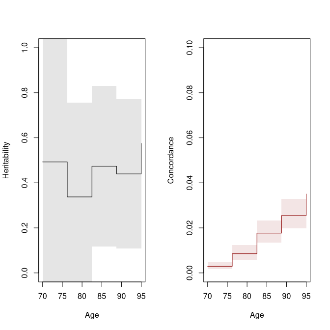


Bivariate probit model at time different time points

``` r
system.time(a.mz <- biprobit.time(cancer~1, id="id", data=subset(prt0, zyg=="MZ"),
                               cens.formula = Surv(time,status==0)~1, pairs.only=TRUE,
                                breaks=tt))
#>    user  system elapsed 
#>   0.147   0.001   0.148
system.time(a.dz <- biprobit.time(cancer~1, id="id", data=subset(prt0, zyg=="DZ"),
                               cens.formula = Event(time,status==0)~1, pairs.only=TRUE,
                               breaks=tt))
#>    user  system elapsed 
#>   0.239   0.000   0.239

#system.time(a.zyg <- biprobit.time(cancer~1, rho=~1+zyg, id="id", data=prt, 
#                               cens.formula = Event(time,status==0)~1,
#                               eqmarg=FALSE, fix.cens.weight
#                               breaks=seq(75,100,by=10)))

a.mz
#>                           
#>  1:Concordance            
#>  2:Casewise Concordance   
#>  3:Marginal               
#>  4:Rel.Recur.Risk         
#>  5:OR                     
#>  6:Tetrachoric correlation
#> 
#>       Time 1:Concor... 2:Casewi... 3:Marginal 4:Rel.Re...    5:OR 6:Tetrac...
#> [1,] 70.00      0.0049      0.2976     0.0166     17.9647 35.3869      0.6973
#> [2,] 76.25      0.0125      0.3468     0.0362      9.5940 21.1451      0.6834
#> [3,] 82.50      0.0247      0.3759     0.0656      5.7307 13.1453      0.6481
#> [4,] 88.75      0.0308      0.3675     0.0839      4.3781  9.4430      0.5993
#> [5,] 95.00      0.0409      0.4144     0.0988      4.1952 10.3180      0.6352
a.dz
#>                           
#>  1:Concordance            
#>  2:Casewise Concordance   
#>  3:Marginal               
#>  4:Rel.Recur.Risk         
#>  5:OR                     
#>  6:Tetrachoric correlation
#> 
#>       Time 1:Concor... 2:Casewi... 3:Marginal 4:Rel.Re...   5:OR 6:Tetrac...
#> [1,] 70.00      0.0007      0.0767     0.0088      8.6701 9.9968      0.3855
#> [2,] 76.25      0.0037      0.1612     0.0228      7.0633 9.6181      0.4682
#> [3,] 82.50      0.0074      0.1660     0.0445      3.7329 4.9289      0.3752
#> [4,] 88.75      0.0136      0.2001     0.0680      2.9417 4.0348      0.3614
#> [5,] 95.00      0.0174      0.2091     0.0831      2.5163 3.4243      0.3336

plot(conczyg,se=TRUE,legend=FALSE,xlab="Age",ylab="Concordance", ylim=c(0,0.07))
plot(a.mz, ylim=c(0,.07), col=cols[1], lty=ltys[1], legend=FALSE, add=TRUE)
plot(a.dz, col=cols[2], lty=ltys[2], add=TRUE)
```

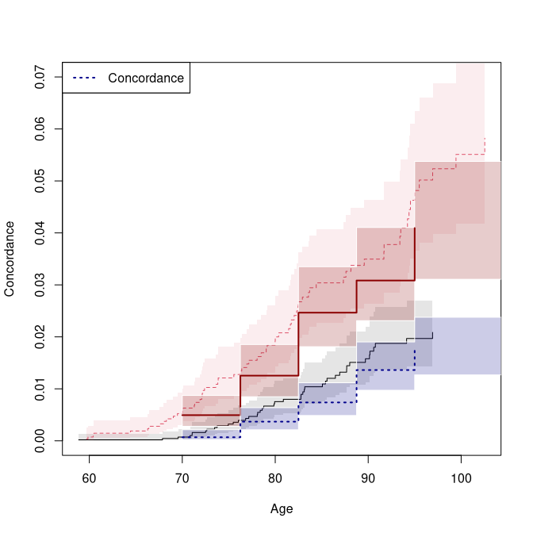


Bivariate probit model adjusting for country

``` r
a.mz_country <- biprobit.time(cancer~country, id="id", data=subset(prt0, zyg=="MZ"),
                               cens.formula = Surv(time,status==0)~country, pairs.only=TRUE,
                                breaks=tt)
system.time(a.dz_country <- biprobit.time(cancer~country, id="id", data=subset(prt0, zyg=="DZ"),
                               cens.formula = Event(time,status==0)~country, pairs.only=TRUE,
                               breaks=tt))
#>    user  system elapsed 
#>   0.368   0.000   0.368

s_mz_country <- summary(a.mz_country)
s_dz_country <- summary(a.dz_country)
```


``` r
s_mz_country
#> $Concordance
#>    Time   Estimate        2.5%      97.5%
#> 1 70.00 0.00592116 0.002986187 0.01170690
#> 2 76.25 0.01432204 0.008753604 0.02334930
#> 3 82.50 0.02921012 0.020110789 0.04224904
#> 4 88.75 0.04037734 0.029107095 0.05576080
#> 5 95.00 0.04970743 0.035562694 0.06907515
#> 
#> $`Casewise Concordance`
#>    Time  Estimate      2.5%     97.5%
#> 1 70.00 0.3061394 0.1804998 0.4691652
#> 2 76.25 0.3502164 0.2491859 0.4667449
#> 3 82.50 0.3867092 0.3017318 0.4791950
#> 4 88.75 0.3906869 0.3129362 0.4744164
#> 5 95.00 0.4190152 0.3369656 0.5058026
#> 
#> $Marginal
#>    Time   Estimate       2.5%      97.5%
#> 1 70.00 0.01934138 0.01265752 0.02944941
#> 2 76.25 0.04089483 0.02990128 0.05569823
#> 3 82.50 0.07553512 0.05950340 0.09544783
#> 4 88.75 0.10334964 0.08432125 0.12608082
#> 5 95.00 0.11862917 0.09702101 0.14428086
#> 
#> $Rel.Recur.Risk
#>    Time  Estimate     2.5%     97.5%
#> 1 70.00 15.828206 6.402412 25.254000
#> 2 76.25  8.563831 5.232353 11.895310
#> 3 82.50  5.119594 3.659965  6.579223
#> 4 88.75  3.780244 2.838404  4.722085
#> 5 95.00  3.532143 2.733073  4.331213
#> 
#> $OR
#>    Time  Estimate      2.5%    97.5%
#> 1 70.00 31.799536 12.251225 82.53954
#> 2 76.25 18.914488  9.701134 36.87794
#> 3 82.50 11.952708  7.033263 20.31308
#> 4 88.75  8.488621  5.238032 13.75644
#> 5 95.00  8.501683  5.275432 13.70099
#> 
#> $`Tetrachoric correlation`
#>    Time  Estimate      2.5%     97.5%
#> 1 70.00 0.6943849 0.4989198 0.8226244
#> 2 76.25 0.6744412 0.5302683 0.7807050
#> 3 82.50 0.6416861 0.5173829 0.7394707
#> 4 88.75 0.5945601 0.4712735 0.6950575
#> 5 95.00 0.6079029 0.4838645 0.7079982
s_dz_country
#> $Concordance
#>    Time     Estimate         2.5%       97.5%
#> 1 70.00 0.0009355085 0.0003014655 0.002899205
#> 2 76.25 0.0053849065 0.0030067815 0.009625779
#> 3 82.50 0.0090012641 0.0055139065 0.014661739
#> 4 88.75 0.0172556341 0.0117010771 0.025379254
#> 5 95.00 0.0221106772 0.0153703190 0.031711692
#> 
#> $`Casewise Concordance`
#>    Time   Estimate       2.5%     97.5%
#> 1 70.00 0.08242731 0.02825081 0.2172688
#> 2 76.25 0.17830239 0.10976467 0.2763507
#> 3 82.50 0.16491577 0.11033790 0.2392308
#> 4 88.75 0.20763626 0.15174905 0.2773756
#> 5 95.00 0.21841377 0.16270904 0.2866602
#> 
#> $Marginal
#>    Time   Estimate        2.5%      97.5%
#> 1 70.00 0.01134950 0.007572628 0.01697786
#> 2 76.25 0.03020098 0.022824994 0.03986330
#> 3 82.50 0.05458098 0.044180067 0.06725818
#> 4 88.75 0.08310511 0.069910900 0.09852566
#> 5 95.00 0.10123298 0.086500435 0.11815021
#> 
#> $Rel.Recur.Risk
#>    Time Estimate       2.5%     97.5%
#> 1 70.00 7.262640 -0.6527463 15.178027
#> 2 76.25 5.903861  2.9616380  8.846085
#> 3 82.50 3.021488  1.8476330  4.195343
#> 4 88.75 2.498478  1.7411885  3.255767
#> 5 95.00 2.157536  1.5525687  2.762503
#> 
#> $OR
#>    Time Estimate     2.5%     97.5%
#> 1 70.00 8.438348 2.374765 29.984323
#> 2 76.25 8.262968 4.176798 16.346645
#> 3 82.50 3.898749 2.289201  6.639977
#> 4 88.75 3.386718 2.150855  5.332698
#> 5 95.00 2.894875 1.876319  4.466352
#> 
#> $`Tetrachoric correlation`
#>    Time  Estimate      2.5%     97.5%
#> 1 70.00 0.3735042 0.1024577 0.5929218
#> 2 76.25 0.4623450 0.2958916 0.6015474
#> 3 82.50 0.3333242 0.1903655 0.4624397
#> 4 88.75 0.3304641 0.1996073 0.4497404
#> 5 95.00 0.3013521 0.1715672 0.4208554
```


``` r
## ACE model (time-varying) with and without adjustment for country
a1 <- bptwin.time(cancer~1, id="id", data=prt0, type="ace",
                              zyg="zyg", DZ="DZ", 
                              cens.formula=Surv(time,status==0)~zyg,
                              breaks=tt)

#a2 <- bptwin.time(cancer~country, id="id", data=prt0, #type="ace",
#                              zyg="zyg", DZ="DZ", 
#                              #cens.formula=Surv(time,status==0)~country+zyg,
#                              breaks=tt)
```


``` r
plot(a.mz, which=c(6), xlab="Age", ylab="Correlation", ylim=c(0,1), col=cols[1], lty=ltys[1], legend=NULL, alpha=.1)
plot(a.dz, which=c(6), col=cols[2], lty=ltys[2], legend=NULL, add=TRUE, alpha=.1)
legend("topleft", c("MZ tetrachoric correlation", "DZ tetrachoric correlation"),
       col=cols, lty=ltys, lwd=2)
```

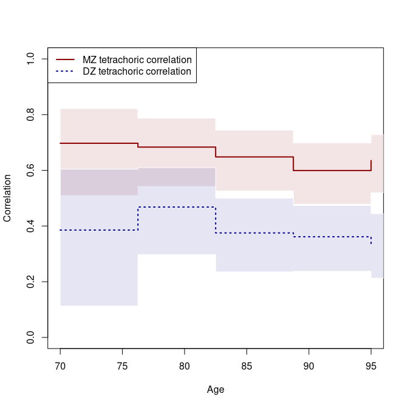

``` r

plot(a.mz, which=c(4), xlab="Age", ylab="Relative Recurrence Risk",
     ylim=c(1,20), col=cols[1], lty=ltys[1], legend=NULL, lwd=2, alpha=.1)
plot(a.dz, which=c(4), col=cols[2], lty=ltys[2], legend=NULL, add=TRUE, lwd=2, alpha=.1)
legend("topright", c("MZ relative recurrence risk", "DZ relative recurrence risk"),
       col=cols, lty=ltys, lwd=2)
```

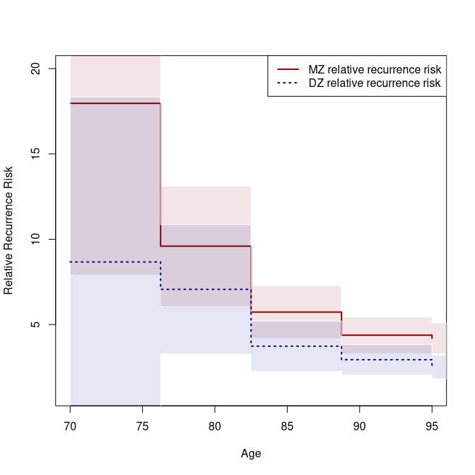

``` r

plot(a1, which=c(5,6), xlab="Age", ylab="Correlation", ylim=c(0,1), col=cols[1:2], lty=ltys[1:2], lwd=2, alpha=0.1,
     legend=c("MZ tetrachoric correlation", "DZ tetrachoric correlation"))
```

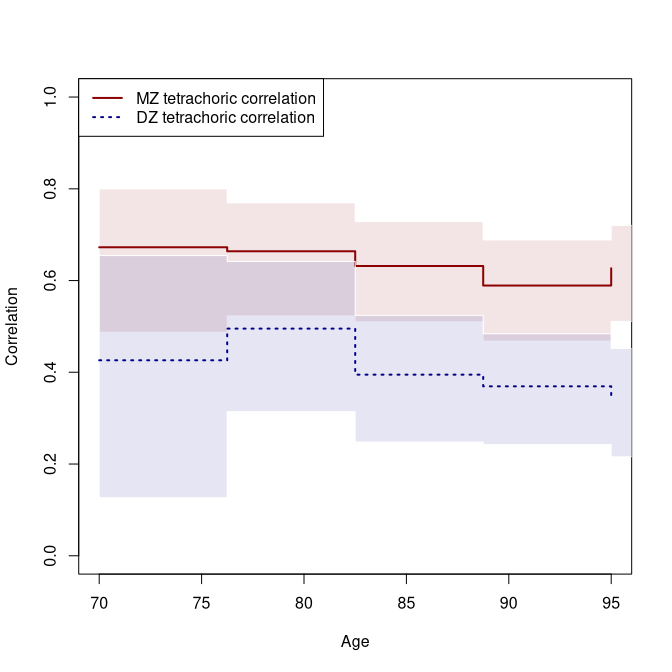

``` r

plot(a1, which=c(1), xlab="Age", ylim=c(0,1), col="black", lty=1, ylab="Heritability", legend=NULL, alpha=.1)
```

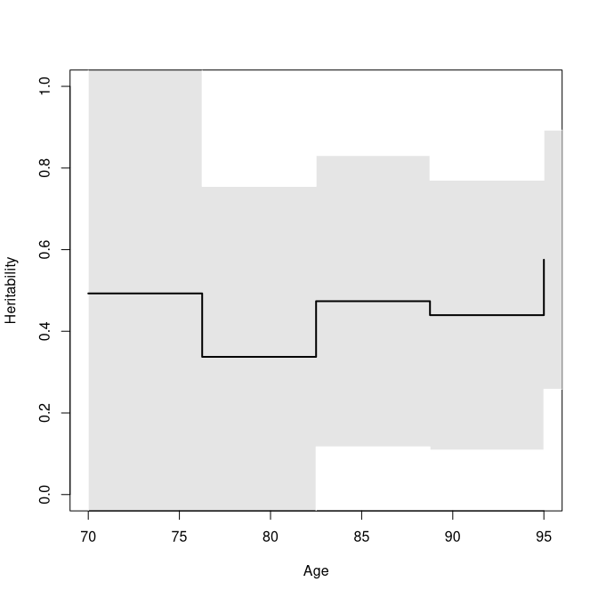

SessionInfo
============


``` r
sessionInfo()
#> R version 4.6.0 (2026-04-24)
#> Platform: x86_64-pc-linux-gnu
#> Running under: Ubuntu 24.04.4 LTS
#> 
#> Matrix products: default
#> BLAS:   /home/kkzh/.asdf/installs/r/4.6.0/lib/R/lib/libRblas.so 
#> LAPACK: /usr/lib/x86_64-linux-gnu/lapack/liblapack.so.3.12.0  LAPACK version 3.12.0
#> 
#> locale:
#>  [1] LC_CTYPE=en_US.UTF-8       LC_NUMERIC=C              
#>  [3] LC_TIME=en_US.UTF-8        LC_COLLATE=en_US.UTF-8    
#>  [5] LC_MONETARY=en_US.UTF-8    LC_MESSAGES=en_US.UTF-8   
#>  [7] LC_PAPER=en_US.UTF-8       LC_NAME=C                 
#>  [9] LC_ADDRESS=C               LC_TELEPHONE=C            
#> [11] LC_MEASUREMENT=en_US.UTF-8 LC_IDENTIFICATION=C       
#> 
#> time zone: Europe/Copenhagen
#> tzcode source: system (glibc)
#> 
#> attached base packages:
#> [1] splines   stats     graphics  grDevices utils     datasets  methods  
#> [8] base     
#> 
#> other attached packages:
#> [1] prodlim_2026.03.11 timereg_2.0.7      survival_3.8-6     mets_1.3.10       
#> 
#> loaded via a namespace (and not attached):
#>  [1] vctrs_0.7.3            cli_3.6.6              knitr_1.51            
#>  [4] rlang_1.2.0            xfun_0.57              KernSmooth_2.23-26    
#>  [7] otel_0.2.0             data.table_1.18.4      glue_1.8.1            
#> [10] future.apply_1.20.2    listenv_0.10.1         lava_1.9.1            
#> [13] stats4_4.6.0           grid_4.6.0             evaluate_1.0.5        
#> [16] lifecycle_1.0.5        mvtnorm_1.3-7          numDeriv_2016.8-1.1   
#> [19] compiler_4.6.0         codetools_0.2-20       Rcpp_1.1.1-1.1        
#> [22] ucminf_1.2.3           future_1.70.0          lattice_0.22-9        
#> [25] digest_0.6.39          pillar_1.11.1          parallelly_1.47.0     
#> [28] parallel_4.6.0         Matrix_1.7-5           tools_4.6.0           
#> [31] RcppArmadillo_15.2.6-1 globals_0.19.1
```


